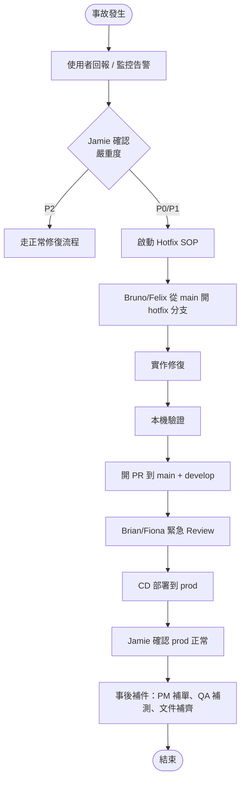

# Skill: Hotfix SOP

## 使用時機

- **觸發者**：Jamie（產品總負責人）
- **適用情境**：生產環境（prod）發生影響營運的事故，無法等待正常開發流程
- **不適用情境**：
  - 一般 bug 修復 → 走正常流程
  - 功能新增 → 走正常流程
  - 效能優化 → 走正常流程
- **輸出路徑**：
  - Hotfix 單：`docs/08_hotfix/YYYYMMDD_HOTFIX-{number}_{title}.md`
  - 事後補件：`docs/08_hotfix/postmortem/YYYYMMDD_PM-{number}.md`

---

## Hotfix 嚴重度分級

| 等級 | 定義 | 範例 | 啟動權限 | SLA |
|------|------|------|----------|-----|
| **P0 - Critical** | 服務完全不可用、資料外洩、金額計算錯誤 | 全站 500、登入失敗 100% | Jamie 立即啟動 | 1 小時內修復 |
| **P1 - High** | 主要功能受損、部分使用者受影響 | 註冊失敗 50%、付款超時 | Jamie 確認後啟動 | 4 小時內修復 |
| **P2 - Medium** | 次要功能異常但有 workaround | 報表延遲、特定瀏覽器破版 | 不走 Hotfix，走正常流程 | 下次 release |

---

## 流程總覽



---

## 階段 1：事故確認（5 分鐘內）

### Jamie 的判斷清單

- [ ] 影響範圍：影響多少使用者？（%）
- [ ] 影響程度：金額、資料、可用性？
- [ ] 是否可繞過：使用者有 workaround 嗎？
- [ ] 修復風險：修復本身會不會引發新問題？
- [ ] 是否需告知客戶：對外公告？

### 通訊

| 對象 | 方式 | 內容 |
|------|------|------|
| 開發者（Bruno/Felix） | 直接呼叫 | 描述問題、優先級、預期 SLA |
| 審查者（Brian/Fiona） | 預警 | 即將有 Hotfix PR，請待命 |
| DevOps | 預警 | 即將部署，準備 rollback |
| 主管/客戶 | 視情況 | 事故通報 |

---

## 階段 2：建立 Hotfix 單（10 分鐘內）

### Hotfix 單模板

```markdown
# HOTFIX-{number}：{簡短描述}

- **建立者**：Jamie
- **建立時間**：YYYY-MM-DD HH:MM (GMT+8)
- **嚴重度**：🔴 P0 / 🟠 P1
- **狀態**：🟡 修復中 / 🔵 審查中 / 🟢 已部署 / ⚫ 已關閉

---

## 1. 事故描述

### 現象

服務於 YYYY-MM-DD HH:MM 開始，全站登入 API 回傳 500 錯誤。

### 影響範圍

| 項目 | 內容 |
|------|------|
| 影響使用者數 | ~5,000（全部活躍使用者） |
| 影響功能 | 登入、所有需登入的操作 |
| 開始時間 | YYYY-MM-DD HH:MM |
| 發現時間 | YYYY-MM-DD HH:MM |
| Workaround | 無 |

### 監控證據

- CloudWatch alarm: `LoginAPIError5xx` 觸發
- 錯誤率：100%
- 失敗 traceId 範例：`abc-123`

---

## 2. 根本原因

### 推測

JWT secret rotation 後，舊 token 無法驗證，導致 cache 中的 session 全失效。

### 驗證

- 查 log：`SignatureException: signature verification failed`
- 查 secret manager：YYYY-MM-DD HH:MM 有 rotation 紀錄

### 真因

`JwtTokenProvider` 未支援 multiple keys 共存。Rotation 後立即失效。

---

## 3. 修復方案

### Option A：Rollback secret rotation

- ✅ 快速（5 分鐘）
- ❌ 治標不治本

### Option B：JwtProvider 支援 key versioning

- ❌ 需要 4 小時開發
- ✅ 根本解決

### **決定**：Option A 立即 rollback，Option B 列入事後改善

---

## 4. 變更內容

| 檔案 | 變更 | 行數 |
|------|------|------|
| AWS Secrets Manager | rollback 到上一版 secret | - |
| `JwtConfig.java` | 暫時 hardcode 舊 secret 為 fallback | +15 |

### 程式碼變更

```java
// 修改前
return Jwts.parserBuilder().setSigningKey(currentKey).build().parseClaimsJws(token);

// 修改後（暫時方案）
try {
    return Jwts.parserBuilder().setSigningKey(currentKey).build().parseClaimsJws(token);
} catch (SignatureException ex) {
    log.warn("Fallback to previous key for token validation");
    return Jwts.parserBuilder().setSigningKey(previousKey).build().parseClaimsJws(token);
}
```

---

## 5. 測試證據

### 本機驗證（Bruno）

- [x] 啟動本機環境，模擬 secret rotation
- [x] 舊 token 仍可通過驗證
- [x] 新 token 也可通過驗證
- [x] 單元測試 `JwtTokenProviderTest` 全部通過

### dev 環境驗證

- [x] 部署到 dev，重現原始問題
- [x] 部署 hotfix，問題消失

---

## 6. 部署計畫

| 步驟 | 時間 | 負責人 |
|------|------|--------|
| Brian Review PR | T+0:30 | Brian |
| Merge 到 main | T+0:35 | Bruno |
| CD 自動部署到 prod（藍綠） | T+0:40 | Jenkins |
| Smoke test | T+0:45 | Bruno + Jamie |
| 全量切流 | T+0:50 | DevOps |
| 監控 30 分鐘 | T+1:20 | Bruno |

### Rollback 計畫

如部署後 5 分鐘內錯誤率仍 > 10%，立即切回舊版本。

---

## 7. 對外通報

| 對象 | 時間 | 內容 |
|------|------|------|
| Status Page | 事故 + 5 分 | 「正在調查登入異常」 |
| Status Page | 修復後 | 「服務已恢復，原因為 JWT 配置問題」 |
| 客戶 | 修復後 1 小時 | Email 通報事故與處理結果 |

---

## 8. 跳過的流程（事後必補）

| 流程 | 跳過原因 | 補件期限 |
|------|----------|----------|
| PRD（Patricia） | 緊急 | 不適用（純修復） |
| SRS（Peter） | 緊急 | 24 小時內補修復描述 |
| 架構審查（Sophia/Preston） | 緊急 | 48 小時內補影響評估 |
| QA 測試（Quincy/Quinn） | 緊急 | 24 小時內補回歸測試 |
| 文件（Daisy） | 緊急 | 48 小時內補事件記錄 |

---

## 9. 簽核

| 角色 | 簽核 | 時間 |
|------|------|------|
| 修復者 | Bruno | YYYY-MM-DD HH:MM |
| 審查者 | Brian | YYYY-MM-DD HH:MM |
| 部署者 | DevOps | YYYY-MM-DD HH:MM |
| 確認 | Jamie | YYYY-MM-DD HH:MM |
```

---

## 階段 3：實作修復（依嚴重度 SLA）

### Bruno/Felix 的工作

```bash
# 1. 從最新的 main 開分支
git fetch origin
git checkout -b hotfix/HOTFIX-001-jwt-rotation origin/main

# 2. 實作最小修復（不要順便做其他改動）
# 只修這個 bug，不重構、不優化、不改格式

# 3. 本機跑相關測試
mvn test -Dtest=JwtTokenProviderTest
npm test -- jwt

# 4. commit（清楚標明 hotfix）
git commit -m "fix(auth): support previous JWT key for rotation [HOTFIX-001]

當 secret rotation 後，舊 token 立即失效，造成全站登入 500。
此 hotfix 暫時讓 JwtProvider 同時接受新舊 key，避免立即失效。

Refs: HOTFIX-001
"

# 5. 推送並開 PR
git push -u origin hotfix/HOTFIX-001-jwt-rotation
gh pr create --base main --title "[HOTFIX-001] Support previous JWT key" \
  --label hotfix,P0
```

### 鐵律

- **只修這個 bug**：不順便做其他改動
- **最小變更**：能 5 行解決就不寫 50 行
- **可 rollback**：不破壞向下相容
- **保留證據**：log、screenshot、test output

---

## 階段 4：緊急 Review（30 分鐘內）

### Brian/Fiona 的速審清單

| 檢查項 | 標準 |
|--------|------|
| 修復是否最小化 | 只動必要檔案 |
| 是否引入新風險 | 無 |
| 是否有 rollback 路徑 | 有 |
| 單元測試是否通過 | 全部通過 |
| 是否含偵錯遺留 | 無 console.log、System.out.println |
| Secret 是否外洩 | 無 hardcode |
| 變更是否符合 SRS | 暫不要求（事後補） |
| 程式碼風格 | 暫不嚴格要求（事後補） |

### Review 結果格式

```markdown
## Hotfix Review - HOTFIX-001

**結論**：✅ 同意 merge / ❌ 退回修正

**理由**：
- 修復最小化，只動 2 個檔案
- 有 rollback 設計（fallback try-catch）
- 單元測試已涵蓋

**事後追蹤**：
- 暫時 hardcode previousKey 必須在 1 週內改為從 Secrets Manager 動態讀取
- 已建立 follow-up ticket：TECH-DEBT-042

**簽核**：Brian, YYYY-MM-DD HH:MM
```

---

## 階段 5：部署（依 CD pipeline）

### 部署順序

```
hotfix/HOTFIX-001 → PR → merge to main → 自動 CD → prod
                                       ↓
                                       cherry-pick 到 develop
```

### 部署檢查

| # | 動作 | 負責 |
|---|------|------|
| 1 | Jenkins build 成功 | Jenkins |
| 2 | Image push to ECR | Jenkins |
| 3 | 部署到 prod canary（10%） | Jenkins |
| 4 | Smoke test 通過 | Bruno + Jamie |
| 5 | 全量切流 100% | DevOps |
| 6 | 監控 30 分鐘 | Bruno |
| 7 | 確認 metrics 恢復 | Jamie |

### 監控指標

| 指標 | 目標 |
|------|------|
| LoginAPIError5xx | < 1% |
| Login latency p95 | < 1s |
| Active sessions | 回升 |

---

## 階段 6：事後補件（48 小時內）

### 補件清單

| 補件項 | 負責人 | 期限 |
|--------|--------|------|
| Postmortem 文件 | Jamie + 修復者 | 48h |
| SRS 修復描述 | Peter | 24h |
| 架構影響評估 | Sophia/Preston（如涉及架構） | 48h |
| 回歸測試案例 | Quincy/Quinn | 24h |
| 自動化測試補齊 | Quincy/Quinn | 1 週 |
| 根本解 ticket | Patricia / Peter | 1 週 |
| 文件更新 | Daisy | 48h |

### Postmortem 模板

```markdown
# Postmortem: HOTFIX-001 JWT Rotation 事故

- **事件 ID**：HOTFIX-001
- **發生時間**：YYYY-MM-DD HH:MM (GMT+8)
- **解決時間**：YYYY-MM-DD HH:MM (GMT+8)
- **總時長**：1 小時 15 分
- **影響範圍**：~5000 使用者
- **撰寫者**：Jamie + Bruno
- **撰寫日期**：YYYY-MM-DD

---

## 1. 事件時間軸

| 時間 | 事件 |
|------|------|
| 10:00 | DevOps 執行 secret rotation |
| 10:01 | LoginAPIError5xx 警報 |
| 10:03 | 使用者開始回報 |
| 10:05 | Jamie 確認 P0，啟動 Hotfix |
| 10:10 | Bruno 開始修復 |
| 10:35 | PR 提交 |
| 10:40 | Brian Review 通過 |
| 10:45 | 部署到 prod canary |
| 10:50 | 全量切流 |
| 11:15 | Metrics 完全恢復 |

## 2. 根本原因

`JwtTokenProvider` 設計時未考慮 key rotation 場景。

## 3. 為何沒被測試發現

- 單元測試只測單一 key
- E2E 測試未涵蓋 secret rotation
- 上線前無 rotation 演練

## 4. 為何沒被監控提前警示

- 沒有 secret rotation 後的 canary 測試

## 5. 短期改善（已完成）

- [x] Hotfix 暫時支援 previous key

## 6. 中期改善（1-2 週）

- [ ] JwtProvider 重構支援 key versioning（Sophia 設計）
- [ ] 加入 secret rotation 演練到 CI
- [ ] 加入 LoginSuccessRate alarm

## 7. 長期改善（1 個月）

- [ ] 建立完整的 chaos engineering 流程
- [ ] DR drill 每季一次

## 8. 經驗教訓

- 任何 stateful 元件的 rotation 都需要演練
- Critical path 需要 canary 測試

## 9. 行動項追蹤

| ID | 動作 | 負責人 | 期限 | 狀態 |
|----|------|--------|------|------|
| AI-001 | JwtProvider 重構 | Sophia → Bruno | YYYY-MM-DD | 進行中 |
| AI-002 | Rotation 演練 CI | DevOps | YYYY-MM-DD | 待開始 |
```

---

## Hotfix 與正常流程的差異對照

| 項目 | 正常流程 | Hotfix 流程 |
|------|----------|-------------|
| 啟動 | Patricia / Peter | Jamie |
| PRD | 必要 | 跳過（事後補） |
| SRS | 必要 | 跳過（事後補） |
| 架構審查 | 必要 | 跳過（事後補） |
| Code Review | 必要 + 完整 | 必要 + 速審 |
| QA 測試 | 必要 | 跳過（事後補） |
| 文件 | 必要 | 跳過（事後補） |
| 分支 | feature/* | hotfix/* |
| 從哪開 | develop | main |
| Merge 到 | develop | main + develop |
| SLA | 視 sprint | P0: 1h, P1: 4h |

---

## 撰寫要點

1. **嚴重度判定要嚴格**：不是所有 bug 都是 hotfix
2. **最小化修復**：不順便做其他事
3. **事後必補**：48 小時內補齊所有跳過的流程
4. **Postmortem 對事不對人**：找系統性原因，不指責個人
5. **行動項要追蹤**：避免相同事故再發生

## 禁止事項

- 禁止 P2 走 hotfix 流程
- 禁止跳過 Reviewer 直接 merge
- 禁止跳過事後補件
- 禁止 hotfix 順便重構
- 禁止 hotfix 不寫測試證據
- 禁止 postmortem 指責個人
- 禁止部署後不監控就離開
