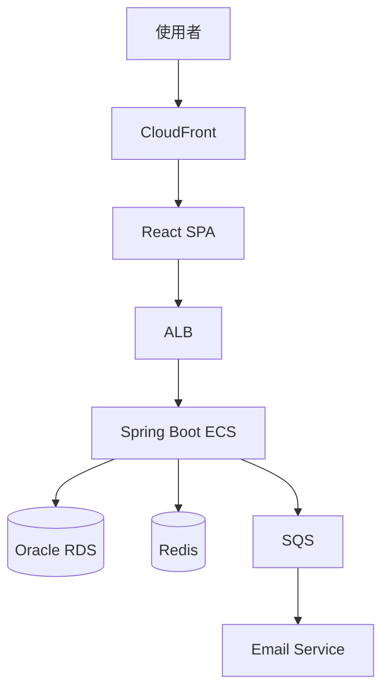

# Skill: Maintenance Handbook

## 使用時機

- **使用者**：Daisy（撰寫）+ Bruno/Felix（補技術細節）+ Jamie（核可）
- **輸出路徑**：`docs/09_maintenance/{project-name}/`
  - `README.md` - 主索引
  - `01_overview.md` - 系統總覽
  - `02_runbook.md` - 日常維運手冊
  - `03_troubleshooting.md` - 故障排除
  - `04_disaster-recovery.md` - 災難復原
  - `05_oncall.md` - 值班手冊
- **觸發時機**：
  - 接手既有專案：1 週內完成 v1.0
  - 系統上線：上線前完成
  - 重大變更：1 週內更新

---

## 主索引（README.md）

```markdown
# {專案名稱} 維運手冊

- **版本**：v1.0
- **最後更新**：YYYY-MM-DD
- **維護者**：Daisy
- **負責 Squad**：Backend (Bruno) / Frontend (Felix)

---

## 文件導覽

| 文件 | 內容 | 適合對象 |
|------|------|----------|
| [01_overview](01_overview.md) | 系統架構、技術棧、依賴 | 新接手者 |
| [02_runbook](02_runbook.md) | 日常檢查、發版、備份 | 值班人員 |
| [03_troubleshooting](03_troubleshooting.md) | 常見問題與排除 | 值班人員 |
| [04_disaster-recovery](04_disaster-recovery.md) | DR 演練與執行 | DevOps |
| [05_oncall](05_oncall.md) | 值班輪值與升級流程 | 全體 |

---

## 緊急聯絡

| 狀況 | 聯絡 | 方式 |
|------|------|------|
| 生產事故 P0/P1 | Jamie | 電話 +886-xxx |
| AWS 帳號問題 | DevOps | Slack #ops |
| Oracle DBA | DBA team | Slack #dba |
| 客戶通知 | PM (Patricia) | Email |

---

## 快速連結

- 監控：[CloudWatch Dashboard](https://...)
- Log：[CloudWatch Logs](https://...)
- APM：[Datadog](https://...)
- Status Page：[status.example.com](https://...)
- CI/CD：[Jenkins](https://...)
- Repo：[GitHub](https://...)
```

---

## 01 系統總覽（01_overview.md）

```markdown
# 系統總覽

## 1. 系統定位

{一段話說明系統用途與在企業中的位置}

## 2. 業務功能

| 模組 | 功能 | 主要使用者 |
|------|------|-----------|
| User | 註冊、登入、個人資料 | 終端使用者 |
| Order | 下單、付款、出貨 | 終端使用者 |
| Admin | 後台管理、報表 | 管理員 |

## 3. 架構圖



## 4. 技術棧

| 層級 | 技術 | 版本 |
|------|------|------|
| 前端 | React + TypeScript + Vite + Ant Design | 18 / 5.x / 5.x / 5.x |
| 後端 | Java + Spring Boot + MyBatis | 21 / 3.2.x / 3.5.x |
| 資料庫 | Oracle | 19c |
| 快取 | Redis | 7.x |
| 訊息 | AWS SQS | - |
| 容器 | Docker + ECS Fargate | - |
| CI/CD | Jenkins Declarative Pipeline | - |

## 5. 環境清單

| 環境 | 用途 | URL | AWS Account |
|------|-----|-----|-------------|
| local | 本機開發 | localhost:8080 | - |
| dev | 整合測試 | dev.example.com | dev-account |
| uat | 驗收 | uat.example.com | uat-account |
| stg | 外部整合 | stg.example.com | stg-account |
| prod | 正式 | api.example.com | prod-account |

## 6. 依賴系統

| 系統 | 用途 | 提供方 | SLA | 故障影響 |
|------|------|--------|-----|----------|
| SendGrid | 寄信 | 第三方 | 99.9% | 註冊驗證信延遲 |
| Stripe | 付款 | 第三方 | 99.95% | 無法下單 |
| 內部 LDAP | 員工登入 | IT | 99.5% | 後台無法登入 |

## 7. 重要設定

| 設定 | 位置 | 說明 |
|------|------|------|
| DB 連線字串 | AWS Secrets Manager `prod/db` | 自動輪替 |
| JWT Secret | AWS Secrets Manager `prod/jwt` | 90 天輪替 |
| API Key | AWS Secrets Manager `prod/api-keys` | - |
| Feature Flag | AWS AppConfig | 動態 |

## 8. 資料流

[參考系統架構文件 sequence diagram]
```

---

## 02 日常維運（02_runbook.md）

```markdown
# 日常維運手冊

## 1. 每日檢查清單

| 時間 | 檢查項 | 工具 | 異常處置 |
|------|--------|------|----------|
| 09:00 | API error rate < 1% | CloudWatch | 啟動排查 |
| 09:00 | DB connection 使用率 < 70% | RDS console | 通知 DBA |
| 09:00 | Redis hit rate > 90% | ElastiCache | 通知 Backend |
| 09:00 | SQS queue depth < 1000 | SQS console | 通知 Backend |
| 09:00 | 昨日新增使用者 / 訂單 | 報表 | - |

## 2. 每週檢查清單

| 項目 | 工具 | 負責 |
|------|------|------|
| 安全性更新 | dependabot / Linus | Linus |
| 容量規劃（CPU/Memory 趨勢） | CloudWatch | DevOps |
| 備份還原演練 | RDS snapshot | DevOps |
| Log 異常模式 | CloudWatch Insights | Backend |

## 3. 每月檢查清單

| 項目 | 負責 |
|------|------|
| 成本檢視（AWS Cost Explorer） | DevOps |
| 認證輪替（Secrets Manager） | DevOps |
| 災難復原演練 | DevOps + Bruno |
| 文件 review | Daisy |

---

## 4. 發版 SOP

### 4.1 一般發版（每週）

```bash
# 1. develop merge 到 release
git checkout release
git merge develop --no-ff
git push

# 2. Jenkins 自動觸發
# Job: deploy-to-uat → 部署到 uat
# 等 QA 驗證

# 3. UAT 通過後
git checkout main
git merge release --no-ff
git tag v1.X.0
git push --tags

# 4. Jenkins 自動觸發
# Job: deploy-to-prod → 部署到 prod（藍綠）
```

### 4.2 部署檢查

| # | 檢查 | 標準 |
|---|------|------|
| 1 | Smoke test | 通過 |
| 2 | Error rate | < 1%（5 分鐘內） |
| 3 | Latency p95 | < 2s |
| 4 | 業務指標（註冊/下單） | 與前一日同期 ±10% |

### 4.3 Rollback

```bash
# 切回藍綠的舊版本
aws ecs update-service --cluster prod \
  --service api \
  --task-definition api:PREVIOUS_REVISION

# 或重跑舊 commit
git revert <commit-hash>
git push
# Jenkins 自動部署
```

---

## 5. 備份與還原

### 5.1 RDS 備份策略

| 類型 | 頻率 | 保留 |
|------|------|------|
| Automated snapshot | 每日 | 35 天 |
| Manual snapshot | release 前 | 1 年 |
| PITR | 持續 | 35 天 |

### 5.2 還原步驟

```bash
# 1. 從 snapshot 還原到新 instance
aws rds restore-db-instance-from-db-snapshot \
  --db-instance-identifier api-restored \
  --db-snapshot-identifier rds:api-2026-04-21

# 2. 切換 application 連線
# 修改 Secrets Manager 的 DB endpoint

# 3. 驗證
# 跑 smoke test
```

### 5.3 PITR（時間點還原）

```bash
aws rds restore-db-instance-to-point-in-time \
  --source-db-instance-identifier api \
  --target-db-instance-identifier api-pitr \
  --restore-time 2026-04-21T10:00:00Z
```

---

## 6. 設定變更 SOP

### 6.1 環境變數變更

```bash
# 1. 修改 Parameter Store
aws ssm put-parameter \
  --name /prod/api/feature-flag \
  --value "new_value" \
  --overwrite

# 2. 觸發 ECS service redeploy
aws ecs update-service --cluster prod --service api --force-new-deployment

# 3. 驗證
curl https://api.example.com/api/v1/health
```

### 6.2 Secret 輪替

```bash
# 自動輪替（推薦）
aws secretsmanager rotate-secret --secret-id prod/db

# 手動輪替後需要 redeploy ECS
```

---

## 7. 定期維護視窗

| 維護類型 | 頻率 | 視窗時間 | 影響 |
|----------|------|----------|------|
| RDS minor patch | 月 | 週日 02:00-04:00 | 短暫 failover |
| ECS task 重啟 | 季 | 週日 02:00 | 無感（rolling） |
| Redis 升級 | 半年 | 週日 02:00 | 短暫斷線 |

每次維護前 24 小時通知客戶。
```

---

## 03 故障排除（03_troubleshooting.md）

```markdown
# 故障排除手冊

## 索引

| 症狀 | 跳到 |
|------|------|
| 全站 5xx | [#1](#1-全站-5xx) |
| API 回應慢 | [#2](#2-api-回應慢) |
| 登入失敗 | [#3](#3-登入失敗) |
| DB 連線爆 | [#4](#4-db-連線爆) |
| Redis 失效 | [#5](#5-redis-失效) |
| SQS 積壓 | [#6](#6-sqs-積壓) |
| 寄信失敗 | [#7](#7-寄信失敗) |

---

## #1 全站 5xx

### 症狀

CloudWatch alarm `APIError5xx` 觸發，error rate > 5%。

### 排查步驟

1. **看 ALB target health**
   ```bash
   aws elbv2 describe-target-health --target-group-arn arn:...
   ```
   - 全部 unhealthy → 跳到「ECS task 異常」
   - 部分 unhealthy → 跳到「個別 task 排查」

2. **看 CloudWatch Logs（最近 5 分鐘 ERROR）**
   ```
   filter @level = "ERROR"
   | stats count() by error_type
   ```

3. **看常見錯誤類型**

   | 錯誤 | 跳到 |
   |------|------|
   | `OutOfMemoryError` | 提高 task memory |
   | `Cannot get connection` | #4 |
   | `JedisConnectionException` | #5 |
   | `SignatureException`（JWT） | 檢查 secret rotation |

### 急救手段

- **Rollback**：切回上一版（5 分鐘內可完成）
- **Scale out**：手動加 task
  ```bash
  aws ecs update-service --cluster prod --service api --desired-count 10
  ```

---

## #2 API 回應慢

### 症狀

p95 latency > 5s。

### 排查

1. **看 X-Ray trace** 找慢的 segment
2. **常見原因**

   | 慢的 segment | 原因 | 處置 |
   |-------------|------|------|
   | DB query | N+1 / missing index | 加 index 或 fix code |
   | Redis | hit rate 低 | 預熱 cache |
   | Email service | 第三方延遲 | 切備援 |
   | Internal API | 下游慢 | 通知對方 team |

### 急救

- 開 Redis cache（如有）
- 降低非核心功能流量

---

## #3 登入失敗

### 排查清單

```bash
# 1. JWT secret 是否輪替
aws secretsmanager describe-secret --secret-id prod/jwt

# 2. LDAP 是否可達
nc -zv ldap.internal 389

# 3. Redis session 是否正常
redis-cli -h prod-redis ping
```

### 常見原因

| 原因 | 處置 |
|------|------|
| JWT secret 剛輪替，舊 token 失效 | 等 1 小時自然過期 / 通知使用者重登 |
| LDAP 不可達 | 通知 IT |
| Redis 故障 | 重啟 / failover |

---

## #4 DB 連線爆

### 症狀

`HikariPool: Connection is not available`

### 排查

```sql
-- 看連線數
SELECT username, machine, count(*)
FROM v$session
WHERE username = 'APP_USER'
GROUP BY username, machine;

-- 看 long running query
SELECT sid, serial#, elapsed_time, sql_text
FROM v$session s, v$sql q
WHERE s.sql_id = q.sql_id
AND elapsed_time > 60000000
ORDER BY elapsed_time DESC;
```

### 處置

1. **kill 長 query**
   ```sql
   ALTER SYSTEM KILL SESSION 'sid,serial#' IMMEDIATE;
   ```

2. **應用層排查 connection leak**
   - 找 `try-with-resources` 缺失的程式碼

3. **暫時 scale up**
   - 增加 RDS instance class

---

## #5-7 [其他常見故障...]

---

## 升級到 Jamie 的條件

| 條件 | 動作 |
|------|------|
| 排查 30 分鐘無進展 | 升級 |
| 影響 > 1000 使用者 | 升級 |
| 涉及資料正確性 | 立即升級 |
| 需要對外公告 | 升級 |
```

---

## 04 災難復原（04_disaster-recovery.md）

```markdown
# 災難復原手冊

## DR 指標

| 指標 | 目標 | 實測 |
|------|------|------|
| RTO（恢復時間） | 1 小時 | 45 分鐘（最近演練） |
| RPO（資料遺失） | 15 分鐘 | 5 分鐘 |

## DR 架構

| 元件 | 主 region | DR region | 同步方式 |
|------|----------|-----------|----------|
| ECS | ap-northeast-1 | ap-southeast-1 | image 同步 |
| RDS | ap-northeast-1 | ap-southeast-1 | cross-region read replica |
| Redis | ap-northeast-1 | ap-southeast-1 | global datastore |
| S3 | ap-northeast-1 | ap-southeast-1 | cross-region replication |

## DR 啟動條件

| 條件 | 啟動 |
|------|------|
| 主 region 整體不可用 > 30 分鐘 | DR |
| AZ failure 但跨 AZ 還能運作 | 不啟動 DR |

## DR 啟動 SOP

### Phase 1：判斷與決策（10 分鐘）

- [ ] AWS Health Dashboard 確認 region 狀態
- [ ] 通知 Jamie 取得啟動授權
- [ ] 通知客戶準備 DR 切換

### Phase 2：DB Promote（15 分鐘）

```bash
# 1. promote read replica 為 primary
aws rds promote-read-replica \
  --db-instance-identifier api-dr \
  --region ap-southeast-1
```

### Phase 3：服務切換（15 分鐘）

```bash
# 1. 啟動 DR region ECS service
# 2. 修改 Route53 切換 DNS
# 3. 修改 Secrets Manager 指向新 DB
```

### Phase 4：驗證（10 分鐘）

- Smoke test
- 客戶驗證

## 演練計畫

每季一次：

| 演練 | 頻率 | 環境 |
|------|------|------|
| RDS failover | 月 | dev |
| 跨 AZ failover | 季 | uat |
| 跨 region failover | 半年 | uat |
| 完整 DR | 年 | dr-uat |
```

---

## 05 值班手冊（05_oncall.md）

```markdown
# 值班手冊

## 輪值表

| 週次 | 主值班 | 副值班 |
|------|--------|--------|
| W1 | Bruno | Felix |
| W2 | Felix | Bruno |
| W3 | Bruno | Felix |
| W4 | Felix | Bruno |

## 值班職責

### 工作日

- 監控告警 30 分鐘內回應
- 每日早晚各一次檢視 dashboard

### 假日 / 夜間

- P0/P1 告警必須回應
- P2 隔日上班處理

## 告警分級

| 等級 | 範例 | 回應時間 | 處置 |
|------|------|----------|------|
| P0 | 全站 down、資料外洩 | 5 分鐘 | 立即啟動 Hotfix SOP |
| P1 | 主功能 50% 失敗 | 15 分鐘 | Hotfix SOP |
| P2 | 次要功能異常 | 1 小時 | 排入下次 release |
| P3 | 警告（無影響） | 隔日 | 觀察 |

## 升級流程

```
告警 → 主值班（5min）→ 副值班（15min）→ Jamie（30min）→ 全員集合
```

## 工具速查

| 工具 | 用途 | URL |
|------|------|-----|
| CloudWatch | 監控、log | [link] |
| Datadog | APM | [link] |
| PagerDuty | 告警通知 | [link] |
| Status Page | 對外公告 | [link] |
| Confluence | Postmortem | [link] |

## 交接

每週一 09:00 進行交接：

- [ ] 上週未完事項
- [ ] 進行中的事故
- [ ] 即將到期的維護
- [ ] 異常告警紀錄
```

---

## 撰寫要點

1. **角色清楚**：每段都標明對象（值班 / DevOps / Backend）
2. **可執行**：每個步驟都附指令
3. **可量化**：時間、閾值、SLA 都明確
4. **可追蹤**：所有操作都留紀錄
5. **定期更新**：每月 review 一次

## 禁止事項

- 禁止只寫概念不寫指令
- 禁止把帳密寫進文件
- 禁止省略 rollback 計畫
- 禁止用「視情況」「適當時機」
- 禁止文件超過 6 個月不更新
