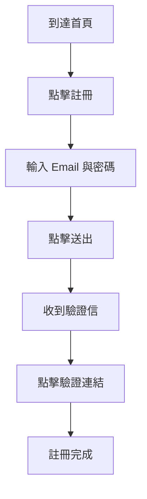

# Skill: PRD Template

## 使用時機

- **使用者**：Patricia（資深 PM）
- **輸出路徑**：`docs/02_product/YYYYMMDD_PRD_{feature-name}.md`
- **觸發時機**：Jamie 轉達新需求給 Patricia

## 模板

```markdown
# PRD: {功能名稱}

- **文件版本**：v1.0
- **撰寫者**：Patricia
- **撰寫日期**：YYYY-MM-DD
- **狀態**：🟡 草稿 / 🟢 已定稿 / 🔴 待修正
- **關聯票券**：{Jira / Linear ticket}

---

## 1. 背景與目標

### 1.1 背景

{為什麼現在要做這件事？當前痛點是什麼？}

### 1.2 目標

{解決什麼問題？達成什麼效果？}

### 1.3 成功指標（North Star Metrics）

| 指標 | 基準值 | 目標值 | 量測方式 |
|------|--------|--------|----------|
| 使用者註冊轉換率 | 2% | 5% | Google Analytics |
| 平均每日活躍使用者（DAU） | 1000 | 3000 | 後台統計 |

---

## 2. 目標使用者

### 2.1 主要使用者（Primary Persona）

**姓名**：小明
**年齡**：25-35
**職業**：上班族
**科技熟悉度**：中等
**使用情境**：
- 上班通勤時在手機上操作
- 預期操作時間 < 3 分鐘

**痛點**：
- 現有流程步驟過多
- 介面不直覺

### 2.2 次要使用者（Secondary Persona）

{若有}

---

## 3. 功能描述

### 3.1 功能清單

| 編號 | 功能名稱 | 優先級 | 說明 |
|------|----------|--------|------|
| F-001 | 使用者註冊 | 🔴 P0 | 必要 |
| F-002 | Email 驗證 | 🔴 P0 | 必要 |
| F-003 | 社群登入 | 🟡 P1 | 重要 |
| F-004 | 記住密碼 | 🟢 P2 | 加分 |

### 3.2 使用者故事（User Story）

#### US-001：使用者註冊

> **作為**一位新使用者，
> **我希望**能夠用 Email 註冊帳號，
> **以便**開始使用此平台的服務。

**驗收條件**：
- 輸入有效 Email 與符合強度的密碼後能成功註冊
- 註冊後立即收到驗證信
- 未驗證的帳號無法登入

---

## 4. 使用者旅程

### 4.1 Happy Path（主要流程）



### 4.2 Edge Cases

| 情境 | 預期行為 |
|------|----------|
| Email 已被使用 | 顯示「此 Email 已被註冊，請登入或使用其他 Email」 |
| 密碼強度不足 | 即時顯示密碼強度指示，不符合無法送出 |
| 驗證信 24 小時內未驗證 | 過期，需重新註冊 |
| 使用者關閉驗證信分頁 | 保留註冊資料，可重新發送驗證信 |

---

## 5. 非功能需求

| 類別 | 需求 |
|------|------|
| 效能 | 註冊 API 回應時間 < 2 秒 |
| 可用性 | 99.9% SLA |
| 安全性 | 符合 GDPR、密碼 BCrypt 加密 |
| 相容性 | 支援 Chrome 100+、Safari 15+、Firefox 100+ |
| 無障礙 | 符合 WCAG AA |
| 多語言 | 繁體中文、英文 |

---

## 6. 限制與假設

### 6.1 限制

- 僅支援 Email 註冊（本次不支援手機註冊）
- 僅支援 Gmail、Outlook 作為驗證信寄件人

### 6.2 假設

- 使用者擁有有效 Email
- 使用者在有網路環境下操作

---

## 7. 未涵蓋範圍（Out of Scope）

**本次「不做」的項目**：

- ❌ 手機號碼註冊
- ❌ 第三方登入（FB、Apple）
- ❌ 忘記密碼流程（下一版）
- ❌ 帳號註銷流程

---

## 8. 競品參考（選填）

| 競品 | 做法 | 我們的選擇 | 理由 |
|------|------|------------|------|
| 競品 A | 支援 Email 註冊 | 採用 | 最大眾接受 |
| 競品 B | 僅社群登入 | 不採用 | 門檻太高 |

---

## 9. 時程規劃（概估）

| 階段 | 預計時間 |
|------|----------|
| PRD 定稿 | 3 天 |
| SRS 產出 | 3 天 |
| 架構設計 | 5 天 |
| 開發 | 2 週 |
| Review + 測試 | 1 週 |
| 部署 | 1 天 |

---

## 10. 風險與緩解

| 風險 | 可能性 | 影響 | 緩解措施 |
|------|--------|------|----------|
| Email 服務商封鎖 | 中 | 高 | 採用 SendGrid + 備援 |
| 註冊量爆增導致系統崩潰 | 低 | 高 | 搭配 CDN + 限流 |

---

## 11. 附錄

### 參考資料

- [競品分析文件](...)
- [使用者訪談結果](...)

### 待確認事項

- [ ] 是否需要支援匿名註冊？（問 Jamie 轉達給使用者）
- [ ] 密碼強度規則細節？
```

## 撰寫要點

1. **使用者導向**：永遠從使用者價值切入
2. **可驗證**：避免「體驗要好」這種無法驗證的描述
3. **明確排除項**：列出「不做」的範圍
4. **優先級清楚**：P0 / P1 / P2 + 理由
5. **誠實**：不確定就標註「待確認」

## 禁止事項

- 禁止寫技術實作細節（那是架構師的職責）
- 禁止寫 API 規格（那是 Peter 的職責）
- 禁止省略「未涵蓋範圍」章節
- 禁止模糊描述（「使用者體驗要好」）
