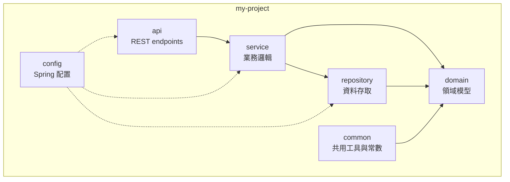

# Skill: Project Architecture

## 使用時機

- **使用者**：Preston（專案架構師）
- **輸出路徑**：`docs/04_architecture/project/YYYYMMDD_ProjectArch_{module}.md`
- **觸發時機**：Sophia 完成系統架構後（兩者可並行）

## 模板

```markdown
# 專案架構：{專案名稱}

- **文件版本**：v1.0
- **架構師**：Preston
- **日期**：YYYY-MM-DD
- **對應 SRS**：[link]
- **對應系統架構**：[link]

---

## 1. 模組劃分

### 1.1 模組概覽



### 1.2 Maven Multi-Module 結構

```
my-project/
├── pom.xml                  # parent
├── my-project-common/
│   └── pom.xml
├── my-project-domain/
│   └── pom.xml
├── my-project-repository/
│   └── pom.xml
├── my-project-service/
│   └── pom.xml
├── my-project-api/
│   └── pom.xml
└── my-project-app/          # 啟動模組
    └── pom.xml
```

### 1.3 模組職責

| 模組 | 職責 | 可依賴 |
|------|------|--------|
| common | 通用工具、常數、例外 | - |
| domain | PO、DTO、Enum、Convertor | common |
| repository | MyBatis Mapper | domain |
| service | 業務邏輯 | repository、domain |
| api | Controller、Filter | service、domain |
| config | Spring 配置 | 各模組 |
| app | Application.java | 全部 |

### 1.4 依賴規則

- 上層**只能**依賴下層
- 同層**不互相依賴**
- 違反則 build 失敗（用 ArchUnit 驗證）

---

## 2. 套件結構

### 2.1 完整套件樹

```
com.example.myproject/
├── MyProjectApplication.java          # @SpringBootApplication
│
├── api/
│   ├── controller/
│   │   ├── UserController.java
│   │   └── OrderController.java
│   ├── filter/
│   │   └── JwtAuthFilter.java
│   ├── interceptor/
│   │   └── LoggingInterceptor.java
│   └── advice/
│       └── GlobalExceptionHandler.java
│
├── service/
│   ├── UserService.java                # interface
│   ├── OrderService.java
│   └── impl/
│       ├── UserServiceImpl.java
│       └── OrderServiceImpl.java
│
├── repository/
│   ├── UserMapper.java                 # MyBatis interface
│   ├── OrderMapper.java
│   └── xml/
│       ├── UserMapper.xml              # 動態 SQL
│       └── OrderMapper.xml
│
├── domain/
│   ├── po/
│   │   ├── UserPO.java
│   │   └── OrderPO.java
│   ├── dto/
│   │   ├── request/
│   │   │   ├── CreateUserRequest.java
│   │   │   └── UpdateOrderRequest.java
│   │   └── response/
│   │       ├── UserResponse.java
│   │       └── OrderResponse.java
│   ├── enums/
│   │   ├── UserStatus.java
│   │   └── OrderStatus.java
│   └── convertor/
│       ├── UserConvertor.java          # MapStruct
│       └── OrderConvertor.java
│
├── common/
│   ├── constant/
│   │   ├── ErrorCode.java
│   │   └── CacheKey.java
│   ├── exception/
│   │   ├── BusinessException.java
│   │   └── SystemException.java
│   ├── response/
│   │   └── ApiResponse.java
│   └── util/
│       ├── DateUtils.java
│       ├── JsonUtils.java
│       └── MaskUtils.java
│
├── config/
│   ├── SecurityConfig.java
│   ├── DatabaseConfig.java
│   ├── RedisConfig.java
│   ├── MyBatisConfig.java
│   ├── SwaggerConfig.java
│   └── WebMvcConfig.java
│
├── security/
│   ├── JwtTokenProvider.java
│   ├── UserPrincipal.java
│   └── PasswordEncoder.java
│
└── aspect/
    ├── LoggingAspect.java
    ├── PerformanceAspect.java
    └── AuditAspect.java
```

### 2.2 命名規範總結

| 對象 | 規則 | 範例 |
|------|------|------|
| Controller | `*Controller` | `UserController` |
| Service interface | `*Service` | `UserService` |
| Service impl | `*ServiceImpl` | `UserServiceImpl` |
| Mapper | `*Mapper` | `UserMapper` |
| PO | `*PO` | `UserPO` |
| Request DTO | `*Request` | `CreateUserRequest` |
| Response DTO | `*Response` | `UserResponse` |
| Convertor | `*Convertor` | `UserConvertor` |
| Util | `*Utils` | `DateUtils` |
| Exception | `*Exception` | `BusinessException` |
| Config | `*Config` | `SecurityConfig` |
| Aspect | `*Aspect` | `LoggingAspect` |

---

## 3. 核心類別設計

### 3.1 ApiResponse（統一回應）

```java
@Data
@Builder
@AllArgsConstructor
@NoArgsConstructor
public class ApiResponse<T> {
    private int code;
    private String message;
    private T data;
    private List<FieldError> errors;
    private String timestamp;
    private String traceId;

    public static <T> ApiResponse<T> success(T data) { /* ... */ }
    public static <T> ApiResponse<T> error(int code, String message) { /* ... */ }
}
```

### 3.2 BusinessException

```java
@Getter
public class BusinessException extends RuntimeException {
    private final int code;
    private final List<FieldError> errors;

    public BusinessException(int code, String message) { /* ... */ }
    public BusinessException(int code, String message, List<FieldError> errors) { /* ... */ }
}
```

### 3.3 GlobalExceptionHandler

```java
@RestControllerAdvice
@Slf4j
public class GlobalExceptionHandler {

    @ExceptionHandler(BusinessException.class)
    public ResponseEntity<ApiResponse<Void>> handleBusiness(BusinessException ex) {
        log.warn("Business exception: code={}, msg={}", ex.getCode(), ex.getMessage());
        return ResponseEntity.ok(ApiResponse.error(ex.getCode(), ex.getMessage()));
    }

    @ExceptionHandler(MethodArgumentNotValidException.class)
    public ResponseEntity<ApiResponse<Void>> handleValidation(MethodArgumentNotValidException ex) {
        // 1001: 必填參數缺失
    }

    @ExceptionHandler(Exception.class)
    public ResponseEntity<ApiResponse<Void>> handleUnexpected(Exception ex) {
        log.error("Unexpected error", ex);
        return ResponseEntity.ok(ApiResponse.error(9999, "系統繁忙"));
    }
}
```

---

## 4. 設計模式應用

| 模式 | 使用位置 | 理由 |
|------|----------|------|
| Strategy | 不同支付通路 | 增加新通路不改主流程 |
| Factory | PaymentProviderFactory | 根據通路碼建立對應 Provider |
| Builder | 複雜物件建構 | Lombok @Builder |
| Template Method | OrderProcessor | 統一流程，差異化步驟 |
| Observer | 事件發布（Spring Events） | 解耦 |
| Specification | 動態查詢條件 | 組合複雜 SQL |
| Decorator | LoggingService | 不修改原類別加 log |

---

## 5. ER Diagram

```mermaid
erDiagram
    USER_INFO ||--o{ ORDER_HEADER : "places"
    USER_INFO {
        VARCHAR2(36) user_id PK
        VARCHAR2(255) email "UK"
        VARCHAR2(60) password_hash
        VARCHAR2(20) status
        TIMESTAMP created_at
    }
    ORDER_HEADER ||--|{ ORDER_ITEM : "contains"
    ORDER_HEADER {
        VARCHAR2(36) order_id PK
        VARCHAR2(36) user_id FK
        NUMBER(18,2) total_amount
        VARCHAR2(20) status
        TIMESTAMP created_at
    }
    ORDER_ITEM {
        VARCHAR2(36) item_id PK
        VARCHAR2(36) order_id FK
        VARCHAR2(36) product_id FK
        NUMBER(10) quantity
        NUMBER(18,2) unit_price
    }
    PRODUCT_INFO ||--o{ ORDER_ITEM : "referenced by"
    PRODUCT_INFO {
        VARCHAR2(36) product_id PK
        VARCHAR2(255) name
        NUMBER(18,2) price
        VARCHAR2(20) status
    }
```

### 5.1 索引策略

| 表 | 索引 | 用途 |
|----|------|------|
| USER_INFO | pk_user_info | 主鍵 |
| USER_INFO | uk_user_info_email | email 唯一 |
| ORDER_HEADER | idx_order_user_status | 使用者訂單查詢 |
| ORDER_ITEM | idx_item_order | 訂單明細查詢 |

---

## 6. Configuration 策略

### 6.1 Profile 規劃

```yaml
# application.yml（共通）
spring:
  profiles:
    active: ${SPRING_PROFILES_ACTIVE:local}

# application-local.yml
# application-dev.yml
# application-uat.yml
# application-stg.yml
# application-preprod.yml
# application-prod.yml
```

### 6.2 配置分層

| 配置 | 共通 | local | dev | prod |
|------|------|-------|-----|------|
| 應用名稱 | ✅ | - | - | - |
| 資料庫 URL | - | ✅（明碼） | ✅（${env}） | ✅（${env}） |
| Redis | - | ✅ | ✅ | ✅ |
| Log level | INFO | DEBUG | INFO | WARN |
| Swagger | - | enabled | enabled | disabled |

---

## 7. AOP 設計

### 7.1 LoggingAspect

```java
@Aspect
@Component
@Slf4j
public class LoggingAspect {

    @Around("@annotation(org.springframework.web.bind.annotation.PostMapping)")
    public Object logRequest(ProceedingJoinPoint pjp) throws Throwable {
        long start = System.currentTimeMillis();
        try {
            Object result = pjp.proceed();
            log.info("API {} took {}ms", pjp.getSignature(), System.currentTimeMillis() - start);
            return result;
        } catch (Throwable t) {
            log.error("API {} failed", pjp.getSignature(), t);
            throw t;
        }
    }
}
```

### 7.2 AuditAspect

針對標註 `@Auditable` 的方法記錄稽核日誌。

---

## 8. ArchUnit 架構驗證

```java
@AnalyzeClasses(packages = "com.example.myproject")
class ArchitectureTest {

    @ArchTest
    static final ArchRule controllers_should_only_call_services =
        classes().that().resideInAPackage("..controller..")
            .should().onlyAccessClassesThat()
            .resideInAnyPackage("..service..", "..domain..", "..common..", "java..");

    @ArchTest
    static final ArchRule services_should_not_call_controllers =
        noClasses().that().resideInAPackage("..service..")
            .should().accessClassesThat().resideInAPackage("..controller..");
}
```

---

## 9. 資料庫設計遵循

對照 [relational-database](../rules/relational-database.md)：

- ✅ 表命名避開保留字（user_info 而非 user）
- ✅ ID 使用 VARCHAR(36) UUID 字串
- ✅ 時間使用 TIMESTAMP（不帶時區，DB 存 UTC）
- ✅ 金額使用 NUMERIC(18,2)
- ✅ 業務邏輯不放 DB

---

## 10. 待確認事項

- [ ] 是否需要分離 read-only DB？
- [ ] 是否需要 ShardingSphere（資料分片）？
```

## 撰寫要點

1. **模組依賴清楚**：用 ArchUnit 驗證
2. **套件結構完整**：所有資料夾都列出
3. **設計模式有理由**：不為了用而用
4. **ER Diagram 完整**：含索引

## 禁止事項

- 禁止省略 ER Diagram
- 禁止套件結構混亂（必須清楚分層）
- 禁止 Configuration 不分 Profile
- 禁止業務邏輯設計依賴資料庫特性
