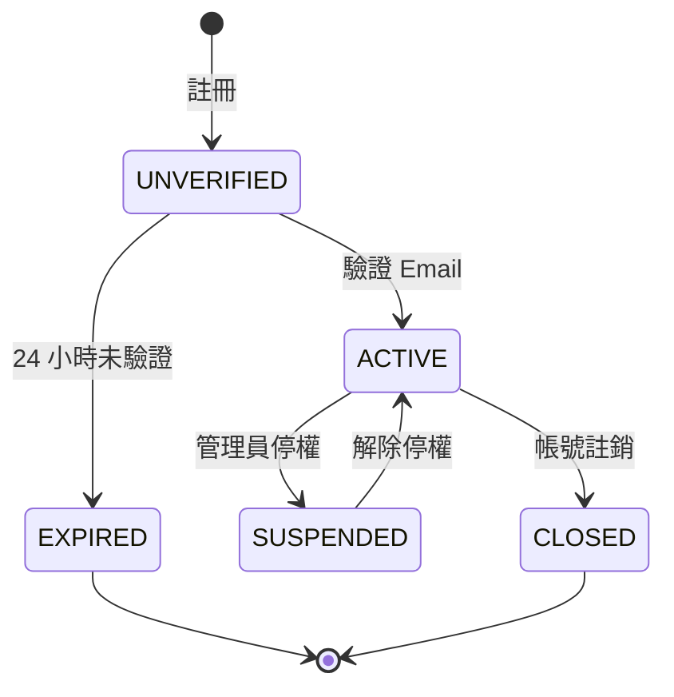

# Skill: SRS Template

## 使用時機

- **使用者**：Peter（PM）
- **輸出路徑**：`docs/03_spec/YYYYMMDD_SRS_{feature-name}.md`
- **觸發時機**：Patricia 完成 PRD 後

## 模板

```markdown
# SRS: {功能名稱}

- **文件版本**：v1.0
- **撰寫者**：Peter
- **撰寫日期**：YYYY-MM-DD
- **狀態**：🟡 草稿 / 🟢 已定稿 / 🔴 待修正
- **對應 PRD**：[PRD 連結]
- **關聯票券**：{ticket}

---

## 1. 功能拆解

將 PRD 的功能拆解為可實作的最小單位：

| 功能 ID | 名稱 | 說明 | PRD 對應 |
|---------|------|------|----------|
| F-001-1 | 註冊表單元件 | UI 表單 | F-001 |
| F-001-2 | 註冊 API | POST /api/v1/user/register | F-001 |
| F-001-3 | 寄送驗證信 | Email Service 整合 | F-001 |
| F-001-4 | 驗證連結處理 | GET /verify?token=... | F-002 |

---

## 2. 資料模型

### 2.1 USER_INFO 表

| 欄位 | 型別 | 長度 | 必填 | 預設 | 說明 |
|------|------|------|------|------|------|
| user_id | VARCHAR2 | 36 | Y | - | UUID（系統產生） |
| email | VARCHAR2 | 255 | Y | - | 唯一索引 |
| password_hash | VARCHAR2 | 60 | Y | - | BCrypt hash |
| display_name | VARCHAR2 | 100 | N | - | 顯示名稱 |
| status | VARCHAR2 | 20 | Y | UNVERIFIED | 狀態 |
| email_verified_at | TIMESTAMP | - | N | NULL | 驗證時間 |
| created_at | TIMESTAMP | - | Y | SYSTIMESTAMP | 建立時間 |
| updated_at | TIMESTAMP | - | N | NULL | 更新時間 |

**索引**：
- `pk_user_info` PRIMARY KEY (user_id)
- `uk_user_info_email` UNIQUE (email)
- `idx_user_info_status` (status)

### 2.2 USER_VERIFICATION_TOKEN 表

[...]

---

## 3. 業務規則

### 3.1 密碼強度規則

| 規則 | 值 |
|------|-----|
| 最小長度 | 12 |
| 必含大寫字母 | Y |
| 必含小寫字母 | Y |
| 必含數字 | Y |
| 必含特殊符號 | Y |
| 不能與 email 相同 | Y |
| 不能是常見密碼 | Y（檢查清單 1000 個） |

### 3.2 註冊流程業務規則

1. Email 必須符合 RFC 5322 格式
2. Email 不能已存在於 USER_INFO 表
3. 密碼必須符合 3.1 規則
4. 註冊成功後立即寄送驗證信
5. 驗證 Token 有效期為 24 小時
6. 同一 Email 24 小時內最多重發 5 次

### 3.3 邊界條件

| 條件 | 處理 |
|------|------|
| Email > 255 字元 | 拒絕，回 1003 |
| 密碼包含 emoji | 接受 |
| Email 含 `+` 別名（如 `a+b@c.com`） | 接受，視為不同帳號 |

---

## 4. API 清單

### 4.1 POST /api/v1/user/register

**功能**：註冊新使用者

**Request**：
```json
{
  "email": "test@example.com",
  "password": "ValidP@ss123!",
  "displayName": "Test User"
}
```

**Response（成功）**：
```json
{
  "code": 0,
  "message": "success",
  "data": {
    "userId": "550e8400-e29b-41d4-a716-446655440000",
    "email": "test@example.com",
    "status": "UNVERIFIED"
  },
  "timestamp": "2026-04-21T10:30:45.123+08:00",
  "traceId": "..."
}
```

**Response（失敗）**：
| Code | Message | 情境 |
|------|---------|------|
| 1001 | 必填參數缺失 | email 或 password 為空 |
| 1002 | Email 格式錯誤 | 不符合 RFC 5322 |
| 1002 | 密碼強度不足 | 不符合 3.1 規則 |
| 2010 | Email 已被註冊 | email 已存在 |
| 9001 | 系統繁忙 | 內部錯誤 |

### 4.2 POST /api/v1/user/verify-email

[...]

### 4.3 POST /api/v1/user/resend-verification

[...]

---

## 5. UI 流程

### 5.1 註冊頁

**路徑**：`/register`

**欄位**：
| 欄位 | 元件 | 驗證 | 提示 |
|------|------|------|------|
| Email | Input | 必填、Email 格式 | "請輸入您的 Email" |
| 密碼 | Input.Password | 必填、強度規則 | 即時顯示強度條 |
| 確認密碼 | Input.Password | 必填、與密碼相同 | - |
| 顯示名稱 | Input | 選填、最多 100 字 | - |
| 服務條款同意 | Checkbox | 必勾 | 連結到條款頁 |
| 註冊按鈕 | Button | - | 表單未通過時 disabled |

**Loading 狀態**：
- 點擊送出後按鈕顯示 spinner
- 表單欄位 disabled

**錯誤狀態**：
- 欄位錯誤：紅色邊框 + 下方訊息
- API 錯誤：頂部顯示 alert

### 5.2 驗證信箱頁

**路徑**：`/verify-email`

[...]

---

## 6. 狀態機

### 6.1 使用者狀態



| 狀態 | 說明 | 可登入 |
|------|------|--------|
| UNVERIFIED | 已註冊未驗證 | ❌ |
| ACTIVE | 啟用中 | ✅ |
| EXPIRED | 驗證過期 | ❌ |
| SUSPENDED | 停權 | ❌ |
| CLOSED | 已註銷 | ❌ |

---

## 7. 驗收標準（AC）

### AC-001：註冊成功

```gherkin
Scenario: 使用者用有效資訊註冊
  Given 使用者尚未註冊
  And 使用者開啟註冊頁
  When 輸入 email "test@example.com"
  And 輸入密碼 "ValidP@ss123!"
  And 輸入確認密碼 "ValidP@ss123!"
  And 勾選服務條款
  And 點擊「註冊」
  Then API 回傳 code = 0
  And 系統建立狀態為 UNVERIFIED 的帳號
  And 系統寄送驗證信到 test@example.com
  And 頁面導向「請驗證信箱」
```

### AC-002：Email 已被註冊

```gherkin
Scenario: 使用者註冊已被使用的 Email
  Given email "existing@example.com" 已在系統中
  When 使用者用此 email 註冊
  Then API 回傳 code = 2010
  And 顯示錯誤訊息「此 Email 已被註冊」
  And 帳號未被建立
```

### AC-003：密碼強度不足

[...]

---

## 8. 依賴關係

| 依賴 | 用途 | 提供者 |
|------|------|--------|
| Email Service | 寄送驗證信 | SendGrid（雲端）/ 自建 SMTP（地端） |
| Redis | 驗證 Token 快取（含 TTL） | 內部服務 |
| Audit Log Service | 記錄註冊事件 | 內部服務 |

---

## 9. 錯誤處理

| 情境 | 對應錯誤碼 | 使用者訊息 | 內部處理 |
|------|-----------|------------|----------|
| Email Service 無回應 | 5002 | 系統繁忙，請稍後再試 | 寫入 retry queue |
| DB 寫入失敗 | 9001 | 系統繁忙，請稍後再試 | 告警 |
| 重複註冊（Race condition） | 2010 | 此 Email 已被註冊 | DB unique constraint 確保 |

---

## 10. 效能要求

| 指標 | 目標 |
|------|------|
| 註冊 API p95 response time | < 2 秒 |
| 寄送驗證信 | < 30 秒（async） |
| 同時並發註冊 | 100 RPS |

---

## 11. 監控指標

由 DevOps 配合：
- 註冊成功/失敗 rate
- 平均 response time
- Email 寄送成功率
- 驗證率（24 小時內驗證的比例）

---

## 12. 待確認事項

- [ ] 服務條款內容（請法務確認）
- [ ] 驗證信模板設計（請設計師提供）
- [ ] 是否支援軟刪除？
```

## 撰寫要點

1. **明確可實作**：每個規格都要工程師可以直接寫程式
2. **AC 完整**：用 Given-When-Then 描述所有情境
3. **資料模型精準**：欄位、型別、約束都要明確
4. **邊界條件清楚**：edge cases 必須列出

## 禁止事項

- 禁止模糊描述（「適當的」「合理的」「快速的」）
- 禁止省略 AC
- 禁止寫程式碼實作細節（那是工程師的職責）
- 禁止省略「待確認事項」
