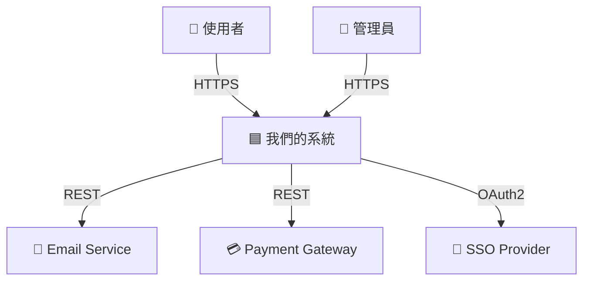
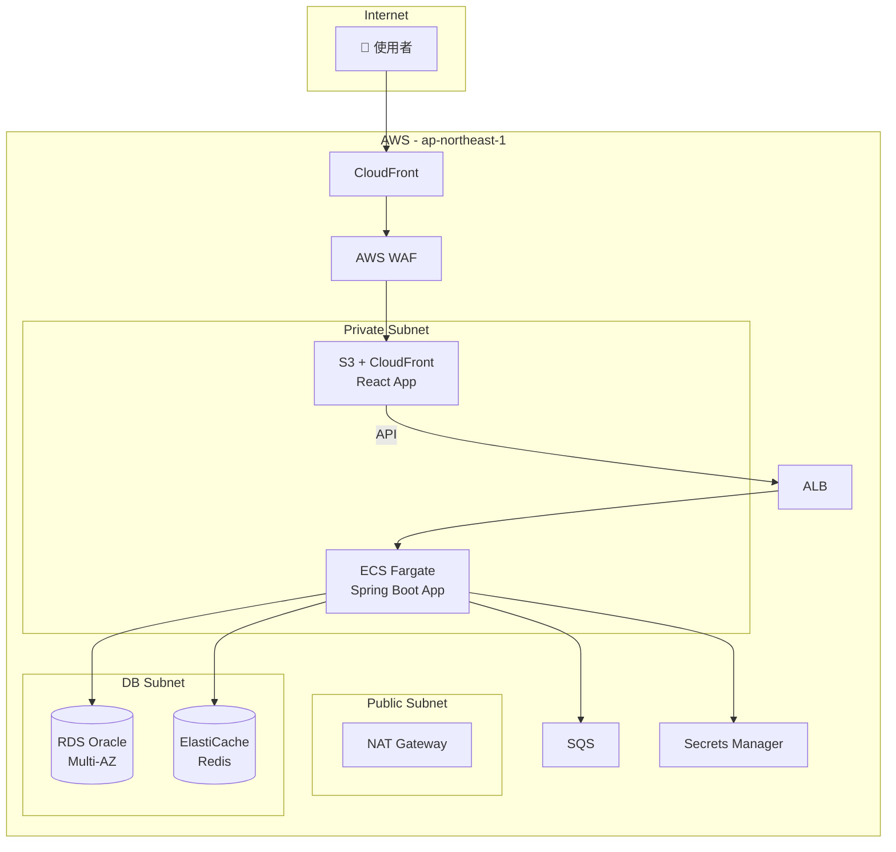
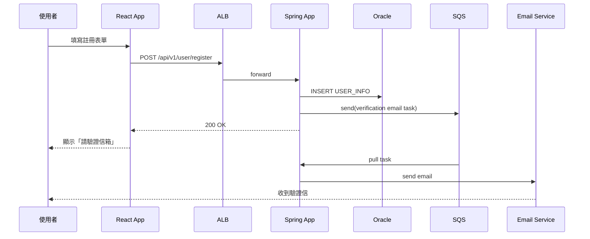

# Skill: System Architecture

## 使用時機

- **使用者**：Sophia（系統架構師）
- **輸出路徑**：`docs/04_architecture/system/YYYYMMDD_SystemArch_{feature}.md`
- **觸發時機**：Peter 完成 SRS 後

## 模板

```markdown
# 系統架構：{專案/功能名稱}

- **文件版本**：v1.0
- **架構師**：Sophia
- **日期**：YYYY-MM-DD
- **對應 SRS**：[link]

---

## 1. 架構概覽

### 1.1 系統定位

{一段話說明系統在企業整體架構中的位置}

### 1.2 C4 Context Diagram（Level 1）



| 元素 | 說明 |
|------|------|
| 使用者 | 一般終端使用者 |
| 管理員 | 系統管理員 |
| 我們的系統 | 本次設計範圍 |
| Email Service | SendGrid（雲）/ 自建 SMTP（地端） |
| Payment Gateway | Stripe |
| SSO Provider | Auth0 / Keycloak |

---

## 2. 系統邊界

### 2.1 範圍內

- 使用者管理
- 訂單管理
- 通知整合

### 2.2 範圍外

- 第三方 SSO 內部運作
- Payment Gateway 內部運作
- Email Service 內部運作

### 2.3 系統間契約

| 對外系統 | 介面類型 | 同步/非同步 | SLA |
|----------|----------|-------------|-----|
| Email Service | REST | 非同步（佇列） | 99.9% |
| Payment Gateway | REST + Webhook | 同步 + 非同步 | 99.95% |
| SSO Provider | OIDC | 同步 | 99.9% |

---

## 3. 雲端架構（AWS）

### 3.1 C4 Container Diagram（Level 2）



### 3.2 AWS 服務選擇

| 用途 | 選定服務 | 替代方案 | 選擇理由 |
|------|----------|----------|----------|
| 計算 | ECS Fargate | EKS, EC2 | 無需管理節點，啟動快 |
| 資料庫 | RDS for Oracle | EC2 自建 | 客戶要求 Oracle，RDS 提供 Multi-AZ |
| 快取 | ElastiCache Redis | DynamoDB | TTL、List 等資料結構需求 |
| 訊息佇列 | SQS | Kafka, RabbitMQ | 流量規模 SQS 足夠，運維最低 |
| 機密 | Secrets Manager | Parameter Store | 自動輪替 RDS credentials |
| 前端 | S3 + CloudFront | EC2 + Nginx | 靜態網站成本最低 |

### 3.3 網路設計

| Subnet | CIDR | AZ | 用途 |
|--------|------|-----|------|
| public-a | 10.0.1.0/24 | ap-northeast-1a | ALB / NAT |
| public-c | 10.0.2.0/24 | ap-northeast-1c | ALB / NAT |
| private-a | 10.0.10.0/24 | ap-northeast-1a | ECS |
| private-c | 10.0.11.0/24 | ap-northeast-1c | ECS |
| db-a | 10.0.20.0/24 | ap-northeast-1a | RDS Primary |
| db-c | 10.0.21.0/24 | ap-northeast-1c | RDS Standby |

---

## 4. 地端整合（若 Hybrid）

### 4.1 連線方式

- **AWS Direct Connect**：1 Gbps 專線
- **VPN backup**：IPsec
- **頻寬規劃**：日常 < 100 Mbps，高峰 < 500 Mbps

### 4.2 地端系統清單

| 系統 | 用途 | 連線方式 |
|------|------|----------|
| 內部 LDAP | 員工認證 | LDAP over VPN |
| 內部 ERP | 訂單同步 | REST over VPN |

---

## 5. 技術選型決策

### 5.1 後端框架

- **選定**：Spring Boot 3.x + Java 21
- **替代方案**：
  | 方案 | 優點 | 缺點 | 評分 |
  |------|------|------|------|
  | Spring Boot 3 + Java 21 | 生態成熟、團隊熟悉、Virtual Threads | 啟動較慢、記憶體大 | 9/10 |
  | Quarkus | 啟動快、低記憶體 | 生態較小 | 7/10 |
  | Micronaut | AOT、低記憶體 | 學習曲線 | 6/10 |
- **理由**：團隊既有經驗 + 生態成熟，Java 21 LTS 提供 Virtual Threads 解決 I/O 並發

### 5.2 前端框架

- **選定**：React 18 + TypeScript + Vite
- **替代方案**：
  | 方案 | 優缺點 |
  |------|--------|
  | React + Vite | 團隊熟悉、生態成熟 |
  | Next.js | SSR 強，但本系統是 SPA 不需要 |
  | Vue 3 | 學習曲線低，但生態小 |
- **理由**：團隊熟悉 + Ant Design 整合佳

### 5.3 資料庫

- **選定**：Oracle 19c
- **理由**：客戶要求

### 5.4 ORM

- **選定**：MyBatis 3.5+
- **替代方案**：
  - Hibernate / JPA：過度抽象，效能調校複雜
  - JOOQ：型別安全強，但學習曲線
- **理由**：SQL 控制度高，符合「Smart Service, Dumb Database」原則

---

## 6. 資料流向

### 6.1 註冊流程 Sequence



---

## 7. 非功能需求

### 7.1 可用性

- **SLA 目標**：99.95%（每月停機 ≤22 分鐘）
- **HA 設計**：
  - ECS：2+ tasks across 2+ AZ
  - RDS：Multi-AZ
  - Redis：Cluster mode（3 nodes）
  - ALB：自動跨 AZ

### 7.2 擴展性

- **水平擴展**：ECS Auto Scaling（CPU > 70% scale out）
- **垂直擴展**：RDS instance 升級（停機升級）
- **流量規模**：DAU 10K → 100K（擴展能力）

### 7.3 安全性

- TLS 1.3
- AWS WAF（OWASP Top 10 規則集）
- IAM 最小權限
- Secrets Manager 自動輪替
- VPC Flow Logs
- CloudTrail

### 7.4 監控

| 類別 | 工具 | 指標 |
|------|------|------|
| Metrics | CloudWatch | CPU、Memory、Request rate |
| Tracing | X-Ray | 跨服務追蹤 |
| Logging | CloudWatch Logs | 結構化 JSON |
| APM | New Relic / Datadog | 應用層效能 |

---

## 8. 災難復原

| 指標 | 目標 |
|------|------|
| RTO | 1 小時 |
| RPO | 15 分鐘 |
| 備份 | RDS daily snapshot + PITR |
| DR Region | ap-southeast-1（warm standby） |

---

## 9. 成本估算

| 服務 | 規格 | 月費（USD） |
|------|------|-------------|
| ECS Fargate | 4 tasks × 1 vCPU × 2GB | $120 |
| RDS Oracle SE2 | db.m5.large Multi-AZ | $800 |
| ElastiCache | cache.m5.large × 3 | $300 |
| ALB + CloudFront | - | $50 |
| 其他 | - | $100 |
| **總計** | - | **$1,370** |

---

## 10. 風險與緩解

| 風險 | 可能性 | 影響 | 緩解 |
|------|--------|------|------|
| Oracle 授權成本高 | 高 | 高 | 評估 RDS 託管 vs EC2 自建 |
| 跨 AZ 流量費用 | 中 | 中 | 同 AZ 部署、cache 集中 |
| 流量激增超出 ASG 上限 | 低 | 高 | 設定 CloudWatch alarm + 手動介入 |

---

## 11. 投票紀錄（如有）

| 議題 | 投票結果 | 決定 |
|------|----------|------|
| 後端框架 | Sophia/Preston/Brian/Fiona = 4 票 Spring Boot | Spring Boot 3 |

---

## 12. 待確認事項

- [ ] 是否需要多 region 部署？
- [ ] 跨地端流量上限？
```

## 撰寫要點

1. **C4 Model**：至少 Level 1（Context）+ Level 2（Container）
2. **量化**：所有規格、成本、SLA 都要數字
3. **替代方案**：每個技術選擇都要列替代方案
4. **風險顯性**：列出風險與緩解

## 禁止事項

- 禁止只寫「能動就好」的架構
- 禁止省略災難復原設計
- 禁止省略監控設計
- 禁止技術選型不寫替代方案
