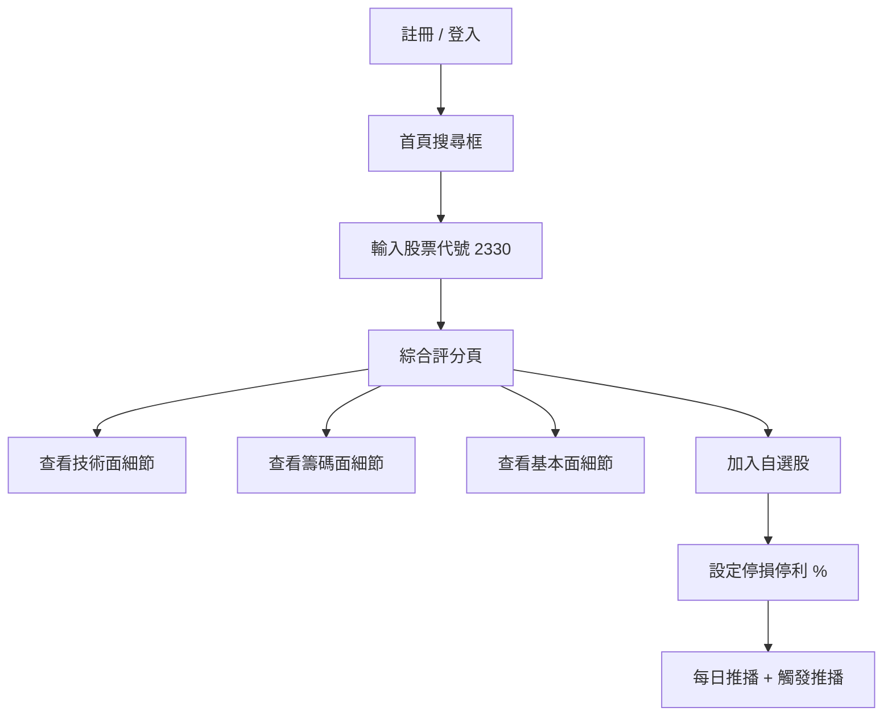

# PRD：台股股票分析與追蹤平台 MVP

- **文件版本**：v0.1（雛形）
- **撰寫者**：Patricia（資深 PM）
- **撰寫日期**：2026-04-21
- **狀態**：🟡 草稿（待 Jamie 與使用者確認 5 大關鍵假設後定稿）
- **關聯票券**：尚未建立
- **上游文件**：
  - [PROJECT.md](../../PROJECT.md)
  - [Intake 進度報告](../01_leader/progress/20260421_1000_intake.md)

---

## 1. 背景與目標

### 1.1 背景

台灣有約 **1,200 萬證券開戶人口**，其中 40 歲上下的散戶為主力族群。此族群普遍面臨三大痛點：

1. **資訊散落**：技術面看券商 App、籌碼面看 HiStock、基本面看公開資訊觀測站（MOPS）、消息面看財經媒體，需在 4-5 個工具間切換
2. **判讀門檻高**：技術指標（KD、MACD）與籌碼資料（三大法人、融資融券）需要一定金融背景才能解讀
3. **缺乏個人化建議**：現有工具提供「資料」但不提供「建議」，散戶需自行下決策

現有競品（Yahoo 股市、CMoney、富果 Fugle）多聚焦在單一面向或為券商導流，**缺乏一站式整合 + 個人化買賣建議**的產品定位。

### 1.2 目標

打造一個**以「輸入股票代號 → 取得綜合評分與買賣建議」為核心體驗**的台股分析平台，讓散戶能在 **30 秒內**取得對單一個股的多維度判讀。

### 1.3 成功指標（North Star Metrics）

呼應 PROJECT.md：

| 指標 | 基準值 | 目標值（上線後 6 個月） | 量測方式 |
|------|--------|------------------------|----------|
| MAU（月活躍使用者） | 0 | 10,000 | 後台埋點 |
| 次月留存率（M1 Retention） | - | > 40% | Cohort 分析 |
| 平均每使用者每日查詢次數 | - | > 5 次 | 行為日誌 |
| 自選股設定使用者比率 | - | > 60% | 註冊後 7 日內 |
| API P95 延遲 | - | < 200ms | APM 監控 |
| 評分建議準確度（事後驗證） | - | > 55% 命中率 | 30 日後股價驗證 |

---

## 2. 目標使用者

### 2.1 主要使用者（Primary Persona）

**姓名**：陳大明（化名）
**年齡**：38-45 歲
**職業**：上班族 / 中階主管
**月可投資金額**：3-10 萬新台幣
**投資年資**：3-10 年
**科技熟悉度**：中等（會用券商 App、LINE、Email）

**使用情境**：
- **早盤前（08:30-09:00）**：通勤時查看自選股昨日收盤、外資買賣超、隔夜美股影響
- **盤中（09:00-13:30）**：午休 5-10 分鐘檢查持股，遇重大訊息需即時推播
- **盤後（13:30-22:00）**：晚餐後 15-30 分鐘研究新標的、調整自選股

**痛點**：
- 不知道「現在這檔股票該買、該賣、還是該觀望」
- 看到外資連續買超不知道代表什麼
- 重大訊息（例如除權息、警示股）常常錯過
- 設定停損停利常常情緒化執行不了

### 2.2 次要使用者（Secondary Persona）

**新手投資人（25-35 歲）**：剛開戶 1-2 年，需要被「教育」而非僅被「告知資料」。
> v1 範圍以「主要使用者」為主，新手教學內容（Tooltip、術語說明）列為 P1。

---

## 3. 功能描述

### 3.1 功能清單（依五大面向 + AI 差異化核心）

#### 一、技術面（Technical）— P0

| 編號 | 功能 | 優先級 | 說明 |
|------|------|--------|------|
| F-T01 | K 線圖（日/週/月切換） | 🔴 P0 | 提供標準蠟燭圖 |
| F-T02 | 移動平均線 MA（5/10/20/60/120/240 日） | 🔴 P0 | 多週期疊圖 |
| F-T03 | KD 隨機指標 | 🔴 P0 | 含黃金/死亡交叉提示 |
| F-T04 | MACD | 🔴 P0 | 含柱狀圖背離提示 |
| F-T05 | 成交量 | 🔴 P0 | 與 K 線同步顯示 |

#### 二、籌碼面（Chips）— P0（台股最關鍵）

| 編號 | 功能 | 優先級 | 說明 |
|------|------|--------|------|
| F-C01 | 三大法人買賣超 | 🔴 P0 | 外資、投信、自營商日資料 |
| F-C02 | 外資連續買賣超天數 | 🔴 P0 | 含視覺化提示 |
| F-C03 | 投信認養股辨識 | 🔴 P0 | 連續 5 日買超門檻 |
| F-C04 | 融資融券餘額變化 | 🔴 P0 | 日變化 + 週趨勢 |

#### 三、基本面（Fundamental）— P0

| 編號 | 功能 | 優先級 | 說明 |
|------|------|--------|------|
| F-F01 | 本益比 PE / 本益成長比 PEG | 🔴 P0 | 含產業平均對照 |
| F-F02 | 股價淨值比 PB | 🔴 P0 | - |
| F-F03 | 殖利率 | 🔴 P0 | 近 4 季滾動 |
| F-F04 | EPS 季成長率 | 🔴 P0 | YoY + QoQ |
| F-F05 | 月營收 YoY / MoM | 🔴 P0 | 含 12 個月趨勢圖 |

#### 四、消息面（Sentiment）— P0

| 編號 | 功能 | 優先級 | 說明 |
|------|------|--------|------|
| F-S01 | MOPS 重大訊息即時推播 | 🔴 P0 | 自選股觸發 |
| F-S02 | 法說會 / 股利公告日曆 | 🔴 P0 | 月曆視圖 |
| F-S03 | 除權息日提醒 | 🔴 P0 | T-3 日推播 |

#### 五、風險控管（Risk）— P0

| 編號 | 功能 | 優先級 | 說明 |
|------|------|--------|------|
| F-R01 | 警示股 / 注意股 / 處置股提醒 | 🔴 P0 | 自選股每日掃描 |
| F-R02 | 自訂停損停利提醒 | 🔴 P0 | 使用者自訂 % 觸發推播 |

#### 六、AI 智慧建議（差異化核心）— P0

| 編號 | 功能 | 優先級 | 說明 |
|------|------|--------|------|
| F-A01 | 綜合評分（0-100） | 🔴 P0 | 五大面向加權總和 |
| F-A02 | 買賣訊號摘要 | 🔴 P0 | 強烈買進/買進/觀望/賣出/強烈賣出 五級 |
| F-A03 | 個人化警示 | 🔴 P0 | 依自選股 + 自訂規則 |

#### 七、基礎平台功能 — P0

| 編號 | 功能 | 優先級 | 說明 |
|------|------|--------|------|
| F-P01 | 使用者註冊 / 登入（Email） | 🔴 P0 | - |
| F-P02 | 自選股管理（CRUD） | 🔴 P0 | 至少支援 50 檔 |
| F-P03 | 股票代號搜尋 | 🔴 P0 | 支援代號、簡稱、全名 |
| F-P04 | 推播設定（App / Email） | 🔴 P0 | v1 採 Email + Web 通知 |

### 3.2 使用者故事（User Story）

#### US-001：核心查詢體驗

> **作為**一位 40 歲散戶，
> **我希望**輸入股票代號（例如 2330）後，
> **以便**在 30 秒內看到該股的綜合評分與買賣建議，並知道五大面向的判讀依據。

**驗收條件**：
- 輸入代號後 < 2 秒回傳結果
- 首屏顯示：綜合評分（0-100）、買賣訊號（5 級）、五大面向各自小卡
- 可點擊任一面向小卡展開細節

#### US-002：自選股追蹤

> **作為**持有 5-10 檔股票的散戶，
> **我希望**將我的持股加入自選股，
> **以便**每日早盤前自動收到綜合評分變化與重大訊息推播。

**驗收條件**：
- 自選股列表顯示：代號、簡稱、最新評分、評分變化、最新重大訊息
- 每日早盤前 08:00 推播自選股摘要
- 評分跨級變動（例如「買進」→「觀望」）即時推播

#### US-003：風險控管

> **作為**容易情緒化操作的散戶，
> **我希望**設定停損 -10%、停利 +20%，
> **以便**達標時收到推播提醒，避免錯過或拖延。

**驗收條件**：
- 可針對每檔自選股獨立設定 %
- 觸發時即時推播（含 Email + Web 通知）
- 推播後紀錄，避免重複轟炸

---

## 4. 使用者旅程

### 4.1 Happy Path（核心查詢流程）

### 4.2 Edge Cases

| 情境 | 預期行為 |
|------|----------|
| 輸入不存在的代號 | 顯示「查無此代號，請確認後重試」+ 推薦相似代號 |
| 輸入 ETF（例如 0050） | 正常回傳，但部分指標（如 EPS）顯示「N/A 不適用」 |
| 行情資料延遲 / 來源中斷 | 顯示「資料延遲 X 分鐘」黃色警示，不阻擋頁面 |
| 警示股 / 處置股查詢 | 評分頁頂部紅色警示橫幅，並降低綜合評分 |
| 自選股超過上限（50 檔） | 顯示「已達上限，請先移除」 |
| 推播設定但 Email 未驗證 | 註冊流程強制 Email 驗證；未驗證僅 Web 通知 |
| 資料來源授權問題（重大）| 顯示「部分資料暫時無法提供」並紀錄事件 |

---

## 5. 功能優先級（含理由）

### 5.1 P0 – 必須做（MVP 範圍）

涵蓋上述 **七大類共 30 項功能**。理由：
- **核心體驗閉環**：搜尋 → 評分 → 自選 → 推播 → 風控，缺一不可
- **差異化關鍵**：AI 綜合評分（F-A01-A03）是與 Yahoo 股市最大差異
- **台股獨特性**：籌碼面（F-C01-C04）是台股散戶最關注的面向，必須在 v1 提供

### 5.2 P1 – 重要但 v1 不做

| 項目 | 延後理由 |
|------|----------|
| 布林通道、RSI、威廉指標等進階技術指標 | v1 五指標已涵蓋 80% 散戶需求 |
| 個股新聞情緒分析（NLP） | 技術成本高，v1 採人工策展之 MOPS 即可 |
| 法人籌碼分點進出 | 資料源昂貴（需付費），v1 不納入 |
| 回測引擎（Backtesting） | 需資料倉儲架構，v2 規劃 |
| 機器學習評分模型 | v1 採規則引擎驗證商業模式，v2 再投入 ML |
| Mobile App（原生） | v1 以 Web Responsive 為主 |

### 5.3 P2 – 加分項

| 項目 | 說明 |
|------|------|
| 社群討論區 | 高經營成本，且涉及合規風險 |
| 模擬交易 | 教育價值高但開發複雜 |
| 多語系（英文） | 目標客群為台灣散戶，暫不需要 |
| 達人推薦組合 | 需建立達人生態系 |

---

## 6. 成功指標（KPI）

### 6.1 業務指標（呼應 PROJECT.md）

| KPI | 目標 | 說明 |
|------|------|------|
| MAU | 10,000（上線後 6 個月） | 月活躍 |
| M1 Retention | > 40% | 次月留存 |
| 平均單次 Session 時長 | > 3 分鐘 | 代表深度使用 |

### 6.2 產品指標

| KPI | 目標 |
|------|------|
| 自選股設定率 | 註冊後 7 日內 > 60% 使用者設定 |
| 推播開啟率（Email）| > 25% |
| 評分頁查看深度 | 平均展開 > 2 個面向細節 |

### 6.3 品質指標

| KPI | 目標 |
|------|------|
| API P95 延遲 | < 200ms（呼應 PROJECT.md）|
| 評分建議命中率 | > 55%（30 日後事後驗證）|
| 系統可用性 | > 99.5% SLA |

---

## 7. 非功能需求

| 類別 | 需求 |
|------|------|
| **效能** | 個股查詢 P95 < 2 秒；API P95 < 200ms |
| **可用性** | 99.5% SLA（盤中時段 09:00-13:30 提升至 99.9%）|
| **安全性** | 密碼 BCrypt、HTTPS、JWT、OWASP Top 10 防護 |
| **個資合規** | 符合《個人資料保護法》：最小蒐集、加密儲存、可刪除 |
| **金融合規** | 平台須明確標註「非投資建議」免責聲明；不涉及代客操作、不收受存款；待確認是否需向金管會報備（**強烈建議諮詢律師**）|
| **資料授權** | TWSE / OTC 資料須確認商用授權範圍（Q1 待確認）|
| **時區** | 統一 GMT+8（呼應全域規範）|
| **相容性** | Chrome 110+、Safari 16+、Firefox 110+；行動瀏覽器 RWD |
| **無障礙** | 符合 WCAG 2.1 AA 基本要求 |
| **多語言** | 僅繁體中文（台灣用語）|

---

## 8. 限制與假設（含 Jamie Q1-Q5 的 PM 觀點）

### 8.1 Jamie 提出的 5 個 Open Questions — Patricia 觀點建議

| # | 問題 | Jamie 暫定假設 | Patricia 建議 | 建議優先處理 |
|---|------|---------------|---------------|--------------|
| Q1 | 行情資料來源 | TWSE/OTC 公開資料（延遲 20 分鐘）| **接受暫定假設**；20 分鐘延遲對「非當沖」散戶可接受。但 v1 須在 UI 明確標註「延遲 20 分鐘」避免客訴。**長期建議**：v2 評估付費即時行情（如群益 API、玉山）以提升留存 | 🔴 高（影響法律與產品定位）|
| Q2 | DB 引擎 | PostgreSQL on Docker | **接受**；PostgreSQL 對時序資料、JSON 欄位支援好，且免授權費。**但提醒**：行情資料量大，v1.5 應評估 TimescaleDB 擴充 | 🟡 中（技術選型）|
| Q3 | AI 強度 v1 | 規則引擎（v2 再 ML）| **強烈支持**；v1 用規則引擎可解釋（符合金融合規要求「需可說明」），ML 黑盒模型不適合金融建議產品的初期 | 🟢 低（已合理）|
| Q4 | 部署目標 | AWS ap-northeast-1 單區域 | **接受**；台灣使用者延遲可接受（< 50ms）。但 PROJECT.md 寫「AWS + 地端」，**需確認**是否真的需要地端（地端維運成本高，建議純雲）| 🔴 高（影響成本估算）|
| Q5 | 變現模式 | v1 註冊免費，預留付費機制 | **接受**；v1 衝 MAU 為主，但**強烈建議**從第一天就埋點記錄「哪些功能被高頻使用」以便 v2 設計付費牆。同時建議預留「廣告位」設計但 v1 不上廣告 | 🟡 中（影響架構）|

### 8.2 其他限制

- 僅服務台股（上市 + 上櫃），不含興櫃、海外、加密貨幣
- 僅服務個人散戶，不支援機構帳戶 / 多人協作
- 不提供下單功能（避免券商業務範疇與合規風險）
- v1 僅支援 Email 註冊，不支援第三方登入

### 8.3 假設

- 使用者擁有有效 Email 且能收驗證信
- 使用者在有網路環境下操作
- TWSE / OTC 公開資料 API 維持穩定（過去 5 年無重大中斷紀錄）
- MOPS 資料更新頻率符合即時推播需求（< 5 分鐘）
- 規則引擎評分準確度 > 55%（業界基準），若驗證後不達標則需提前進入 v2 ML

---

## 9. 未涵蓋範圍（Out of Scope）

**v1「明確不做」的項目**，避免範圍蔓延：

### 9.1 功能類

- ❌ 下單交易（券商業務，合規門檻高）
- ❌ 模擬交易 / 虛擬倉位
- ❌ 個股社群討論區 / 留言
- ❌ 達人組合 / 跟單功能
- ❌ 海外股票（美股、港股、陸股）
- ❌ ETF 深度分析（v1 僅基本資訊）
- ❌ 期貨、選擇權、權證
- ❌ 加密貨幣

### 9.2 技術指標類

- ❌ 進階技術指標（RSI、布林通道、威廉、寶塔線等）
- ❌ 自訂技術指標公式
- ❌ 多股對比 / 相關性分析

### 9.3 籌碼面進階

- ❌ 法人分點進出（資料源付費）
- ❌ 大股東持股變化
- ❌ 庫藏股追蹤

### 9.4 AI 進階

- ❌ 機器學習評分模型（v1 採規則引擎）
- ❌ 新聞情緒 NLP 分析
- ❌ AI 對話式投資諮詢（Chatbot）
- ❌ 回測引擎（Backtesting）

### 9.5 平台類

- ❌ 原生 Mobile App（iOS / Android）— v1 採 Web RWD
- ❌ 桌面版 App
- ❌ 多語系（英文、簡中）
- ❌ 付費訂閱機制（預留架構但 v1 不上線）
- ❌ 廣告版位
- ❌ 開放 API 給第三方

---

## 10. 競品參考

| 競品 | 對方優勢 | 對方弱點 | 我方差異化策略 |
|------|----------|----------|----------------|
| **Yahoo 股市** | 免費、用戶基數大、品牌信任 | 純資訊呈現、無建議、籌碼面薄弱、UI 老舊 | 提供「綜合評分 + 買賣訊號」，散戶無需自行判讀 |
| **CMoney** | 籌碼面豐富、達人生態系 | 廣告多、付費牆侵入、UI 複雜 | 乾淨體驗、免費基礎功能、聚焦個人化 |
| **富果 Fugle** | UI/UX 現代、券商整合下單 | 偏年輕族群、仍以資訊為主 | 鎖定 40 歲散戶、不做下單但深化分析建議 |
| **HiStock 嗨投資** | 籌碼面深度、付費社群 | 介面複雜、學習曲線陡 | 規則引擎評分降低判讀門檻 |
| **XQ 全球贏家** | 專業度高 | 高價（年費萬元起）、桌面導向 | Web 免費、聚焦行動使用情境 |

**結論**：市場缺口在「**40 歲散戶 × 一站式整合 × 個人化建議 × 免費**」象限，本產品定位於此。

---

## 11. 時程規劃（概估）

| 階段 | 預計時間 | 負責 |
|------|----------|------|
| PRD 定稿（待 Q1-Q5 釐清）| 3 天 | Patricia + Jamie |
| SRS 產出 | 5 天 | Peter |
| 架構設計 + ER 圖 | 7 天 | Sophia + Preston |
| MVP 開發（30 項 P0 功能）| 8-10 週 | 開發團隊 |
| Code Review + QA | 2 週 | - |
| Beta 上線（內部 100 人）| 1 週 | - |
| 正式上線 | 1 天 | - |

**Q3 2026 上線目標：** 從 2026-04-21 起算約 18-20 週，**時程偏緊但可行**，建議考慮分批上線（先三大面向 + AI 評分，籌碼/消息/風控分批跟上）。

---

## 12. 風險與緩解

| 風險 | 可能性 | 影響 | 緩解措施 |
|------|--------|------|----------|
| 行情資料商用授權未獲得 | 🟡 中 | 🔴 高 | Q1 須先確認；備案：與資料商簽約 |
| 金融合規（金管會）需求 | 🟡 中 | 🔴 高 | 諮詢金融律師、明確標註「非投資建議」|
| 評分準確度不達 55% | 🟡 中 | 🟡 中 | 內部 Beta 階段先驗證、不達標則延後上線 |
| 開發時程過緊 | 🔴 高 | 🟡 中 | 分批上線；P1/P2 嚴格延後 |
| 競品快速跟進「AI 評分」 | 🟡 中 | 🟡 中 | 加速建立資料壁壘 + 個人化深度 |
| 個資外洩 / 資安事件 | 🟢 低 | 🔴 高 | 滲透測試、最小蒐集原則、加密儲存 |

---

## 13. 待確認事項（需 Jamie 帶回給使用者）

依重要性排序，**Top 3 必須優先確認**：

1. 🔴 **【法律 / 合規】** v1 是否確認僅使用「公開延遲 20 分鐘」資料？是否已諮詢律師確認金融合規邊界（「綜合評分 + 買賣訊號」是否構成「投資建議」需執照）？
2. 🔴 **【部署成本】** PROJECT.md 寫「AWS + 地端」，是否真的需要地端機房？地端維運將大幅提高成本與時程。建議純 AWS。
3. 🔴 **【範圍取捨】** 30 項 P0 功能於 18 週內完成風險高，是否接受「分批上線」？（例如：技術面 + 基本面 + AI 評分先上，籌碼/消息/風控 v1.1 補上）

其他待確認：
- 推播管道：v1 採 Email + Web 通知是否足夠？是否需要 LINE Notify？
- 自選股上限 50 檔是否合理？
- 評分權重是否需提供「使用者自訂」？（v1 建議使用固定權重）
- 是否需提供「歷史評分回顧」功能？（涉及資料儲存策略）

---

## 14. 附錄

### 14.1 名詞解釋

| 術語 | 解釋 |
|------|------|
| MVP | Minimum Viable Product，最小可行產品 |
| MOPS | Market Observation Post System，公開資訊觀測站 |
| TWSE | Taiwan Stock Exchange，臺灣證券交易所 |
| MAU | Monthly Active Users，月活躍使用者 |
| YoY / MoM / QoQ | 年增 / 月增 / 季增 |
| KD / MACD | 常見技術指標 |

### 14.2 參考資料

- [PROJECT.md](../../PROJECT.md)
- [Intake 報告](../01_leader/progress/20260421_1000_intake.md)
- 公開資訊觀測站：https://mops.twse.com.tw/
- 證交所開放資料：https://www.twse.com.tw/zh/page/trading/exchange/

### 14.3 下游交接

PRD 定稿後交接給：
- **Peter**（系統 PM）：產出 SRS（系統需求規格）
- **Sophia / Preston**（架構師）：架構設計、ER 圖
- **Daisy**（文件員）：使用者文件、API 文件
