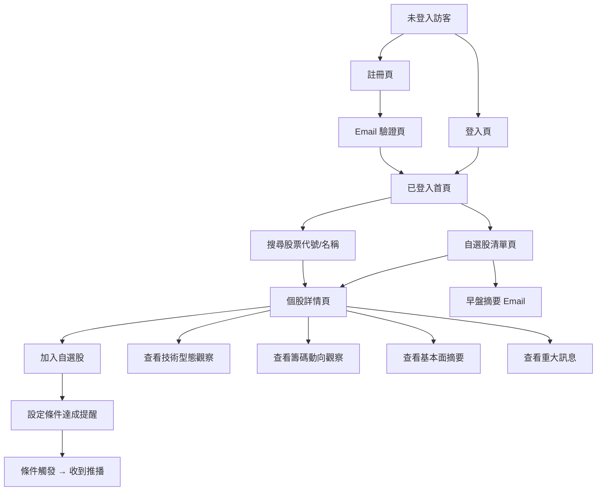
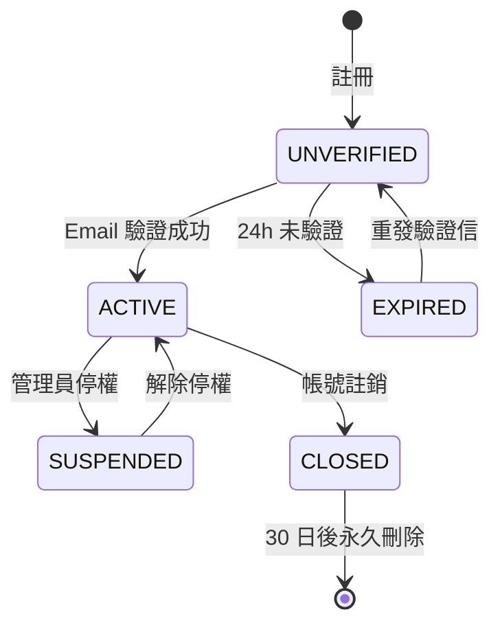
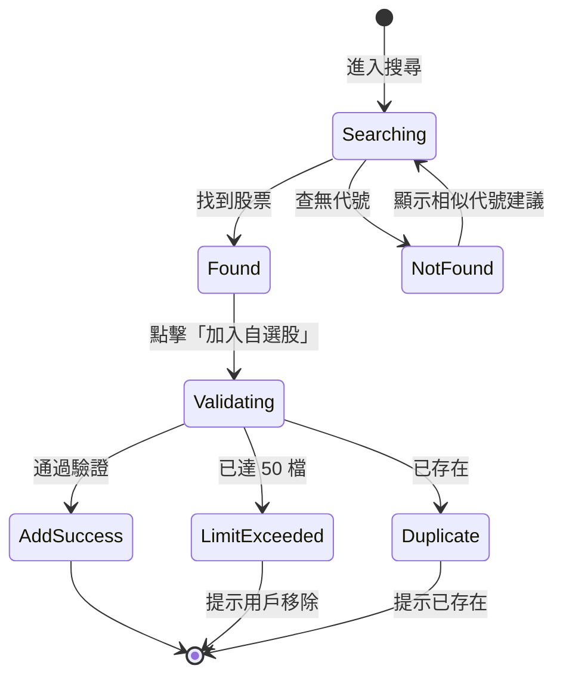
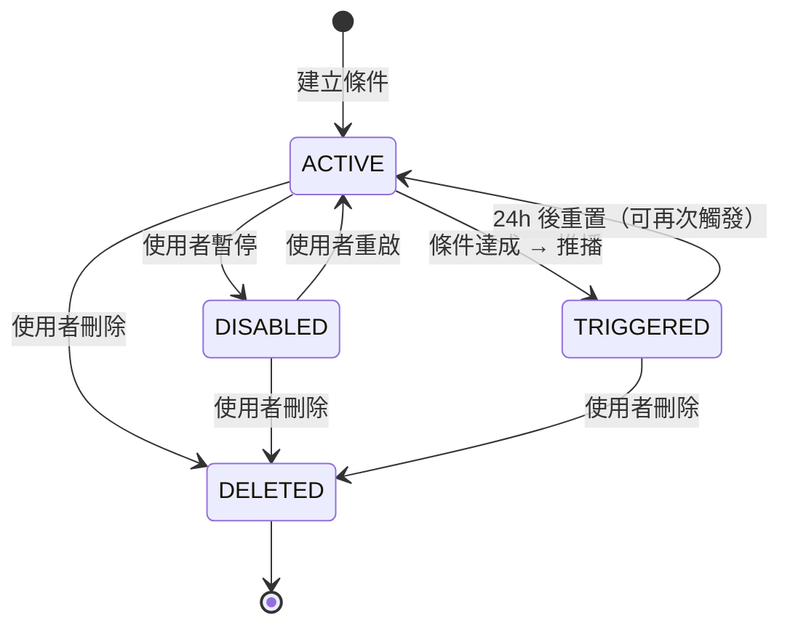
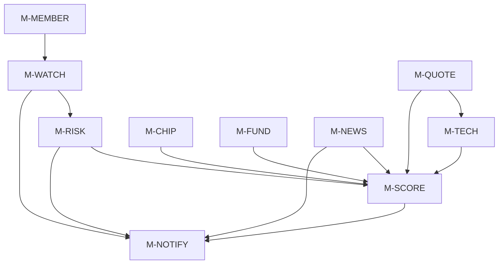

# SRS：台股股票分析與追蹤平台 MVP

- **文件版本**：v1.0
- **撰寫者**：Peter（產品經理）
- **撰寫日期**：2026-04-21
- **狀態**：🟡 草稿（待 Sophia/Preston 架構評估後定稿）
- **對應 PRD**：[20260421_PRD_stock-analysis-mvp.md](../02_product/20260421_PRD_stock-analysis-mvp.md)
- **拍板決策**：[20260421_decision-prd-top3.md](../01_leader/decisions/20260421_decision-prd-top3.md)
- **時程**：Q4 2026 上線
- **下游交接**：Sophia（系統架構師）、Preston（專案架構師）、Bruno（API）、Felix（前端）、Quincy/Quinn（QA）

---

## 0. 必讀前提：合規定位（D1 拍板）

> 本平台**完全不提供投資建議**，所有 AI 輸出僅為「市場資訊呈現」與「條件達成提醒」。
>
> 詳見 [第 11 章：合規文案規範](#11-合規文案規範)。

| 原始 PRD 名詞 | SRS 採用名詞（強制） |
|---------------|---------------------|
| 綜合評分 | **個股健康度指標** |
| 買賣訊號摘要 | **技術型態觀察 / 籌碼動向觀察** |
| 個人化警示 | **條件達成提醒**（使用者自設條件） |
| 強烈買進 / 買進 / 觀望 / 賣出 / 強烈賣出 | **5 級訊號燈**（強烈正向 / 偏正向 / 中性 / 偏負向 / 強烈負向） |

---

## 1. 功能拆解

### 1.1 模組總覽

依 D3 拍板「30 項 P0 全做、可並行開發」原則，將 PRD 30 項 P0 拆解為 **10 大模組、共 78 個子功能**。

| 模組代號 | 模組名稱 | 對應 PRD 編號 | 子功能數 | 並行性 |
|---------|---------|--------------|---------|--------|
| M-MEMBER | 會員模組 | F-P01 | 10 | 獨立 |
| M-WATCH | 自選股模組 | F-P02、F-P03 | 8 | 依賴 M-MEMBER |
| M-QUOTE | 行情模組 | F-T01、F-T05 | 7 | 獨立 |
| M-TECH | 技術指標模組 | F-T02、F-T03、F-T04 | 9 | 依賴 M-QUOTE |
| M-CHIP | 籌碼模組 | F-C01、F-C02、F-C03、F-C04 | 8 | 獨立 |
| M-FUND | 基本面模組 | F-F01、F-F02、F-F03、F-F04、F-F05 | 9 | 獨立 |
| M-NEWS | 消息模組 | F-S01、F-S02、F-S03 | 7 | 獨立 |
| M-RISK | 風控模組 | F-R01、F-R02 | 6 | 依賴 M-WATCH |
| M-SCORE | AI 評分模組 | F-A01、F-A02、F-A03 | 8 | 依賴 M-TECH/M-CHIP/M-FUND |
| M-NOTIFY | 推播模組 | F-P04 | 6 | 跨模組事件接收 |

### 1.2 功能拆解明細

#### M-MEMBER（會員模組）

| 功能 ID | 名稱 | 說明 |
|---------|------|------|
| F-MEMBER-01 | 註冊 API | Email + 密碼註冊 |
| F-MEMBER-02 | Email 驗證 API | Token 驗證 |
| F-MEMBER-03 | 重發驗證信 | 24h 內最多 5 次 |
| F-MEMBER-04 | 登入 API | 簽發 JWT Access + Refresh Token |
| F-MEMBER-05 | 登出 API | Token 加入黑名單 |
| F-MEMBER-06 | Token 刷新 | Refresh Token 換新 |
| F-MEMBER-07 | 查詢個人資料 | - |
| F-MEMBER-08 | 修改個人資料 | 顯示名稱、推播偏好 |
| F-MEMBER-09 | 修改密碼 | 需驗證舊密碼 |
| F-MEMBER-10 | 帳號註銷 | 軟刪除（30 日後永久刪除） |

#### M-WATCH（自選股模組）

| 功能 ID | 名稱 | 說明 |
|---------|------|------|
| F-WATCH-01 | 新增自選股 | 上限 50 檔 |
| F-WATCH-02 | 移除自選股 | - |
| F-WATCH-03 | 查詢自選股清單 | 含最新健康度指標、漲跌幅 |
| F-WATCH-04 | 排序自選股 | 使用者自訂排序值 |
| F-WATCH-05 | 標籤分組 | 自訂群組（例：「電子權值股」） |
| F-WATCH-06 | 股票代號搜尋 | 支援代號、簡稱、全名（含 ETF） |
| F-WATCH-07 | 自選股摘要查詢 | 早盤前推播用批次資料 |
| F-WATCH-08 | 批次操作 | 一次新增多檔 |

#### M-QUOTE（行情模組）

| 功能 ID | 名稱 | 說明 |
|---------|------|------|
| F-QUOTE-01 | 即時報價查詢 | 公開延遲 20 分鐘資料 |
| F-QUOTE-02 | 批次報價查詢 | 自選股清單批次 |
| F-QUOTE-03 | 歷史 K 線（日） | 預設 1 年，最長 5 年 |
| F-QUOTE-04 | 歷史 K 線（週） | 預設 5 年 |
| F-QUOTE-05 | 歷史 K 線（月） | 預設 10 年 |
| F-QUOTE-06 | 成交量資料 | 與 K 線同步 |
| F-QUOTE-07 | 資料延遲標記 | 回傳資料含 `dataDelayMinutes` 欄位 |

#### M-TECH（技術指標模組）

| 功能 ID | 名稱 | 說明 |
|---------|------|------|
| F-TECH-01 | MA 計算（5/10/20/60/120/240 日） | - |
| F-TECH-02 | KD 計算（含黃金/死亡交叉偵測） | 9 日 |
| F-TECH-03 | MACD 計算（含柱狀圖背離偵測） | 12/26/9 |
| F-TECH-04 | 取得單一指標 | - |
| F-TECH-05 | 批次取得多指標 | - |
| F-TECH-06 | 技術型態觀察生成 | 訊號燈，不含建議字眼 |
| F-TECH-07 | 指標歷史快照 | 用於回放 |
| F-TECH-08 | 指標計算排程 | 收盤後批次計算 |
| F-TECH-09 | 多週期切換 | 日/週/月 |

#### M-CHIP（籌碼模組）

| 功能 ID | 名稱 | 說明 |
|---------|------|------|
| F-CHIP-01 | 三大法人買賣超日資料 | 外資、投信、自營商 |
| F-CHIP-02 | 外資連續買賣超天數計算 | - |
| F-CHIP-03 | 投信認養股辨識 | 連續 5 日買超門檻 |
| F-CHIP-04 | 融資融券餘額查詢 | - |
| F-CHIP-05 | 融資融券週趨勢 | - |
| F-CHIP-06 | 籌碼動向觀察生成 | 訊號燈 |
| F-CHIP-07 | 籌碼資料同步排程 | 每日 17:00 後 |
| F-CHIP-08 | 籌碼歷史查詢 | 最長 1 年 |

#### M-FUND（基本面模組）

| 功能 ID | 名稱 | 說明 |
|---------|------|------|
| F-FUND-01 | PE / PEG 查詢 | 含產業平均 |
| F-FUND-02 | PB 查詢 | - |
| F-FUND-03 | 殖利率查詢 | 近 4 季滾動 |
| F-FUND-04 | EPS 季成長率 | YoY + QoQ |
| F-FUND-05 | 月營收 YoY/MoM | 12 個月趨勢 |
| F-FUND-06 | 產業平均比對 | 產業歸類 |
| F-FUND-07 | 財報資料同步排程 | 季報出爐日（MOPS） |
| F-FUND-08 | ETF 適用性判斷 | 不適用欄位回 N/A |
| F-FUND-09 | 基本面歷史快照 | - |

#### M-NEWS（消息模組）

| 功能 ID | 名稱 | 說明 |
|---------|------|------|
| F-NEWS-01 | MOPS 重大訊息查詢 | 個股 |
| F-NEWS-02 | 重大訊息推播觸發 | 自選股事件 |
| F-NEWS-03 | 法說會行事曆 | 月曆視圖 |
| F-NEWS-04 | 股利公告行事曆 | - |
| F-NEWS-05 | 除權息日 T-3 提醒 | 排程觸發 |
| F-NEWS-06 | 消息抓取排程 | 5 分鐘輪詢 |
| F-NEWS-07 | 消息已讀標記 | 避免重複推播 |

#### M-RISK（風控模組）

| 功能 ID | 名稱 | 說明 |
|---------|------|------|
| F-RISK-01 | 警示股 / 注意股 / 處置股每日掃描 | TWSE 公告 |
| F-RISK-02 | 風控標籤註記至個股 | 顯示紅色橫幅 |
| F-RISK-03 | 自訂停損 % 設定 | 0.5% ~ 50% |
| F-RISK-04 | 自訂停利 % 設定 | 0.5% ~ 200% |
| F-RISK-05 | 觸發即時推播 | 不重複轟炸（同條件 24h 內 1 次） |
| F-RISK-06 | 觸發紀錄查詢 | 30 日 |

#### M-SCORE（AI 評分模組）

| 功能 ID | 名稱 | 說明 |
|---------|------|------|
| F-SCORE-01 | 健康度指標計算（0-100） | 規則引擎 |
| F-SCORE-02 | 五大面向加權配置 | 固定權重 v1 |
| F-SCORE-03 | 技術型態觀察生成 | 5 級訊號燈 |
| F-SCORE-04 | 籌碼動向觀察生成 | 5 級訊號燈 |
| F-SCORE-05 | 基本面健康度生成 | 5 級訊號燈 |
| F-SCORE-06 | 評分結果儲存（每日快照） | 用於趨勢比對 |
| F-SCORE-07 | 評分變化偵測 | 跨級變動觸發 M-NOTIFY |
| F-SCORE-08 | 合規文案套用 | 統一從文案庫取得 |

#### M-NOTIFY（推播模組）

| 功能 ID | 名稱 | 說明 |
|---------|------|------|
| F-NOTIFY-01 | 條件達成提醒設定 | CRUD |
| F-NOTIFY-02 | 推播管道設定 | Email + Web Push |
| F-NOTIFY-03 | 早盤摘要推播（08:00） | 自選股摘要 |
| F-NOTIFY-04 | 即時事件推播 | 評分變化、重大訊息、停損停利 |
| F-NOTIFY-05 | 推播紀錄查詢 | 30 日 |
| F-NOTIFY-06 | 推播去重機制 | 同事件 24h 內 1 次 |

---

## 2. 資料模型

> 全域規範：
> - 時間統一 `LocalDateTime`（GMT+8 固定時區）
> - ID 統一 `String(UUID, 36)`
> - 數值統一 `BigDecimal`
> - 命名避免 RDMS 保留字

### 2.1 USER_INFO（會員）

| 欄位 | 型別 | 長度 | 必填 | 預設 | 說明 |
|------|------|------|------|------|------|
| user_id | VARCHAR | 36 | Y | - | UUID |
| email | VARCHAR | 255 | Y | - | 唯一索引 |
| password_hash | VARCHAR | 60 | Y | - | BCrypt |
| display_name | VARCHAR | 100 | N | - | 顯示名稱 |
| status | VARCHAR | 20 | Y | UNVERIFIED | 狀態（UNVERIFIED / ACTIVE / SUSPENDED / CLOSED） |
| email_verified_at | TIMESTAMP | - | N | NULL | 驗證時間 |
| notify_email_enabled | CHAR | 1 | Y | Y | Email 推播開關 |
| notify_web_enabled | CHAR | 1 | Y | Y | Web Push 開關 |
| created_at | TIMESTAMP | - | Y | NOW() | - |
| updated_at | TIMESTAMP | - | N | NULL | - |
| deleted_at | TIMESTAMP | - | N | NULL | 軟刪除 |

### 2.2 STOCK（股票主檔）

| 欄位 | 型別 | 長度 | 必填 | 預設 | 說明 |
|------|------|------|------|------|------|
| stock_id | VARCHAR | 36 | Y | - | UUID |
| stock_code | VARCHAR | 10 | Y | - | 例：2330 |
| stock_name | VARCHAR | 50 | Y | - | 例：台積電 |
| stock_full_name | VARCHAR | 200 | N | - | 例：台灣積體電路製造股份有限公司 |
| market_type | VARCHAR | 10 | Y | - | TWSE / OTC |
| industry_code | VARCHAR | 20 | N | - | 產業代號 |
| industry_name | VARCHAR | 50 | N | - | 產業名稱 |
| asset_type | VARCHAR | 20 | Y | STOCK | STOCK / ETF |
| risk_flag | VARCHAR | 20 | N | NULL | NORMAL / WARNING / ATTENTION / DISPOSITION |
| listed_at | DATE | - | N | - | 上市日 |
| status | VARCHAR | 20 | Y | ACTIVE | ACTIVE / DELISTED |
| created_at | TIMESTAMP | - | Y | NOW() | - |
| updated_at | TIMESTAMP | - | N | NULL | - |

**唯一索引**：`(stock_code, market_type)`

### 2.3 WATCHLIST（自選股）

| 欄位 | 型別 | 長度 | 必填 | 預設 | 說明 |
|------|------|------|------|------|------|
| watch_id | VARCHAR | 36 | Y | - | UUID |
| user_id | VARCHAR | 36 | Y | - | FK → USER_INFO |
| stock_id | VARCHAR | 36 | Y | - | FK → STOCK |
| group_name | VARCHAR | 50 | N | DEFAULT | 自訂分組 |
| sort_order | NUMBER | - | Y | 0 | 排序值 |
| created_at | TIMESTAMP | - | Y | NOW() | - |
| updated_at | TIMESTAMP | - | N | NULL | - |

**唯一索引**：`(user_id, stock_id)`

### 2.4 QUOTE_DAILY（日線報價）

| 欄位 | 型別 | 長度 | 必填 | 預設 | 說明 |
|------|------|------|------|------|------|
| quote_id | VARCHAR | 36 | Y | - | UUID |
| stock_id | VARCHAR | 36 | Y | - | - |
| trade_date | DATE | - | Y | - | 交易日 |
| open_price | NUMBER(10,4) | - | Y | - | 開盤 |
| high_price | NUMBER(10,4) | - | Y | - | 最高 |
| low_price | NUMBER(10,4) | - | Y | - | 最低 |
| close_price | NUMBER(10,4) | - | Y | - | 收盤 |
| volume | NUMBER(18) | - | Y | 0 | 成交量（股） |
| change_amount | NUMBER(10,4) | - | Y | 0 | 漲跌價 |
| change_pct | NUMBER(8,4) | - | Y | 0 | 漲跌幅 % |
| data_source | VARCHAR | 20 | Y | TWSE | 資料來源 |
| data_delay_minutes | NUMBER | - | Y | 20 | 延遲分鐘 |
| created_at | TIMESTAMP | - | Y | NOW() | - |

**唯一索引**：`(stock_id, trade_date)`

### 2.5 TECHNICAL_SNAPSHOT（技術指標快照）

| 欄位 | 型別 | 長度 | 必填 | 預設 | 說明 |
|------|------|------|------|------|------|
| snapshot_id | VARCHAR | 36 | Y | - | UUID |
| stock_id | VARCHAR | 36 | Y | - | - |
| snapshot_date | DATE | - | Y | - | - |
| ma5 | NUMBER(10,4) | - | N | - | 5 日均 |
| ma10 | NUMBER(10,4) | - | N | - | - |
| ma20 | NUMBER(10,4) | - | N | - | - |
| ma60 | NUMBER(10,4) | - | N | - | - |
| ma120 | NUMBER(10,4) | - | N | - | - |
| ma240 | NUMBER(10,4) | - | N | - | - |
| kd_k | NUMBER(8,4) | - | N | - | KD 之 K |
| kd_d | NUMBER(8,4) | - | N | - | KD 之 D |
| kd_cross | VARCHAR | 20 | N | NULL | GOLDEN / DEATH / NONE |
| macd_diff | NUMBER(10,4) | - | N | - | DIF |
| macd_dea | NUMBER(10,4) | - | N | - | DEA |
| macd_histogram | NUMBER(10,4) | - | N | - | 柱狀圖 |
| macd_divergence | VARCHAR | 20 | N | NONE | TOP / BOTTOM / NONE |
| created_at | TIMESTAMP | - | Y | NOW() | - |

**唯一索引**：`(stock_id, snapshot_date)`

### 2.6 CHIP_DATA（籌碼資料）

| 欄位 | 型別 | 長度 | 必填 | 預設 | 說明 |
|------|------|------|------|------|------|
| chip_id | VARCHAR | 36 | Y | - | UUID |
| stock_id | VARCHAR | 36 | Y | - | - |
| trade_date | DATE | - | Y | - | - |
| foreign_buy | NUMBER(18) | - | Y | 0 | 外資買進股數 |
| foreign_sell | NUMBER(18) | - | Y | 0 | 外資賣出 |
| foreign_net | NUMBER(18) | - | Y | 0 | 外資買賣超 |
| trust_net | NUMBER(18) | - | Y | 0 | 投信買賣超 |
| dealer_net | NUMBER(18) | - | Y | 0 | 自營商買賣超 |
| foreign_consecutive_days | NUMBER | - | N | 0 | 外資連續買/賣超天數（正/負） |
| trust_consecutive_days | NUMBER | - | N | 0 | 投信連續天數 |
| margin_balance | NUMBER(18) | - | N | 0 | 融資餘額 |
| margin_change | NUMBER(18) | - | N | 0 | 融資日變化 |
| short_balance | NUMBER(18) | - | N | 0 | 融券餘額 |
| short_change | NUMBER(18) | - | N | 0 | 融券日變化 |
| created_at | TIMESTAMP | - | Y | NOW() | - |

**唯一索引**：`(stock_id, trade_date)`

### 2.7 FUNDAMENTAL（基本面資料）

| 欄位 | 型別 | 長度 | 必填 | 預設 | 說明 |
|------|------|------|------|------|------|
| fund_id | VARCHAR | 36 | Y | - | UUID |
| stock_id | VARCHAR | 36 | Y | - | - |
| period_type | VARCHAR | 10 | Y | - | QUARTER / MONTH |
| period_year | NUMBER | - | Y | - | 例：2026 |
| period_value | NUMBER | - | Y | - | 季：1-4；月：1-12 |
| pe_ratio | NUMBER(10,4) | - | N | - | - |
| peg_ratio | NUMBER(10,4) | - | N | - | - |
| pb_ratio | NUMBER(10,4) | - | N | - | - |
| dividend_yield | NUMBER(8,4) | - | N | - | 殖利率 % |
| eps | NUMBER(10,4) | - | N | - | 每股盈餘 |
| eps_yoy | NUMBER(10,4) | - | N | - | EPS 年增 % |
| eps_qoq | NUMBER(10,4) | - | N | - | EPS 季增 % |
| revenue | NUMBER(18) | - | N | - | 月營收（千元） |
| revenue_yoy | NUMBER(10,4) | - | N | - | - |
| revenue_mom | NUMBER(10,4) | - | N | - | - |
| industry_avg_pe | NUMBER(10,4) | - | N | - | 產業平均 PE |
| announce_date | DATE | - | N | - | 公告日 |
| created_at | TIMESTAMP | - | Y | NOW() | - |

**唯一索引**：`(stock_id, period_type, period_year, period_value)`

### 2.8 ANNOUNCEMENT（重大訊息）

| 欄位 | 型別 | 長度 | 必填 | 預設 | 說明 |
|------|------|------|------|------|------|
| announce_id | VARCHAR | 36 | Y | - | UUID |
| stock_id | VARCHAR | 36 | Y | - | - |
| announce_type | VARCHAR | 30 | Y | - | MAJOR / DIVIDEND / EARNINGS_CALL / EX_RIGHT / OTHER |
| title | VARCHAR | 500 | Y | - | - |
| content | CLOB | - | N | - | 全文 |
| announce_date | TIMESTAMP | - | Y | - | 公告時間（GMT+8） |
| event_date | DATE | - | N | - | 事件日（除權息日、法說日） |
| source_url | VARCHAR | 500 | N | - | MOPS 原始連結 |
| created_at | TIMESTAMP | - | Y | NOW() | - |

**索引**：`(stock_id, announce_date DESC)`

### 2.9 SCORE_RESULT（評分結果）

| 欄位 | 型別 | 長度 | 必填 | 預設 | 說明 |
|------|------|------|------|------|------|
| score_id | VARCHAR | 36 | Y | - | UUID |
| stock_id | VARCHAR | 36 | Y | - | - |
| score_date | DATE | - | Y | - | - |
| health_score | NUMBER(5,2) | - | Y | - | 0-100 |
| tech_signal | VARCHAR | 20 | Y | - | 5 級訊號燈 |
| chip_signal | VARCHAR | 20 | Y | - | - |
| fund_signal | VARCHAR | 20 | Y | - | - |
| risk_signal | VARCHAR | 20 | Y | - | - |
| news_signal | VARCHAR | 20 | Y | - | - |
| tech_score | NUMBER(5,2) | - | Y | - | 子分數 |
| chip_score | NUMBER(5,2) | - | Y | - | - |
| fund_score | NUMBER(5,2) | - | Y | - | - |
| risk_score | NUMBER(5,2) | - | Y | - | - |
| news_score | NUMBER(5,2) | - | Y | - | - |
| score_change | NUMBER(5,2) | - | Y | 0 | 與前一日差距 |
| signal_changed | CHAR | 1 | Y | N | 是否跨級變動 |
| created_at | TIMESTAMP | - | Y | NOW() | - |

**唯一索引**：`(stock_id, score_date)`

**5 級訊號燈枚舉**：`STRONG_POSITIVE / POSITIVE / NEUTRAL / NEGATIVE / STRONG_NEGATIVE`

### 2.10 ALERT_CONDITION（條件達成提醒）

| 欄位 | 型別 | 長度 | 必填 | 預設 | 說明 |
|------|------|------|------|------|------|
| alert_id | VARCHAR | 36 | Y | - | UUID |
| user_id | VARCHAR | 36 | Y | - | - |
| stock_id | VARCHAR | 36 | Y | - | - |
| alert_type | VARCHAR | 30 | Y | - | STOP_LOSS / TAKE_PROFIT / PRICE_ABOVE / PRICE_BELOW / SCORE_CHANGE / ANNOUNCE |
| trigger_value | NUMBER(10,4) | - | N | - | 觸發值（例：-10 表示 -10%） |
| reference_price | NUMBER(10,4) | - | N | - | 基準價（停損停利使用） |
| status | VARCHAR | 20 | Y | ACTIVE | ACTIVE / TRIGGERED / DISABLED / DELETED |
| last_triggered_at | TIMESTAMP | - | N | NULL | 上次觸發時間 |
| trigger_count | NUMBER | - | Y | 0 | 累計觸發次數 |
| notify_channels | VARCHAR | 100 | Y | EMAIL,WEB | 逗號分隔 |
| created_at | TIMESTAMP | - | Y | NOW() | - |
| updated_at | TIMESTAMP | - | N | NULL | - |

### 2.11 NOTIFY_RECORD（推播紀錄）

| 欄位 | 型別 | 長度 | 必填 | 預設 | 說明 |
|------|------|------|------|------|------|
| notify_id | VARCHAR | 36 | Y | - | UUID |
| user_id | VARCHAR | 36 | Y | - | - |
| stock_id | VARCHAR | 36 | N | - | 跨股摘要可為 NULL |
| alert_id | VARCHAR | 36 | N | - | FK → ALERT_CONDITION（若由條件觸發） |
| notify_type | VARCHAR | 30 | Y | - | DAILY_SUMMARY / SCORE_CHANGE / ANNOUNCE / STOP_LOSS / TAKE_PROFIT / RISK_FLAG |
| title | VARCHAR | 200 | Y | - | - |
| content | VARCHAR | 1000 | Y | - | - |
| channel | VARCHAR | 20 | Y | - | EMAIL / WEB |
| send_status | VARCHAR | 20 | Y | PENDING | PENDING / SENT / FAILED |
| sent_at | TIMESTAMP | - | N | - | - |
| created_at | TIMESTAMP | - | Y | NOW() | - |

**索引**：`(user_id, created_at DESC)`、`(alert_id, created_at DESC)`

---

## 3. 業務規則

### 3.1 技術指標計算規則

#### 3.1.1 移動平均線（MA）

```
MA(N) = SUM(收盤價 of 最近 N 個交易日) / N
```
- 不足 N 日資料時回傳 NULL
- 計算採用「複權收盤價」

#### 3.1.2 KD 隨機指標（9 日）

```
RSV = (今日收盤 - 最近 9 日最低) / (最近 9 日最高 - 最近 9 日最低) × 100
K = 前一日 K × 2/3 + RSV × 1/3
D = 前一日 D × 2/3 + K × 1/3
```
- 初始 K、D 預設為 50
- **黃金交叉**：K 由下往上突破 D 且 K < 30
- **死亡交叉**：K 由上往下跌破 D 且 K > 70

#### 3.1.3 MACD（12/26/9）

```
EMA12 = 收盤價 × 2/13 + 前一日 EMA12 × 11/13
EMA26 = 收盤價 × 2/27 + 前一日 EMA26 × 25/27
DIF = EMA12 - EMA26
DEA = DIF × 2/10 + 前一日 DEA × 8/10
柱狀圖 = (DIF - DEA) × 2
```
- **頂背離**：股價創新高但 DIF 未創新高
- **底背離**：股價創新低但 DIF 未創新低

### 3.2 健康度指標加權規則

```
健康度指標 = 技術分 × 0.25
           + 籌碼分 × 0.30  ← 台股籌碼權重最高
           + 基本面分 × 0.25
           + 風險分 × 0.10
           + 消息分 × 0.10
```

| 子分數 | 計算依據 |
|--------|---------|
| 技術分 (0-100) | KD 位置(40%) + MACD(30%) + MA 多頭排列(30%) |
| 籌碼分 (0-100) | 三大法人(50%) + 連續買賣超(30%) + 融資融券(20%) |
| 基本面分 (0-100) | PE 相對產業(25%) + EPS YoY(35%) + 月營收 YoY(40%) |
| 風險分 (0-100) | 警示股=0 / 注意股=40 / 處置股=20 / 正常=100 |
| 消息分 (0-100) | 近 7 日重大訊息正負面權重（v1 採關鍵字） |

### 3.3 5 級訊號燈分級規則

| 訊號燈 | 對應分數 | 顏色 | 對應禁用詞（D1） |
|--------|---------|------|-----------------|
| STRONG_POSITIVE 強烈正向 | 80-100 | 深綠 | 禁用「強烈買進」 |
| POSITIVE 偏正向 | 60-79 | 綠 | 禁用「買進」 |
| NEUTRAL 中性 | 40-59 | 灰 | - |
| NEGATIVE 偏負向 | 20-39 | 橙 | 禁用「賣出」 |
| STRONG_NEGATIVE 強烈負向 | 0-19 | 紅 | 禁用「強烈賣出」 |

### 3.4 條件達成提醒觸發規則

| 提醒類型 | 觸發邏輯 |
|---------|---------|
| STOP_LOSS（停損） | 當前價 ≤ 基準價 × (1 + trigger_value/100)，trigger_value 為負 |
| TAKE_PROFIT（停利） | 當前價 ≥ 基準價 × (1 + trigger_value/100)，trigger_value 為正 |
| PRICE_ABOVE | 當前價 ≥ trigger_value |
| PRICE_BELOW | 當前價 ≤ trigger_value |
| SCORE_CHANGE | 健康度跨級變動（例：偏正向 → 中性） |
| ANNOUNCE | 該股有新重大訊息 |

**去重規則**：同一 alert_id 的 24 小時內不重複推播。

### 3.5 自選股業務規則

| 規則 | 值 |
|------|-----|
| 單一使用者上限 | 50 檔 |
| 自訂分組數量上限 | 10 個 |
| 群組名稱長度 | 1-50 字 |
| 重複新增同一股 | 拒絕，回 2020 |

### 3.6 邊界條件

| 條件 | 處理 |
|------|------|
| 查詢不存在的股票代號 | 回 4001，附建議的相似代號（最多 5 檔） |
| 查詢 ETF（如 0050） | 正常回傳，但 EPS、PE 等不適用欄位回 N/A |
| 行情資料來源中斷 > 30 分鐘 | API 回 5010，UI 顯示「資料延遲，最後更新時間：xxx」 |
| 警示股 / 處置股查詢 | 評分頁頂部紅色橫幅 + 健康度指標 ≤ 40 |
| 自選股已達 50 檔再新增 | 回 2021，提示「已達上限」 |
| 條件達成提醒同條件重複設定 | 拒絕，回 2030 |
| 推播設定但 Email 未驗證 | 註冊強制驗證；未驗證僅可使用 Web Push |

### 3.7 合規文案套用規則

所有 API 回傳的文案欄位（`signalText`、`observationText`）必須**完全來自合規文案庫**，禁止前端自行組裝（詳見第 11 章）。

---

## 4. API 清單

### 4.1 全域規範（呼應 api-design.md）

- **路徑格式**：`/api/v1/{module}/{action}`
- **HTTP 方法**：統一 POST（檔案上傳除外）
- **HTTP 狀態碼**：統一 200（業務錯誤透過 `code` 區分）
- **內容類型**：`application/json; charset=UTF-8`
- **時間格式**：ISO 8601（`YYYY-MM-DDTHH:mm:ss.sss+08:00`）
- **Envelope Pattern**：`{ code, message, data, timestamp, traceId }`
- **認證**：除註冊/登入/Email 驗證外，皆需 JWT Bearer Token

### 4.2 API 總清單（共 47 endpoints）

#### M-MEMBER（10）

| # | 路徑 | 用途 | 認證 |
|---|------|------|------|
| 1 | /api/v1/member/register | 註冊 | 否 |
| 2 | /api/v1/member/verify-email | Email 驗證 | 否 |
| 3 | /api/v1/member/resend-verification | 重發驗證信 | 否 |
| 4 | /api/v1/member/login | 登入 | 否 |
| 5 | /api/v1/member/logout | 登出 | 是 |
| 6 | /api/v1/member/refresh-token | 刷新 Token | 否（用 Refresh Token） |
| 7 | /api/v1/member/profile/get | 取得個人資料 | 是 |
| 8 | /api/v1/member/profile/update | 更新個人資料 | 是 |
| 9 | /api/v1/member/password/change | 修改密碼 | 是 |
| 10 | /api/v1/member/account/close | 帳號註銷 | 是 |

#### M-WATCH（6）

| # | 路徑 | 用途 | 認證 |
|---|------|------|------|
| 11 | /api/v1/watchlist/add | 新增自選股 | 是 |
| 12 | /api/v1/watchlist/remove | 移除自選股 | 是 |
| 13 | /api/v1/watchlist/list | 自選股清單 | 是 |
| 14 | /api/v1/watchlist/sort | 排序 | 是 |
| 15 | /api/v1/watchlist/group/update | 分組更新 | 是 |
| 16 | /api/v1/stock/search | 股票搜尋 | 是 |

#### M-QUOTE（3）

> **Wave 2 實作版端點（2026-04-22 更新，依 Jamie 仲裁 D5）**：
> - 原 `/api/v1/quote/realtime/get` → **`/api/v1/quote/get`**（與 Bruno QuoteController 實作一致）
> - 原 `/api/v1/quote/realtime/batch` → **`/api/v1/quote/list`**
> - 原 `/api/v1/quote/history/get` → **`/api/v1/quote/history`**（去掉 `/get`，與 Felix/Bruno 雙側實作一致）
> - 詳細 schema 見 `docs/03_spec/20260422_schema-lock_stock-detail-apis.md`

| # | 路徑 | 用途 | 認證 |
|---|------|------|------|
| 17 | /api/v1/quote/get | 最新行情（單檔） | 是 |
| 18 | /api/v1/quote/list | 批次最新行情 | 是 |
| 19 | /api/v1/quote/history | 歷史 K 線（日/週/月） | 是 |

#### M-TECH（3）

| # | 路徑 | 用途 | 認證 |
|---|------|------|------|
| 20 | /api/v1/technical/indicator/get | 取得單一指標 | 是 |
| 21 | /api/v1/technical/indicator/batch | 批次取得指標 | 是 |
| 22 | /api/v1/technical/observation/get | 技術型態觀察 | 是 |

#### M-CHIP（3）

> **Wave 2 實作版端點（2026-04-22 更新）**：
> - 三大法人（Wave 2 MVP）已實作為 **`/api/v1/chip/get`**（見 ChipController）
> - `/api/v1/chip/margin/get`（融資融券）、`/api/v1/chip/observation/get`（籌碼動向觀察）為後續 Wave 保留端點，Wave 2 尚未實作
> - 詳細 schema 見 `docs/03_spec/20260422_schema-lock_stock-detail-apis.md`

| # | 路徑 | 用途 | 認證 |
|---|------|------|------|
| 23 | /api/v1/chip/get | 三大法人最新買賣超（Wave 2 MVP） | 是 |
| 24 | /api/v1/chip/margin/get | 融資融券（後續 Wave） | 是 |
| 25 | /api/v1/chip/observation/get | 籌碼動向觀察（後續 Wave） | 是 |

#### M-FUND（4）

> **Wave 2 實作版端點（2026-04-22 更新）**：
> - EPS/PER/PBR/ROE 綜合查詢已實作為 **`/api/v1/fundamental/get`**（見 FundamentalController）
> - `/api/v1/fundamental/valuation/get`、`/api/v1/fundamental/eps/get`、`/api/v1/fundamental/revenue/get`、`/api/v1/fundamental/summary/get` 為後續 Wave 細拆端點，Wave 2 尚未實作
> - 詳細 schema 見 `docs/03_spec/20260422_schema-lock_stock-detail-apis.md`

| # | 路徑 | 用途 | 認證 |
|---|------|------|------|
| 26 | /api/v1/fundamental/get | EPS/PER/PBR/ROE 基本面查詢（Wave 2 MVP） | 是 |
| 27 | /api/v1/fundamental/valuation/get | PE/PEG/PB/殖利率細項（後續 Wave） | 是 |
| 28 | /api/v1/fundamental/eps/get | EPS 季成長（後續 Wave） | 是 |
| 29 | /api/v1/fundamental/revenue/get | 月營收（後續 Wave） | 是 |
| 30 | /api/v1/fundamental/summary/get | 基本面摘要（後續 Wave） | 是 |

#### M-NEWS（3）

| # | 路徑 | 用途 | 認證 |
|---|------|------|------|
| 30 | /api/v1/news/announcement/list | 重大訊息清單 | 是 |
| 31 | /api/v1/news/calendar/get | 公告日曆 | 是 |
| 32 | /api/v1/news/announcement/get | 單則訊息 | 是 |

#### M-RISK（3）

| # | 路徑 | 用途 | 認證 |
|---|------|------|------|
| 33 | /api/v1/risk/flag/get | 警示股狀態 | 是 |
| 34 | /api/v1/risk/flag/scan | 自選股風險掃描 | 是 |
| 35 | /api/v1/risk/flag/list | 全市場警示股清單 | 是 |

#### M-SCORE（4）

| # | 路徑 | 用途 | 認證 |
|---|------|------|------|
| 36 | /api/v1/score/health/get | 健康度指標 | 是 |
| 37 | /api/v1/score/health/batch | 批次健康度 | 是 |
| 38 | /api/v1/score/detail/get | 評分明細（含五子項） | 是 |
| 39 | /api/v1/score/history/get | 評分歷史 | 是 |

#### M-NOTIFY（8）

| # | 路徑 | 用途 | 認證 |
|---|------|------|------|
| 40 | /api/v1/alert/condition/create | 建立提醒條件 | 是 |
| 41 | /api/v1/alert/condition/update | 修改 | 是 |
| 42 | /api/v1/alert/condition/delete | 刪除 | 是 |
| 43 | /api/v1/alert/condition/list | 我的提醒清單 | 是 |
| 44 | /api/v1/alert/trigger/list | 觸發紀錄 | 是 |
| 45 | /api/v1/notify/record/list | 推播紀錄 | 是 |
| 46 | /api/v1/notify/preference/update | 推播偏好設定 | 是 |
| 47 | /api/v1/notify/web/subscribe | Web Push 訂閱 | 是 |

### 4.3 重點 API 規格範例

#### 4.3.1 POST /api/v1/score/detail/get（健康度指標明細）

**Request**：
```json
{
  "stockCode": "2330"
}
```

**Response（成功）**：
```json
{
  "code": 0,
  "message": "success",
  "data": {
    "stockCode": "2330",
    "stockName": "台積電",
    "scoreDate": "2026-04-21",
    "healthScore": 78.50,
    "techSignal": "POSITIVE",
    "chipSignal": "STRONG_POSITIVE",
    "fundSignal": "POSITIVE",
    "riskSignal": "NEUTRAL",
    "newsSignal": "NEUTRAL",
    "subScores": {
      "tech": 72.00,
      "chip": 88.00,
      "fund": 75.00,
      "risk": 100.00,
      "news": 50.00
    },
    "observations": {
      "tech": "近 5 日 KD 形成黃金交叉，MA20 上揚",
      "chip": "外資連續 7 日買超，投信認養中",
      "fund": "EPS 年增率 +18%，本益比低於產業平均",
      "risk": "正常股票，無警示註記",
      "news": "近 7 日無重大訊息"
    },
    "disclaimer": "本平台僅供資訊參考，不構成投資建議。投資有風險，請審慎評估。",
    "dataDelayMinutes": 20,
    "lastUpdatedAt": "2026-04-21T17:30:00.000+08:00"
  },
  "timestamp": "2026-04-21T17:35:12.456+08:00",
  "traceId": "tr-abc-123"
}
```

**錯誤回應**：

| Code | Message | 情境 |
|------|---------|------|
| 1001 | 必填參數缺失 | stockCode 為空 |
| 1002 | 股票代號格式錯誤 | 非數字或長度不符 |
| 4001 | 查無此股票 | 不存在 |
| 5010 | 資料來源暫時無法存取 | TWSE/MOPS 中斷 |
| 9001 | 系統繁忙 | - |

#### 4.3.2 POST /api/v1/watchlist/add

**Request**：
```json
{
  "stockCode": "2330",
  "groupName": "電子權值股"
}
```

**Response（成功）**：
```json
{
  "code": 0,
  "message": "success",
  "data": {
    "watchId": "550e8400-e29b-41d4-a716-446655440000",
    "stockCode": "2330",
    "stockName": "台積電",
    "groupName": "電子權值股",
    "createdAt": "2026-04-21T17:35:12.456+08:00"
  },
  "timestamp": "2026-04-21T17:35:12.456+08:00",
  "traceId": "tr-abc-124"
}
```

**錯誤回應**：

| Code | Message | 情境 |
|------|---------|------|
| 2020 | 該股票已在自選股清單中 | 重複新增 |
| 2021 | 自選股已達上限 50 檔 | - |
| 4001 | 查無此股票 | - |
| 3001 | 未登入 | Token 無效 |

#### 4.3.3 POST /api/v1/alert/condition/create

**Request**：
```json
{
  "stockCode": "2330",
  "alertType": "STOP_LOSS",
  "triggerValue": -10.00,
  "referencePrice": 850.00,
  "notifyChannels": ["EMAIL", "WEB"]
}
```

**Response（成功）**：
```json
{
  "code": 0,
  "message": "success",
  "data": {
    "alertId": "550e8400-e29b-41d4-a716-446655440001",
    "stockCode": "2330",
    "alertType": "STOP_LOSS",
    "triggerValue": -10.00,
    "referencePrice": 850.00,
    "status": "ACTIVE",
    "createdAt": "2026-04-21T17:35:12.456+08:00"
  },
  "timestamp": "2026-04-21T17:35:12.456+08:00",
  "traceId": "tr-abc-125"
}
```

**錯誤回應**：

| Code | Message | 情境 |
|------|---------|------|
| 1003 | triggerValue 超出範圍 | 停損非 -50~-0.5、停利非 0.5~200 |
| 2030 | 已存在相同條件 | 同股同類型 |
| 4001 | 查無此股票 | - |

> 其餘 API 詳細規格待 Bruno 補完整版至 `docs/03_spec/api/openapi.yaml`。

---

## 5. UI 流程

### 5.1 核心流程圖



### 5.2 頁面狀態設計

| 頁面 | Loading 狀態 | Error 狀態 | Empty 狀態 |
|------|-------------|-----------|-----------|
| 首頁 | 搜尋框 spinner | 「服務暫時無法存取」alert | - |
| 個股詳情頁 | 各區塊 skeleton screen | 各區塊 retry 按鈕 | 不適用欄位顯示 N/A |
| 自選股清單 | 清單 skeleton | 「資料載入失敗」+ retry | 「尚未加入任何自選股，立即搜尋」CTA |
| 公告日曆 | 月曆 skeleton | retry | 「本月無重大公告」 |
| 條件提醒清單 | 清單 skeleton | retry | 「尚未設定提醒，立即建立」CTA |
| 推播紀錄 | 清單 skeleton | retry | 「近 30 日無推播紀錄」 |

### 5.3 個股詳情頁版面（線稿說明）

```
┌─────────────────────────────────────────────┐
│ [Logo] 搜尋框                    [自選股][登出]│
├─────────────────────────────────────────────┤
│ 2330 台積電   ★加入自選 [⚙設定提醒]           │
│ 收盤 850.00 (+2.5%)  [資料延遲 20 分鐘]      │
├─────────────────────────────────────────────┤
│ ⚠ 資訊參考橫幅：「本平台僅供資訊參考，不構成投資建議」│
├─────────────────────────────────────────────┤
│ ╔═════ 個股健康度指標 ═════╗                  │
│ ║       78 / 100           ║                  │
│ ║  [偏正向] (5 級訊號燈)   ║                  │
│ ╚═══════════════════════════╝                │
├─────────────────────────────────────────────┤
│ ┌─技術型態觀察─┐ ┌─籌碼動向觀察─┐ ┌─基本面─┐│
│ │ KD 黃金交叉  │ │ 外資連 7 買超 │ │ EPS+18%││
│ │ [偏正向]    │ │ [強烈正向]   │ │ [偏正向]││
│ └─────────────┘ └─────────────┘ └────────┘│
├─────────────────────────────────────────────┤
│ [日線 K 圖切換 日/週/月]                      │
│ [K 線圖 + 成交量]                            │
├─────────────────────────────────────────────┤
│ [近 30 日重大訊息]                           │
└─────────────────────────────────────────────┘
```

---

## 6. 狀態機

### 6.1 會員生命週期



| 狀態 | 可登入 | 可使用 API |
|------|--------|-----------|
| UNVERIFIED | ❌ | 僅 verify-email、resend |
| ACTIVE | ✅ | 全部 |
| EXPIRED | ❌ | 僅 resend |
| SUSPENDED | ❌ | 無 |
| CLOSED | ❌ | 無（30 日內可申請復原） |

### 6.2 自選股新增流程狀態機



### 6.3 條件達成提醒生命週期



| 狀態 | 是否會觸發推播 |
|------|---------------|
| ACTIVE | ✅ |
| TRIGGERED | ❌（去重期間） |
| DISABLED | ❌ |
| DELETED | ❌ |

---

## 7. 驗收標準（AC）

### AC-01：使用者註冊成功

```gherkin
Scenario: 使用者用有效 Email 與密碼註冊
  Given 使用者尚未註冊
  When 使用者輸入 email "test@example.com"
  And 輸入符合強度的密碼
  And 勾選服務條款
  And 點擊「註冊」
  Then API 回傳 code = 0
  And 系統建立狀態為 UNVERIFIED 的帳號
  And 系統寄送驗證信
  And 頁面導向「請驗證信箱」
```

### AC-02：Email 重複註冊

```gherkin
Scenario: 使用者註冊已存在的 Email
  Given email "existing@example.com" 已被註冊
  When 使用者用此 email 註冊
  Then API 回傳 code = 2010
  And 顯示「此 Email 已被註冊」
```

### AC-03：登入後查看個股健康度

```gherkin
Scenario: 已登入使用者查詢台積電健康度
  Given 使用者已登入且帳號為 ACTIVE
  When 使用者搜尋 "2330"
  And 點擊台積電進入詳情頁
  Then 頁面 2 秒內顯示健康度指標 0-100 數值
  And 顯示 5 個面向訊號燈（技術/籌碼/基本面/風險/消息）
  And 頁面頂部顯示資訊參考橫幅
  And 回傳資料含 dataDelayMinutes = 20
```

### AC-04：加入自選股成功

```gherkin
Scenario: 使用者加入第一檔自選股
  Given 使用者自選股清單為空
  When 使用者搜尋 "2330" 並點擊「加入自選股」
  Then API 回傳 code = 0
  And 自選股清單顯示「2330 台積電」
  And UI 顯示「已加入自選股」toast
```

### AC-05：自選股達上限

```gherkin
Scenario: 使用者已加入 50 檔自選股後再新增
  Given 使用者已有 50 檔自選股
  When 使用者嘗試加入第 51 檔
  Then API 回傳 code = 2021
  And 顯示「自選股已達上限 50 檔，請先移除」
```

### AC-06：查無股票代號

```gherkin
Scenario: 使用者搜尋不存在的代號
  Given 系統中無代號 "9999"
  When 使用者搜尋 "9999"
  Then API 回傳 code = 4001
  And UI 顯示「查無此代號」
  And 顯示最多 5 檔相似代號建議
```

### AC-07：設定停損條件

```gherkin
Scenario: 使用者為自選股設定 -10% 停損
  Given 使用者已將 "2330" 加入自選股
  And "2330" 當前價為 850
  When 使用者建立 STOP_LOSS 條件，triggerValue = -10
  Then API 回傳 code = 0
  And 條件狀態為 ACTIVE
  And 系統紀錄 referencePrice = 850
```

### AC-08：停損條件觸發推播

```gherkin
Scenario: 停損條件達成觸發推播
  Given 使用者設定 "2330" STOP_LOSS = -10%、basePrice = 850
  And Email 與 Web Push 皆啟用
  When "2330" 當前價跌至 765 以下
  Then 系統建立 NOTIFY_RECORD（EMAIL + WEB 各 1 筆）
  And 24 小時內不再重複推播
  And ALERT_CONDITION 狀態變為 TRIGGERED
```

### AC-09：健康度跨級變動推播

```gherkin
Scenario: 自選股健康度從偏正向跌至中性
  Given 使用者自選股含 "2330"
  And 昨日 "2330" healthScore = 65 (POSITIVE)
  When 今日 "2330" healthScore = 55 (NEUTRAL)
  Then 系統觸發 SCORE_CHANGE 推播
  And 推播文案符合合規規範（不出現「賣出」「應該」字眼）
```

### AC-10：早盤摘要推播

```gherkin
Scenario: 每日 08:00 推播自選股摘要
  Given 使用者有 5 檔自選股且已驗證 Email
  When 系統時間達到 08:00
  Then 系統寄送 1 封 Email 包含 5 檔健康度與漲跌幅
  And 內容含資訊參考聲明
```

### AC-11：警示股紅色橫幅

```gherkin
Scenario: 使用者查詢被列為警示股的股票
  Given "1234" 被 TWSE 列為警示股
  When 使用者進入 "1234" 詳情頁
  Then 頁面頂部顯示紅色橫幅「警示股」
  And 健康度指標不超過 40
  And 顯示警示股說明文字
```

### AC-12：ETF 不適用欄位

```gherkin
Scenario: 使用者查詢 ETF 0050
  Given 0050 為 ETF
  When 使用者查詢 0050 基本面
  Then EPS、PE、PEG 欄位回傳 N/A
  And UI 顯示「ETF 不適用此欄位」說明
```

### AC-13：資料來源中斷

```gherkin
Scenario: TWSE 資料源中斷時查詢報價
  Given TWSE 資料源中斷超過 30 分鐘
  When 使用者查詢任一股票即時報價
  Then API 回傳 code = 5010
  And 回傳 lastUpdatedAt 為最後成功更新時間
  And UI 顯示「資料延遲，最後更新：xxx」
```

### AC-14：合規文案禁用詞檢查

```gherkin
Scenario: API 回傳文案不得包含禁用詞
  Given 任一股票的健康度查詢
  When API 回傳 observations 與 signalText 文案
  Then 文案不得包含「建議買入」「建議賣出」「應該買」「應該賣」「最佳」「保證」字眼
  And 文案必須來自合規文案庫
```

### AC-15：Token 失效處理

```gherkin
Scenario: Access Token 過期後呼叫 API
  Given 使用者 Access Token 已過期
  When 使用者呼叫 /api/v1/score/detail/get
  Then API 回傳 code = 3002
  And UI 自動觸發 refresh-token 流程
  And 成功後重新呼叫原 API
```

### AC-16：條件提醒去重

```gherkin
Scenario: 同條件 24 小時內不重複推播
  Given 使用者 alert_id="X" 在 10:00 已觸發推播
  When 同樣條件在 15:00 再次達成
  Then 系統不建立新 NOTIFY_RECORD
  And ALERT_CONDITION.trigger_count 不增加
```

### AC-17：刪除帳號軟刪除

```gherkin
Scenario: 使用者註銷帳號
  Given 使用者狀態為 ACTIVE
  When 使用者點擊「註銷帳號」並確認
  Then USER_INFO.status = CLOSED
  And USER_INFO.deleted_at 記錄當前時間
  And 30 日內可申請復原
  And 30 日後排程永久刪除
```

---

## 8. 依賴關係

### 8.1 外部資料源

| 資料源 | 用途 | 更新頻率 | 風險 | 備援 |
|--------|------|---------|------|------|
| TWSE 證交所 | 上市股票報價、警示股 | 公開延遲 20 分鐘 | 🔴 高（單點） | v2 評估付費 API |
| OTC 櫃買中心 | 上櫃股票報價 | 公開延遲 20 分鐘 | 🔴 高 | 同上 |
| MOPS 公開資訊觀測站 | 重大訊息、財報、月營收 | 即時公告 | 🟡 中 | 5 分鐘輪詢 |
| 三大法人資料 | 籌碼資料 | 每日 17:00 後 | 🟡 中 | TWSE 開放資料 |
| AWS SES（建議） | Email 寄送 | - | 🟢 低 | 自建 SMTP（地端） |
| Web Push Service | 瀏覽器推播 | - | 🟢 低 | - |

> **D2 拍板提醒**：架構為 AWS + 地端混合，Sophia 需設計同步策略確保兩端資料一致性。

### 8.2 內部模組依賴圖



### 8.3 排程任務依賴

| 排程 | 觸發時機 | 上游依賴 |
|------|---------|---------|
| 報價同步 | 每分鐘（盤中）/ 每日 14:00 | TWSE/OTC |
| 籌碼資料同步 | 每日 17:00 | TWSE 法人公告 |
| 月營收同步 | 每月 10 日 | MOPS |
| 財報同步 | 季報公告日 | MOPS |
| 重大訊息輪詢 | 每 5 分鐘 | MOPS |
| 技術指標計算 | 報價同步完成後 | M-QUOTE |
| 健康度計算 | 19:00（所有資料就緒後） | M-TECH/M-CHIP/M-FUND/M-NEWS/M-RISK |
| 早盤摘要推播 | 每日 08:00 | M-SCORE |
| 警示股掃描 | 每日 17:30 | TWSE 公告 |

---

## 9. 錯誤處理

### 9.1 業務錯誤碼分段（依 api-design.md）

| 區段 | 用途 |
|------|------|
| 0 | 成功 |
| 1000-1999 | 參數校驗錯誤 |
| 2000-2999 | 業務邏輯錯誤 |
| 3000-3999 | 權限相關錯誤 |
| 4000-4999 | 資源相關錯誤 |
| 5000-5999 | 第三方服務錯誤 |
| 9000-9999 | 系統錯誤 |

### 9.2 本專案專屬錯誤碼

#### 1xxx 參數錯誤

| Code | Message | 情境 |
|------|---------|------|
| 1001 | 必填參數缺失 | - |
| 1002 | 參數格式錯誤 | Email、股票代號、日期等 |
| 1003 | 參數值超出範圍 | 停損 % 超出 -50~-0.5 |
| 1004 | 參數長度超過上限 | - |

#### 2xxx 業務錯誤

| Code | Message | 情境 |
|------|---------|------|
| 2010 | Email 已被註冊 | 註冊 |
| 2011 | Email 或密碼錯誤 | 登入 |
| 2012 | Email 尚未驗證 | 登入 |
| 2013 | 驗證 Token 已過期 | Email 驗證 |
| 2014 | 驗證 Token 無效 | - |
| 2015 | 24 小時內驗證信寄送已達 5 次上限 | - |
| 2020 | 該股票已在自選股清單 | 加入自選股 |
| 2021 | 自選股已達上限 50 檔 | - |
| 2022 | 自訂分組已達上限 10 個 | - |
| 2030 | 已存在相同提醒條件 | 建立提醒 |
| 2031 | 提醒條件已被刪除 | 修改/刪除 |
| 2040 | 該帳號已被註銷 | - |
| 2041 | 註銷申請已超過 30 日，無法復原 | - |

#### 3xxx 權限錯誤

| Code | Message | 情境 |
|------|---------|------|
| 3001 | 未登入 | Token 缺失 |
| 3002 | Token 已過期 | - |
| 3003 | Token 無效或已被撤銷 | - |
| 3010 | 帳號已被停權 | - |
| 3011 | 帳號已註銷 | - |

#### 4xxx 資源錯誤

| Code | Message | 情境 |
|------|---------|------|
| 4001 | 查無此股票 | - |
| 4002 | 查無此使用者 | - |
| 4003 | 查無此提醒條件 | - |
| 4004 | 查無此推播紀錄 | - |
| 4010 | 該股票已下市 | - |

#### 5xxx 第三方錯誤

| Code | Message | 情境 |
|------|---------|------|
| 5001 | Email 寄送服務異常 | SES/SMTP |
| 5002 | Web Push 服務異常 | - |
| 5010 | TWSE/OTC 資料源暫時無法存取 | - |
| 5011 | MOPS 資料源暫時無法存取 | - |
| 5012 | 籌碼資料源暫時無法存取 | - |

#### 9xxx 系統錯誤

| Code | Message | 情境 |
|------|---------|------|
| 9001 | 系統繁忙，請稍後再試 | 通用 |
| 9002 | 系統維護中 | 排程維護 |
| 9999 | 未知錯誤 | 兜底 |

### 9.3 錯誤訊息原則

- **使用者訊息**：繁體中文台灣用語，不洩露技術細節
- **內部訊息**：寫入 log + traceId
- **重大錯誤**：5xxx/9xxx 觸發告警給 DevOps

---

## 10. 效能要求

### 10.1 API 效能（呼應 PROJECT.md KPI）

| API 類型 | P95 延遲目標 | P99 延遲目標 |
|---------|-------------|-------------|
| 認證類（login/refresh） | < 200ms | < 500ms |
| 查詢類（單筆） | < 200ms | < 500ms |
| 查詢類（批次/列表） | < 500ms | < 1s |
| 計算類（健康度即時計算） | < 800ms | < 2s |
| 寫入類（自選股、提醒） | < 300ms | < 800ms |

### 10.2 資料更新頻率

| 資料類型 | 更新頻率 | 顯示延遲標示 |
|---------|---------|-------------|
| 即時報價 | 每分鐘（盤中） | dataDelayMinutes = 20 |
| 三大法人 | 每日 17:00 後 | - |
| 月營收 | 每月 10 日 | - |
| 財報 | 季報公告日 | - |
| 重大訊息 | 5 分鐘輪詢 | - |
| 健康度指標 | 每日 19:00 | - |

### 10.3 推播延遲

| 推播類型 | 延遲目標 |
|---------|---------|
| 條件達成提醒（停損/停利） | < 60 秒（從盤中價格更新到 Email 送達） |
| 重大訊息推播 | < 5 分鐘 |
| 健康度跨級變動 | < 30 分鐘（依排程） |
| 早盤摘要 | 08:00 ± 5 分鐘 |

### 10.4 系統承載量

> 推估依據：1 萬 MAU × 30% 日活 = 3,000 DAU；尖峰時段（早盤前 08:00-09:30）同時在線約 1,500 人。

| 指標 | 目標值 |
|------|--------|
| 同時在線使用者 | 1,500（尖峰）/ 500（一般） |
| API 尖峰 RPS | 300 |
| 推播尖峰（08:00 早盤摘要） | 10,000 封 / 5 分鐘 |
| DB QPS | 1,000 |
| 資料儲存量（v1 上線後 1 年） | 預估 50 GB |

### 10.5 可用性

| 指標 | 目標 |
|------|------|
| 全日 SLA | 99.5% |
| 盤中時段（09:00-13:30）SLA | 99.9% |
| 月度計畫維護視窗 | 凌晨 02:00-04:00 |

---

## 11. 合規文案規範（D1 拍板必含章節）

### 11.1 必加聲明（全頁面）

**位置**：每個含有 AI 評分、訊號、觀察的頁面**頂部**與 **API response disclaimer 欄位**。

> **「本平台僅供資訊參考，不構成投資建議。投資有風險，請審慎評估。」**

### 11.2 禁用詞清單（嚴格）

| 類別 | 禁用詞 | 違規後果 |
|------|--------|---------|
| 直接建議 | 建議買進、建議買入、建議賣出、應該買、應該賣 | 🔴 重大違規 |
| 絕對化 | 一定、必定、保證、絕對、肯定 | 🔴 重大違規 |
| 程度詞 | 最佳、最好、最值得、首選、不可錯過 | 🔴 重大違規 |
| 預測性 | 必漲、必跌、明天會漲、未來上看 XXX 元 | 🔴 重大違規 |
| 召喚性 | 立即進場、火速買進、把握良機 | 🔴 重大違規 |
| 操作指引 | 停損點 / 停利點（系統內部欄位除外）、進場點、出場點 | 🟡 中等違規 |

### 11.3 允許詞清單（建議用詞）

| 場景 | 允許用詞 |
|------|---------|
| 訊號燈 | 強烈正向、偏正向、中性、偏負向、強烈負向 |
| 技術型態 | 「KD 形成黃金交叉」「MA20 上揚」「突破前波高點」 |
| 籌碼動向 | 「外資連續 N 日買超」「投信認養中」「融資餘額增加」 |
| 基本面 | 「EPS 年增 X%」「本益比低於產業平均」「殖利率 X%」 |
| 風險 | 「列為警示股」「列為注意股」「列為處置股」 |
| 條件提醒 | 「達成您設定的條件」「您設定的價格已達成」 |

### 11.4 文案庫管理

- **集中管理**：所有用戶可見文案存放於 `i18n/zh-TW/score-messages.json`
- **變更流程**：文案修改需經產品（Peter）+ 法務（待補）雙重審查
- **前端禁止組裝**：前端僅可顯示後端回傳的 `signalText`、`observationText`，**禁止自行拼接文案**
- **QA 必檢**：每個 release 自動掃描禁用詞（Quincy/Quinn 建立 lint）

### 11.5 頁面顯示位置強制要求

| 頁面 | 顯示位置 |
|------|---------|
| 個股詳情頁 | 頂部橫幅（紅底白字）、頁尾固定 |
| 自選股清單 | 頁尾固定 |
| 健康度卡片 | 卡片下方小字 |
| Email 推播 | 信件最下方（粗體） |
| Web Push | 推播內容後綴 |
| 註冊條款 | 條款內含此聲明 |

---

## 12. 模組並行開發拆解（給 Jamie 派工參考）

### 12.1 模組獨立性矩陣

| 模組 | 可獨立開發？ | 上游依賴 | 建議優先順序 |
|------|------------|---------|-------------|
| M-MEMBER | ✅ | 無 | 第 1 批 |
| M-QUOTE | ✅ | TWSE/OTC | 第 1 批 |
| M-CHIP | ✅ | TWSE 法人 | 第 1 批 |
| M-FUND | ✅ | MOPS | 第 1 批 |
| M-NEWS | ✅ | MOPS | 第 1 批 |
| M-WATCH | ⚠️ | M-MEMBER | 第 2 批 |
| M-TECH | ⚠️ | M-QUOTE | 第 2 批 |
| M-RISK | ⚠️ | M-WATCH、TWSE 警示股 | 第 2 批 |
| M-SCORE | ❌ | M-TECH/M-CHIP/M-FUND/M-NEWS/M-RISK | 第 3 批 |
| M-NOTIFY | ❌ | M-SCORE、M-WATCH、M-RISK | 第 3 批 |

### 12.2 建議分組（3 個並行 Squad）

| Squad | 模組 | 預估工時 |
|-------|------|---------|
| Squad A（會員與互動） | M-MEMBER、M-WATCH、M-NOTIFY | ~10 週 |
| Squad B（資料層） | M-QUOTE、M-CHIP、M-FUND、M-NEWS | ~10 週 |
| Squad C（指標與評分） | M-TECH、M-RISK、M-SCORE | ~10 週 |

### 12.3 整合里程碑（建議）

| Milestone | 時間 | 內容 |
|-----------|------|------|
| M1（第 4 週） | 2026-06 中 | 會員 + 自選股 + 行情可端到端跑通 |
| M2（第 8 週） | 2026-07 中 | 技術 + 籌碼 + 基本面資料完整 |
| M3（第 12 週） | 2026-09 初 | 健康度評分 + 條件提醒可運作 |
| M4（第 16 週） | 2026-10 中 | 推播 + 排程 + 合規文案全面驗收 |
| Beta（第 18 週） | 2026-11 初 | 內部 100 人 |
| GA（Q4 2026） | 2026-12 | 正式上線 |

---

## 13. 待確認事項（給 Jamie 帶回給 Patricia / 使用者）

### 13.1 PRD 模糊點 Top 3（Peter 發現）

1. 🔴 **健康度權重是否使用者可調整？** PRD 第 13 章提及「v1 建議使用固定權重」，SRS 採此假設。若需開放自訂，會多 1 個 API + UI 設定頁。
2. 🔴 **「歷史評分回顧」是否在 v1 範圍？** PRD 第 13 章列為待確認，SRS 已預留 SCORE_RESULT 表結構支援，但**未列入 API 與 UI 章節**。需確認。
3. 🔴 **推播管道是否含 LINE Notify？** PRD 第 13 章提及「v1 採 Email + Web 通知是否足夠」，SRS 採「Email + Web Push」。LINE Notify 已於 2025 年停止服務，若使用者堅持需 LINE，建議改用 LINE Messaging API（成本與時程影響大）。

### 13.2 其他模糊點（次要）

- 自選股「群組分組」是否為 P0？（PRD 未明列，SRS 已加入）
- 條件達成提醒是否支援「複合條件」（例：價格 + 量同時達成）？（v1 採單一條件）
- ETF 是否需獨立評分模型？（v1 採同模型，不適用欄位 N/A）
- 帳號註銷後資料保留 30 日是否符合個資法？（待法務確認）

---

## 14. 給架構師的技術風險提醒（Top 2）

### 14.1 🔴 風險 1：AWS + 地端混合資料一致性（D2 影響）

- **問題**：D2 拍板「AWS + 地端」，但兩端資料同步策略未定。
- **風險場景**：使用者在 AWS 端建立自選股，地端 DB 未即時同步，地端排程觸發推播時讀到舊資料。
- **建議方向**：
  - Sophia 需設計「主從同步」策略（主庫位於哪端？延遲容忍度？）
  - 評估 AWS DMS、Debezium、Kafka 等同步工具
  - 設計 fallback 機制：當同步延遲 > X 分鐘時，read replica 改 read primary
- **影響模組**：所有寫入類 API（M-MEMBER、M-WATCH、M-NOTIFY）

### 14.2 🔴 風險 2：健康度計算延遲與 P95 < 200ms 的衝突

- **問題**：健康度計算需聚合 5 個面向資料，若使用者觸發即時計算可能無法在 200ms 內完成。
- **風險場景**：個股詳情頁開啟瞬間查詢 5 檔自選股健康度，P95 可能突破 800ms。
- **建議方向**：
  - **預計算 + 快取**：健康度於每日 19:00 排程計算後寫入 SCORE_RESULT 表，API 僅讀快取
  - **Redis 快取層**：熱門股（前 100 大）常駐記憶體
  - **批次端點優化**：批次 API 採用 SQL JOIN 一次查詢
  - **注意**：全域規範禁止「本地快取」，但 Redis 屬「託管服務」可用
- **影響模組**：M-SCORE、M-WATCH、M-NOTIFY

---

## 15. 監控指標（建議 DevOps 配合）

| 類別 | 指標 |
|------|------|
| API | 各 endpoint 的 P50/P95/P99、錯誤率、QPS |
| 業務 | 註冊轉換率、自選股設定率、推播開啟率 |
| 資料 | 各資料源同步成功率、延遲、健康度計算耗時 |
| 推播 | Email 寄送成功率、Web Push 訂閱率、去重命中率 |
| 合規 | 文案禁用詞掃描結果（每次 release）|

---

## 文件結束

- **下一步**：Jamie 接手 → Sophia + Preston 進入架構設計階段
- **本文件預期變動**：Sophia 評估後可能調整 API 規格（特別是 M-NOTIFY 與 M-SCORE）；Patricia 補充 13.1 模糊點後 SRS 將出 v1.1
