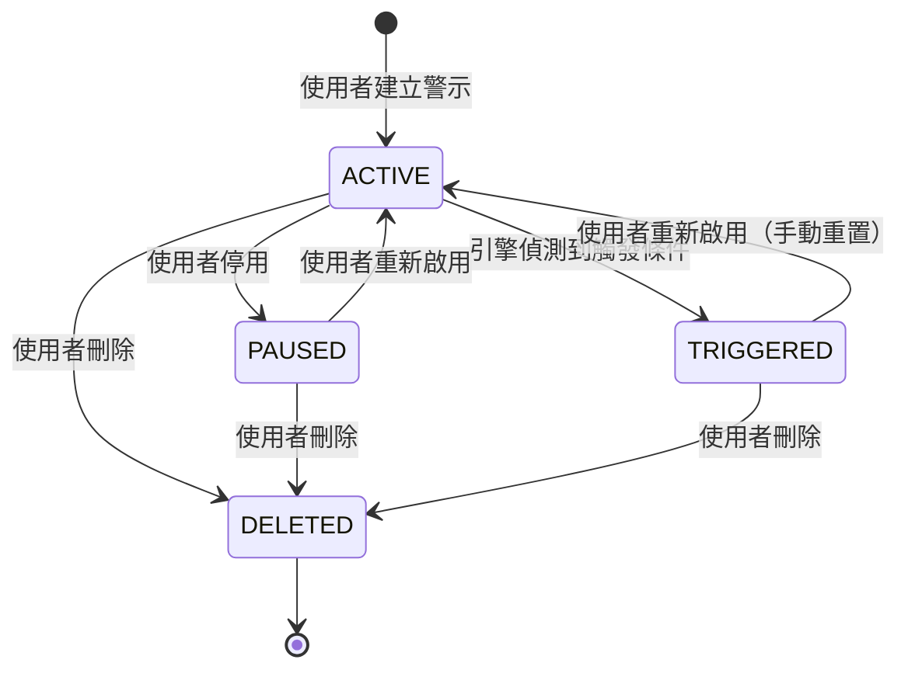
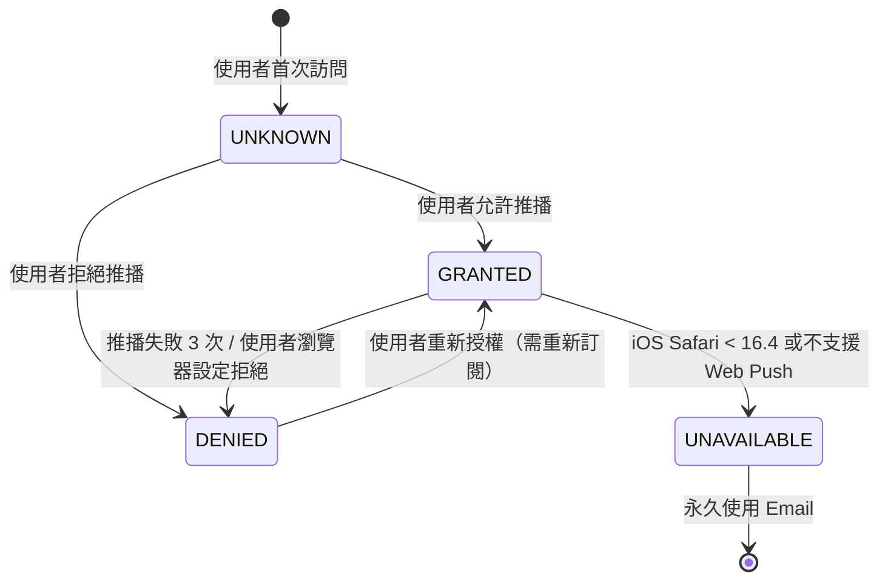
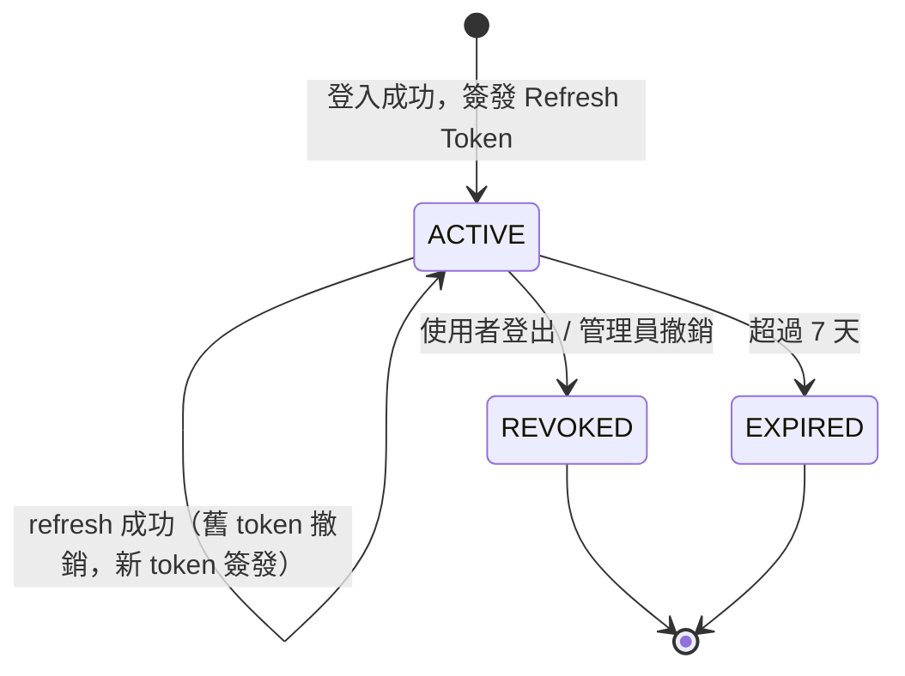

# SRS：Wave 3 — 從「能查」進化到「常用」

| 項目 | 內容 |
|------|------|
| 文件版本 | v1.0 |
| 撰寫者 | Peter（PM） |
| 撰寫日期 | 2026-04-23 |
| 狀態 | 已定稿 |
| 對應 PRD | [20260423_wave3_PRD.md](../02_product/20260423_wave3_PRD.md) |
| 決策依據 | [20260423_decision-wave2-wave3-9items.md](../01_leader/decisions/20260423_decision-wave2-wave3-9items.md) |
| 版本關聯 | v0.3.0（Wave 3） |
| 下游使用者 | Sophia、Preston、Bruno、Felix、Brian、Fiona、Quincy、Quinn |

---

## 0. 全域規範

| 項目 | 規範 |
|------|------|
| HTTP 方法 | POST（除特殊說明） |
| HTTP 狀態碼 | 200（業務錯誤透過 `code` 區分；未授權一律 200 + code 3001，不使用 HTTP 401） |
| Content-Type | `application/json; charset=UTF-8` |
| 認證 | `Authorization: Bearer {access_token}`（公開端點除外） |
| 數值精度 | 價格 / 金融比率：後端 `BigDecimal` 序列化為 `string` |
| 時間格式 | ISO 8601 datetime：`YYYY-MM-DDTHH:mm:ss.sss+08:00`；純日期：`YYYY-MM-DD` |
| 時區 | 固定 GMT+8 |
| Envelope 格式 | `{ "code": 0, "message": "success", "data": {...}, "timestamp": "...", "traceId": "..." }` |
| ID 格式 | UUID（`VARCHAR(36)`），由後端產生 |
| 錯誤碼來源 | [20260422_errorCodes_central.md](20260422_errorCodes_central.md) + Wave 3 新增錯誤碼（見本文件 §12） |

---

## 1. 功能拆解

| 功能 ID | 名稱 | 說明 | PRD 對應 | 優先級 |
|---------|------|------|----------|--------|
| F-W3-01-1 | 個股搜尋 API | POST /api/v1/stock/search | F-W3-01 | P0 |
| F-W3-01-2 | 搜尋自動完成下拉 UI | 搜尋框 + 下拉選單元件 | F-W3-01 | P0 |
| F-W3-01-3 | 熱門搜尋 API | POST /api/v1/stock/hot-search | F-W3-01 | P0 |
| F-W3-01-4 | 熱門搜尋彙總排程 | 每小時更新 hot_search 表的 cron job | F-W3-01 | P0 |
| F-W3-02-1 | Watchlist 加入 API | POST /api/v1/watchlist/add | F-W3-02 | P0 |
| F-W3-02-2 | Watchlist 移除 API | POST /api/v1/watchlist/remove | F-W3-02 | P0 |
| F-W3-02-3 | Watchlist 清單查詢 API | POST /api/v1/watchlist/list | F-W3-02 | P0 |
| F-W3-02-4 | 首頁自選股列表 UI | 含即時報價彙整，重用 quote/list API | F-W3-02 | P0 |
| F-W3-02-5 | StockDetail 自選星按鈕 UI | 加入 / 已加入狀態切換 | F-W3-02 | P0 |
| F-W3-02-6 | 未登入引導登入後補做機制 | 意圖暫存 + 登入後自動執行 | F-W3-02 | P0 |
| F-W3-03-1 | 價格警示新增 API | POST /api/v1/alert/create | F-W3-03 | P1 |
| F-W3-03-2 | 價格警示更新狀態 API | POST /api/v1/alert/update-status | F-W3-03 | P1 |
| F-W3-03-3 | 價格警示刪除 API | POST /api/v1/alert/delete | F-W3-03 | P1 |
| F-W3-03-4 | 我的警示清單查詢 API | POST /api/v1/alert/list | F-W3-03 | P1 |
| F-W3-03-5 | 警示觸發引擎（排程） | 盤中每分鐘掃描，含 idempotency | F-W3-03 | P1 |
| F-W3-03-6 | 推播偏好設定 API | POST /api/v1/user/notification-preference | F-W3-03 | P1 |
| F-W3-03-7 | VAPID Web Push 訂閱 API | POST /api/v1/push/subscribe / unsubscribe | F-W3-03 | P1 |
| F-W3-03-8 | 警示觸發推播（Web Push + Email） | 推播服務整合 + 降級邏輯 | F-W3-03 | P1 |
| F-W3-04-1 | Spring Security 客製 EntryPoint | AuthenticationEntryPoint 回 200 + 3001 | F-W3-04 | P0 |
| F-W3-04-2 | JWT 驗證 Filter | Access Token 15 分鐘 + Refresh Token 7 天 | F-W3-04 | P0 |
| F-W3-04-3 | Refresh Token API | POST /api/v1/auth/refresh | F-W3-04 | P0 |
| F-W3-04-4 | Token 黑名單機制（Redis） | Refresh Token 撤銷 / 登出 | F-W3-04 | P0 |
| F-W3-04-5 | 公開端點白名單配置 | Security Filter Chain 設定 | F-W3-04 | P0 |
| F-W3-04-6 | 前端 axios interceptor 更新 | 偵測 code 3001/3002/3003 並處理 | F-W3-04 | P0 |
| F-W3-05-1 | 搜尋歷史寫入（自動觸發） | 搜尋成功後後端寫入 search_history | F-W3-05 | P1 |
| F-W3-05-2 | 搜尋歷史查詢 API | POST /api/v1/search/history/list | F-W3-05 | P1 |
| F-W3-05-3 | 搜尋歷史移除單筆 API | POST /api/v1/search/history/remove | F-W3-05 | P1 |
| F-W3-05-4 | 搜尋歷史清除全部 API | POST /api/v1/search/history/clear | F-W3-05 | P1 |

---

## 2. 資料模型

### 2.1 STOCK_INFO 表（既有，Wave 3 確認完整性）

| 欄位 | 型別 | 長度 | 必填 | 預設 | 說明 |
|------|------|------|------|------|------|
| stock_id | VARCHAR | 20 | Y | - | 股票代號（例 `"2330"`） |
| stock_name | VARCHAR | 100 | Y | - | 中文名稱（例 `"台積電"`） |
| stock_name_en | VARCHAR | 200 | N | NULL | 英文名稱（例 `"TSMC"`） |
| market | VARCHAR | 10 | Y | - | `TWSE` 或 `OTC` |
| listed_date | DATE | - | N | NULL | 上市 / 上櫃日期 |
| is_active | BOOLEAN | - | Y | true | 是否仍在交易（下市 / 下櫃為 false） |
| updated_at | TIMESTAMP | - | Y | now() | 最後更新時間（GMT+8） |

**索引**：
- `pk_stock_info` PRIMARY KEY (stock_id)
- `idx_stock_info_name` (stock_name)（支援中文 LIKE 前綴搜尋）
- `idx_stock_info_name_en` (stock_name_en)（支援英文前綴搜尋）
- `idx_stock_info_market` (market)
- **Wave 3 新增**：`idx_stock_info_name_trgm`（PostgreSQL pg_trgm GIN index，支援中文部分匹配；由 Sophia / Preston 確認是否啟用 pg_trgm extension）

> **業務規則**：Wave 3 開始前 Bruno 必須確認上市 + 上櫃主檔資料完整度（對應 PRD §8.1 限制）。

---

### 2.2 WATCHLIST_ITEM 表（新增）

| 欄位 | 型別 | 長度 | 必填 | 預設 | 說明 |
|------|------|------|------|------|------|
| item_id | VARCHAR | 36 | Y | - | UUID，系統產生 |
| user_id | VARCHAR | 36 | Y | - | FK → USER_INFO.user_id |
| stock_id | VARCHAR | 20 | Y | - | FK → STOCK_INFO.stock_id |
| sort_order | INTEGER | - | Y | 0 | 排列順序（預留，Wave 4 排序功能用） |
| created_at | TIMESTAMP | - | Y | now() | 加入時間（GMT+8） |

**索引**：
- `pk_watchlist_item` PRIMARY KEY (item_id)
- `uk_watchlist_user_stock` UNIQUE (user_id, stock_id)（防重複加入）
- `idx_watchlist_user` (user_id)（高頻查詢）

**約束**：
- `ck_watchlist_limit`：每個 user_id 下最多 50 筆（由應用層在 add API 中前置檢查）

---

### 2.3 PRICE_ALERT 表（新增）

| 欄位 | 型別 | 長度 | 必填 | 預設 | 說明 |
|------|------|------|------|------|------|
| alert_id | VARCHAR | 36 | Y | - | UUID，系統產生 |
| user_id | VARCHAR | 36 | Y | - | FK → USER_INFO.user_id |
| stock_id | VARCHAR | 20 | Y | - | FK → STOCK_INFO.stock_id |
| alert_type | VARCHAR | 20 | Y | - | `PRICE_ABOVE`（向上突破）/ `PRICE_BELOW`（向下突破）/ `CHANGE_PERCENT`（漲跌幅） |
| threshold | NUMERIC(18,4) | - | Y | - | 觸發門檻值（價格 or 百分比；CHANGE_PERCENT 為絕對值，例 5.0 代表 ±5%） |
| change_direction | VARCHAR | 10 | N | NULL | 僅 `CHANGE_PERCENT` 類型使用：`UP`（漲幅超過）/ `DOWN`（跌幅超過）/ `BOTH`（任一方向） |
| status | VARCHAR | 20 | Y | ACTIVE | `ACTIVE`（啟用）/ `PAUSED`（停用）/ `TRIGGERED`（已觸發）/ `DELETED`（已刪除） |
| triggered_at | TIMESTAMP | - | N | NULL | 最近一次觸發時間（GMT+8） |
| trigger_count | INTEGER | - | Y | 0 | 累計觸發次數 |
| created_at | TIMESTAMP | - | Y | now() | 建立時間（GMT+8） |
| updated_at | TIMESTAMP | - | N | NULL | 最後更新時間 |

**索引**：
- `pk_price_alert` PRIMARY KEY (alert_id)
- `idx_alert_user` (user_id)
- `idx_alert_user_stock` (user_id, stock_id)（查詢某使用者某股票所有警示）
- `idx_alert_active` (status, stock_id) WHERE status = 'ACTIVE'（警示引擎掃描用）

**約束**：
- 每個 (user_id, stock_id) 組合最多 5 條 ACTIVE + PAUSED 警示（應用層前置檢查）
- threshold > 0（DB check constraint）

---

### 2.4 NOTIFICATION_PREFERENCE 表（新增）

| 欄位 | 型別 | 長度 | 必填 | 預設 | 說明 |
|------|------|------|------|------|------|
| pref_id | VARCHAR | 36 | Y | - | UUID，系統產生 |
| user_id | VARCHAR | 36 | Y | - | FK → USER_INFO.user_id（唯一） |
| web_push_enabled | BOOLEAN | - | Y | true | 是否啟用 Web Push |
| email_enabled | BOOLEAN | - | Y | true | 是否啟用 Email 推播 |
| web_push_status | VARCHAR | 20 | Y | UNKNOWN | `UNKNOWN` / `GRANTED`（已授權）/ `DENIED`（已拒絕）/ `UNAVAILABLE`（不支援） |
| created_at | TIMESTAMP | - | Y | now() | 建立時間 |
| updated_at | TIMESTAMP | - | N | NULL | 最後更新時間 |

**索引**：
- `pk_notification_preference` PRIMARY KEY (pref_id)
- `uk_notification_pref_user` UNIQUE (user_id)

> **業務規則**：使用者首次啟用警示功能時自動建立預設記錄（web_push_enabled = true, email_enabled = true）。

---

### 2.5 PUSH_SUBSCRIPTION 表（新增）

| 欄位 | 型別 | 長度 | 必填 | 預設 | 說明 |
|------|------|------|------|------|------|
| subscription_id | VARCHAR | 36 | Y | - | UUID，系統產生 |
| user_id | VARCHAR | 36 | Y | - | FK → USER_INFO.user_id |
| endpoint | TEXT | - | Y | - | Web Push endpoint URL（瀏覽器提供） |
| p256dh | TEXT | - | Y | - | 加密公鑰（base64url） |
| auth | VARCHAR | 255 | Y | - | 驗證密鑰（base64url） |
| user_agent | VARCHAR | 512 | N | NULL | 瀏覽器 User-Agent（方便除錯） |
| is_active | BOOLEAN | - | Y | true | 是否有效（推播失敗一定次數後設為 false） |
| fail_count | INTEGER | - | Y | 0 | 推播連續失敗次數 |
| created_at | TIMESTAMP | - | Y | now() | 訂閱時間 |
| updated_at | TIMESTAMP | - | N | NULL | 最後更新時間 |

**索引**：
- `pk_push_subscription` PRIMARY KEY (subscription_id)
- `idx_push_sub_user` (user_id)
- `uk_push_sub_endpoint` UNIQUE (endpoint)（同一瀏覽器避免重複訂閱）

---

### 2.6 NOTIFICATION_LOG 表（新增）

| 欄位 | 型別 | 長度 | 必填 | 預設 | 說明 |
|------|------|------|------|------|------|
| log_id | VARCHAR | 36 | Y | - | UUID，系統產生 |
| alert_id | VARCHAR | 36 | Y | - | FK → PRICE_ALERT.alert_id |
| user_id | VARCHAR | 36 | Y | - | FK → USER_INFO.user_id |
| stock_id | VARCHAR | 20 | Y | - | 股票代號 |
| channel | VARCHAR | 20 | Y | - | `WEB_PUSH` / `EMAIL` |
| status | VARCHAR | 20 | Y | - | `SENT`（送出）/ `FAILED`（失敗）/ `DELIVERED`（確認送達，Web Push receipt） |
| triggered_price | NUMERIC(18,4) | - | Y | - | 觸發當下股價 |
| sent_at | TIMESTAMP | - | Y | now() | 送出時間 |
| error_detail | TEXT | - | N | NULL | 失敗原因（截斷至 1000 字元） |

**索引**：
- `pk_notification_log` PRIMARY KEY (log_id)
- `idx_notif_log_alert` (alert_id)
- `idx_notif_log_user` (user_id, sent_at DESC)

---

### 2.7 HOT_SEARCH 表（新增）

| 欄位 | 型別 | 長度 | 必填 | 預設 | 說明 |
|------|------|------|------|------|------|
| hot_id | VARCHAR | 36 | Y | - | UUID，系統產生 |
| stock_id | VARCHAR | 20 | Y | - | FK → STOCK_INFO.stock_id |
| search_count | INTEGER | - | Y | 0 | 過去 24 小時搜尋次數（含匿名） |
| rank | INTEGER | - | Y | - | 排名（1-10），由排程計算 |
| computed_at | TIMESTAMP | - | Y | - | 最近一次彙總時間 |

**索引**：
- `pk_hot_search` PRIMARY KEY (hot_id)
- `uk_hot_search_stock` UNIQUE (stock_id)（每檔股票一筆）
- `idx_hot_search_rank` (rank)（快速取前 10 名）

> **隱私規則**：彙總前必須排除搜尋次數 < 3 的關鍵字（避免暴露個別使用者意圖）。

---

### 2.8 SEARCH_RAW_LOG 表（新增，熱門搜尋彙總用原始資料）

| 欄位 | 型別 | 長度 | 必填 | 預設 | 說明 |
|------|------|------|------|------|------|
| log_id | VARCHAR | 36 | Y | - | UUID |
| stock_id | VARCHAR | 20 | Y | - | 被搜尋的股票代號（點選確認後才寫入） |
| searched_at | TIMESTAMP | - | Y | now() | 搜尋時間 |

> **隱私設計**：不記錄 user_id，僅記錄 stock_id + 時間，確保熱門搜尋彙總不可溯源至個人。
> **保留期**：僅保留最近 48 小時資料（排程清除）。

---

### 2.9 SEARCH_HISTORY 表（新增）

| 欄位 | 型別 | 長度 | 必填 | 預設 | 說明 |
|------|------|------|------|------|------|
| history_id | VARCHAR | 36 | Y | - | UUID |
| user_id | VARCHAR | 36 | Y | - | FK → USER_INFO.user_id |
| stock_id | VARCHAR | 20 | Y | - | FK → STOCK_INFO.stock_id |
| searched_at | TIMESTAMP | - | Y | now() | 最後搜尋時間（重複搜尋時 update） |

**索引**：
- `pk_search_history` PRIMARY KEY (history_id)
- `uk_search_history_user_stock` UNIQUE (user_id, stock_id)（同股票只保留一筆，更新時間）
- `idx_search_history_user_time` (user_id, searched_at DESC)（快速取最近 10 筆）

---

### 2.10 REFRESH_TOKEN 表（新增，TD-1 清償）

| 欄位 | 型別 | 長度 | 必填 | 預設 | 說明 |
|------|------|------|------|------|------|
| token_id | VARCHAR | 36 | Y | - | UUID |
| user_id | VARCHAR | 36 | Y | - | FK → USER_INFO.user_id |
| token_hash | VARCHAR | 64 | Y | - | SHA-256 hash of refresh token（不明文存儲） |
| device_info | VARCHAR | 512 | N | NULL | User-Agent 摘要 |
| issued_at | TIMESTAMP | - | Y | now() | 簽發時間 |
| expires_at | TIMESTAMP | - | Y | - | 過期時間（issued_at + 7 天） |
| revoked_at | TIMESTAMP | - | N | NULL | 撤銷時間（NULL 表示仍有效） |
| is_active | BOOLEAN | - | Y | true | 是否有效 |

**索引**：
- `pk_refresh_token` PRIMARY KEY (token_id)
- `idx_refresh_token_hash` (token_hash)（查詢時用） 
- `idx_refresh_token_user` (user_id, is_active)

---

## 3. 業務規則

### 3.1 F-W3-01 搜尋規則

#### 3.1.1 搜尋觸發條件

| 規則 | 值 |
|------|-----|
| 最少輸入字元數 | 1 |
| Debounce 延遲 | 250ms（前端控制） |
| 最大回傳筆數 | 10 筆 |
| 大小寫敏感 | 否（英文 case-insensitive） |

#### 3.1.2 匹配規則（依優先序）

| 優先序 | 匹配類型 | 範例 | 實作方式 |
|--------|---------|------|---------|
| 1 | 股票代號完全匹配 | 輸入 `2330` 命中 `2330` | `stock_id = ?` |
| 2 | 股票代號前綴匹配 | 輸入 `23` 命中 `2330`、`2301`... | `stock_id LIKE '23%'` |
| 3 | 中文名稱完全匹配 | 輸入 `台積電` 命中 `台積電` | `stock_name = ?` |
| 4 | 中文名稱前綴匹配 | 輸入 `台積` 命中 `台積電` | `stock_name LIKE '台積%'` |
| 5 | 中文名稱部分匹配 | 輸入 `積電` 命中 `台積電` | `stock_name LIKE '%積電%'` |
| 6 | 英文名稱前綴匹配 | 輸入 `TSMC` 命中 `TSMC` | `stock_name_en ILIKE 'TSMC%'` |

> 同優先序內，依過去 24 小時搜尋次數（來自 HOT_SEARCH.search_count）降冪排序；搜尋次數相同時依 stock_id 升冪排序（穩定排序）。

#### 3.1.3 無結果處理

- 顯示文案：`找不到符合的股票`（i18n key: `search.noResult`）
- 同時顯示熱門搜尋清單（引導探索）

#### 3.1.4 熱門搜尋規則

| 規則 | 值 |
|------|-----|
| 統計時間窗 | 過去 24 小時 |
| 最大顯示筆數 | 10 筆 |
| 更新頻率 | 每小時（cron job） |
| 隱私門檻 | 搜尋次數 < 3 的股票不出現在熱門清單 |
| 資料來源 | SEARCH_RAW_LOG（不含個人 user_id） |

---

### 3.2 F-W3-02 Watchlist 規則

| 規則 | 值 |
|------|-----|
| 每位使用者最大自選股數 | 50 檔 |
| 重複加入行為 | 回 2020 WATCHLIST_ALREADY_EXISTS |
| 超出上限行為 | 回 2021 WATCHLIST_LIMIT_REACHED |
| 股票下市後行為 | 仍保留在 Watchlist（不自動移除）；UI 標示「已下市」 |
| 刪除後資料 | 硬刪除（直接刪除 DB 記錄，不保留） |
| 即時報價彙整 | 呼叫既有 `POST /api/v1/quote/list`，傳入所有 watchlist stock_id |
| N+1 避免 | 單次批次 SQL 取所有 watchlist item；single JOIN 呼叫 quote/list（對應 PRD §12.1 跨Wave-7） |

#### 3.2.1 「登入後補做」UX 規則

1. 未登入使用者點擊「★ 加入自選股」時，前端將意圖存入 `sessionStorage`：
   - Key：`pendingWatchlistAdd`
   - Value：`{ stockId: "2330", stockName: "台積電", expiredAt: <now+5min> }`
2. 顯示登入對話框（Login Modal），文案：`登入即可跨裝置同步您的自選股`
3. 登入成功 callback 觸發：
   - 讀取 `sessionStorage.pendingWatchlistAdd`
   - 驗證 `expiredAt` 是否過期（超過 5 分鐘視為廢棄）
   - 未過期則自動呼叫 `POST /api/v1/watchlist/add`
   - 成功：Toast 提示「已加入自選股」，清除 sessionStorage
   - 失敗（2020 已加入 / 2021 已滿 / stock 不存在）：顯示對應錯誤，不中斷
4. 意圖過期處理：若 expiredAt 已過，靜默丟棄，不自動加入

---

### 3.3 F-W3-03 價格警示規則

#### 3.3.1 警示條件規則

| 警示類型 | alert_type | threshold 含義 | 觸發條件 |
|---------|-----------|---------------|---------|
| 向上突破 | `PRICE_ABOVE` | 目標價（例 600.0） | 當前成交價 >= threshold |
| 向下突破 | `PRICE_BELOW` | 目標價（例 580.0） | 當前成交價 <= threshold |
| 漲幅超過 | `CHANGE_PERCENT` + `UP` | 漲幅百分比（例 5.0 表 +5%） | (price - prevClose) / prevClose * 100 >= threshold |
| 跌幅超過 | `CHANGE_PERCENT` + `DOWN` | 跌幅百分比（例 5.0 表 -5%） | (prevClose - price) / prevClose * 100 >= threshold |
| 漲跌幅任一方向 | `CHANGE_PERCENT` + `BOTH` | 絕對百分比 | abs((price - prevClose) / prevClose * 100) >= threshold |

| 規則 | 值 |
|------|-----|
| 每股每使用者最大警示數 | 5 條（ACTIVE + PAUSED 合計） |
| 重複條件 | 相同 (user_id, stock_id, alert_type, threshold, change_direction) 視為重複，回 2030 |
| 超出上限 | 回 2032 ALERT_LIMIT_REACHED（Wave 3 新增錯誤碼） |

#### 3.3.2 警示引擎排程規則

| 規則 | 值 |
|------|-----|
| 檢查時間 | 盤中：09:00-13:30 GMT+8（每分鐘） |
| 盤後 | 不執行（節省資源） |
| 假日 / 非交易日 | 不執行（依 TD-7 交易日曆服務判斷） |
| Cron 表達式 | `0 * 9-13 * * MON-FRI`（每小時整點不執行，需細化至分鐘：`0/1 0 9-13 * * MON-FRI`） |
| 每次掃描對象 | `status = 'ACTIVE'` 的所有警示，批次依 stock_id 分組 |

#### 3.3.3 Idempotency 規則（避免重複推播）

1. 警示觸發後，立即更新 `status = 'TRIGGERED'`、`triggered_at = now()`
2. 同一條警示當日觸發一次後不再推播（以 `triggered_at` DATE 判斷；隔日凌晨 00:05 GMT+8 不自動重置，由使用者手動重新啟用）
3. 若排程執行時發現 `status = 'TRIGGERED'`，跳過不推播
4. 資料庫更新與推播動作必須在同一應用層交易中完成（先更新 DB，再送推播；若推播失敗，DB 狀態維持 TRIGGERED，不回滾，改記 notification_log.status = FAILED）

#### 3.3.4 推播降級規則

```
觸發警示
  └─ 查詢 NOTIFICATION_PREFERENCE
       ├─ web_push_enabled = true AND web_push_status = GRANTED
       │    └─ 查詢 PUSH_SUBSCRIPTION (is_active = true)
       │         ├─ 有訂閱：嘗試 Web Push
       │         │    ├─ 成功：寫 notification_log SENT，結束
       │         │    └─ 失敗：寫 notification_log FAILED
       │         │          └─ email_enabled = true：嘗試 Email（AWS SES）
       │         │               ├─ 成功：寫 notification_log SENT
       │         │               └─ 失敗：寫 notification_log FAILED（5001 SES 錯誤）
       │         └─ 無訂閱：直接走 Email 分支
       └─ web_push_enabled = false OR web_push_status != GRANTED
            └─ email_enabled = true：走 Email
            └─ email_enabled = false：不推播，寫 SKIPPED 日誌
```

**push_subscription.fail_count 規則**：
- Web Push 失敗一次：fail_count + 1
- fail_count >= 3：設 is_active = false，更新 NOTIFICATION_PREFERENCE.web_push_status = DENIED

---

### 3.4 F-W3-04 Spring Security 規則

#### 3.4.1 未授權回應契約（端到端）

所有需要認證的端點收到未授權請求時，回傳：

```json
{
  "code": 3001,
  "message": "未登入，請先登入",
  "timestamp": "2026-04-23T10:30:45.123+08:00",
  "traceId": "abc-123-def"
}
```

HTTP 狀態碼：**200**（不使用 401）

#### 3.4.2 觸發場景矩陣

| 場景 | code | message | 是否寫 audit_log |
|------|------|---------|----------------|
| 未帶 Authorization header | 3001 | 未登入，請先登入 | 否 |
| token 格式錯誤 / 解析失敗 | 3003 | 登入憑證無效或已被撤銷 | 是（記 INVALID_TOKEN 事件） |
| access token 已過期（exp 超過） | 3002 | 登入憑證已過期 | 否（正常流程） |
| token 在黑名單中（已登出 / 被撤銷） | 3003 | 登入憑證無效或已被撤銷 | 是（記 REVOKED_TOKEN 事件） |
| 已登入但無此功能權限（RBAC，Wave 4+） | 3004 | 無權限執行此操作 | 是 |

#### 3.4.3 公開端點白名單（不需 JWT 驗證）

| 端點 | 說明 |
|------|------|
| POST /api/v1/auth/login | 登入 |
| POST /api/v1/auth/register | 註冊 |
| POST /api/v1/auth/refresh | 刷新 token |
| POST /api/v1/auth/verify-email | 驗證信箱 |
| POST /api/v1/auth/resend-verification | 重發驗證信 |
| POST /api/v1/stock/search | 個股搜尋（搜尋允許未登入，但搜尋歷史不寫入） |
| POST /api/v1/stock/hot-search | 熱門搜尋 |
| GET /actuator/health | 健康檢查 |
| GET /actuator/info | 服務資訊 |

> 公開端點若帶有 JWT，仍解析並注入 SecurityContext（不強制驗證，用於區分已登入 / 未登入行為）。

#### 3.4.4 前端 axios interceptor 行為

| 偵測到的 code | 前端行為 |
|-------------|---------|
| 3001（未登入） | 清空 access token + refresh token；儲存當前路徑至 sessionStorage (returnUrl)；導向 /login |
| 3002（access token 過期） | 觸發 refresh token 流程；成功後重試原請求；失敗（refresh 也過期）走 3001 流程 |
| 3003（token 無效 / 黑名單） | 清空所有 token；導向 /login；埋點事件 `tampered_token` |

#### 3.4.5 JWT 規格

| 項目 | 規格 |
|------|------|
| Access Token 有效期 | 15 分鐘 |
| Refresh Token 有效期 | 7 天 |
| 演算法 | RS256（非對稱金鑰，禁止 HS256） |
| Claims | `sub`（user_id）、`email`、`iat`、`exp`、`jti`（JWT ID，用於黑名單） |
| Refresh Token 儲存 | 後端 DB（REFRESH_TOKEN 表）+ hash 存儲（SHA-256，不明文） |
| 黑名單 | Redis `jwt:blacklist:{jti}`（TTL = access token 剩餘有效期） |

---

### 3.5 F-W3-05 搜尋歷史規則

| 規則 | 值 |
|------|-----|
| 最大保留筆數 | 每位使用者最多 10 筆 |
| 超出上限處理 | 刪除最舊一筆（LRU 策略，在 add 時執行） |
| 重複搜尋 | 更新 searched_at，不新增重複記錄（UPSERT 語意） |
| 歷史保留期 | 90 天（超過 90 天未搜尋的記錄由排程清除） |
| 儲存條件 | 使用者必須已登入 + 點擊（選定）了某檔股票 |
| 未登入行為 | 不儲存、不顯示搜尋歷史（不使用 localStorage） |
| 顯示時機 | 搜尋框 focus 且 input 為空時顯示 |

---

## 4. API 清單

| # | 路徑 | 方法 | 用途 | 認證 | 功能 ID |
|---|------|------|------|------|---------|
| 1 | /api/v1/stock/search | POST | 個股搜尋（中 / 英 / 代號） | 否（帶 token 亦可） | F-W3-01-1 |
| 2 | /api/v1/stock/hot-search | POST | 取熱門搜尋前 10 名 | 否 | F-W3-01-3 |
| 3 | /api/v1/watchlist/add | POST | 加入自選股 | 是 | F-W3-02-1 |
| 4 | /api/v1/watchlist/remove | POST | 移除自選股 | 是 | F-W3-02-2 |
| 5 | /api/v1/watchlist/list | POST | 查詢自選股清單（含報價） | 是 | F-W3-02-3 |
| 6 | /api/v1/alert/create | POST | 建立價格警示 | 是 | F-W3-03-1 |
| 7 | /api/v1/alert/update-status | POST | 啟用 / 停用 / 重設警示 | 是 | F-W3-03-2 |
| 8 | /api/v1/alert/delete | POST | 刪除價格警示 | 是 | F-W3-03-3 |
| 9 | /api/v1/alert/list | POST | 查詢我的警示清單 | 是 | F-W3-03-4 |
| 10 | /api/v1/user/notification-preference | POST | 查詢 / 更新推播偏好 | 是 | F-W3-03-6 |
| 11 | /api/v1/push/subscribe | POST | 新增 Web Push 訂閱 | 是 | F-W3-03-7 |
| 12 | /api/v1/push/unsubscribe | POST | 取消 Web Push 訂閱 | 是 | F-W3-03-7 |
| 13 | /api/v1/auth/refresh | POST | Refresh Access Token | 否 | F-W3-04-3 |
| 14 | /api/v1/auth/logout | POST | 登出（撤銷 Refresh Token） | 是 | F-W3-04-4 |
| 15 | /api/v1/search/history/list | POST | 查詢搜尋歷史 | 是 | F-W3-05-2 |
| 16 | /api/v1/search/history/remove | POST | 移除單筆搜尋歷史 | 是 | F-W3-05-3 |
| 17 | /api/v1/search/history/clear | POST | 清除全部搜尋歷史 | 是 | F-W3-05-4 |

> 既有 API（`/api/v1/quote/list`）由 Watchlist 首頁直接複用，不重複定義。

---

### 4.1 POST /api/v1/stock/search

**功能**：依輸入字串搜尋股票（代號 / 中文 / 英文），回傳最多 10 筆，依排序規則排列。

**Request**：

```json
{
  "keyword": "台積",
  "limit": 10
}
```

| 欄位 | 型別 | 必填 | 說明 |
|------|------|------|------|
| keyword | string | Y | 搜尋字串，最小 1 字元，最大 50 字元 |
| limit | integer | N | 回傳筆數，預設 10，最大 10 |

**Response.data Schema**：

```json
{
  "code": 0,
  "message": "success",
  "data": {
    "items": [
      {
        "stockId": "2330",
        "stockName": "台積電",
        "stockNameEn": "TSMC",
        "market": "TWSE",
        "matchType": "NAME_PREFIX"
      }
    ],
    "keyword": "台積",
    "total": 1
  },
  "timestamp": "2026-04-23T10:30:45.123+08:00",
  "traceId": "abc-123"
}
```

| 欄位 | 型別 | 說明 |
|------|------|------|
| items | StockSearchItem[] | 搜尋結果陣列（最多 10 筆） |
| keyword | string | Echo 回傳的搜尋字串 |
| total | integer | 實際命中總數（不含分頁截斷） |

**StockSearchItem**：

| 欄位 | 型別 | 說明 |
|------|------|------|
| stockId | string | 股票代號 |
| stockName | string | 中文名稱 |
| stockNameEn | string | 英文名稱（可為 null） |
| market | `"TWSE"` \| `"OTC"` | 市場別 |
| matchType | string | 匹配類型（`ID_EXACT`、`ID_PREFIX`、`NAME_EXACT`、`NAME_PREFIX`、`NAME_PARTIAL`、`NAME_EN_PREFIX`），供前端 highlight 使用 |

**錯誤碼**：

| code | 觸發條件 |
|------|---------|
| 1001 | keyword 未帶 |
| 1004 | keyword 超過 50 字元 |
| 9001 | 系統錯誤 |

**副作用**（已登入使用者點選結果後，由前端觸發）：
- 前端在使用者點擊某搜尋結果後，呼叫 search history 寫入；搜尋 API 本身不觸發歷史寫入（避免 debounce 期間的中間字串汙染歷史）

---

### 4.2 POST /api/v1/stock/hot-search

**功能**：取當前熱門搜尋前 10 名（由 HOT_SEARCH 表提供快取）。

**Request**：

```json
{}
```

（無必填參數）

**Response.data Schema**：

```json
{
  "code": 0,
  "message": "success",
  "data": {
    "items": [
      { "rank": 1, "stockId": "2330", "stockName": "台積電", "market": "TWSE", "searchCount": 1523 },
      { "rank": 2, "stockId": "2317", "stockName": "鴻海", "market": "TWSE", "searchCount": 987 }
    ],
    "computedAt": "2026-04-23T10:00:00.000+08:00"
  },
  "timestamp": "2026-04-23T10:30:45.123+08:00",
  "traceId": "abc-123"
}
```

> `searchCount` 顯示為彙總數字（不洩漏個別使用者資訊）。

---

### 4.3 POST /api/v1/watchlist/add

**功能**：將指定股票加入登入使用者的自選股清單。

**Request**：

```json
{
  "stockId": "2330"
}
```

**Response（成功）**：

```json
{
  "code": 0,
  "message": "success",
  "data": {
    "itemId": "uuid-...",
    "stockId": "2330",
    "stockName": "台積電",
    "market": "TWSE",
    "createdAt": "2026-04-23T10:30:45.123+08:00"
  },
  "timestamp": "...",
  "traceId": "..."
}
```

**錯誤碼**：

| code | 觸發條件 |
|------|---------|
| 1001 | stockId 未帶 |
| 2020 | 該股票已在自選股清單 |
| 2021 | 已達 50 檔上限 |
| 3001 | 未登入 |
| 4001 | 股票不存在 |
| 9001 | 系統錯誤 |

---

### 4.4 POST /api/v1/watchlist/remove

**Request**：

```json
{
  "stockId": "2330"
}
```

**Response（成功）**：

```json
{
  "code": 0,
  "message": "success",
  "data": null,
  "timestamp": "...",
  "traceId": "..."
}
```

**錯誤碼**：

| code | 觸發條件 |
|------|---------|
| 1001 | stockId 未帶 |
| 2023 | 該股票不在自選股清單（Wave 3 新增錯誤碼 WATCHLIST_NOT_FOUND） |
| 3001 | 未登入 |
| 9001 | 系統錯誤 |

---

### 4.5 POST /api/v1/watchlist/list

**功能**：查詢登入使用者的自選股清單，含各股最新報價（複用 quote/list 批次查詢）。

**Request**：

```json
{}
```

**Response.data Schema**：

```json
{
  "code": 0,
  "message": "success",
  "data": {
    "items": [
      {
        "itemId": "uuid-...",
        "stockId": "2330",
        "stockName": "台積電",
        "market": "TWSE",
        "createdAt": "2026-04-23T09:00:00.000+08:00",
        "quote": {
          "price": "1050.00",
          "change": "+19.00",
          "changePercent": "+1.84",
          "volume": 28450000,
          "quoteDate": "2026-04-23",
          "isStale": false
        }
      }
    ],
    "total": 1
  },
  "timestamp": "...",
  "traceId": "..."
}
```

> 若某股票報價查詢失敗（例如資料來源暫時不可用），quote 欄位回傳 null（不中斷整批），並在該 item 附上 `"quoteError": "5010"`。

**效能要求**：P95 < 500ms（10 檔自選股）。

**錯誤碼**：

| code | 觸發條件 |
|------|---------|
| 3001 | 未登入 |
| 9001 | 系統錯誤 |

---

### 4.6 POST /api/v1/alert/create

**Request**：

```json
{
  "stockId": "2330",
  "alertType": "PRICE_BELOW",
  "threshold": "580.00",
  "changeDirection": null
}
```

| 欄位 | 型別 | 必填 | 說明 |
|------|------|------|------|
| stockId | string | Y | 股票代號 |
| alertType | string | Y | `PRICE_ABOVE` / `PRICE_BELOW` / `CHANGE_PERCENT` |
| threshold | string | Y | 觸發門檻值（BigDecimal string，必須 > 0） |
| changeDirection | string | N | 僅 `CHANGE_PERCENT` 必填：`UP` / `DOWN` / `BOTH` |

**Response（成功）**：

```json
{
  "code": 0,
  "message": "success",
  "data": {
    "alertId": "uuid-...",
    "stockId": "2330",
    "stockName": "台積電",
    "alertType": "PRICE_BELOW",
    "threshold": "580.00",
    "changeDirection": null,
    "status": "ACTIVE",
    "createdAt": "2026-04-23T10:30:45.123+08:00"
  },
  "timestamp": "...",
  "traceId": "..."
}
```

**錯誤碼**：

| code | 觸發條件 |
|------|---------|
| 1001 | 必填欄位缺失 |
| 1002 | alertType 不合法；changeDirection 不合法 |
| 1003 | threshold <= 0 |
| 2030 | 相同條件已存在 |
| 2032 | 已達每股 5 條警示上限（新增錯誤碼） |
| 3001 | 未登入 |
| 4001 | 股票不存在 |
| 9001 | 系統錯誤 |

---

### 4.7 POST /api/v1/alert/update-status

**Request**：

```json
{
  "alertId": "uuid-...",
  "status": "PAUSED"
}
```

| status 值 | 允許的轉換 |
|-----------|-----------|
| `ACTIVE` | 從 PAUSED、TRIGGERED 轉入（重新啟用） |
| `PAUSED` | 從 ACTIVE 轉入（停用） |

> 不允許透過此 API 直接設為 TRIGGERED 或 DELETED。

**錯誤碼**：

| code | 觸發條件 |
|------|---------|
| 1001 | alertId 或 status 未帶 |
| 1002 | status 不合法轉換 |
| 3001 | 未登入 |
| 4003 | 警示不存在或不屬於此使用者 |
| 9001 | 系統錯誤 |

---

### 4.8 POST /api/v1/alert/delete

**Request**：

```json
{
  "alertId": "uuid-..."
}
```

**Response**：`{ "code": 0, "message": "success", "data": null }`

**錯誤碼**：

| code | 觸發條件 |
|------|---------|
| 1001 | alertId 未帶 |
| 3001 | 未登入 |
| 4003 | 警示不存在或不屬於此使用者 |
| 9001 | 系統錯誤 |

> 刪除實作：status 更新為 DELETED（軟刪除），前端查詢 list 時過濾。

---

### 4.9 POST /api/v1/alert/list

**Request**：

```json
{
  "stockId": "2330",
  "status": "ACTIVE"
}
```

| 欄位 | 必填 | 說明 |
|------|------|------|
| stockId | N | 不帶則查所有股票 |
| status | N | 不帶則查 ACTIVE + PAUSED + TRIGGERED |

**Response.data Schema**：

```json
{
  "items": [
    {
      "alertId": "uuid-...",
      "stockId": "2330",
      "stockName": "台積電",
      "alertType": "PRICE_BELOW",
      "threshold": "580.00",
      "changeDirection": null,
      "status": "ACTIVE",
      "triggeredAt": null,
      "triggerCount": 0,
      "createdAt": "2026-04-23T10:30:45.123+08:00"
    }
  ],
  "total": 1
}
```

---

### 4.10 POST /api/v1/user/notification-preference

**功能**：查詢或更新使用者推播偏好（GET / UPDATE 合一端點）。

**Request**：

```json
{
  "action": "update",
  "webPushEnabled": true,
  "emailEnabled": true,
  "webPushStatus": "GRANTED"
}
```

| 欄位 | 必填 | 說明 |
|------|------|------|
| action | Y | `get`（查詢）或 `update`（更新） |
| webPushEnabled | N（update 時選填） | 是否啟用 Web Push |
| emailEnabled | N（update 時選填） | 是否啟用 Email |
| webPushStatus | N（update 時選填） | 前端在 Notification.permission 改變時同步 |

**Response.data**：

```json
{
  "webPushEnabled": true,
  "emailEnabled": true,
  "webPushStatus": "GRANTED",
  "updatedAt": "2026-04-23T10:30:45.123+08:00"
}
```

---

### 4.11 POST /api/v1/push/subscribe

**Request**：

```json
{
  "endpoint": "https://fcm.googleapis.com/...",
  "p256dh": "base64url...",
  "auth": "base64url...",
  "userAgent": "Mozilla/5.0 ..."
}
```

**Response**：`{ "code": 0, "message": "success", "data": { "subscriptionId": "uuid-..." } }`

---

### 4.12 POST /api/v1/push/unsubscribe

**Request**：`{ "endpoint": "https://fcm.googleapis.com/..." }`

**Response**：`{ "code": 0, "message": "success", "data": null }`

---

### 4.13 POST /api/v1/auth/refresh

**功能**：使用 Refresh Token 換取新的 Access Token。

**Request**：

```json
{
  "refreshToken": "eyJ..."
}
```

**Response（成功）**：

```json
{
  "code": 0,
  "message": "success",
  "data": {
    "accessToken": "eyJ...",
    "expiresIn": 900,
    "refreshToken": "eyJ...",
    "refreshExpiresIn": 604800
  },
  "timestamp": "...",
  "traceId": "..."
}
```

> Refresh Token Rotation：每次 refresh 回傳新的 refresh token，舊的立即撤銷。

**錯誤碼**：

| code | 觸發條件 |
|------|---------|
| 1001 | refreshToken 未帶 |
| 3003 | refresh token 無效 / 已撤銷 / 黑名單 |
| 3002 | refresh token 已過期 |
| 9001 | 系統錯誤 |

---

### 4.14 POST /api/v1/auth/logout

**Request**：`{}`（refresh token 從 request body 帶入，或從 Authorization header 取 access token 的 jti）

**實際 Request**：

```json
{
  "refreshToken": "eyJ..."
}
```

**Response**：`{ "code": 0, "message": "success", "data": null }`

> 後端將 refresh token 的 token_hash 設為 revoked；access token 的 jti 加入 Redis 黑名單（TTL = 剩餘有效期）。

---

### 4.15 POST /api/v1/search/history/list

**Request**：`{}`

**Response.data**：

```json
{
  "items": [
    {
      "stockId": "2330",
      "stockName": "台積電",
      "market": "TWSE",
      "searchedAt": "2026-04-23T10:25:00.000+08:00"
    }
  ],
  "total": 5
}
```

---

### 4.16 POST /api/v1/search/history/remove

**Request**：`{ "stockId": "2330" }`

**Response**：`{ "code": 0, "message": "success", "data": null }`

---

### 4.17 POST /api/v1/search/history/clear

**Request**：`{}`

**Response**：`{ "code": 0, "message": "success", "data": null }`

---

## 5. UI 流程

詳細 UI 規格見獨立文件：[20260423_wave3_ui-spec.md](20260423_wave3_ui-spec.md)

### 5.1 搜尋流程概要

1. 首頁頂部搜尋框（SearchBar 元件）
2. focus 且 input 為空：顯示搜尋歷史（已登入）或 熱門搜尋（未登入）
3. 輸入字元：debounce 250ms 後觸發 `/api/v1/stock/search`
4. 下拉選單顯示最多 10 筆結果（含股票代號、中文名、市場別）
5. 鍵盤支援：上下箭頭選擇、Enter 確認、Escape 關閉
6. 點選後：記錄 search history（已登入）、導向 `/stocks/:stockId`、寫入 SEARCH_RAW_LOG

### 5.2 Watchlist 首頁流程概要

1. 首頁載入：呼叫 `/api/v1/watchlist/list`
2. 有自選股：顯示表格（代號、名稱、現價、漲跌、漲跌幅、成交量）
3. 無自選股：顯示空狀態 + CTA 按鈕「使用搜尋加入第一檔自選股」
4. 點選行：導向 `/stocks/:stockId`
5. 點選移除按鈕：確認 Modal → 呼叫 `/api/v1/watchlist/remove` → 樂觀更新

### 5.3 價格警示設定流程概要

1. StockDetail 頁面「設定警示」按鈕
2. 開啟警示設定 Modal：選擇類型 + 輸入門檻值 + 選擇方向（CHANGE_PERCENT 時）
3. 提交後呼叫 `/api/v1/alert/create`
4. 首次設定時詢問 Web Push 權限（瀏覽器 Notification.permission API）
5. 獲得權限後呼叫 `/api/v1/push/subscribe`；拒絕後呼叫 notification-preference 更新 webPushStatus = DENIED
6. 「我的警示」頁面（/alerts）：列出所有警示，可啟停 / 刪除

---

## 6. 狀態機

### 6.1 價格警示狀態機



| 狀態 | 說明 | 引擎是否掃描 |
|------|------|------------|
| ACTIVE | 啟用中，等待觸發 | 是 |
| PAUSED | 使用者手動暫停 | 否 |
| TRIGGERED | 已觸發（當日不再推播） | 否 |
| DELETED | 軟刪除 | 否 |

---

### 6.2 Web Push 訂閱狀態機



---

### 6.3 Refresh Token 生命週期



---

## 7. 驗收標準（AC）

### AC-W3-01-01：個股搜尋 - 中文前綴匹配

```gherkin
Scenario: 輸入中文前綴找到目標股票
  Given 系統中存在股票 "2330 台積電"
  And 使用者在搜尋框輸入 "台積"
  When debounce 250ms 後觸發搜尋 API
  Then API 回傳 code = 0
  And 結果包含 stockId = "2330", stockName = "台積電"
  And matchType = "NAME_PREFIX"
  And 結果在 P95 < 200ms 內回傳
```

### AC-W3-01-02：個股搜尋 - 代號前綴匹配

```gherkin
Scenario: 輸入代號前綴找到多筆股票
  Given 系統中存在 "2330 台積電"、"2317 鴻海"、"2301 光寶科" 等
  When 使用者輸入 "23" 並觸發搜尋
  Then 結果包含 "2317"、"2330" 等所有 23xx 開頭股票
  And 結果依 matchType 優先序 + 搜尋熱度排序
  And 最多回傳 10 筆
```

### AC-W3-01-03：個股搜尋 - 無結果

```gherkin
Scenario: 搜尋不存在的字串
  Given 使用者輸入 "abcxyz"
  When 觸發搜尋 API
  Then API 回傳 code = 0
  And data.items 為空陣列
  And data.total = 0
  And 前端顯示 "找不到符合的股票" 並附上熱門搜尋
```

### AC-W3-01-04：熱門搜尋隱私保護

```gherkin
Scenario: 熱門搜尋彙總不暴露低頻股票
  Given 股票 "9999 範例股" 在過去 24 小時僅被搜尋 2 次
  When 熱門搜尋排程執行彙總
  Then "9999 範例股" 不出現在 hot_search 結果中
```

### AC-W3-02-01：Watchlist 加入成功

```gherkin
Scenario: 已登入使用者加入自選股
  Given 使用者已登入
  And 使用者的 Watchlist 少於 50 檔
  And 股票 "2330 台積電" 存在且未在 Watchlist 中
  When 使用者點擊「★ 加入自選股」
  Then API 回傳 code = 0
  And 星星圖示變為金色實心
  And 首頁 Watchlist 即時更新包含 "2330 台積電"
  And WATCHLIST_ITEM 表新增一筆記錄
```

### AC-W3-02-02：未登入使用者加入自選股後引導登入

```gherkin
Scenario: 未登入使用者點擊加入自選股，登入後自動補做
  Given 使用者未登入
  And 使用者瀏覽 /stocks/2330
  When 使用者點擊「★ 加入自選股」
  Then 前端將 { stockId: "2330", expiredAt: now+5min } 存入 sessionStorage
  And 顯示登入對話框，文案包含 "登入即可跨裝置同步您的自選股"
  When 使用者完成登入（在 5 分鐘內）
  Then 前端自動呼叫 POST /api/v1/watchlist/add（stockId = "2330"）
  And API 回傳 code = 0
  And 顯示 Toast "已加入自選股"
  And sessionStorage 中的意圖被清除
```

### AC-W3-02-03：Watchlist 已達上限

```gherkin
Scenario: 自選股已達 50 檔上限
  Given 使用者已登入
  And 使用者的 Watchlist 已有 50 檔
  When 使用者嘗試加入第 51 檔股票
  Then API 回傳 code = 2021
  And 前端顯示 "已達自選股上限，請先移除其他股票"
  And Watchlist 數量不變
```

### AC-W3-02-04：自選股即時報價 N+1 防護

```gherkin
Scenario: 自選股清單載入不觸發 N+1 查詢
  Given 使用者有 10 檔自選股
  When 呼叫 POST /api/v1/watchlist/list
  Then 後端使用單次批次 SQL 取所有 watchlist item
  And 使用單次 quote/list 批次呼叫取報價
  And API P95 < 500ms
```

### AC-W3-03-01：價格警示新增成功

```gherkin
Scenario: 設定向下突破警示
  Given 使用者已登入
  And 股票 "2330 台積電" 存在
  And 使用者對 2330 已有 0 條警示
  When 使用者設定 alertType = "PRICE_BELOW", threshold = "580.00"
  Then API 回傳 code = 0
  And PRICE_ALERT 表新增一筆 status = ACTIVE 記錄
  And 警示列表顯示新增的警示
```

### AC-W3-03-02：警示觸發推播（Web Push + Email 降級）

```gherkin
Scenario: Web Push 成功
  Given 警示 alert_id = "xxx" 狀態為 ACTIVE
  And 使用者有有效的 Web Push 訂閱
  And 盤中時間，台積電當前價格跌破 580 元
  When 警示引擎每分鐘掃描時偵測到觸發條件
  Then 系統更新 alert status = TRIGGERED, triggered_at = now()
  And 系統透過 Web Push 推播通知（含股票名稱、觸發類型、當前價格、深層連結）
  And NOTIFICATION_LOG 寫入 channel = WEB_PUSH, status = SENT

Scenario: Web Push 失敗降級 Email
  Given 警示觸發，但 Web Push 推播失敗
  And 使用者的 email_enabled = true
  When Web Push 推播回傳失敗
  Then 系統立即嘗試透過 AWS SES 寄送警示 Email
  And NOTIFICATION_LOG 先寫 WEB_PUSH/FAILED，再寫 EMAIL/SENT
  And push_subscription.fail_count 累加 1
```

### AC-W3-03-03：警示 Idempotency

```gherkin
Scenario: 同一警示當日不重複推播
  Given alert_id = "xxx" 已於今日 10:30 觸發（status = TRIGGERED）
  When 警示引擎 10:31 再次掃描同一條件仍滿足
  Then 系統跳過此警示（不推播）
  And NOTIFICATION_LOG 無新增記錄
```

### AC-W3-04-01：未授權回應格式

```gherkin
Scenario: 未帶 token 存取受保護端點
  Given 請求未帶 Authorization header
  When 呼叫 POST /api/v1/watchlist/list
  Then HTTP 狀態碼為 200
  And response body code = 3001
  And message = "未登入，請先登入"
  And 包含 timestamp 和 traceId 欄位
  And 不使用 HTTP 401
```

### AC-W3-04-02：Access Token 過期觸發 Refresh

```gherkin
Scenario: Access Token 過期，前端自動更新
  Given 使用者的 access token 已過期（exp 超過）
  And 使用者有有效的 refresh token
  When 前端發出任意受保護請求
  And API 回傳 code = 3002
  Then axios interceptor 自動呼叫 POST /api/v1/auth/refresh
  And 使用新 access token 重試原請求
  And 使用者無感知（不跳轉登入頁）
```

### AC-W3-05-01：搜尋歷史 - 顯示與移除

```gherkin
Scenario: 已登入使用者查看搜尋歷史
  Given 使用者已登入且曾搜尋過 "2330", "2317"
  When 使用者 focus 搜尋框且未輸入字元
  Then 前端顯示「最近搜尋」區塊
  And 顯示最多 10 筆，依 searched_at 降序排列
  And 每筆右側有 X 移除按鈕

Scenario: 移除單筆搜尋歷史
  Given 使用者的搜尋歷史包含 "2330 台積電"
  When 點擊 "2330" 旁的 X 按鈕
  Then 呼叫 POST /api/v1/search/history/remove（stockId = "2330"）
  And 清單即時移除該筆
  And API 回傳 code = 0
```

---

## 8. 依賴關係

| 依賴 | 用途 | 提供者 | Wave 3 狀態 |
|------|------|--------|------------|
| STOCK_INFO 表 | 搜尋主檔資料 | 既有（Wave 1） | 需 Bruno 確認完整度 |
| POST /api/v1/quote/list | Watchlist 即時報價 | 既有（Wave 2） | 直接複用 |
| Redis | JWT 黑名單、hot_search 快取 | 既有（Wave 2 引入） | 既有 |
| AWS SES | 警示 Email 推播 | 雲端（Sophia 確認配置） | 新增 |
| VAPID Web Push（FCM / Browser Push API） | 警示 Web Push 推播 | 瀏覽器標準 + FCM 轉發 | 新增 |
| TD-7 交易日曆服務 | 警示引擎判斷交易日 | Bruno（Wave 3 必做） | 新增（依賴此 TD 完成） |
| Spring Security 6.x | JWT Filter + EntryPoint | Spring 框架 | 新增 |
| PostgreSQL pg_trgm extension | 中文部分搜尋索引 | DB（Sophia 確認） | 待確認是否啟用 |
| Audit Log Service | 記錄 token 相關安全事件 | 既有（Wave 1） | 既有 |

---

## 9. 錯誤處理

| 情境 | 錯誤碼 | 使用者訊息 | 內部處理 |
|------|--------|-----------|---------|
| 股票主檔查無資料 | 4001 | 查無此股票 | 回傳空狀態，不 fallback |
| Watchlist 操作未登入 | 3001 | 未登入，請先登入 | 前端導向 /login |
| Watchlist 重複加入 | 2020 | 該股票已在自選股清單 | Toast 提示（不視為錯誤） |
| Watchlist 超出上限 | 2021 | 已達自選股上限 50 檔 | Toast 提示 + 引導管理 |
| 警示重複條件 | 2030 | 已存在相同提醒條件 | Toast 提示 |
| 警示超出每股上限 | 2032 | 已達每股警示上限 5 條 | Toast 提示 |
| AWS SES 失敗 | 5001 | 推播服務暫時異常 | 記 notification_log FAILED；不重試（SES 內建重試） |
| Web Push 失敗 | 5002 | 推播服務暫時異常 | 降級 Email；fail_count++ |
| token 格式錯誤 | 3003 | 登入憑證無效或已被撤銷 | 寫 audit_log；前端導向 /login |
| 系統錯誤（未預期） | 9001 | 系統繁忙，請稍後再試 | 記錄完整 stack trace；告警 |

---

## 10. 效能要求

| 功能 | 指標 | 目標 |
|------|------|------|
| 個股搜尋 API | P95 response time | < 200ms |
| 熱門搜尋 API | P95 response time | < 100ms（Redis 快取） |
| Watchlist 清單（含報價） | P95 response time | < 500ms（10 檔） |
| 警示觸發到推播送達 | 端到端延遲 | < 5 分鐘 |
| Web Push 送達延遲 | 正常情況 | < 30 秒 |
| Email 送達延遲 | 正常情況 | < 2 分鐘 |
| Auth refresh API | P95 response time | < 300ms |
| 搜尋歷史 API | P95 response time | < 100ms |
| 系統整體 | API P95 | < 250ms（Wave 3 含新功能） |
| 可用性 SLA | 月度 | 99.5% |

---

## 11. 監控指標

| 指標 | 量測方式 |
|------|---------|
| 搜尋 API QPS + P95 | APM（CloudWatch / X-Ray） |
| Watchlist 加入率（vs 瀏覽 StockDetail 次數） | 行為日誌 |
| 警示推播成功率（Web Push vs Email） | NOTIFICATION_LOG 統計 |
| Web Push GRANTED 比率 | NOTIFICATION_PREFERENCE 統計 |
| Token refresh 成功率 vs 失敗率 | 應用日誌 |
| 熱門搜尋排程執行時間 | 排程日誌 |
| 自選股首頁 P95 | APM |

---

## 12. Wave 3 新增錯誤碼

以下為 Wave 3 新增，需同步更新至 [20260422_errorCodes_central.md](20260422_errorCodes_central.md)。

| Code | Constant | Message (zh-TW) | Message (en) | 段別 | 用途 |
|------|----------|-----------------|--------------|------|------|
| `2023` | `WATCHLIST_NOT_FOUND` | 該股票不在自選股清單 | Stock not in watchlist | 業務 | 移除不存在的 Watchlist 記錄 |
| `2032` | `ALERT_LIMIT_REACHED` | 已達每股警示上限 5 條 | Alert limit (5) per stock reached | 業務 | 每股超過 5 條警示 |

> Brian / Fiona Review 時必須確認 Java ErrorCode.java + TypeScript errorCodes.ts 同步新增。

---

## 13. 待 Sophia / Preston 確認事項

| # | 事項 | 影響範圍 | 建議方向 |
|---|------|---------|---------|
| 1 | PostgreSQL pg_trgm extension 是否在 dev/prod 環境啟用 | F-W3-01 搜尋效能 | 建議啟用，性能提升顯著 |
| 2 | VAPID public/private key 的產生與儲存方式 | F-W3-03 Web Push | 建議存 AWS Secrets Manager |
| 3 | AWS SES 寄件者身分驗證（Domain verification）預計何時完成 | F-W3-03 Email 推播 | W2 前需完成，否則阻擋測試 |
| 4 | TD-7 交易日曆服務的 API contract | F-W3-03 警示引擎 | Preston 設計交易日曆 service interface |
| 5 | Redis JWT 黑名單 key 命名規範 | F-W3-04 Token 黑名單 | `jwt:blacklist:{jti}` TTL = access token 剩餘效期 |
| 6 | Spring Security Filter Chain 配置是否需配合現有 M-QUOTE / M-CHIP module 的 SecurityConfig | F-W3-04 | 需 Preston 評估 module 拆分影響 |
