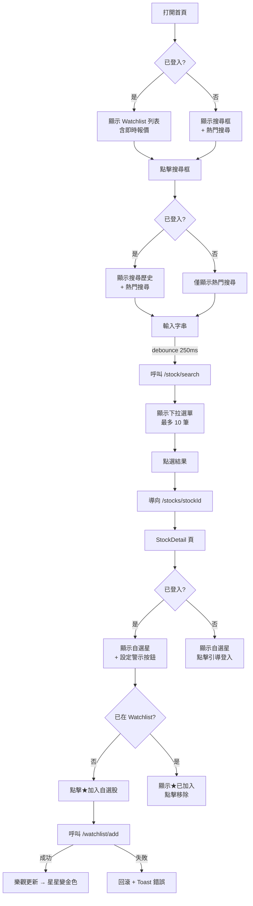
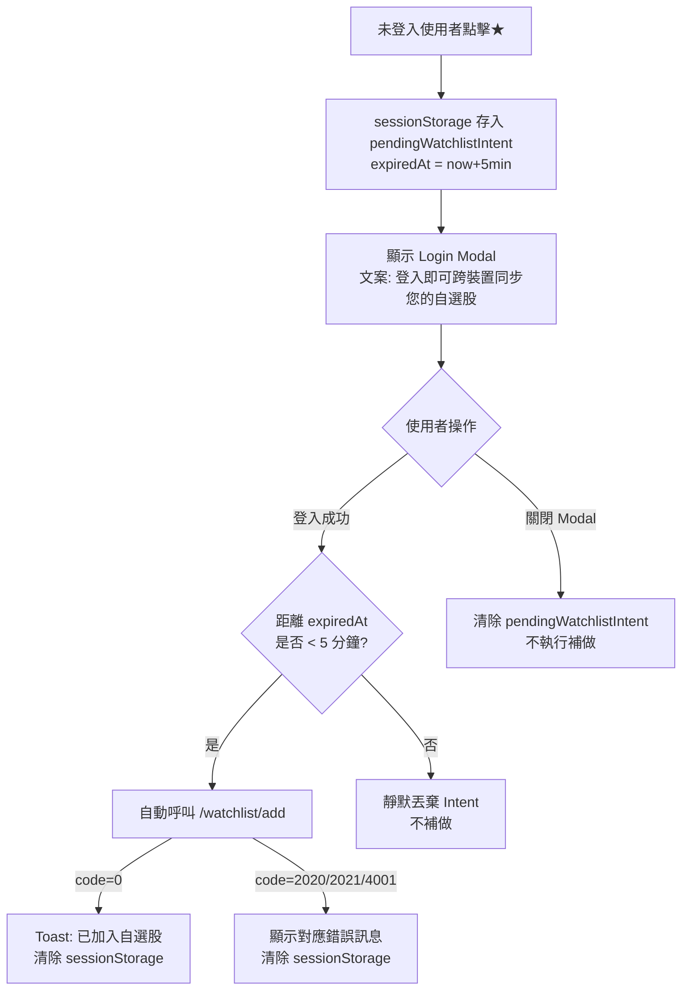
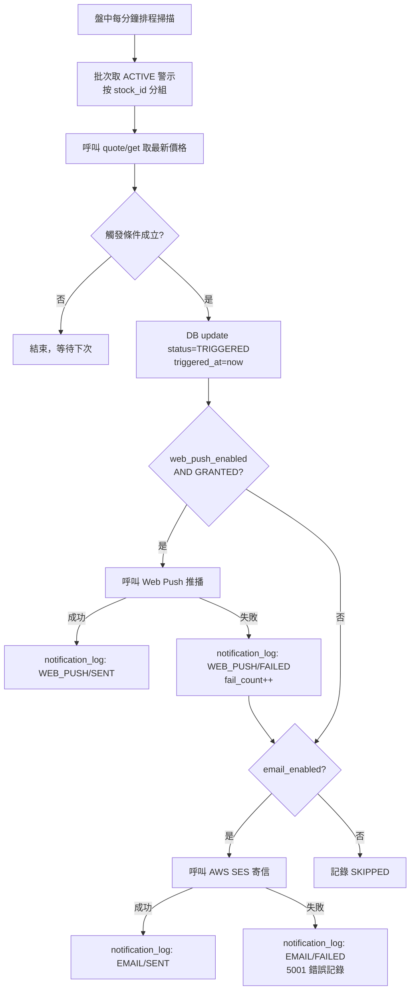

# Wave 3 UI 規格（頁面流程 + 互動行為）

| 項目 | 內容 |
|------|------|
| 文件版本 | v1.0 |
| 撰寫者 | Peter（PM） |
| 撰寫日期 | 2026-04-23 |
| 狀態 | 已定稿 |
| 對應 SRS | [20260423_wave3_SRS.md](20260423_wave3_SRS.md) |
| 對應 API Spec | [20260423_wave3_api-spec.md](20260423_wave3_api-spec.md) |
| 下游使用者 | Felix、Fiona、Quincy、Quinn |

> **範圍說明**：本文件定義頁面流程、欄位規格、互動行為與錯誤狀態。不含視覺設計（顏色、字體、間距）；UI 框架使用 Ant Design 5.x。

---

## 1. 路由結構

| 路由 | 頁面 | 認證要求 |
|------|------|---------|
| `/` | 首頁（Watchlist + 搜尋） | 無（未登入顯示空狀態引導） |
| `/stocks/:stockId` | 個股詳情（StockDetail） | 無（公開） |
| `/alerts` | 我的警示管理頁 | 必須登入 |
| `/settings` | 設定（含推播偏好） | 必須登入 |
| `/login` | 登入頁 | 無 |

---

## 2. 主要流程圖

### 2.1 完整使用流程



### 2.2 未登入加入自選股流程



### 2.3 警示觸發通知流程



---

## 3. F-W3-01 個股搜尋 UI 規格

### 3.1 SearchBar 元件

**位置**：首頁頂部、StockDetail 頁面頂部導覽列

**元件結構**：

```
┌─────────────────────────────────────────────────────┐
│ 🔍 [搜尋股票代號或名稱，例如：台積電、2330]          │
└─────────────────────────────────────────────────────┘
```

| 屬性 | 規格 |
|------|------|
| Input placeholder | `搜尋股票代號或名稱，例如：台積電、2330`（i18n key: `search.placeholder`） |
| 最大輸入字元 | 50 |
| Debounce | 250ms |
| 自動聚焦 | 首頁載入時不自動聚焦（避免行動裝置彈出鍵盤） |
| 清除按鈕 | 有輸入時顯示 × 清除鍵 |

### 3.2 搜尋下拉面板（SearchDropdown）

**觸發條件**：
- focus 且 input 為空：顯示「最近搜尋」（已登入）或「熱門搜尋」（未登入）
- focus 且 input 有內容：顯示搜尋結果

**空 input 面板結構**（已登入）：

```
┌──────────────────────────────────────┐
│ 最近搜尋                    清除全部 │
├──────────────────────────────────────┤
│ 2330  台積電  上市         [×]       │
│ 2317  鴻海    上市         [×]       │
│ ...（最多 10 筆）                    │
├──────────────────────────────────────┤
│ 熱門搜尋                             │
├──────────────────────────────────────┤
│ 1. 2330  台積電  上市                │
│ 2. 2317  鴻海    上市                │
│ ...（最多 10 筆）                    │
└──────────────────────────────────────┘
```

**空 input 面板結構**（未登入）：

```
┌──────────────────────────────────────┐
│ 熱門搜尋                             │
├──────────────────────────────────────┤
│ 1. 2330  台積電  上市                │
│ ...                                  │
└──────────────────────────────────────┘
```

**有輸入面板結構**：

```
┌──────────────────────────────────────┐
│ 2330  台積電  上市               [→] │
│ 2331  智慧    上市               [→] │
│ ...（最多 10 筆）                    │
└──────────────────────────────────────┘
```

**無結果面板**：

```
┌──────────────────────────────────────┐
│ 找不到符合的股票                     │
│                                      │
│ 熱門搜尋                             │
│ 1. 2330  台積電  上市                │
└──────────────────────────────────────┘
```

### 3.3 搜尋結果列項目規格

| 欄位 | 顯示內容 | 說明 |
|------|---------|------|
| 主要文字 | `{stockId} {stockName}` | 例：`2330 台積電` |
| 次要文字 | 市場別 | `上市` 或 `上櫃`（i18n） |
| Highlight | 匹配字串以粗體或底線標示 | 依 matchType 判斷哪部分要 highlight |
| 右側 | 右箭頭 → | 點擊後導向 StockDetail |

### 3.4 鍵盤操作

| 按鍵 | 行為 |
|------|------|
| ↑ ↓ | 在下拉選單中移動焦點 |
| Enter | 選取當前焦點項目，導向 StockDetail |
| Escape | 關閉下拉面板，清除 input 焦點 |
| Tab | 關閉下拉面板 |

### 3.5 互動狀態

| 狀態 | UI 行為 |
|------|---------|
| Loading（debounce 後等待 API 回應） | 下拉面板顯示 loading spinner |
| API 成功（有結果） | 渲染結果列表 |
| API 成功（無結果） | 顯示無結果文案 + 熱門搜尋 |
| API 失敗（9001） | 顯示「搜尋服務暫時無法使用，請稍後再試」Toast（不關閉面板） |
| 輸入超過 50 字元 | 截斷不觸發搜尋，顯示長度警告 |

---

## 4. F-W3-02 Watchlist 首頁 UI 規格

### 4.1 首頁結構（已登入 + 有自選股）

```
┌──────────────────────────────────────────────────────┐
│  [SearchBar]                           [登出] [設定]  │
├──────────────────────────────────────────────────────┤
│  我的自選股                         上次更新: 14:32   │
├──────────────────────────────────────────────────────┤
│  代號  名稱      現價      漲跌      漲跌幅  成交量  │
├──────────────────────────────────────────────────────┤
│  2330  台積電  1,050.00  ▲+19.00  +1.84%  28,450K  [🗑] │
│  2317  鴻海      168.00   ▼-2.00  -1.18%  45,230K  [🗑] │
│  ...（最多 50 列）                                    │
└──────────────────────────────────────────────────────┘
```

### 4.2 首頁空狀態（已登入 + 無自選股）

```
┌──────────────────────────────────────────────────────┐
│  [SearchBar]                                          │
├──────────────────────────────────────────────────────┤
│                                                      │
│         🌟                                           │
│      尚未加入任何自選股                               │
│   [使用搜尋加入第一檔自選股]（CTA 按鈕，點擊後聚焦搜尋框）│
│                                                      │
└──────────────────────────────────────────────────────┘
```

### 4.3 首頁（未登入）

```
┌──────────────────────────────────────────────────────┐
│  [SearchBar]                     [登入] [註冊]        │
├──────────────────────────────────────────────────────┤
│  熱門搜尋                                             │
│  1. 2330 台積電  2. 2317 鴻海  3. 2454 聯發科  ...   │
└──────────────────────────────────────────────────────┘
```

### 4.4 Watchlist 表格欄位規格

| 欄位 | 顯示格式 | 對齊 | 說明 |
|------|---------|------|------|
| 代號 | 純文字 | 左 | 點擊後導向 StockDetail |
| 名稱 | 純文字 | 左 | 點擊後導向 StockDetail |
| 現價 | `#,##0.00`，千分位格式 | 右 | BigDecimal string 格式化 |
| 漲跌 | `▲+XX.XX` / `▼-XX.XX` / `0.00` | 右 | 正值綠色、負值紅色、零值灰色 |
| 漲跌幅 | `+X.XX%` / `-X.XX%` | 右 | 正值綠色、負值紅色 |
| 成交量 | `X,XXXK`（千股）或 `X,XXXM`（百萬股） | 右 | 依量級自動換算 |
| 操作 | 垃圾桶圖示按鈕 | 中 | 點擊彈出確認 Modal |

**特殊狀態**：
- `isStale = true`：現價欄位顯示灰色文字 + 「延遲」tag
- `quoteError != null`：現價欄位顯示「-」，tooltip 顯示「行情資料暫時無法載入」
- 股票已下市（`is_active = false`）：名稱後顯示「已下市」紅色 tag

### 4.5 移除自選股互動

1. 點擊垃圾桶圖示
2. 彈出確認 Modal：
   ```
   移除 2330 台積電？
   移除後可重新搜尋加入。
   [取消] [確認移除]
   ```
3. 點擊「確認移除」：
   - 樂觀更新：立即從列表移除
   - 背景呼叫 `/api/v1/watchlist/remove`
   - 失敗（2023 / 9001）：回滾（重新加回列表）+ Toast 錯誤訊息
4. Modal 關閉邏輯：點擊取消 / Escape / 遮罩外側均關閉

---

## 5. F-W3-02 StockDetail 自選星按鈕規格

### 5.1 按鈕位置與狀態

**位置**：StockDetail 頁面 PriceHeader 元件右側

| 狀態 | 顯示 | 顏色 |
|------|------|------|
| 未加入 | `☆ 加入自選股` | 灰色邊框按鈕 |
| 已加入 | `★ 已加入自選股` | 金色實心星 + 主色背景 |
| Loading | 星星圖示 spinner | 灰色 |
| 未登入 | `☆ 加入自選股` | 同未加入樣式 |

### 5.2 互動行為

**已登入使用者**：

```
點擊★
  └─ 未加入狀態
       └─ 立即樂觀更新（UI 變為「★ 已加入」）
       └─ 呼叫 /watchlist/add
            ├─ 成功：維持 UI 狀態
            └─ 失敗：回滾 UI + Toast 錯誤

  └─ 已加入狀態
       └─ 彈出確認 Modal（移除自選股）
       └─ 確認後呼叫 /watchlist/remove
            ├─ 成功：UI 變回「☆ 加入自選股」
            └─ 失敗：不回滾（保持已加入）+ Toast 錯誤
```

**未登入使用者**：

```
點擊☆
  └─ sessionStorage 存入 pendingWatchlistIntent
       { stockId, stockName, expiredAt: now+5min }
  └─ 開啟 Login Modal
       文案：「登入即可跨裝置同步您的自選股」
       [登入] [稍後再說]
  └─ 登入成功後自動補做（見 §2.2 流程）
```

---

## 6. F-W3-03 價格警示 UI 規格

### 6.1 設定警示入口

**位置**：StockDetail 頁面，自選星按鈕右側

| 狀態 | 顯示 |
|------|------|
| 未設定 | `🔔 設定警示` 按鈕 |
| 已有警示 | `🔔 已設定 N 條警示` 按鈕（點擊後導向 /alerts 頁，並預先篩選此股票） |

**未登入**：點擊後引導登入（同自選星邏輯，不需暫存意圖，登入後導向 /alerts 頁面）。

### 6.2 新增警示 Modal

**觸發**：點擊「設定警示」按鈕（已登入使用者）

**Modal 標題**：`設定 {stockName} 價格警示`

**表單欄位**：

| 欄位 | 元件 | 驗證 | 說明 |
|------|------|------|------|
| 警示類型 | Radio Group | 必選 | 選項：①向上突破 ②向下突破 ③漲跌幅超過 |
| 目標價格 / 漲跌幅 | Input（數字） | 必填、> 0 | 選「漲跌幅」時 label 改為「幅度（%）」 |
| 方向（條件式） | Radio Group | 僅「漲跌幅」類型顯示 | 選項：上漲、下跌、任一方向 |
| 距當前價位提示 | 純文字（只讀） | - | 即時計算：`此價位距當前 {N}%`（不阻擋提交） |

**按鈕**：
- `[取消]`：關閉 Modal，不儲存
- `[確認設定]`：呼叫 `/api/v1/alert/create`；Loading 狀態禁用按鈕

**首次設定警示時 Web Push 授權流程**：

```
確認設定 → 後端建立成功
  └─ 檢查 Notification.permission
       ├─ "default"（未詢問）：彈出瀏覽器推播授權請求
       │    ├─ 允許：呼叫 /push/subscribe，更新 webPushStatus = GRANTED
       │    └─ 拒絕：呼叫 notification-preference 更新 webPushStatus = DENIED
       │          顯示提示：「已改用 Email 接收通知」
       ├─ "granted"（已允許）：確認 /push/subscribe 訂閱有效，跳過
       └─ "denied"（已拒絕）：直接顯示「將以 Email 接收通知」提示
```

**iOS Safari < 16.4 判斷**：
- 前端偵測 `typeof Notification === 'undefined'` 或不支援 Service Worker
- 自動設定 webPushStatus = UNAVAILABLE
- 顯示提示：「您的瀏覽器不支援 Web Push，將以 Email 接收通知」

### 6.3 我的警示頁（/alerts）

**路由**：`/alerts`（需登入，未登入導向 /login 後帶 returnUrl=/alerts）

**頁面結構**：

```
┌──────────────────────────────────────────────────────┐
│  我的價格警示                     [+ 新增警示]        │
├──────────────────────────────────────────────────────┤
│  篩選：[全部 ▾]  [股票代號 ▾]                        │
├──────────────────────────────────────────────────────┤
│  2330 台積電                                         │
│  ↓ 跌破 580.00 元          [啟用中] [暫停] [刪除]    │
│  ▲ 漲幅超過 5%             [已觸發] [重啟] [刪除]    │
├──────────────────────────────────────────────────────┤
│  2317 鴻海                                           │
│  ↑ 突破 170.00 元          [已暫停] [啟用] [刪除]    │
└──────────────────────────────────────────────────────┘
```

**每筆警示的狀態 Badge**：

| status | Badge 文字 | 顏色 |
|--------|-----------|------|
| ACTIVE | 啟用中 | 綠色 |
| PAUSED | 已暫停 | 灰色 |
| TRIGGERED | 已觸發 | 橙色 |

**每筆警示的操作按鈕**：

| 當前狀態 | 可用操作 | API |
|---------|---------|-----|
| ACTIVE | 暫停、刪除 | update-status(PAUSED)、delete |
| PAUSED | 啟用、刪除 | update-status(ACTIVE)、delete |
| TRIGGERED | 重啟、刪除 | update-status(ACTIVE)、delete |

**空狀態**：

```
🔔 尚未設定任何警示
[前往個股頁設定第一條警示]（連結回首頁搜尋）
```

---

## 7. F-W3-04 Spring Security 前端規格

### 7.1 axios interceptor 規格

**Request Interceptor**：
- 每次請求自動在 header 加入 `Authorization: Bearer {accessToken}`
- 若本地無 access token，不加 header（公開端點不受影響）

**Response Interceptor（code 判斷）**：

```
收到 response
  └─ 解析 response.data
       ├─ code = 0：正常處理（回傳 data 欄位）
       ├─ code = 3001（未登入）：
       │    清空 accessToken + refreshToken
       │    存 returnUrl = window.location.pathname
       │    導向 /login
       ├─ code = 3002（token 過期）：
       │    觸發 token refresh 流程（見下）
       ├─ code = 3003（token 無效 / 撤銷）：
       │    清空所有 token
       │    埋點事件 tampered_token
       │    導向 /login
       └─ 其他 code：交由各業務元件處理
```

**Token Refresh 流程**：

```
偵測到 code = 3002
  └─ 若已有 refresh token：
       └─ 呼叫 POST /api/v1/auth/refresh
            ├─ 成功：
            │    儲存新 accessToken + refreshToken
            │    重試原始請求（帶新 token）
            │    使用者無感知
            └─ 失敗（3002 / 3003）：
                 清空所有 token
                 導向 /login
  └─ 若無 refresh token：
       清空 token，導向 /login
```

> **Concurrent refresh 防護**：若同時多個請求都收到 3002，只發出一次 refresh 請求，其他請求等待 refresh 完成後一起重試（使用 Promise queue）。

### 7.2 Login Modal 規格

**觸發來源**：
1. 未登入使用者點擊「★ 加入自選股」
2. 訪問需認證的路由（/alerts、/settings）

**Modal 欄位**：

| 欄位 | 元件 | 驗證 |
|------|------|------|
| Email | Input | 必填、Email 格式 |
| 密碼 | Input.Password | 必填 |
| 登入按鈕 | Button | 表單未通過時 disabled |
| 前往註冊 | Link | 點擊後導向 /register |

**Loading 狀態**：點擊登入後顯示 spinner，表單 disabled。

**錯誤狀態**：
- code 2011（帳密錯誤）：顯示「Email 或密碼錯誤」（不明確指出哪個錯）
- code 2012（未驗證）：顯示「Email 尚未驗證，請先驗證信箱」+ 重發驗證信連結
- code 9001：顯示「系統繁忙，請稍後再試」

---

## 8. F-W3-05 搜尋歷史 UI 規格

### 8.1 展示條件

| 條件 | 行為 |
|------|------|
| 未登入 + focus 搜尋框 | 不顯示搜尋歷史，只顯示熱門搜尋 |
| 已登入 + focus 搜尋框 + input 為空 + 有歷史 | 顯示「最近搜尋」區塊 + 熱門搜尋 |
| 已登入 + focus 搜尋框 + input 為空 + 無歷史 | 跳過「最近搜尋」，只顯示熱門搜尋 |
| focus 後 input 有字元 | 顯示搜尋結果，隱藏歷史 / 熱門 |

### 8.2 搜尋歷史區塊欄位

| 元素 | 說明 |
|------|------|
| 區塊標題 | `最近搜尋`（i18n key: `search.recentTitle`） |
| 右上 CTA | `清除全部`（i18n key: `search.clearAll`），點擊呼叫 `/search/history/clear` |
| 每筆項目 | `{stockId} {stockName}` + 市場別 badge + 右側 × 按鈕 |
| × 按鈕 | 點擊呼叫 `/search/history/remove`（stockId），即時移除該筆 |
| 點擊項目 | 導向 `/stocks/{stockId}`（不觸發新的 history 寫入，避免重複） |

### 8.3 搜尋歷史寫入觸發點

搜尋歷史在以下時機寫入（後端統一觸發）：
- 使用者**點擊**搜尋結果列表中的某一筆
- 使用者點擊搜尋歷史列表中的某一筆（不再次寫入，update searched_at 即可）

不觸發寫入的情境：
- debounce 期間的中間字串搜尋（只是打字過程）
- 直接在網址列輸入 `/stocks/:stockId`

---

## 9. 推播偏好設定（Settings 頁）UI 規格

**路由**：`/settings`（需登入）

**推播偏好區塊**：

```
┌──────────────────────────────────────────────────────┐
│ 通知設定                                              │
├──────────────────────────────────────────────────────┤
│ Web Push 通知   [開] ────────────────────────────────│
│   ✓ 已授權推播                                        │
│   （若為 DENIED）⚠ 您的瀏覽器未授權 Web Push，已改用 Email│
│   （若為 UNAVAILABLE）ℹ 您的瀏覽器不支援 Web Push，已改用 Email│
├──────────────────────────────────────────────────────┤
│ Email 通知      [開] ────────────────────────────────│
│   通知將寄送至 {user.email}                           │
└──────────────────────────────────────────────────────┘
```

**Toggle 行為**：
- 點擊 Toggle：呼叫 `/user/notification-preference`（action = update，更新對應欄位）
- Loading 狀態：Toggle 禁用，顯示 spinner

**Web Push 狀態訊息**：

| webPushStatus | 顯示訊息 |
|--------------|---------|
| UNKNOWN | `點擊以設定推播通知`（點擊後重新詢問瀏覽器授權） |
| GRANTED | `✓ 已授權推播` |
| DENIED | `⚠ 您的瀏覽器未授權 Web Push，已改用 Email` |
| UNAVAILABLE | `ℹ 您的瀏覽器不支援 Web Push，已改用 Email` |

---

## 10. 警示推播 Email 模板規格

**寄件者**：`noreply@stock-platform.example.com`（需 AWS SES 驗證）

**主旨格式**：
- PRICE_ABOVE：`⚠ {stockName} 突破 {threshold} 元`
- PRICE_BELOW：`⚠ {stockName} 跌破 {threshold} 元`
- CHANGE_PERCENT / UP：`⚠ {stockName} 漲幅達 {threshold}%`
- CHANGE_PERCENT / DOWN：`⚠ {stockName} 跌幅達 {threshold}%`
- CHANGE_PERCENT / BOTH：`⚠ {stockName} 漲跌幅達 {threshold}%`

**Email 內文必含欄位**：

| 欄位 | 說明 |
|------|------|
| 股票名稱 + 代號 | `台積電（2330）` |
| 觸發類型描述 | `向下突破 580.00 元` |
| 當前價格 | `當前價格：578.50 元` |
| 觸發時間 | `2026-04-23 11:32:15 (GMT+8)` |
| 深層連結按鈕 | `[立即查看]`（連結至 `{baseUrl}/stocks/{stockId}`） |
| 取消訂閱連結 | `[管理通知設定]`（連結至 `{baseUrl}/settings`） |
| 語言 | 依使用者偏好（i18n，Wave 3 預設繁體中文） |

---

## 11. Web Push 通知內容規格

| 欄位 | 內容 |
|------|------|
| title | `⚠ {stockName} 價格警示` |
| body | `{觸發類型描述}，當前 {price} 元（{changePercent}）` |
| icon | 平台 favicon（PWA manifest icon） |
| badge | 小圖示（瀏覽器通知 badge） |
| data.url | `{baseUrl}/stocks/{stockId}`（點擊推播後的深層連結） |
| tag | `alert-{alertId}`（同 alertId 的推播會覆蓋，避免多條重複） |

**點擊行為**：`clients.openWindow(event.notification.data.url)`（Service Worker 處理）

---

## 12. 通用 Loading 與錯誤狀態規範

### 12.1 Loading 狀態

| 情境 | 元件行為 |
|------|---------|
| Watchlist 首頁載入 | 顯示 Skeleton（5 行佔位符），不顯示真實資料框架 |
| 搜尋 API 等待 | 下拉面板顯示 Spin（spinner） |
| Watchlist 加入 / 移除 | 按鈕顯示 loading spinner，禁用點擊 |
| 警示設定送出 | Modal 確認按鈕 loading，禁用表單 |
| Token refresh | 背景靜默（使用者無感知） |

### 12.2 錯誤 Toast 規範

所有非預期錯誤（9001）使用 Ant Design `message.error`：

| 情境 | 顯示文案 | 持續時間 |
|------|---------|---------|
| Watchlist 加入失敗 | `加入自選股失敗，請稍後再試` | 3 秒 |
| Watchlist 移除失敗 | `移除失敗，請稍後再試` | 3 秒 |
| 警示建立失敗 | `設定警示失敗，請稍後再試` | 3 秒 |
| 搜尋 API 失敗 | `搜尋服務暫時無法使用` | 3 秒 |
| 系統繁忙（9001） | `系統繁忙，請稍後再試` | 3 秒 |

成功訊息使用 `message.success`：

| 情境 | 文案 | 持續時間 |
|------|------|---------|
| Watchlist 加入成功 | `已加入自選股` | 2 秒 |
| 登入後自動補做加入 | `已加入自選股（台積電）` | 2 秒 |
| Watchlist 移除成功 | `已移除自選股` | 2 秒 |
| 警示建立成功 | `警示設定完成` | 2 秒 |
| 搜尋歷史清除 | `已清除搜尋記錄` | 2 秒 |

---

## 13. 多語系（i18n）新增 Key 清單

Wave 3 新增以下 i18n key（需同步更新 `en.json` / `zh-TW.json`）：

| i18n Key | zh-TW 文案 | en 文案 |
|---------|-----------|--------|
| `search.placeholder` | 搜尋股票代號或名稱，例如：台積電、2330 | Search by stock ID or name, e.g. TSMC, 2330 |
| `search.noResult` | 找不到符合的股票 | No matching stocks found |
| `search.recentTitle` | 最近搜尋 | Recent Searches |
| `search.clearAll` | 清除全部 | Clear All |
| `search.hotTitle` | 熱門搜尋 | Trending |
| `watchlist.addSuccess` | 已加入自選股 | Added to Watchlist |
| `watchlist.addAutoSuccess` | 已加入自選股（{stockName}） | Added {stockName} to Watchlist |
| `watchlist.addFailed` | 加入自選股失敗，請稍後再試 | Failed to add, please try again |
| `watchlist.removeConfirmTitle` | 移除 {stockName}？ | Remove {stockName}? |
| `watchlist.removeConfirmContent` | 移除後可重新搜尋加入。 | You can add it back by searching. |
| `watchlist.removeSuccess` | 已移除自選股 | Removed from Watchlist |
| `watchlist.limitReached` | 已達自選股上限，請先移除其他股票 | Watchlist limit (50) reached |
| `watchlist.alreadyExists` | 該股票已在自選股清單 | Stock already in watchlist |
| `watchlist.emptyHint` | 尚未加入任何自選股 | No stocks in your watchlist |
| `watchlist.emptyAction` | 使用搜尋加入第一檔自選股 | Search to add your first stock |
| `watchlist.loginPrompt` | 登入即可跨裝置同步您的自選股 | Sign in to sync your watchlist across devices |
| `alert.createSuccess` | 警示設定完成 | Alert created |
| `alert.createFailed` | 設定警示失敗，請稍後再試 | Failed to create alert |
| `alert.limitReached` | 已達每股警示上限 5 條 | Alert limit (5 per stock) reached |
| `alert.duplicate` | 已存在相同提醒條件 | Duplicate alert condition |
| `alert.webPushGranted` | 已授權推播 | Push notifications enabled |
| `alert.webPushDenied` | 您的瀏覽器未授權 Web Push，已改用 Email | Browser push denied, using Email instead |
| `alert.webPushUnavailable` | 您的瀏覽器不支援 Web Push，已改用 Email | Web Push not supported, using Email instead |
| `alert.emptyHint` | 尚未設定任何警示 | No alerts set |
| `market.TWSE` | 上市 | Listed |
| `market.OTC` | 上櫃 | OTC |

---

## 14. 無障礙（a11y）規範

| 元件 | 規範 |
|------|------|
| SearchBar | `aria-label="股票搜尋"` + 下拉面板 `role="listbox"` |
| 搜尋結果項目 | `role="option"`、`aria-selected` |
| Watchlist 表格 | `<table>` + `<th>` + 適當 `scope` 屬性 |
| 自選星按鈕 | `aria-label="加入自選股" / "已加入自選股"` |
| 確認 Modal | `role="dialog"`、`aria-labelledby`、focus trap |
| Toast 通知 | `role="alert"` + `aria-live="polite"` |
| Loading Skeleton | `aria-busy="true"` |
| 垃圾桶按鈕 | `aria-label="移除 {stockName} 自選股"` |

---

## 15. 響應式設計斷點

| 斷點 | px 範圍 | 行為 |
|------|---------|------|
| Mobile | < 768px | Watchlist 表格隱藏「成交量」欄；搜尋下拉面板全寬 |
| Tablet | 768-1024px | 完整表格；搜尋框適度縮短 |
| Desktop | > 1024px | 完整功能 |

> 更細節的 RWD 設計由 Felix 依 Ant Design Grid 系統實作，本文件僅定義最低需求。
