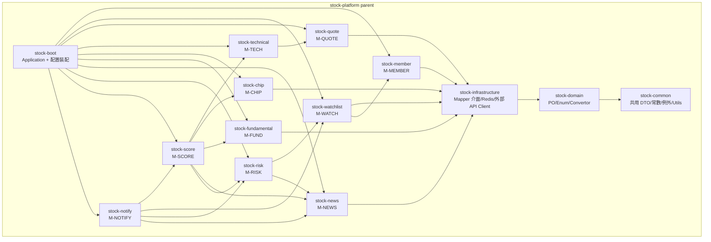
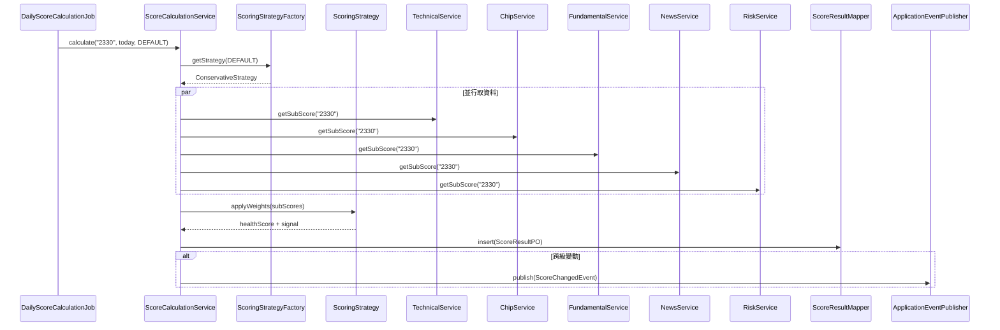

# 專案架構：台股股票分析與追蹤平台 — 後端

- **文件版本**：v1.0
- **架構師**：Preston（Senior Project Architect）
- **日期**：2026-04-21
- **對應 PRD**：[20260421_PRD_stock-analysis-mvp.md](../../02_product/20260421_PRD_stock-analysis-mvp.md)
- **對應 SRS**：[20260421_SRS_stock-analysis-mvp.md](../../03_spec/20260421_SRS_stock-analysis-mvp.md)
- **拍板依據**：
  - [D1：合規定位（純資訊呈現）](../../01_leader/decisions/20260421_decision-prd-top3.md)
  - [D2：AWS + 地端混合](../../01_leader/decisions/20260421_decision-prd-top3.md)
  - [D3：30 項 P0 全做、Q4 2026 上線、模組化並行](../../01_leader/decisions/20260421_decision-prd-top3.md)
  - [D4：健康度 4 種 preset、歷史 3 年回顧、FCM/APNs/Telegram 推播、Redis 允許](../../01_leader/decisions/20260421_decision-srs-extension.md)
- **DB 拍板**：PostgreSQL 16 on Docker（不採 Oracle）
- **下游交接**：Sophia（系統架構）、Bruno（API）、Felix（前端 Coder）、Linus（Library）、Quincy/Quinn（QA）

---

## 0. 文件導覽

本文件聚焦**單一後端服務**內部結構（模組劃分、套件樹、設計模式、ER、Configuration、AOP）。
**跨系統議題**（AWS ↔ 地端同步、Kafka topic、CDN、推播 Gateway 部署位置）由 Sophia 的系統架構文件接手，本文件只交代「應用層該如何組裝才能順利對接」。

---

## 1. 模組劃分

### 1.1 設計目標

呼應 D3「**支援 3 個 Squad 並行開發**」拍板：

1. 一個 Maven multi-module 專案，**12 個 module**（含 parent + boot）。
2. **業務模組獨立成 module**（M-MEMBER ~ M-NOTIFY 共 10 個 SRS 模組 → 對應 10 個 Maven module）。
3. **基礎設施抽離**為 `stock-common`、`stock-domain`、`stock-infrastructure`，避免業務模組相互直接依賴。
4. **Boot 模組**（`stock-boot`）為唯一 `@SpringBootApplication`，組裝所有業務模組成單一可部署 JAR（v1 採 Modular Monolith；v2 視流量再依模組拆微服務）。

> **為什麼是 Modular Monolith？** v1 系統承載量推估（300 RPS、1000 DB QPS）遠未達微服務必要規模；採 Modular Monolith 可讓 3 個 Squad 在「同 Repo 不同 module」並行開發，build 階段以 ArchUnit 強制依賴方向，未來拆微服務時 module 邊界即微服務邊界，**遷移成本最低**。

### 1.2 模組總覽（Mermaid）



### 1.3 模組職責對照表

| Maven Module | 對應 SRS 模組 | 職責 | 可依賴 |
|--------------|--------------|------|--------|
| `stock-common` | - | `ApiResponse`、`BusinessException`、`ErrorCode` 常數、`DateUtils`、`UuidUtils`、`BigDecimalUtils`、合規文案禁用詞 lint | 僅 JDK / 第三方 |
| `stock-domain` | - | 11 張表 PO、Enum（5 級訊號燈、會員狀態...）、`Convertor`（PO ↔ DTO 由各業務模組宣告 interface，本模組僅提供 base） | `stock-common` |
| `stock-infrastructure` | - | MyBatis Mapper interface 統一存放、Redis Template 包裝、外部資料源 Client（TWSEClient、MOPSClient）、推播 Gateway Adapter（FCM/APNs/Telegram） | `stock-domain` |
| `stock-member` | M-MEMBER | 註冊、登入、JWT 簽發、Email 驗證、帳號註銷 | `stock-infrastructure` |
| `stock-watchlist` | M-WATCH | 自選股 CRUD、分組、批次操作、股票搜尋 | `stock-member`、`stock-infrastructure` |
| `stock-quote` | M-QUOTE | 即時報價（公開延遲 20 分鐘）、歷史 K 線（日/週/月） | `stock-infrastructure` |
| `stock-technical` | M-TECH | MA/KD/MACD 計算、技術型態觀察、指標快照排程 | `stock-quote` |
| `stock-chip` | M-CHIP | 三大法人、融資融券、籌碼動向觀察 | `stock-infrastructure` |
| `stock-fundamental` | M-FUND | PE/PEG/PB/殖利率、EPS、月營收、產業平均 | `stock-infrastructure` |
| `stock-news` | M-NEWS | MOPS 重大訊息、行事曆、消息抓取排程 | `stock-infrastructure` |
| `stock-risk` | M-RISK | 警示股掃描、停損停利條件、觸發判定 | `stock-watchlist`、`stock-news` |
| `stock-score` | M-SCORE | 健康度引擎（Strategy）、4 種 preset、歷史評分查詢、評分變化偵測 | `stock-technical`、`stock-chip`、`stock-fundamental`、`stock-news`、`stock-risk` |
| `stock-notify` | M-NOTIFY | 條件提醒 CRUD、3 通道推播（FCM/APNs/Telegram）、早盤摘要排程、去重機制 | `stock-score`、`stock-watchlist`、`stock-risk`、`stock-news` |
| `stock-boot` | - | `StockPlatformApplication.java`、`application*.yml`、Bean 裝配、Profile 切換 | 全部 |

### 1.4 模組依賴規則（強制）

1. **下層只能被上層依賴**（`common → domain → infrastructure → 業務模組 → boot`）。
2. **業務模組之間**：除 `M-WATCH → M-MEMBER`、`M-RISK → M-WATCH`、`M-SCORE → 5 個資料模組`、`M-NOTIFY → M-SCORE/M-WATCH/M-RISK/M-NEWS` 等**SRS 第 8.2 節宣告的依賴**外，禁止其他橫向依賴。
3. **違反即 build 失敗**：`stock-boot` 內以 ArchUnit 撰寫測試（見第 11 章）。
4. **跨模組溝通**：偏好 Spring `ApplicationEvent`（M-NOTIFY 接收評分變化、停損停利觸發），降低編譯期耦合。

### 1.5 並行 Squad 對應（呼應 SRS 第 12.2 節）

| Squad | 負責 Maven Module | 整合點 |
|-------|------------------|--------|
| Squad A（會員與互動） | `stock-member`、`stock-watchlist`、`stock-notify` | M1 / M4 |
| Squad B（資料層） | `stock-quote`、`stock-chip`、`stock-fundamental`、`stock-news` | M1 / M2 |
| Squad C（指標與評分） | `stock-technical`、`stock-risk`、`stock-score` | M2 / M3 |
| 共享 | `stock-common`、`stock-domain`、`stock-infrastructure`、`stock-boot` | 由 Preston + Linus 把關 |

> **Preston 風險提示**：Squad 共享 `stock-domain` 是衝突熱區。建議 PO/Enum 變更**強制 PR review by Preston**，避免合併衝突。

---

## 2. Maven 結構

### 2.1 目錄結構

```
stock-platform/
├── pom.xml                              # parent POM，dependencyManagement 集中
├── .mvn/                                # Maven Wrapper
├── docker/
│   ├── docker-compose.local.yml         # local：postgres + redis + app
│   └── postgres/init.sql
├── stock-common/
│   └── pom.xml
├── stock-domain/
│   └── pom.xml
├── stock-infrastructure/
│   └── pom.xml
├── stock-member/
│   └── pom.xml
├── stock-watchlist/
│   └── pom.xml
├── stock-quote/
│   └── pom.xml
├── stock-technical/
│   └── pom.xml
├── stock-chip/
│   └── pom.xml
├── stock-fundamental/
│   └── pom.xml
├── stock-news/
│   └── pom.xml
├── stock-risk/
│   └── pom.xml
├── stock-score/
│   └── pom.xml
├── stock-notify/
│   └── pom.xml
└── stock-boot/
    ├── pom.xml
    └── src/main/resources/
        ├── application.yml
        ├── application-local.yml
        ├── application-dev.yml
        ├── application-uat.yml
        └── application-prod.yml
```

### 2.2 Parent POM 大綱

```xml
<project>
    <modelVersion>4.0.0</modelVersion>

    <groupId>tw.com.stockplatform</groupId>
    <artifactId>stock-platform</artifactId>
    <version>1.0.0-SNAPSHOT</version>
    <packaging>pom</packaging>

    <parent>
        <groupId>org.springframework.boot</groupId>
        <artifactId>spring-boot-starter-parent</artifactId>
        <version>3.3.4</version>
        <relativePath/>
    </parent>

    <properties>
        <java.version>21</java.version>
        <maven.compiler.source>21</maven.compiler.source>
        <maven.compiler.target>21</maven.compiler.target>
        <project.build.sourceEncoding>UTF-8</project.build.sourceEncoding>

        <mybatis-spring-boot.version>3.0.3</mybatis-spring-boot.version>
        <postgresql.version>42.7.4</postgresql.version>
        <jjwt.version>0.12.6</jjwt.version>
        <mapstruct.version>1.6.2</mapstruct.version>
        <lombok.version>1.18.34</lombok.version>
        <archunit.version>1.3.0</archunit.version>
        <testcontainers.version>1.20.2</testcontainers.version>
        <springdoc.version>2.6.0</springdoc.version>
        <firebase-admin.version>9.4.1</firebase-admin.version>      <!-- FCM -->
        <pushy.version>0.15.4</pushy.version>                       <!-- APNs -->
        <telegram-bots.version>7.9.1</telegram-bots.version>
    </properties>

    <modules>
        <module>stock-common</module>
        <module>stock-domain</module>
        <module>stock-infrastructure</module>
        <module>stock-member</module>
        <module>stock-watchlist</module>
        <module>stock-quote</module>
        <module>stock-technical</module>
        <module>stock-chip</module>
        <module>stock-fundamental</module>
        <module>stock-news</module>
        <module>stock-risk</module>
        <module>stock-score</module>
        <module>stock-notify</module>
        <module>stock-boot</module>
    </modules>

    <dependencyManagement>
        <!-- 集中管理所有版本，子模組僅宣告 groupId/artifactId -->
    </dependencyManagement>
</project>
```

### 2.3 各業務 module 的 POM 範例（以 `stock-score` 為例）

```xml
<project>
    <parent>
        <groupId>tw.com.stockplatform</groupId>
        <artifactId>stock-platform</artifactId>
        <version>1.0.0-SNAPSHOT</version>
    </parent>
    <artifactId>stock-score</artifactId>

    <dependencies>
        <dependency>
            <groupId>tw.com.stockplatform</groupId>
            <artifactId>stock-technical</artifactId>
        </dependency>
        <dependency>
            <groupId>tw.com.stockplatform</groupId>
            <artifactId>stock-chip</artifactId>
        </dependency>
        <dependency>
            <groupId>tw.com.stockplatform</groupId>
            <artifactId>stock-fundamental</artifactId>
        </dependency>
        <dependency>
            <groupId>tw.com.stockplatform</groupId>
            <artifactId>stock-news</artifactId>
        </dependency>
        <dependency>
            <groupId>tw.com.stockplatform</groupId>
            <artifactId>stock-risk</artifactId>
        </dependency>
        <dependency>
            <groupId>org.springframework.boot</groupId>
            <artifactId>spring-boot-starter-data-redis</artifactId>
        </dependency>
        <dependency>
            <groupId>org.springframework.boot</groupId>
            <artifactId>spring-boot-starter-test</artifactId>
            <scope>test</scope>
        </dependency>
        <dependency>
            <groupId>org.testcontainers</groupId>
            <artifactId>postgresql</artifactId>
            <scope>test</scope>
        </dependency>
    </dependencies>
</project>
```

### 2.4 Boot Module POM 大綱

```xml
<project>
    <parent>
        <groupId>tw.com.stockplatform</groupId>
        <artifactId>stock-platform</artifactId>
        <version>1.0.0-SNAPSHOT</version>
    </parent>
    <artifactId>stock-boot</artifactId>

    <dependencies>
        <!-- 全部 10 個業務 module -->
        <dependency><groupId>tw.com.stockplatform</groupId><artifactId>stock-member</artifactId></dependency>
        <dependency><groupId>tw.com.stockplatform</groupId><artifactId>stock-watchlist</artifactId></dependency>
        <dependency><groupId>tw.com.stockplatform</groupId><artifactId>stock-quote</artifactId></dependency>
        <dependency><groupId>tw.com.stockplatform</groupId><artifactId>stock-technical</artifactId></dependency>
        <dependency><groupId>tw.com.stockplatform</groupId><artifactId>stock-chip</artifactId></dependency>
        <dependency><groupId>tw.com.stockplatform</groupId><artifactId>stock-fundamental</artifactId></dependency>
        <dependency><groupId>tw.com.stockplatform</groupId><artifactId>stock-news</artifactId></dependency>
        <dependency><groupId>tw.com.stockplatform</groupId><artifactId>stock-risk</artifactId></dependency>
        <dependency><groupId>tw.com.stockplatform</groupId><artifactId>stock-score</artifactId></dependency>
        <dependency><groupId>tw.com.stockplatform</groupId><artifactId>stock-notify</artifactId></dependency>

        <dependency>
            <groupId>org.springframework.boot</groupId>
            <artifactId>spring-boot-starter-web</artifactId>
        </dependency>
        <dependency>
            <groupId>org.springframework.boot</groupId>
            <artifactId>spring-boot-starter-actuator</artifactId>
        </dependency>
        <dependency>
            <groupId>com.tngtech.archunit</groupId>
            <artifactId>archunit-junit5</artifactId>
            <scope>test</scope>
        </dependency>
    </dependencies>

    <build>
        <plugins>
            <plugin>
                <groupId>org.springframework.boot</groupId>
                <artifactId>spring-boot-maven-plugin</artifactId>
            </plugin>
        </plugins>
    </build>
</project>
```

### 2.5 關鍵第三方版本一覽

| 元件 | 版本 | 用途 |
|------|------|------|
| Java | 21 LTS | 語言 |
| Spring Boot | 3.3.4 | 框架 |
| MyBatis-Spring-Boot | 3.0.3（MyBatis 3.5+） | ORM |
| PostgreSQL JDBC | 42.7.4 | DB driver |
| Spring Data Redis | 由 Boot 帶入 | Redis |
| JJWT | 0.12.6 | JWT |
| MapStruct | 1.6.2 | DTO ↔ PO 轉換 |
| Lombok | 1.18.34 | 樣板碼削減 |
| ArchUnit | 1.3.0 | 架構驗證 |
| Testcontainers | 1.20.2 | 整合測試（Postgres、Redis） |
| Springdoc OpenAPI | 2.6.0 | Swagger UI |
| Firebase Admin SDK | 9.4.1 | FCM 推播 |
| Pushy | 0.15.4 | APNs 推播 |
| TelegramBots | 7.9.1 | Telegram Bot |

---

## 3. Spring 套件結構

### 3.1 共通套件樹（每個業務 module 套用）

以 `stock-score` 為例，**所有業務模組皆遵循同一套樹狀**：

```
tw.com.stockplatform.score/
├── controller/
│   └── ScoreController.java                       # @RestController, /api/v1/score/**
├── service/
│   ├── ScoreService.java                          # interface
│   ├── ScoreCalculationService.java
│   ├── ScorePresetService.java
│   └── impl/
│       ├── ScoreServiceImpl.java
│       ├── ScoreCalculationServiceImpl.java
│       └── ScorePresetServiceImpl.java
├── repository/
│   ├── ScoreResultMapper.java                     # MyBatis @Mapper
│   ├── UserPreferenceMapper.java
│   └── xml/
│       ├── ScoreResultMapper.xml
│       └── UserPreferenceMapper.xml
├── strategy/                                       # 設計模式：Strategy（4 種 preset）
│   ├── ScoringStrategy.java                       # interface
│   ├── ConservativeStrategy.java
│   ├── AggressiveStrategy.java
│   ├── TechnicalStrategy.java
│   └── ValueStrategy.java
├── factory/
│   └── ScoringStrategyFactory.java                # 設計模式：Factory
├── dto/
│   ├── request/
│   │   ├── HealthScoreGetRequest.java
│   │   ├── HealthScoreBatchRequest.java
│   │   └── UpdateUserWeightsRequest.java
│   └── response/
│       ├── HealthScoreResponse.java
│       ├── ScoreDetailResponse.java
│       └── ScoreHistoryResponse.java
├── convertor/
│   └── ScoreConvertor.java                        # MapStruct
├── enums/
│   ├── SignalLevel.java                           # STRONG_POSITIVE...STRONG_NEGATIVE
│   └── ScorePresetType.java                       # CONSERVATIVE / AGGRESSIVE / TECHNICAL / VALUE
├── constant/
│   ├── ScoreErrorCode.java                        # 8xxx 屬於 M-SCORE 區段（如有需要再分配）
│   └── ScoreCacheKey.java                         # Redis key 命名集中
├── event/
│   ├── ScoreChangedEvent.java                     # 跨級變動 → M-NOTIFY
│   └── listener/
│       └── (M-NOTIFY 端訂閱)
├── scheduler/
│   └── DailyScoreCalculationJob.java              # 19:00 排程
└── exception/
    └── ScoreCalculationException.java             # 自定例外（繼承 BusinessException）
```

### 3.2 各業務模組的特殊套件

| 模組 | 額外套件 | 用途 |
|------|---------|------|
| `stock-member` | `security/` | JwtTokenProvider、JwtAuthenticationFilter、UserPrincipal、PasswordEncoder bean |
| `stock-quote` | `client/` | TWSEQuoteClient、OTCQuoteClient（Adapter） |
| `stock-technical` | `calculator/` | MaCalculator、KdCalculator、MacdCalculator + IndicatorCalculatorFactory |
| `stock-news` | `crawler/` | MopsAnnouncementCrawler |
| `stock-notify` | `gateway/` | FcmPushGateway、ApnsPushGateway、TelegramPushGateway（Adapter）+ NotificationDispatcher |

### 3.3 跨模組共用套件（位於 `stock-common` / `stock-domain` / `stock-infrastructure`）

```
tw.com.stockplatform.common/
├── response/
│   └── ApiResponse.java                           # Envelope Pattern
├── exception/
│   ├── BusinessException.java
│   └── advice/                                    # 注意：GlobalExceptionHandler 放 stock-boot 統一掃
├── constant/
│   ├── ErrorCode.java                             # 0/1xxx/2xxx/3xxx/4xxx/5xxx/9xxx
│   ├── ComplianceWording.java                     # 合規禁用詞 + 必加聲明
│   └── DateTimeFormats.java
└── util/
    ├── DateUtils.java                             # GMT+8 固定
    ├── UuidUtils.java
    ├── BigDecimalUtils.java
    └── JsonUtils.java

tw.com.stockplatform.domain/
├── po/                                            # 11 張表 PO
│   ├── UserInfoPO.java
│   ├── UserPreferencePO.java
│   ├── StockPO.java
│   ├── WatchlistPO.java
│   ├── QuoteDailyPO.java
│   ├── TechnicalSnapshotPO.java
│   ├── ChipDataPO.java
│   ├── FundamentalPO.java
│   ├── AnnouncementPO.java
│   ├── ScoreResultPO.java
│   ├── AlertConditionPO.java
│   └── NotifyRecordPO.java
└── enums/
    ├── UserStatus.java
    ├── MarketType.java
    ├── AssetType.java
    ├── RiskFlag.java
    ├── SignalLevel.java
    ├── AlertType.java
    └── NotifyChannel.java

tw.com.stockplatform.infrastructure/
├── client/                                        # 外部資料源 Adapter
│   ├── TwseDataClient.java
│   ├── OtcDataClient.java
│   └── MopsClient.java
├── cache/
│   └── RedisCacheTemplate.java                    # Spring Data Redis 包裝
└── gateway/
    └── PushGatewayAdapter.java                    # interface（impl 在 stock-notify）
```

### 3.4 命名規範總覽

| 對象 | 規則 | 範例 |
|------|------|------|
| Controller | `*Controller` | `ScoreController` |
| Service interface | `*Service` | `ScoreService` |
| Service impl | `*ServiceImpl` | `ScoreServiceImpl` |
| Mapper | `*Mapper` | `ScoreResultMapper` |
| PO | `*PO` | `ScoreResultPO` |
| Request DTO | `*Request` | `HealthScoreGetRequest` |
| Response DTO | `*Response` | `HealthScoreResponse` |
| Convertor | `*Convertor` | `ScoreConvertor`（MapStruct） |
| Util | `*Utils` | `DateUtils` |
| Exception | `*Exception` | `ScoreCalculationException` |
| Config | `*Config` | `RedisConfig` |
| Aspect | `*Aspect` | `LoggingAspect` |
| Strategy | `*Strategy` | `ConservativeStrategy` |
| Factory | `*Factory` | `ScoringStrategyFactory` |
| Adapter / Gateway | `*Gateway` / `*Adapter` | `FcmPushGateway` |
| Event | `*Event` | `ScoreChangedEvent` |
| Scheduler | `*Job` | `DailyScoreCalculationJob` |

---

## 4. 核心類別設計

> 本章節為各模組挑 3-5 個核心類別，列出**職責、主要方法簽名、依賴關係**。實際程式碼由 Bruno（後端 Coder）依此骨架實作。

### 4.1 stock-member（M-MEMBER）

| 類別 | 職責 | 主要方法 | 依賴 |
|------|------|---------|------|
| `MemberController` | M-MEMBER 全部 10 支 API 入口 | `register / verifyEmail / login / logout / refreshToken / getProfile / updateProfile / changePassword / closeAccount` | `MemberService`、`AuthService` |
| `MemberServiceImpl` | 註冊、Email 驗證、個人資料管理 | `register(req) / verifyEmail(token) / closeAccount(userId)` | `UserInfoMapper`、`EmailVerifyTokenMapper`、`PasswordEncoder`、`EmailService` |
| `AuthServiceImpl` | 登入、JWT 簽發、Token 黑名單 | `login(req) / refresh(refreshToken) / logout(accessToken)` | `JwtTokenProvider`、`Redis`（黑名單）、`UserInfoMapper` |
| `JwtTokenProvider` | Access Token (15m) + Refresh Token (7d) 簽發/驗證 | `createAccessToken / createRefreshToken / parseClaims / validate` | JJWT |
| `JwtAuthenticationFilter` | Spring Security Filter，驗 Bearer Token、寫 SecurityContext | `doFilterInternal` | `JwtTokenProvider`、`Redis`（黑名單） |

### 4.2 stock-watchlist（M-WATCH）

| 類別 | 職責 | 主要方法 | 依賴 |
|------|------|---------|------|
| `WatchlistController` | 6 支 API（add/remove/list/sort/group/search） | - | `WatchlistService`、`StockSearchService` |
| `WatchlistServiceImpl` | 自選股 CRUD、上限 50 檔判定、批次新增 | `add / remove / list(userId) / sortReorder / updateGroup` | `WatchlistMapper`、`StockMapper`、Redis 快取（list 結果） |
| `StockSearchServiceImpl` | 股票代號/簡稱/全名搜尋（含 ETF） | `search(keyword)` | `StockMapper`、Redis 全表快取（盤後刷新） |

### 4.3 stock-quote（M-QUOTE）

| 類別 | 職責 | 主要方法 | 依賴 |
|------|------|---------|------|
| `QuoteController` | 即時/批次/歷史 K 線 3 支 API | - | `QuoteService` |
| `QuoteServiceImpl` | 報價聚合、資料延遲標記、K 線多週期 | `getRealtime(stockCode) / getBatch(codes) / getHistory(code, period)` | `QuoteDailyMapper`、`TwseDataClient`、`OtcDataClient`、Redis（即時報價快取 60 秒） |
| `QuoteSyncJob` | 報價同步排程（盤中每分鐘 / 盤後 14:00 全量） | `syncMinute / syncDailyClose` | `TwseDataClient`、`QuoteDailyMapper` |

### 4.4 stock-technical（M-TECH）

| 類別 | 職責 | 主要方法 | 依賴 |
|------|------|---------|------|
| `TechnicalController` | 指標查詢 3 支 API | - | `TechnicalService` |
| `TechnicalServiceImpl` | 指標查詢 + 技術型態觀察文字（呼叫合規文案庫） | `getIndicator / getBatch / getObservation` | `TechnicalSnapshotMapper`、`IndicatorCalculatorFactory` |
| `IndicatorCalculatorFactory` | **Factory 模式**，依 indicator code 回傳 `MaCalculator / KdCalculator / MacdCalculator` | `getCalculator(IndicatorCode)` | 各 Calculator bean |
| `MaCalculator / KdCalculator / MacdCalculator` | 純計算邏輯（無狀態） | `calculate(List<QuoteDailyPO>)` → 對應 `MaResult / KdResult / MacdResult` | 無 |
| `DailyTechnicalSnapshotJob` | 收盤後（14:30）批次計算所有股票指標 | `run()` | `QuoteDailyMapper`、`TechnicalSnapshotMapper`、`IndicatorCalculatorFactory` |

### 4.5 stock-chip（M-CHIP）

| 類別 | 職責 | 主要方法 | 依賴 |
|------|------|---------|------|
| `ChipController` | 三大法人/融資融券/籌碼觀察 3 支 API | - | `ChipService` |
| `ChipServiceImpl` | 籌碼資料聚合、外資連續天數計算、投信認養辨識 | `getInstitutional / getMargin / getObservation` | `ChipDataMapper`、`TwseDataClient` |
| `ChipSyncJob` | 每日 17:00 同步三大法人資料 | `run()` | `TwseDataClient`、`ChipDataMapper` |

### 4.6 stock-fundamental（M-FUND）

| 類別 | 職責 | 主要方法 | 依賴 |
|------|------|---------|------|
| `FundamentalController` | PE/EPS/月營收/摘要 4 支 API | - | `FundamentalService` |
| `FundamentalServiceImpl` | 含 ETF 適用性判斷（不適用回 N/A）、產業平均比對 | `getValuation / getEps / getRevenue / getSummary` | `FundamentalMapper`、`StockMapper`（取 industryCode） |
| `IndustryAverageCalculator` | 產業平均 PE/PB 計算（盤後） | `calculate(industryCode)` | `FundamentalMapper` |

### 4.7 stock-news（M-NEWS）

| 類別 | 職責 | 主要方法 | 依賴 |
|------|------|---------|------|
| `NewsController` | 訊息清單/日曆/單則 3 支 API | - | `NewsService` |
| `NewsServiceImpl` | 重大訊息查詢、行事曆組裝 | `listAnnouncements / getCalendar / getAnnouncement` | `AnnouncementMapper`、`MopsClient` |
| `MopsCrawlerJob` | 5 分鐘輪詢 MOPS、抓新公告 → 發 `AnnouncementPublishedEvent` | `run()` | `MopsClient`、`AnnouncementMapper`、`ApplicationEventPublisher` |
| `ExRightReminderJob` | T-3 除權息提醒排程 | `run()` | `AnnouncementMapper`、`ApplicationEventPublisher` |

### 4.8 stock-risk（M-RISK）

| 類別 | 職責 | 主要方法 | 依賴 |
|------|------|---------|------|
| `RiskController` | 警示股查詢 3 支 API | - | `RiskService` |
| `RiskServiceImpl` | 警示股標記、停損停利條件管理 | `getFlag / scanWatchlist / listFlagged` | `StockMapper`、`AlertConditionMapper` |
| `RiskFlagScanJob` | 每日 17:30 掃描 TWSE 警示股公告 | `run()` | `TwseDataClient`、`StockMapper`、`ApplicationEventPublisher` |
| `StopLossTriggerService` | 盤中即時價格達成停損停利判定 | `evaluate(stockCode, currentPrice)` | `AlertConditionMapper`、發 `AlertTriggeredEvent` |

### 4.9 stock-score（M-SCORE）— **核心引擎**

| 類別 | 職責 | 主要方法 | 依賴 |
|------|------|---------|------|
| `ScoreController` | 健康度查詢 4 支 API + Preset 3 支 = 7 支 | `getHealth / getHealthBatch / getDetail / getHistory / getPresets / updateUserWeights / resetWeights` | `ScoreService`、`ScorePresetService` |
| `ScoreServiceImpl` | 對外查詢入口（讀 SCORE_RESULT 快照 + Redis） | `getDetail(userId, stockCode)` | `ScoreResultMapper`、Redis、`ScorePresetService` |
| `ScoreCalculationServiceImpl` | **核心**：呼叫 5 個資料模組 → 套用 Strategy 算分 → 偵測跨級變動發 Event | `calculate(stockCode, scoreDate, ScorePresetType)` → `ScoreResultPO` | `TechnicalService`、`ChipService`、`FundamentalService`、`NewsService`、`RiskService`、`ScoringStrategyFactory`、`ApplicationEventPublisher` |
| `ScoringStrategyFactory` | **Factory**，依 `ScorePresetType` 或使用者自訂權重回傳對應 Strategy | `getStrategy(ScorePresetType) / fromUserPreference(UserPreferencePO)` | 4 個 Strategy bean |
| `ScoringStrategy`（interface） | **Strategy**，定義各面向權重 | `getWeights() : Map<Dimension, BigDecimal>` | - |
| `DailyScoreCalculationJob` | 每日 19:00 對全市場（約 1800 檔）算分 + 寫快照 + 發變化 Event | `run()` | `ScoreCalculationServiceImpl`、`StockMapper` |

#### 4.9.1 健康度引擎時序圖



### 4.10 stock-notify（M-NOTIFY）

| 類別 | 職責 | 主要方法 | 依賴 |
|------|------|---------|------|
| `AlertConditionController / NotifyController` | 8 支 API | - | `AlertConditionService`、`NotifyRecordService`、`PushPreferenceService` |
| `AlertConditionServiceImpl` | 條件 CRUD + 觸發紀錄查詢 | `create / update / delete / list / listTriggers` | `AlertConditionMapper` |
| `NotificationDispatcher` | **Observer/Adapter 整合點**：訂閱事件 → 路由到 3 通道 | `@EventListener onScoreChanged / onAlertTriggered / onAnnouncementPublished / onRiskFlagged` | `FcmPushGateway`、`ApnsPushGateway`、`TelegramPushGateway`、`NotifyRecordMapper`、`DeduplicationService` |
| `PushGatewayAdapter`（interface） | **Adapter**：統一推播介面 | `send(NotifyMessage)` | - |
| `FcmPushGateway / ApnsPushGateway / TelegramPushGateway` | 3 種通道實作 | `send(NotifyMessage)` | Firebase / Pushy / TelegramBots SDK |
| `DeduplicationService` | 24h 去重判定 | `shouldSend(alertId, notifyType)` | Redis（key TTL 86400s） |
| `MorningSummaryJob` | 08:00 早盤摘要批次 | `run()` | `WatchlistService`、`ScoreService`、`NotificationDispatcher` |

---

## 5. 設計模式應用

| 模式 | 使用位置 | 理由 |
|------|---------|------|
| **Strategy** | `stock-score` 的 `ScoringStrategy` 4 種 preset（保守 / 積極 / 技術派 / 價值派）+ 使用者自訂權重 | D4 拍板需 4 種 preset；新增 preset **不改 ScoreCalculationService**，符合 OCP |
| **Factory** | `IndicatorCalculatorFactory`（依 IndicatorCode 取 Calculator）、`ScoringStrategyFactory`（依 PresetType 取 Strategy） | 集中管理建立邏輯；新增技術指標只需新增 Calculator + 註冊 |
| **Adapter** | `PushGatewayAdapter` 統一 FCM / APNs / Telegram 介面 | D4 拍板 3 種推播通道，介面差異大，外部 SDK 變動隔離 |
| **Observer (Spring ApplicationEvent)** | `ScoreChangedEvent` / `AlertTriggeredEvent` / `AnnouncementPublishedEvent` / `RiskFlaggedEvent` → `NotificationDispatcher` 訂閱 | M-NOTIFY 不主動輪詢其他模組；新增事件來源不改 dispatcher |
| **Template Method** | `AbstractDailyBatchJob`（定義骨架：lock → fetch → process → report → unlock），子類實作 `process()` | 統一所有排程的鎖、log、metric、錯誤處理 |
| **Builder** | `ApiResponse`、`NotifyMessage`、`HealthScoreResponse` 等複雜 DTO（透過 Lombok `@Builder`） | 可讀性 |
| **Specification（簡化版）** | `WatchlistMapper` 動態查詢條件（依 group / sort 排序） | MyBatis XML 動態 SQL |
| **Singleton** | 所有 Spring `@Service` / `@Component`（預設） | Spring 容器管理 |

> **不採用** Decorator（v1 沒有需要動態包裝行為的場景）、Chain of Responsibility（健康度算分採並行取資料 + 一次套權重，鏈式反而難讀）。

---

## 6. ER Diagram

### 6.1 完整 11 張表 ER 圖（Mermaid，PostgreSQL 語法）

```mermaid
erDiagram
    USER_INFO ||--o{ WATCHLIST : "owns"
    USER_INFO ||--|| USER_PREFERENCE : "has"
    USER_INFO ||--o{ ALERT_CONDITION : "creates"
    USER_INFO ||--o{ NOTIFY_RECORD : "receives"

    STOCK_INFO ||--o{ WATCHLIST : "watched_by"
    STOCK_INFO ||--o{ QUOTE_DAILY : "has"
    STOCK_INFO ||--o{ TECHNICAL_SNAPSHOT : "has"
    STOCK_INFO ||--o{ CHIP_DATA : "has"
    STOCK_INFO ||--o{ FUNDAMENTAL : "has"
    STOCK_INFO ||--o{ ANNOUNCEMENT : "publishes"
    STOCK_INFO ||--o{ SCORE_RESULT : "scored_in"
    STOCK_INFO ||--o{ ALERT_CONDITION : "monitored_by"

    ALERT_CONDITION ||--o{ NOTIFY_RECORD : "triggers"

    USER_INFO {
        VARCHAR(36) user_id PK
        VARCHAR(255) email UK
        VARCHAR(60) password_hash
        VARCHAR(100) display_name
        VARCHAR(20) status
        TIMESTAMP email_verified_at
        CHAR(1) notify_email_enabled
        CHAR(1) notify_web_enabled
        TIMESTAMP created_at
        TIMESTAMP updated_at
        TIMESTAMP deleted_at
    }

    USER_PREFERENCE {
        VARCHAR(36) preference_id PK
        VARCHAR(36) user_id FK_UK
        VARCHAR(20) preset_type
        NUMERIC(5_2) tech_weight
        NUMERIC(5_2) chip_weight
        NUMERIC(5_2) fund_weight
        NUMERIC(5_2) risk_weight
        NUMERIC(5_2) news_weight
        VARCHAR(20) telegram_chat_id
        VARCHAR(255) fcm_token
        VARCHAR(255) apns_token
        TIMESTAMP created_at
        TIMESTAMP updated_at
    }

    STOCK_INFO {
        VARCHAR(36) stock_id PK
        VARCHAR(10) stock_code
        VARCHAR(50) stock_name
        VARCHAR(200) stock_full_name
        VARCHAR(10) market_type
        VARCHAR(20) industry_code
        VARCHAR(50) industry_name
        VARCHAR(20) asset_type
        VARCHAR(20) risk_flag
        DATE listed_at
        VARCHAR(20) status
        TIMESTAMP created_at
        TIMESTAMP updated_at
    }

    WATCHLIST {
        VARCHAR(36) watch_id PK
        VARCHAR(36) user_id FK
        VARCHAR(36) stock_id FK
        VARCHAR(50) group_name
        INTEGER sort_order
        TIMESTAMP created_at
        TIMESTAMP updated_at
    }

    QUOTE_DAILY {
        VARCHAR(36) quote_id PK
        VARCHAR(36) stock_id FK
        DATE trade_date
        NUMERIC(10_4) open_price
        NUMERIC(10_4) high_price
        NUMERIC(10_4) low_price
        NUMERIC(10_4) close_price
        BIGINT volume
        NUMERIC(10_4) change_amount
        NUMERIC(8_4) change_pct
        VARCHAR(20) data_source
        INTEGER data_delay_minutes
        TIMESTAMP created_at
    }

    TECHNICAL_SNAPSHOT {
        VARCHAR(36) snapshot_id PK
        VARCHAR(36) stock_id FK
        DATE snapshot_date
        NUMERIC(10_4) ma5
        NUMERIC(10_4) ma10
        NUMERIC(10_4) ma20
        NUMERIC(10_4) ma60
        NUMERIC(10_4) ma120
        NUMERIC(10_4) ma240
        NUMERIC(8_4) kd_k
        NUMERIC(8_4) kd_d
        VARCHAR(20) kd_cross
        NUMERIC(10_4) macd_diff
        NUMERIC(10_4) macd_dea
        NUMERIC(10_4) macd_histogram
        VARCHAR(20) macd_divergence
        TIMESTAMP created_at
    }

    CHIP_DATA {
        VARCHAR(36) chip_id PK
        VARCHAR(36) stock_id FK
        DATE trade_date
        BIGINT foreign_buy
        BIGINT foreign_sell
        BIGINT foreign_net
        BIGINT trust_net
        BIGINT dealer_net
        INTEGER foreign_consecutive_days
        INTEGER trust_consecutive_days
        BIGINT margin_balance
        BIGINT margin_change
        BIGINT short_balance
        BIGINT short_change
        TIMESTAMP created_at
    }

    FUNDAMENTAL {
        VARCHAR(36) fund_id PK
        VARCHAR(36) stock_id FK
        VARCHAR(10) period_type
        INTEGER period_year
        INTEGER period_value
        NUMERIC(10_4) pe_ratio
        NUMERIC(10_4) peg_ratio
        NUMERIC(10_4) pb_ratio
        NUMERIC(8_4) dividend_yield
        NUMERIC(10_4) eps
        NUMERIC(10_4) eps_yoy
        NUMERIC(10_4) eps_qoq
        BIGINT revenue
        NUMERIC(10_4) revenue_yoy
        NUMERIC(10_4) revenue_mom
        NUMERIC(10_4) industry_avg_pe
        DATE announce_date
        TIMESTAMP created_at
    }

    ANNOUNCEMENT {
        VARCHAR(36) announce_id PK
        VARCHAR(36) stock_id FK
        VARCHAR(30) announce_type
        VARCHAR(500) title
        TEXT content
        TIMESTAMP announce_date
        DATE event_date
        VARCHAR(500) source_url
        TIMESTAMP created_at
    }

    SCORE_RESULT {
        VARCHAR(36) score_id PK
        VARCHAR(36) stock_id FK
        DATE score_date "PARTITION KEY"
        NUMERIC(5_2) health_score
        VARCHAR(20) tech_signal
        VARCHAR(20) chip_signal
        VARCHAR(20) fund_signal
        VARCHAR(20) risk_signal
        VARCHAR(20) news_signal
        NUMERIC(5_2) tech_score
        NUMERIC(5_2) chip_score
        NUMERIC(5_2) fund_score
        NUMERIC(5_2) risk_score
        NUMERIC(5_2) news_score
        NUMERIC(5_2) score_change
        CHAR(1) signal_changed
        TIMESTAMP created_at
    }

    ALERT_CONDITION {
        VARCHAR(36) alert_id PK
        VARCHAR(36) user_id FK
        VARCHAR(36) stock_id FK
        VARCHAR(30) alert_type
        NUMERIC(10_4) trigger_value
        NUMERIC(10_4) reference_price
        VARCHAR(20) status
        TIMESTAMP last_triggered_at
        INTEGER trigger_count
        VARCHAR(100) notify_channels
        TIMESTAMP created_at
        TIMESTAMP updated_at
    }

    NOTIFY_RECORD {
        VARCHAR(36) notify_id PK
        VARCHAR(36) user_id FK
        VARCHAR(36) stock_id FK
        VARCHAR(36) alert_id FK
        VARCHAR(30) notify_type
        VARCHAR(200) title
        VARCHAR(1000) content
        VARCHAR(20) channel
        VARCHAR(20) send_status
        TIMESTAMP sent_at
        TIMESTAMP created_at
    }
```

### 6.2 比 SRS 多新增的表：USER_PREFERENCE

> SRS 11 張表中已有 `USER_INFO`，但 D4「健康度 4 種 preset + 使用者自訂權重」需要獨立表儲存，且要存 FCM/APNs/Telegram 綁定資訊。Preston 拆出 `USER_PREFERENCE` 表（與 USER_INFO 1:1）符合單一職責。

實際資料表清單仍為 **11 張**（將 SRS 第 11 章合規禁用詞集中存於程式碼常數而非 DB；USER_PREFERENCE 替代原 USER_INFO 中的 `notify_*` 欄位）。

### 6.3 SCORE_RESULT 分區設計（D4 必含）

D4 拍板「歷史 3 年回顧、1800 檔 × 365 天 × 3 年 ≈ 200 萬筆」，採 **PostgreSQL 原生 RANGE Partition by `score_date`**：

```sql
-- 主表（PostgreSQL 14+ native partitioning）
CREATE TABLE score_result (
    score_id        VARCHAR(36)     NOT NULL,
    stock_id        VARCHAR(36)     NOT NULL,
    score_date      DATE            NOT NULL,
    health_score    NUMERIC(5,2)    NOT NULL,
    tech_signal     VARCHAR(20)     NOT NULL,
    chip_signal     VARCHAR(20)     NOT NULL,
    fund_signal     VARCHAR(20)     NOT NULL,
    risk_signal     VARCHAR(20)     NOT NULL,
    news_signal     VARCHAR(20)     NOT NULL,
    tech_score      NUMERIC(5,2)    NOT NULL,
    chip_score      NUMERIC(5,2)    NOT NULL,
    fund_score      NUMERIC(5,2)    NOT NULL,
    risk_score      NUMERIC(5,2)    NOT NULL,
    news_score      NUMERIC(5,2)    NOT NULL,
    score_change    NUMERIC(5,2)    NOT NULL DEFAULT 0,
    signal_changed  CHAR(1)         NOT NULL DEFAULT 'N',
    created_at      TIMESTAMP       NOT NULL DEFAULT (NOW() AT TIME ZONE 'Asia/Taipei'),
    PRIMARY KEY (score_id, score_date)
) PARTITION BY RANGE (score_date);

-- 季度分區（一季一張，3 年共 12 張 + 緩衝）
CREATE TABLE score_result_2026q2 PARTITION OF score_result
    FOR VALUES FROM ('2026-04-01') TO ('2026-07-01');
CREATE TABLE score_result_2026q3 PARTITION OF score_result
    FOR VALUES FROM ('2026-07-01') TO ('2026-10-01');
-- ... 以此類推

-- 唯一索引必須含 partition key
CREATE UNIQUE INDEX uk_score_result_stock_date
    ON score_result (stock_id, score_date);

-- 查詢優化索引
CREATE INDEX idx_score_result_date_signal
    ON score_result (score_date, signal_changed)
    WHERE signal_changed = 'Y';
```

> **D4 壓縮策略**：6 個月以前的分區，由 DBA 排程刪除子分數欄位（保留 health_score 與 5 個 signal 即可），透過 `pg_partman` 自動管理新增/封存。

### 6.4 索引建議

| 表 | 索引類型 | 索引欄位 | 用途 |
|----|---------|---------|------|
| USER_INFO | UNIQUE | (email) | 登入/註冊查詢 |
| USER_INFO | INDEX | (status, deleted_at) | 帳號管理 |
| USER_PREFERENCE | UNIQUE | (user_id) | 1:1 對應 |
| STOCK_INFO | UNIQUE | (stock_code, market_type) | 代號查詢 |
| STOCK_INFO | INDEX | (stock_name) — `gin` (`pg_trgm`) | 簡稱模糊搜尋 |
| STOCK_INFO | INDEX | (industry_code) | 產業平均計算 |
| WATCHLIST | UNIQUE | (user_id, stock_id) | 防重複 |
| WATCHLIST | INDEX | (user_id, group_name, sort_order) | 列表查詢 |
| QUOTE_DAILY | UNIQUE | (stock_id, trade_date DESC) | 歷史 K 線 |
| TECHNICAL_SNAPSHOT | UNIQUE | (stock_id, snapshot_date DESC) | 指標查詢 |
| CHIP_DATA | UNIQUE | (stock_id, trade_date DESC) | 籌碼查詢 |
| FUNDAMENTAL | UNIQUE | (stock_id, period_type, period_year, period_value) | 財報查詢 |
| ANNOUNCEMENT | INDEX | (stock_id, announce_date DESC) | 訊息列表 |
| ANNOUNCEMENT | INDEX | (event_date) WHERE event_date IS NOT NULL | 行事曆 |
| SCORE_RESULT | UNIQUE | (stock_id, score_date) | 主查詢 |
| SCORE_RESULT | INDEX | (score_date, signal_changed) WHERE signal_changed='Y' | 變化偵測 |
| ALERT_CONDITION | INDEX | (user_id, status) | 我的提醒清單 |
| ALERT_CONDITION | INDEX | (stock_id, status, alert_type) WHERE status='ACTIVE' | 觸發判定 |
| NOTIFY_RECORD | INDEX | (user_id, created_at DESC) | 推播紀錄 |
| NOTIFY_RECORD | INDEX | (alert_id, created_at DESC) | 去重查詢 |

---

## 7. PostgreSQL 規範遵循

呼應全域 `system-design.md`、`java-development.md` 並對應 D2「拍板採 PostgreSQL on Docker」：

### 7.1 型別對照（自全域 Oracle 規範轉 PostgreSQL）

| 用途 | Oracle | PostgreSQL（本專案） | 說明 |
|------|--------|---------------------|------|
| ID（UUID） | `VARCHAR2(36)` | `VARCHAR(36)` | **不採 `UUID` 型別**，與全域「ID 用 UUID 字串」一致 |
| 不帶時區時間 | `TIMESTAMP` | `TIMESTAMP WITHOUT TIME ZONE` | 應用層處理 GMT+8 |
| 一般文字 | `VARCHAR2(N)` | `VARCHAR(N)` | - |
| 大文字 | `CLOB` | `TEXT` | 重大訊息全文 |
| 小整數 | `NUMBER` | `INTEGER` | 排序值、天數 |
| 大整數（成交量） | `NUMBER(18)` | `BIGINT` | - |
| 數值（價格、比率） | `NUMBER(10,4)` | `NUMERIC(10,4)` | BigDecimal 對應 |
| 布林（Y/N） | `CHAR(1)` | `CHAR(1)` | 維持 Y/N 字元，避免跨 DB 差異 |

### 7.2 命名與保留字

- 表名一律加意義字尾避開保留字：`USER_INFO`（不用 `USER`）、`STOCK_INFO`、`QUOTE_DAILY`。
- 欄位命名 `snake_case`、Java 端用 `camelCase`，由 MyBatis `mapUnderscoreToCamelCase: true` 自動轉換。

### 7.3 時區處理（Fixed Timezone Architecture）

- DB 容器層 `TZ=Asia/Taipei`，所有 `TIMESTAMP` 欄位儲存「**GMT+8 牆上時間**」。
- Java 端統一 `LocalDateTime.now(ZoneId.of("Asia/Taipei"))`。
- 對外 API（`timestamp` 欄位）採 ISO 8601 帶時區（`+08:00`），由 Jackson 全域 `JavaTimeModule` 序列化規則處理。

### 7.4 Smart Service, Dumb Database

- 不使用 PostgreSQL 觸發器、預存函式（PL/pgSQL）寫業務邏輯。
- 不使用 `ON UPDATE CASCADE`（外鍵連動由應用層管控）。
- `score_result` 分區管理由 `pg_partman` 排程或應用層 JOB 執行（**不放 DB 觸發器**）。

---

## 8. Configuration 策略

### 8.1 Profile 規劃（依全域 `environment.md`）

依拍板「local / dev / prod 必備」+ uat 因合規驗證需要：

```
local  ← 工程師本機（Testcontainer + Docker Compose）
dev    ← 前後端整合
uat    ← 內部驗收（合規文案 + 資料源驗證）
prod   ← 正式
```

> 不啟用 stg / preProd（v1 範圍未要求對外整合測試）。

### 8.2 Application YAML 結構

**`application.yml`（共通）**：

```yaml
spring:
  application:
    name: stock-platform
  profiles:
    active: ${SPRING_PROFILES_ACTIVE:local}
  jackson:
    time-zone: Asia/Taipei
    date-format: "yyyy-MM-dd'T'HH:mm:ss.SSSXXX"
    serialization:
      write-dates-as-timestamps: false

mybatis:
  configuration:
    map-underscore-to-camel-case: true
    use-generated-keys: false
    default-statement-timeout: 5
  mapper-locations: classpath*:mapper/**/*.xml

server:
  port: ${SERVER_PORT:8080}
  shutdown: graceful

management:
  endpoints:
    web:
      exposure:
        include: health, info, metrics, prometheus

springdoc:
  swagger-ui:
    enabled: ${SWAGGER_ENABLED:true}

stock:
  jwt:
    access-token-expiry-minutes: 15
    refresh-token-expiry-days: 7
  watchlist:
    max-stocks: 50
    max-groups: 10
  alert:
    dedup-window-hours: 24
    stop-loss-range: { min: -50.0, max: -0.5 }
    take-profit-range: { min: 0.5, max: 200.0 }
  score:
    cache-ttl-seconds: 3600
    calculation-cron: "0 0 19 * * *"
```

**`application-local.yml`（明碼允許）**：

```yaml
spring:
  datasource:
    url: jdbc:postgresql://localhost:5432/stockdb
    username: stockuser
    password: stockpass
    driver-class-name: org.postgresql.Driver
  data:
    redis:
      host: localhost
      port: 6379

logging:
  level:
    tw.com.stockplatform: DEBUG
    org.springframework.web: DEBUG

stock:
  jwt:
    secret: "local-dev-secret-do-not-use-in-prod-min-32-chars"
  external:
    twse-base-url: https://www.twse.com.tw
    mops-base-url: https://mops.twse.com.tw
  notify:
    fcm:
      enabled: false                # local 不真的推
    apns:
      enabled: false
    telegram:
      enabled: false
```

**`application-dev.yml` / `application-uat.yml` / `application-prod.yml`（嚴禁明碼，全部從環境變數注入）**：

```yaml
spring:
  datasource:
    url: ${DB_URL}
    username: ${DB_USERNAME}
    password: ${DB_PASSWORD}
  data:
    redis:
      host: ${REDIS_HOST}
      port: ${REDIS_PORT}
      password: ${REDIS_PASSWORD}

stock:
  jwt:
    secret: ${JWT_SECRET}
  notify:
    fcm:
      enabled: true
      service-account-json: ${FCM_SERVICE_ACCOUNT_JSON}
    apns:
      enabled: true
      key-path: ${APNS_KEY_PATH}
      key-id: ${APNS_KEY_ID}
      team-id: ${APNS_TEAM_ID}
      bundle-id: ${APNS_BUNDLE_ID}
    telegram:
      enabled: true
      bot-token: ${TELEGRAM_BOT_TOKEN}

springdoc:
  swagger-ui:
    enabled: ${SWAGGER_ENABLED:false}    # prod 預設關閉
```

### 8.3 配置注入規範

| 規則 | 說明 |
|------|------|
| **絕不使用預設值兜底** | 除 local 外，缺環境變數應 fail-fast（`@Value` 不寫 default） |
| **絕不嵌套變數** | 禁止 `${A:${B:default}}` 寫法 |
| **集中管理** | 業務常數透過 `@ConfigurationProperties("stock.xxx")` 綁定 record class |
| **敏感資訊** | JWT secret、推播 key、DB password 必走環境變數，dev 以上透過 K8s Secret 或 AWS Secrets Manager |

範例 `@ConfigurationProperties`：

```java
@ConfigurationProperties(prefix = "stock.alert")
public record AlertProperties(
    int dedupWindowHours,
    Range stopLossRange,
    Range takeProfitRange
) {
    public record Range(BigDecimal min, BigDecimal max) {}
}
```

### 8.4 Docker Compose（local 開發）

`docker/docker-compose.local.yml`：

```yaml
version: "3.9"
services:
  postgres:
    image: postgres:16.4-alpine
    container_name: stock-postgres
    environment:
      POSTGRES_DB: stockdb
      POSTGRES_USER: stockuser
      POSTGRES_PASSWORD: stockpass
      TZ: Asia/Taipei
      PGTZ: Asia/Taipei
    ports:
      - "5432:5432"
    volumes:
      - ./postgres/init.sql:/docker-entrypoint-initdb.d/init.sql
      - stock-pg-data:/var/lib/postgresql/data
    healthcheck:
      test: ["CMD-SHELL", "pg_isready -U stockuser -d stockdb"]
      interval: 5s
      timeout: 3s
      retries: 10

  redis:
    image: redis:7.4-alpine
    container_name: stock-redis
    command: redis-server --appendonly yes --requirepass localredispass
    ports:
      - "6379:6379"
    volumes:
      - stock-redis-data:/data

  app:
    build:
      context: ../
      dockerfile: docker/Dockerfile
    container_name: stock-app
    depends_on:
      postgres:
        condition: service_healthy
      redis:
        condition: service_started
    environment:
      SPRING_PROFILES_ACTIVE: local
      TZ: Asia/Taipei
    ports:
      - "8080:8080"

volumes:
  stock-pg-data:
  stock-redis-data:
```

### 8.5 Profile-aware Bean

```java
@Configuration
public class PushGatewayConfig {

    @Bean
    @Profile({"dev", "uat", "prod"})
    public FcmPushGateway fcmPushGateway(FcmProperties props) {
        return new FcmPushGateway(props);
    }

    @Bean
    @Profile("local")
    public FcmPushGateway fcmPushGatewayLocal() {
        return new NoOpFcmPushGateway();   // 本機只記 log，不真的推
    }
}
```

---

## 9. 例外處理架構

### 9.1 例外體系

```
RuntimeException
└── BusinessException                   # stock-common（所有業務例外的 root）
    ├── ValidationException             # 1xxx
    ├── AuthException                   # 2010-2015、3xxx
    ├── ResourceNotFoundException       # 4xxx
    ├── ExternalServiceException        # 5xxx
    └── 各模組自定（如 ScoreCalculationException）
```

### 9.2 BusinessException 設計

```java
@Getter
public class BusinessException extends RuntimeException {
    private final int code;
    private final List<FieldError> errors;

    public BusinessException(int code, String message) {
        super(message);
        this.code = code;
        this.errors = Collections.emptyList();
    }

    public BusinessException(int code, String message, List<FieldError> errors) {
        super(message);
        this.code = code;
        this.errors = errors == null ? Collections.emptyList() : errors;
    }

    // 對應 SRS 第 9.2 節常用快捷
    public static BusinessException of(ErrorCode errorCode) {
        return new BusinessException(errorCode.getCode(), errorCode.getMessage());
    }
}
```

### 9.3 ErrorCode 集中管理（對應 SRS 第 9.2 節）

```java
@Getter
@RequiredArgsConstructor
public enum ErrorCode {
    SUCCESS(0, "success"),

    // 1xxx 參數
    PARAM_MISSING(1001, "必填參數缺失"),
    PARAM_INVALID_FORMAT(1002, "參數格式錯誤"),
    PARAM_OUT_OF_RANGE(1003, "參數值超出範圍"),
    PARAM_TOO_LONG(1004, "參數長度超過上限"),

    // 2xxx 業務
    EMAIL_ALREADY_REGISTERED(2010, "Email 已被註冊"),
    EMAIL_OR_PASSWORD_INVALID(2011, "Email 或密碼錯誤"),
    EMAIL_NOT_VERIFIED(2012, "Email 尚未驗證"),
    VERIFY_TOKEN_EXPIRED(2013, "驗證 Token 已過期"),
    VERIFY_TOKEN_INVALID(2014, "驗證 Token 無效"),
    VERIFY_LIMIT_EXCEEDED(2015, "24 小時內驗證信寄送已達 5 次上限"),
    WATCHLIST_DUPLICATE(2020, "該股票已在自選股清單"),
    WATCHLIST_LIMIT_EXCEEDED(2021, "自選股已達上限 50 檔"),
    WATCHLIST_GROUP_LIMIT(2022, "自訂分組已達上限 10 個"),
    ALERT_DUPLICATE(2030, "已存在相同提醒條件"),
    ALERT_DELETED(2031, "提醒條件已被刪除"),
    ACCOUNT_CLOSED(2040, "該帳號已被註銷"),
    ACCOUNT_RESTORE_EXPIRED(2041, "註銷申請已超過 30 日，無法復原"),

    // 3xxx 權限
    UNAUTHENTICATED(3001, "未登入"),
    TOKEN_EXPIRED(3002, "Token 已過期"),
    TOKEN_INVALID(3003, "Token 無效或已被撤銷"),
    ACCOUNT_SUSPENDED(3010, "帳號已被停權"),
    ACCOUNT_DELETED(3011, "帳號已註銷"),

    // 4xxx 資源
    STOCK_NOT_FOUND(4001, "查無此股票"),
    USER_NOT_FOUND(4002, "查無此使用者"),
    ALERT_NOT_FOUND(4003, "查無此提醒條件"),
    NOTIFY_RECORD_NOT_FOUND(4004, "查無此推播紀錄"),
    STOCK_DELISTED(4010, "該股票已下市"),

    // 5xxx 第三方
    EMAIL_SERVICE_ERROR(5001, "Email 寄送服務異常"),
    WEB_PUSH_SERVICE_ERROR(5002, "Web Push 服務異常"),
    TWSE_DATA_ERROR(5010, "TWSE/OTC 資料源暫時無法存取"),
    MOPS_DATA_ERROR(5011, "MOPS 資料源暫時無法存取"),
    CHIP_DATA_ERROR(5012, "籌碼資料源暫時無法存取"),

    // 9xxx 系統
    SYSTEM_BUSY(9001, "系統繁忙，請稍後再試"),
    SYSTEM_MAINTENANCE(9002, "系統維護中"),
    UNKNOWN_ERROR(9999, "未知錯誤");

    private final int code;
    private final String message;
}
```

### 9.4 GlobalExceptionHandler

放在 `stock-boot` 的 `tw.com.stockplatform.boot.advice`，由 Spring 自動掃描：

```java
@RestControllerAdvice
@Slf4j
@RequiredArgsConstructor
public class GlobalExceptionHandler {

    private final TraceIdProvider traceIdProvider;

    @ExceptionHandler(BusinessException.class)
    public ApiResponse<Void> handleBusiness(BusinessException ex) {
        log.warn("[Business] code={}, msg={}, traceId={}",
            ex.getCode(), ex.getMessage(), traceIdProvider.current());
        return ApiResponse.error(ex.getCode(), ex.getMessage(), ex.getErrors());
    }

    @ExceptionHandler(MethodArgumentNotValidException.class)
    public ApiResponse<Void> handleValidation(MethodArgumentNotValidException ex) {
        List<FieldError> fieldErrors = ex.getBindingResult().getFieldErrors().stream()
            .map(fe -> new FieldError(fe.getField(), fe.getDefaultMessage()))
            .toList();
        return ApiResponse.error(ErrorCode.PARAM_MISSING.getCode(),
            ErrorCode.PARAM_MISSING.getMessage(), fieldErrors);
    }

    @ExceptionHandler(AuthenticationException.class)
    public ApiResponse<Void> handleAuth(AuthenticationException ex) {
        return ApiResponse.error(ErrorCode.UNAUTHENTICATED);
    }

    @ExceptionHandler(Exception.class)
    public ApiResponse<Void> handleUnexpected(Exception ex) {
        log.error("[Unexpected] traceId={}", traceIdProvider.current(), ex);
        return ApiResponse.error(ErrorCode.SYSTEM_BUSY);
    }
}
```

> **注意**：依 `api-design.md`，**統一回 HTTP 200**（除非網路層錯誤），錯誤透過 envelope 的 `code` 區分。`ApiResponse` 自帶 `timestamp`、`traceId`。

---

## 10. AOP 設計

### 10.1 LoggingAspect（請求/回應 log）

放於 `stock-boot.aspect`，全域生效：

```java
@Aspect
@Component
@Slf4j
@RequiredArgsConstructor
public class LoggingAspect {

    private final TraceIdProvider traceIdProvider;

    @Around("execution(* tw.com.stockplatform..controller..*Controller.*(..))")
    public Object logApi(ProceedingJoinPoint pjp) throws Throwable {
        String traceId = traceIdProvider.generateOrInherit();
        long start = System.currentTimeMillis();
        String signature = pjp.getSignature().toShortString();
        try {
            log.info("[API IN ] {} traceId={}", signature, traceId);
            Object result = pjp.proceed();
            long elapsed = System.currentTimeMillis() - start;
            log.info("[API OUT] {} elapsed={}ms traceId={}", signature, elapsed, traceId);
            return result;
        } catch (Throwable t) {
            long elapsed = System.currentTimeMillis() - start;
            log.error("[API ERR] {} elapsed={}ms traceId={}", signature, elapsed, traceId, t);
            throw t;
        }
    }
}
```

### 10.2 PerformanceAspect（記錄超過 P95 200ms 的 API）

```java
@Aspect
@Component
@Slf4j
public class PerformanceAspect {

    private static final long SLOW_API_THRESHOLD_MS = 200L;

    @Around("execution(* tw.com.stockplatform..controller..*Controller.*(..))")
    public Object measure(ProceedingJoinPoint pjp) throws Throwable {
        long start = System.nanoTime();
        try {
            return pjp.proceed();
        } finally {
            long elapsedMs = (System.nanoTime() - start) / 1_000_000L;
            if (elapsedMs > SLOW_API_THRESHOLD_MS) {
                log.warn("[SLOW API] {} elapsed={}ms (>{}ms)",
                    pjp.getSignature().toShortString(), elapsedMs, SLOW_API_THRESHOLD_MS);
                // 同時送 Metric（Micrometer）
                Metrics.counter("api.slow",
                    "method", pjp.getSignature().toShortString()).increment();
            }
        }
    }
}
```

### 10.3 AuditAspect（敏感操作審計）

```java
// 自定義註解
@Target(ElementType.METHOD)
@Retention(RetentionPolicy.RUNTIME)
public @interface Auditable {
    String action();
}

@Aspect
@Component
@Slf4j
@RequiredArgsConstructor
public class AuditAspect {

    private final AuditLogMapper auditLogMapper;
    private final SecurityContextHolder ctx;

    @AfterReturning(pointcut = "@annotation(auditable)", returning = "result")
    public void audit(JoinPoint jp, Auditable auditable, Object result) {
        AuditLogPO log = AuditLogPO.builder()
            .auditId(UuidUtils.gen())
            .userId(currentUserId())
            .action(auditable.action())
            .target(jp.getSignature().toShortString())
            .createdAt(LocalDateTime.now(ZoneId.of("Asia/Taipei")))
            .build();
        auditLogMapper.insert(log);
    }
}
```

**標註位置**：
- `MemberService#changePassword`（action="CHANGE_PASSWORD"）
- `MemberService#closeAccount`（action="CLOSE_ACCOUNT"）
- `AlertConditionService#create / update / delete`
- `WatchlistService#batchAdd`

> Audit 表本身不在 SRS 11 張表清單，依需求由 Preston 視需要新增第 12 張 `AUDIT_LOG`（建議**獨立寫入，不阻塞主流程**，可考慮非同步 thread）。

### 10.4 註：Transaction 切面

採 Spring 內建 `@Transactional` 即可，不另外手寫 AOP。Service 層方法預設 `@Transactional`、查詢加 `@Transactional(readOnly = true)`。

---

## 11. ORM 選擇：MyBatis 3.5+

### 11.1 選擇理由

- 全域規範指定 MyBatis 3.5+（支援 Optional 回傳）。
- 動態 SQL 強，搜尋、籌碼歷史查詢可控。
- 比 JPA 更貼近實際 SQL，便於 PostgreSQL 分區表、`pg_trgm` 索引調優。
- 對應 SRS 多張寬表（TECHNICAL_SNAPSHOT 16 欄、SCORE_RESULT 17 欄），手寫 mapping 可讀性較好。

### 11.2 Mapper 寫法範例（PO 端）

```java
package tw.com.stockplatform.score.repository;

@Mapper
public interface ScoreResultMapper {

    @Select("""
        SELECT score_id, stock_id, score_date, health_score,
               tech_signal, chip_signal, fund_signal, risk_signal, news_signal,
               tech_score, chip_score, fund_score, risk_score, news_score,
               score_change, signal_changed, created_at
          FROM score_result
         WHERE stock_id = #{stockId}
           AND score_date = #{scoreDate}
        """)
    Optional<ScoreResultPO> findByStockAndDate(
        @Param("stockId") String stockId,
        @Param("scoreDate") LocalDate scoreDate
    );

    @Select("""
        SELECT * FROM score_result
         WHERE stock_id = #{stockId}
           AND score_date BETWEEN #{startDate} AND #{endDate}
         ORDER BY score_date DESC
        """)
    List<ScoreResultPO> findHistory(
        @Param("stockId") String stockId,
        @Param("startDate") LocalDate startDate,
        @Param("endDate") LocalDate endDate
    );

    int insert(ScoreResultPO po);
}
```

### 11.3 動態 SQL 範例（XML，自選股列表）

`stock-watchlist/src/main/resources/mapper/WatchlistMapper.xml`：

```xml
<?xml version="1.0" encoding="UTF-8"?>
<!DOCTYPE mapper PUBLIC "-//mybatis.org//DTD Mapper 3.0//EN"
    "http://mybatis.org/dtd/mybatis-3-mapper.dtd">
<mapper namespace="tw.com.stockplatform.watchlist.repository.WatchlistMapper">

    <select id="findByUserAndGroup" resultType="tw.com.stockplatform.domain.po.WatchlistPO">
        SELECT w.watch_id, w.user_id, w.stock_id, w.group_name,
               w.sort_order, w.created_at, w.updated_at,
               s.stock_code, s.stock_name, s.market_type, s.risk_flag
          FROM watchlist w
          INNER JOIN stock_info s ON s.stock_id = w.stock_id
         WHERE w.user_id = #{userId}
        <if test="groupName != null and groupName != ''">
           AND w.group_name = #{groupName}
        </if>
         ORDER BY w.sort_order ASC, w.created_at DESC
    </select>
</mapper>
```

### 11.4 MyBatis 配置要點

```yaml
mybatis:
  configuration:
    map-underscore-to-camel-case: true   # snake_case ↔ camelCase 自動
    use-generated-keys: false
    default-statement-timeout: 5         # 5 秒 SQL 超時
    default-fetch-size: 100
    cache-enabled: false                 # 禁用本地快取（依全域規範）
  type-aliases-package: tw.com.stockplatform.domain.po
  mapper-locations: classpath*:mapper/**/*.xml
```

> **重要**：`cache-enabled: false` — MyBatis 二級快取屬於進程內快取，依 `system-design.md`「禁止本地快取」原則關閉；改用 Redis 由 Service 層手動操作。

---

## 12. Bean 管理與依賴注入策略

### 12.1 注入方式

| 方式 | 是否使用 | 說明 |
|------|---------|------|
| 建構子注入 | ✅ **唯一允許** | `@RequiredArgsConstructor` + `final` field |
| Setter 注入 | ❌ 禁止 | 易產生半成品 bean |
| Field 注入 (`@Autowired`) | ❌ 禁止 | 不利測試、循環依賴難察覺 |

### 12.2 範例

```java
@Service
@RequiredArgsConstructor
@Transactional
public class ScoreServiceImpl implements ScoreService {

    private final ScoreResultMapper scoreResultMapper;
    private final ScorePresetService presetService;
    private final RedisCacheTemplate cacheTemplate;
    private final ApplicationEventPublisher eventPublisher;

    // ...
}
```

### 12.3 Profile-aware Bean（已於 8.5 節示範）

| Bean | local | dev/uat/prod |
|------|-------|--------------|
| `FcmPushGateway` | NoOp（log only） | 真實 FCM |
| `ApnsPushGateway` | NoOp | 真實 APNs |
| `TelegramPushGateway` | NoOp | 真實 Telegram Bot |
| `EmailService` | NoOp（寫檔案） | 真實 SMTP/SES |
| `TwseDataClient` | 可選擇 mock 或 fixture | 真實 TWSE |

### 12.4 Application 啟動類

`stock-boot/src/main/java/tw/com/stockplatform/boot/StockPlatformApplication.java`：

```java
@SpringBootApplication(scanBasePackages = "tw.com.stockplatform")
@MapperScan(basePackages = "tw.com.stockplatform.**.repository")
@EnableConfigurationProperties
@EnableScheduling
@EnableAsync
public class StockPlatformApplication {
    public static void main(String[] args) {
        TimeZone.setDefault(TimeZone.getTimeZone("Asia/Taipei"));
        SpringApplication.run(StockPlatformApplication.class, args);
    }
}
```

### 12.5 ArchUnit 架構驗證

`stock-boot/src/test/java/tw/com/stockplatform/architecture/ModuleArchitectureTest.java`：

```java
@AnalyzeClasses(packages = "tw.com.stockplatform")
class ModuleArchitectureTest {

    @ArchTest
    static final ArchRule controllers_only_call_services =
        classes().that().resideInAPackage("..controller..")
            .should().onlyAccessClassesThat()
            .resideInAnyPackage(
                "..service..", "..dto..", "..common..",
                "java..", "org.springframework..", "lombok.."
            );

    @ArchTest
    static final ArchRule services_should_not_call_controllers =
        noClasses().that().resideInAPackage("..service..")
            .should().accessClassesThat().resideInAPackage("..controller..");

    @ArchTest
    static final ArchRule po_should_not_depend_on_dto =
        noClasses().that().resideInAPackage("..domain.po..")
            .should().accessClassesThat().resideInAPackage("..dto..");

    @ArchTest
    static final ArchRule no_field_injection =
        noFields().should().beAnnotatedWith("org.springframework.beans.factory.annotation.Autowired")
            .because("使用建構子注入");

    @ArchTest
    static final ArchRule mappers_should_be_in_repository_package =
        classes().that().areAnnotatedWith("org.apache.ibatis.annotations.Mapper")
            .should().resideInAPackage("..repository..");

    // 業務模組依賴方向驗證
    @ArchTest
    static final ArchRule notify_only_consumes_score =
        noClasses().that().resideInAPackage("..score..")
            .should().accessClassesThat().resideInAPackage("..notify..");
}
```

---

## 13. 待 Sophia 協調的議題（Top 3）

| # | 議題 | Preston 立場 | 須 Sophia 回答 |
|---|------|--------------|---------------|
| 1 | **AWS ↔ 地端 DB 同步策略**（D2 影響） | Preston 預設「**主庫單一**」，應用層只連一端 | Sophia 須決定主庫位置（AWS 還是地端？）、用 DMS / Debezium / 邏輯複製？讀寫分離還是雙向同步？這影響 `stock-infrastructure` 的 DataSource 配置 |
| 2 | **推播 Gateway 部署位置** | Preston 將 3 種 gateway 都放在 `stock-notify` 內，由 Adapter 統一介面 | Sophia 須決定：尖峰 10,000 封 / 5 分鐘的早盤摘要會不會壓垮單一 app instance？是否要拆獨立服務？或加 Kafka topic 緩衝？ |
| 3 | **健康度計算的時機與位置** | Preston 預設「每日 19:00 在 app 內排程」 | 全市場 1800 檔每日算分，若放在 app instance 中跑，可能影響線上 API 的 P95；Sophia 須決定要不要拆獨立 worker、用 ShedLock 防併發、或丟去 AWS Batch |

---

## 14. 給 Bruno（後端 Coder）的開發注意事項（Top 3）

| # | 注意事項 | 落實方式 |
|---|---------|---------|
| 1 | **嚴守模組依賴方向** | 每次 PR 跑 ArchUnit；新增跨模組依賴需先在本文件 1.4 節更新並由 Preston review |
| 2 | **合規文案統一從 `ComplianceWording` 取得** | 任何 `signalText` / `observationText` **不得程式碼字串拼接**；新增模板需由 Peter + 法務雙審；Bruno 寫單元測試時加上禁用詞 lint（QA Quincy 提供 lint 規則） |
| 3 | **健康度計算嚴禁同步阻塞 API** | `ScoreServiceImpl#getDetail` 必須讀 `SCORE_RESULT` 快照 + Redis，**不可呼叫 ScoreCalculationServiceImpl**；即時計算只在排程觸發。任何 PR 新增「即時算分」皆需 Preston 同意 |

**其他開發守則**（次要但必須）：
- DTO 一律用 Java 21 record；PO 用 `@Data + @Builder`
- 時間 `LocalDateTime.now(ZoneId.of("Asia/Taipei"))`，**禁止** `new Date()`、`Calendar`
- 數值一律 `BigDecimal`（透過 `BigDecimalUtils.scale4()` 統一精度）
- `Optional` 僅可出現在 Mapper 回傳與 Service 內部，**不可出現在 Controller 簽名與 DTO**
- 推播寫入 `NOTIFY_RECORD` 必須在 `DeduplicationService.shouldSend()` 通過後執行
- 任何新增的 `@Transactional` 方法須註明是否 `readOnly = true`

---

## 15. 待確認事項

- [ ] Sophia 第 13 章 3 議題回覆後，本文件第 1.2 節依賴圖、第 4.10 節 Notify 部署可能調整
- [ ] D4 Email 是否仍保留？（D4 拍板「APP Push + Telegram」可能取代 Email；若取代，`MorningSummaryJob` 須改為走 Telegram + FCM）
- [ ] AUDIT_LOG 表是否納入 v1？（Preston 建議納入但需 Peter 確認 SRS 是否需補入第 11 章資料表清單）
- [ ] 是否需要 Flyway / Liquibase 管理 schema migration？（建議採 Flyway 8.x，由 Linus 評估）
- [ ] Web Push（W3C Push API）是否在 D4「FCM/APNs/Telegram」之外仍要實作？（PRD 提到 Web Push 但 D4 未列；待確認）

---

## 文件結束

**下一步**：
1. 本文件交 Jamie，由 Jamie 召集 Sophia 完成系統架構文件後一起進入投票。
2. Bruno 可先依本文件第 2-4、9-12 章節開始建置 Maven 骨架與 boot 模組。
3. Linus 依第 2.5 節版本表評估開源 SDK 可行性（特別是 Pushy / TelegramBots / Firebase Admin）。
