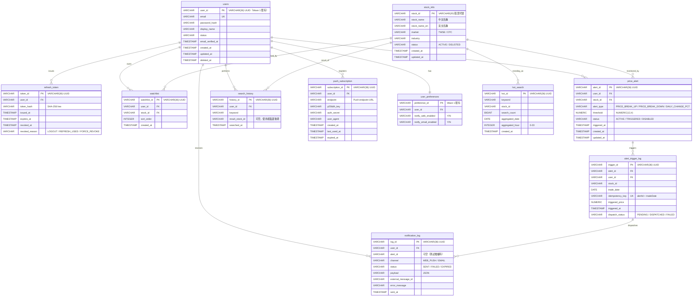

# Wave 3 ER Diagram & 資料庫設計

> **文件版本**：v1.0
> **撰寫者**：Preston
> **撰寫日期**：2026-04-23
> **資料庫**：PostgreSQL 16
> **時區策略**：欄位 `TIMESTAMP WITHOUT TIME ZONE`，應用層固定 GMT+8（沿用 Wave 1/2）
> **ID 策略**：UUID 字串 `VARCHAR(36)`（Java `UUID.randomUUID()`）
> **配套文件**：[Project Architecture](20260423_wave3_project-architecture.md)、[Module Breakdown](20260423_wave3_module-breakdown.md)、[Flyway Migration](20260423_wave3_flyway-migration-plan.md)

---

## 0. 設計準則回顧

| 項目 | 規範 |
|------|------|
| 表名 | snake_case 全小寫，**單數**（沿用 Wave 1/2 既有 `users`、`stock_quote` 慣例） |
| 欄位名 | snake_case 全小寫，避免 RDBMS 保留字 |
| ID | `VARCHAR(36)` UUID 字串 |
| 時間 | `TIMESTAMP WITHOUT TIME ZONE`（不帶時區，應用層固定 GMT+8） |
| 金額 / 比率 | `NUMERIC(p, s)` 配 Java `BigDecimal` |
| 主鍵命名 | `pk_{table}` |
| 唯一索引 | `uk_{table}_{cols}` |
| 一般索引 | `idx_{table}_{cols}` |
| 外鍵命名 | `fk_{table}_{ref-table}` |
| Smart Service, Dumb DB | **禁止** trigger / stored procedure / function 處理業務邏輯 |
| 軟刪除 | `deleted_at` 欄位（沿用 Wave 1 `users` 慣例） |
| pg_trgm extension | Wave 3 啟用，用於中文模糊搜尋（須 RDS 確認權限） |

> **註**：`relational-database.md` 規範檔目前內容仍為 Oracle 範例（D-04 已 rename 但內容未改）。本文件以 Wave 1/2 既有 PostgreSQL 16 migration 慣例為準（VARCHAR / NUMERIC / TIMESTAMP WITHOUT TIME ZONE / 表名單數 / snake_case）。

---

## 1. ER Diagram（總圖）



---

## 2. 表結構詳細定義

### 2.1 stock_info（股票主檔）

**用途**：搜尋資料源，整合 TWSE + OTC，由 `StockInfoSyncService` 每日盤後同步。

```sql
CREATE TABLE IF NOT EXISTS stock_info (
    stock_id        VARCHAR(20)  NOT NULL,                    -- 股票代號 (2330, 6488...)
    stock_name      VARCHAR(100) NOT NULL,                    -- 中文簡稱
    stock_name_en   VARCHAR(100),                             -- 英文名稱（可空）
    market          VARCHAR(10)  NOT NULL,                    -- TWSE / OTC
    industry        VARCHAR(50),                              -- 產業別（可空，後續豐富）
    status          VARCHAR(20)  NOT NULL DEFAULT 'ACTIVE',   -- ACTIVE / DELISTED
    created_at      TIMESTAMP WITHOUT TIME ZONE NOT NULL,
    updated_at      TIMESTAMP WITHOUT TIME ZONE,
    CONSTRAINT pk_stock_info PRIMARY KEY (stock_id),
    CONSTRAINT ck_stock_info_market CHECK (market IN ('TWSE', 'OTC')),
    CONSTRAINT ck_stock_info_status CHECK (status IN ('ACTIVE', 'DELISTED'))
);

-- 中文模糊搜尋（pg_trgm）
CREATE EXTENSION IF NOT EXISTS pg_trgm;
CREATE INDEX IF NOT EXISTS idx_stock_info_name_trgm
    ON stock_info USING GIN (stock_name gin_trgm_ops);

-- 代號 / 英文前綴搜尋
CREATE INDEX IF NOT EXISTS idx_stock_info_id_prefix
    ON stock_info (stock_id text_pattern_ops);
CREATE INDEX IF NOT EXISTS idx_stock_info_name_en_lower
    ON stock_info (LOWER(stock_name_en));

-- 市場 + 狀態（list 用）
CREATE INDEX IF NOT EXISTS idx_stock_info_market_status
    ON stock_info (market, status);

COMMENT ON TABLE  stock_info IS 'Wave 3：股票主檔（搜尋來源，TWSE+OTC）';
COMMENT ON COLUMN stock_info.stock_id    IS '股票代號（VARCHAR(20)，例：2330, 6488）';
COMMENT ON COLUMN stock_info.market      IS 'TWSE 上市 / OTC 上櫃';
```

**索引說明**：
- `idx_stock_info_name_trgm`：GIN + pg_trgm 支援 `LIKE '%台積%'` 高效（避免全表掃描）
- `idx_stock_info_id_prefix`：`text_pattern_ops` 支援 `LIKE '23%'` 前綴查詢
- `idx_stock_info_name_en_lower`：函數索引支援大小寫不敏感前綴

### 2.2 refresh_token（Refresh Token 持久化）

**用途**：取代 Wave 1 記憶體版 refresh token；支援登出黑名單。

```sql
CREATE TABLE IF NOT EXISTS refresh_token (
    token_id        VARCHAR(36)  NOT NULL,
    user_id         VARCHAR(36)  NOT NULL,
    token_hash      VARCHAR(64)  NOT NULL,                    -- SHA-256 hex（不存原 token）
    issued_at       TIMESTAMP WITHOUT TIME ZONE NOT NULL,
    expires_at      TIMESTAMP WITHOUT TIME ZONE NOT NULL,
    revoked_at      TIMESTAMP WITHOUT TIME ZONE,
    revoked_reason  VARCHAR(30),                              -- LOGOUT / REFRESH_USED / FORCE_REVOKE
    created_at      TIMESTAMP WITHOUT TIME ZONE NOT NULL,
    CONSTRAINT pk_refresh_token PRIMARY KEY (token_id),
    CONSTRAINT fk_refresh_token_users
        FOREIGN KEY (user_id) REFERENCES users (user_id) ON DELETE CASCADE,
    CONSTRAINT ck_refresh_token_revoked_reason
        CHECK (revoked_reason IS NULL
            OR revoked_reason IN ('LOGOUT', 'REFRESH_USED', 'FORCE_REVOKE'))
);

CREATE UNIQUE INDEX IF NOT EXISTS uk_refresh_token_hash
    ON refresh_token (token_hash);
CREATE INDEX IF NOT EXISTS idx_refresh_token_user_revoked
    ON refresh_token (user_id, revoked_at);
CREATE INDEX IF NOT EXISTS idx_refresh_token_expires
    ON refresh_token (expires_at);   -- 清理過期 token 排程用

COMMENT ON TABLE refresh_token IS 'Wave 3：Refresh Token 持久化 + 黑名單';
COMMENT ON COLUMN refresh_token.token_hash IS 'SHA-256(refreshToken)；不存原 token';
```

### 2.3 watchlist（自選股）

**用途**：使用者自選股清單，user_id + stock_id 唯一。

```sql
CREATE TABLE IF NOT EXISTS watchlist (
    watchlist_id    VARCHAR(36)  NOT NULL,
    user_id         VARCHAR(36)  NOT NULL,
    stock_id        VARCHAR(20)  NOT NULL,
    sort_order      INTEGER      NOT NULL DEFAULT 0,
    created_at      TIMESTAMP WITHOUT TIME ZONE NOT NULL,
    CONSTRAINT pk_watchlist PRIMARY KEY (watchlist_id),
    CONSTRAINT fk_watchlist_users
        FOREIGN KEY (user_id) REFERENCES users (user_id) ON DELETE CASCADE,
    CONSTRAINT fk_watchlist_stock_info
        FOREIGN KEY (stock_id) REFERENCES stock_info (stock_id)
);

-- (user_id, stock_id) 唯一複合：防重複加入 + 高頻查詢主索引
CREATE UNIQUE INDEX IF NOT EXISTS uk_watchlist_user_stock
    ON watchlist (user_id, stock_id);

-- 列表 ORDER BY sort_order, created_at
CREATE INDEX IF NOT EXISTS idx_watchlist_user_sort
    ON watchlist (user_id, sort_order, created_at);

COMMENT ON TABLE watchlist IS 'Wave 3：使用者自選股（每人最多 50 檔，由 Service 驗證）';
COMMENT ON COLUMN watchlist.sort_order IS '顯示順序，0 表預設（依加入時間）';
```

**上限檢查策略**：由 `WatchlistServiceImpl` 在 INSERT 前 `SELECT COUNT` 驗證。**不**用 DB CHECK 或 trigger（違反 Smart Service Dumb Database）。

### 2.4 price_alert（價格警示）

```sql
CREATE TABLE IF NOT EXISTS price_alert (
    alert_id        VARCHAR(36)    NOT NULL,
    user_id         VARCHAR(36)    NOT NULL,
    stock_id        VARCHAR(20)    NOT NULL,
    alert_type      VARCHAR(30)    NOT NULL,                 -- PRICE_BREAK_UP / PRICE_BREAK_DOWN / DAILY_CHANGE_PCT
    threshold       NUMERIC(12, 4) NOT NULL,                 -- 突破價位 或 漲跌幅 %
    status          VARCHAR(20)    NOT NULL DEFAULT 'ACTIVE', -- ACTIVE / TRIGGERED / DISABLED
    triggered_at    TIMESTAMP WITHOUT TIME ZONE,             -- 最近一次觸發
    created_at      TIMESTAMP WITHOUT TIME ZONE NOT NULL,
    updated_at      TIMESTAMP WITHOUT TIME ZONE,
    CONSTRAINT pk_price_alert PRIMARY KEY (alert_id),
    CONSTRAINT fk_price_alert_users
        FOREIGN KEY (user_id) REFERENCES users (user_id) ON DELETE CASCADE,
    CONSTRAINT fk_price_alert_stock_info
        FOREIGN KEY (stock_id) REFERENCES stock_info (stock_id),
    CONSTRAINT ck_price_alert_type
        CHECK (alert_type IN ('PRICE_BREAK_UP', 'PRICE_BREAK_DOWN', 'DAILY_CHANGE_PCT')),
    CONSTRAINT ck_price_alert_status
        CHECK (status IN ('ACTIVE', 'TRIGGERED', 'DISABLED'))
);

-- 觸發引擎掃描：WHERE status='ACTIVE'
CREATE INDEX IF NOT EXISTS idx_price_alert_status_stock
    ON price_alert (status, stock_id);

-- 使用者管理頁：WHERE user_id=? ORDER BY created_at DESC
CREATE INDEX IF NOT EXISTS idx_price_alert_user_created
    ON price_alert (user_id, created_at DESC);

-- 上限檢查（每使用者每股最多 5 條）：WHERE user_id=? AND stock_id=? AND status<>'DISABLED'
CREATE INDEX IF NOT EXISTS idx_price_alert_user_stock_status
    ON price_alert (user_id, stock_id, status);

COMMENT ON TABLE price_alert IS 'Wave 3：價格警示（每股最多 5 條，由 Service 驗證）';
COMMENT ON COLUMN price_alert.threshold IS '突破價（NUMERIC(12,4)）或漲跌幅 %（如 5.00 表示 5%）';
```

### 2.5 alert_trigger_log（警示觸發紀錄 + idempotency）

**用途**：記錄每次觸發；`idempotency_key` 唯一防重複推播。

```sql
CREATE TABLE IF NOT EXISTS alert_trigger_log (
    trigger_id        VARCHAR(36)    NOT NULL,
    alert_id          VARCHAR(36)    NOT NULL,
    user_id           VARCHAR(36)    NOT NULL,
    stock_id          VARCHAR(20)    NOT NULL,
    trade_date        DATE           NOT NULL,
    idempotency_key   VARCHAR(80)    NOT NULL,              -- 例：{alertId}-{tradeDate}
    triggered_price   NUMERIC(12, 4) NOT NULL,
    triggered_at      TIMESTAMP WITHOUT TIME ZONE NOT NULL,
    dispatch_status   VARCHAR(20)    NOT NULL DEFAULT 'PENDING', -- PENDING / DISPATCHED / FAILED
    dispatch_error    VARCHAR(500),
    created_at        TIMESTAMP WITHOUT TIME ZONE NOT NULL,
    CONSTRAINT pk_alert_trigger_log PRIMARY KEY (trigger_id),
    CONSTRAINT fk_alert_trigger_log_alert
        FOREIGN KEY (alert_id) REFERENCES price_alert (alert_id) ON DELETE CASCADE,
    CONSTRAINT ck_alert_trigger_log_dispatch
        CHECK (dispatch_status IN ('PENDING', 'DISPATCHED', 'FAILED'))
);

-- idempotency 唯一鍵：同一警示同一交易日不重複觸發
CREATE UNIQUE INDEX IF NOT EXISTS uk_alert_trigger_log_idempotency
    ON alert_trigger_log (idempotency_key);

CREATE INDEX IF NOT EXISTS idx_alert_trigger_log_user_date
    ON alert_trigger_log (user_id, triggered_at DESC);
CREATE INDEX IF NOT EXISTS idx_alert_trigger_log_status
    ON alert_trigger_log (dispatch_status, created_at);  -- 補償重派排程用

COMMENT ON TABLE alert_trigger_log IS 'Wave 3：警示觸發紀錄（含 idempotency 防重複推播）';
COMMENT ON COLUMN alert_trigger_log.idempotency_key
    IS '格式：{alert_id}-{YYYYMMDD}；唯一約束保證同日同警示僅推播一次';
```

### 2.6 search_history（搜尋歷史）

```sql
CREATE TABLE IF NOT EXISTS search_history (
    history_id        VARCHAR(36)  NOT NULL,
    user_id           VARCHAR(36)  NOT NULL,
    keyword           VARCHAR(50)  NOT NULL,
    result_stock_id   VARCHAR(20),                          -- 可空：搜尋未點擊
    searched_at       TIMESTAMP WITHOUT TIME ZONE NOT NULL,
    CONSTRAINT pk_search_history PRIMARY KEY (history_id),
    CONSTRAINT fk_search_history_users
        FOREIGN KEY (user_id) REFERENCES users (user_id) ON DELETE CASCADE
);

-- 列表查詢：WHERE user_id=? ORDER BY searched_at DESC LIMIT 10
CREATE INDEX IF NOT EXISTS idx_search_history_user_time
    ON search_history (user_id, searched_at DESC);

-- 熱門搜尋聚合：WHERE searched_at > now() - 24h GROUP BY keyword
CREATE INDEX IF NOT EXISTS idx_search_history_time
    ON search_history (searched_at);

COMMENT ON TABLE search_history IS 'Wave 3：搜尋歷史（每使用者保留最新 10 筆，Service 滑窗淘汰）';
```

**滑窗淘汰策略**：INSERT 後執行
```sql
DELETE FROM search_history
 WHERE user_id = ?
   AND history_id NOT IN (
       SELECT history_id FROM search_history
        WHERE user_id = ?
        ORDER BY searched_at DESC
        LIMIT 10
   );
```

### 2.7 hot_search（熱門搜尋彙總）

**用途**：每小時排程聚合 24h 內 top 10，避免每次查詢都跑 GROUP BY。

```sql
CREATE TABLE IF NOT EXISTS hot_search (
    hot_id             VARCHAR(36)  NOT NULL,
    keyword            VARCHAR(50)  NOT NULL,
    stock_id           VARCHAR(20),                         -- 可空：keyword 未匹配到 stock
    search_count       BIGINT       NOT NULL,
    aggregated_date    DATE         NOT NULL,
    aggregated_hour    SMALLINT     NOT NULL,               -- 0-23（聚合的小時）
    rank               SMALLINT     NOT NULL,               -- 1..10
    created_at         TIMESTAMP WITHOUT TIME ZONE NOT NULL,
    CONSTRAINT pk_hot_search PRIMARY KEY (hot_id),
    CONSTRAINT ck_hot_search_hour CHECK (aggregated_hour BETWEEN 0 AND 23),
    CONSTRAINT ck_hot_search_rank CHECK (rank BETWEEN 1 AND 10)
);

CREATE UNIQUE INDEX IF NOT EXISTS uk_hot_search_date_hour_rank
    ON hot_search (aggregated_date, aggregated_hour, rank);
CREATE INDEX IF NOT EXISTS idx_hot_search_date_hour
    ON hot_search (aggregated_date DESC, aggregated_hour DESC);

COMMENT ON TABLE hot_search IS 'Wave 3：熱門搜尋彙總（每小時聚合，隱私保護：count<3 不入榜）';
```

**聚合排程 SQL**（每小時整點執行）：
```sql
INSERT INTO hot_search (hot_id, keyword, stock_id, search_count,
                        aggregated_date, aggregated_hour, rank, created_at)
SELECT gen_random_uuid()::text,
       keyword,
       MAX(result_stock_id),
       COUNT(*) AS cnt,
       CURRENT_DATE,
       EXTRACT(HOUR FROM CURRENT_TIMESTAMP)::smallint,
       ROW_NUMBER() OVER (ORDER BY COUNT(*) DESC),
       CURRENT_TIMESTAMP
  FROM search_history
 WHERE searched_at > CURRENT_TIMESTAMP - INTERVAL '24 hour'
 GROUP BY keyword
HAVING COUNT(*) >= 3                  -- 隱私：< 3 次不入榜
 ORDER BY cnt DESC
 LIMIT 10;
```

### 2.8 push_subscription（Web Push 訂閱）

```sql
CREATE TABLE IF NOT EXISTS push_subscription (
    subscription_id   VARCHAR(36)   NOT NULL,
    user_id           VARCHAR(36)   NOT NULL,
    endpoint          VARCHAR(500)  NOT NULL,                -- Push endpoint URL
    p256dh_key        VARCHAR(255)  NOT NULL,                -- base64
    auth_secret       VARCHAR(255)  NOT NULL,                -- base64
    user_agent        VARCHAR(255),
    created_at        TIMESTAMP WITHOUT TIME ZONE NOT NULL,
    last_used_at      TIMESTAMP WITHOUT TIME ZONE,
    expired_at        TIMESTAMP WITHOUT TIME ZONE,           -- 410 Gone 後標記
    CONSTRAINT pk_push_subscription PRIMARY KEY (subscription_id),
    CONSTRAINT fk_push_subscription_users
        FOREIGN KEY (user_id) REFERENCES users (user_id) ON DELETE CASCADE
);

CREATE UNIQUE INDEX IF NOT EXISTS uk_push_subscription_endpoint
    ON push_subscription (endpoint);
CREATE INDEX IF NOT EXISTS idx_push_subscription_user_active
    ON push_subscription (user_id, expired_at);

COMMENT ON TABLE push_subscription IS 'Wave 3：Web Push 訂閱（VAPID 協定）';
COMMENT ON COLUMN push_subscription.expired_at
    IS '推送回 HTTP 410 後標記；查詢時排除 expired_at IS NOT NULL';
```

### 2.9 notification_log（推播送達紀錄）

```sql
CREATE TABLE IF NOT EXISTS notification_log (
    log_id              VARCHAR(36)   NOT NULL,
    user_id             VARCHAR(36)   NOT NULL,
    alert_id            VARCHAR(36),                          -- 可空：測試推播
    channel             VARCHAR(20)   NOT NULL,               -- WEB_PUSH / EMAIL
    status              VARCHAR(20)   NOT NULL,               -- SENT / FAILED / EXPIRED
    payload             TEXT,                                  -- JSON
    external_message_id VARCHAR(255),                          -- SES messageId / Web Push response
    error_message       VARCHAR(1000),
    sent_at             TIMESTAMP WITHOUT TIME ZONE NOT NULL,
    created_at          TIMESTAMP WITHOUT TIME ZONE NOT NULL,
    CONSTRAINT pk_notification_log PRIMARY KEY (log_id),
    CONSTRAINT fk_notification_log_users
        FOREIGN KEY (user_id) REFERENCES users (user_id) ON DELETE CASCADE,
    CONSTRAINT ck_notification_log_channel
        CHECK (channel IN ('WEB_PUSH', 'EMAIL')),
    CONSTRAINT ck_notification_log_status
        CHECK (status IN ('SENT', 'FAILED', 'EXPIRED'))
);

CREATE INDEX IF NOT EXISTS idx_notification_log_user_time
    ON notification_log (user_id, sent_at DESC);
CREATE INDEX IF NOT EXISTS idx_notification_log_alert
    ON notification_log (alert_id);
CREATE INDEX IF NOT EXISTS idx_notification_log_status
    ON notification_log (status, sent_at);  -- 失敗監控

COMMENT ON TABLE notification_log IS 'Wave 3：推播送達紀錄（每筆推播一筆，含失敗錯誤訊息）';
```

---

## 3. 索引總覽

| 表 | 索引名 | 欄位 | 類型 | 用途 |
|----|--------|------|------|------|
| stock_info | pk_stock_info | (stock_id) | PK | — |
| stock_info | idx_stock_info_name_trgm | (stock_name) | GIN trgm | 中文模糊搜尋 |
| stock_info | idx_stock_info_id_prefix | (stock_id text_pattern_ops) | BTREE | 代號前綴 |
| stock_info | idx_stock_info_name_en_lower | (LOWER(stock_name_en)) | 函數 BTREE | 英文不分大小寫前綴 |
| stock_info | idx_stock_info_market_status | (market, status) | BTREE | 列表 |
| refresh_token | uk_refresh_token_hash | (token_hash) | UK | 查重 + lookup |
| refresh_token | idx_refresh_token_user_revoked | (user_id, revoked_at) | BTREE | 黑名單檢查 |
| refresh_token | idx_refresh_token_expires | (expires_at) | BTREE | 過期清理排程 |
| watchlist | uk_watchlist_user_stock | (user_id, stock_id) | UK | 防重複 + 高頻查詢 |
| watchlist | idx_watchlist_user_sort | (user_id, sort_order, created_at) | BTREE | 列表排序 |
| price_alert | idx_price_alert_status_stock | (status, stock_id) | BTREE | 觸發引擎掃描 |
| price_alert | idx_price_alert_user_created | (user_id, created_at DESC) | BTREE | 管理頁列表 |
| price_alert | idx_price_alert_user_stock_status | (user_id, stock_id, status) | BTREE | 上限檢查 |
| alert_trigger_log | uk_alert_trigger_log_idempotency | (idempotency_key) | UK | 防重複推播 |
| alert_trigger_log | idx_alert_trigger_log_user_date | (user_id, triggered_at DESC) | BTREE | 使用者觸發歷史 |
| alert_trigger_log | idx_alert_trigger_log_status | (dispatch_status, created_at) | BTREE | 失敗補償排程 |
| search_history | idx_search_history_user_time | (user_id, searched_at DESC) | BTREE | 列表 / 滑窗 |
| search_history | idx_search_history_time | (searched_at) | BTREE | 熱門聚合 |
| hot_search | uk_hot_search_date_hour_rank | (aggregated_date, aggregated_hour, rank) | UK | 聚合唯一 |
| hot_search | idx_hot_search_date_hour | (aggregated_date DESC, aggregated_hour DESC) | BTREE | 取最新 |
| push_subscription | uk_push_subscription_endpoint | (endpoint) | UK | upsert |
| push_subscription | idx_push_subscription_user_active | (user_id, expired_at) | BTREE | 使用者有效訂閱 |
| notification_log | idx_notification_log_user_time | (user_id, sent_at DESC) | BTREE | 使用者通知歷史 |
| notification_log | idx_notification_log_alert | (alert_id) | BTREE | 警示送達追蹤 |
| notification_log | idx_notification_log_status | (status, sent_at) | BTREE | 失敗監控 |

---

## 4. 與 Wave 1/2 既有表的關係

| 既有表 | Wave 3 是否變更？ | 關聯 |
|--------|------------------|------|
| `users`（V1.0.0） | ❌ 不變 | refresh_token / watchlist / price_alert / search_history / push_subscription / notification_log 均 FK 至此 |
| `user_preferences`（V1.0.0） | ❌ 不變 | stock-notify 讀取 `notify_web_enabled` / `notify_email_enabled` 決定推播管道 |
| `audit_logs`（V1.0.1） | ❌ 不變 | Wave 3 業務操作沿用此表寫入 |
| `stock_quote`（V2.0.0） | ❌ 不變 | watchlist 彙整 / alert 觸發引擎讀取 |
| `stock_fundamental`（V2.0.0） | ❌ 不變 | — |
| `stock_chip`（V2.0.0） | ❌ 不變 | — |

**Wave 3 任何欄位變更需走獨立 ADR + 4 票投票**（避免影響 Wave 1/2 PO）。

---

## 5. 容量估算（粗估，輔助 Sophia 容量規劃）

| 表 | 平均單筆大小 | 預估筆數（M3 上線後 6 個月） | 預估總大小 |
|----|--------------|------------------------------|-----------|
| stock_info | 200 B | ~ 2,000（TWSE 1,000 + OTC 1,000） | < 1 MB |
| refresh_token | 200 B | ~ 50,000（10k 使用者 × 5 token） | 10 MB |
| watchlist | 100 B | ~ 100,000（10k 使用者 × 10 檔） | 10 MB |
| price_alert | 150 B | ~ 30,000（10k 使用者 × 3 條） | 5 MB |
| alert_trigger_log | 250 B | ~ 200,000（每月 ~ 33k） | 50 MB / 半年 |
| search_history | 150 B | ~ 100,000（10k 使用者 × 10 筆滑窗） | 15 MB |
| hot_search | 200 B | ~ 87,600（每小時 10 筆 × 24 × 365） | 20 MB / 年 |
| push_subscription | 800 B | ~ 30,000（10k 使用者 × 3 裝置） | 25 MB |
| notification_log | 500 B | ~ 600,000（每月 ~ 100k） | 300 MB / 半年 |

**結論**：
- Wave 3 新增容量需求 < 500 MB / 半年
- 主要增長來源是 `notification_log`，建議 **歸檔策略：保留 90 天熱資料**，超過搬到 S3 + 建檢視
- `alert_trigger_log` 同樣建議 90 天歸檔

歸檔策略由 Sophia 決定是否導入（Wave 3 暫不實作，僅標註）。

---

## 6. 變更歷史

| 日期 | 版本 | 變更 | 作者 |
|------|------|------|------|
| 2026-04-23 | v1.0 | 初版 | Preston |
