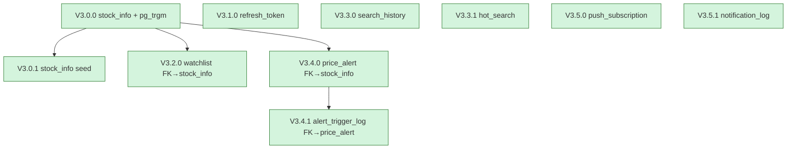

# Wave 3 Flyway Migration 編號規劃

> **文件版本**：v1.0
> **撰寫者**：Preston
> **撰寫日期**：2026-04-23
> **資料庫**：PostgreSQL 16
> **Flyway**：10.20.1（沿用 Wave 2）
> **配套文件**：[ER Diagram](20260423_wave3_er-diagram.md)、[Module Breakdown](20260423_wave3_module-breakdown.md)

---

## 0. 既有 Migration 狀態

```
backend/stock-boot/src/main/resources/db/migration/
├── V1.0.0__create_member_tables.sql              ← Wave 1（users, user_preferences）
├── V1.0.1__create_audit_log.sql                  ← Wave 1（audit_logs）
└── V2.0.0__create_quote_fundamental_chip_tables.sql  ← Wave 2（stock_quote, stock_fundamental, stock_chip）
```

**已被佔用的版本號**：V1.0.0 / V1.0.1 / V2.0.0
**Wave 3 起始版本號**：**V3.0.0**

---

## 1. 編號原則

| 階段 | 版本範圍 | 用途 |
|------|----------|------|
| 主版本（Major） | `V{N}.0.0` | 對應產品 Wave（W1=V1, W2=V2, W3=V3） |
| 次版本（Feature） | `V{N}.{F}.0` | 同 Wave 內不同功能群組 |
| 修補版本（Patch） | `V{N}.{F}.{P}` | 同功能群組內補欄位 / 索引修正 |
| Repeatable | `R__{name}.sql` | seed data、view、function（**Wave 3 暫不使用**） |

**禁止事項**：
- ❌ 禁止刪除 / 修改已上線（dev 以上）的 migration（會被 Flyway checksum 拒絕）
- ❌ 禁止跨 Wave 借用版本號（V2.x.x 只能 Wave 2 用）
- ❌ 禁止單一 migration 跨多個業務領域（一個 migration 對應一個邏輯主題）
- ❌ 禁止在 migration 內寫業務邏輯 SQL（Smart Service Dumb DB）

---

## 2. Wave 3 Migration 規劃（依執行順序）

| 版本 | 檔名 | 主題 | 對應模組 | 預估列數 | 依賴 |
|------|------|------|----------|----------|------|
| **V3.0.0** | `V3.0.0__create_stock_info.sql` | 股票主檔 + pg_trgm extension | stock-search | ~50 | — |
| **V3.0.1** | `V3.0.1__seed_stock_info_twse_otc.sql` | 主檔 seed（TWSE + OTC 全集） | stock-search | ~80（含資料） | V3.0.0 |
| **V3.1.0** | `V3.1.0__create_refresh_token.sql` | Refresh Token 持久化 | stock-member | ~40 | — |
| **V3.2.0** | `V3.2.0__create_watchlist.sql` | 自選股 | stock-watchlist | ~35 | V3.0.0（FK stock_info） |
| **V3.3.0** | `V3.3.0__create_search_history.sql` | 搜尋歷史 | stock-search | ~25 | — |
| **V3.3.1** | `V3.3.1__create_hot_search.sql` | 熱門搜尋彙總 | stock-search | ~30 | — |
| **V3.4.0** | `V3.4.0__create_price_alert.sql` | 價格警示 | stock-alert | ~50 | V3.0.0（FK stock_info） |
| **V3.4.1** | `V3.4.1__create_alert_trigger_log.sql` | 警示觸發 + idempotency | stock-alert | ~45 | V3.4.0 |
| **V3.5.0** | `V3.5.0__create_push_subscription.sql` | Web Push 訂閱 | stock-notify | ~30 | — |
| **V3.5.1** | `V3.5.1__create_notification_log.sql` | 推播送達紀錄 | stock-notify | ~40 | — |

**總共 10 個 migration 檔**。

---

## 3. 各檔案內容大綱

### V3.0.0__create_stock_info.sql

```sql
-- ============================================================
-- V3.0.0  Wave 3：建立股票主檔（搜尋來源） + pg_trgm extension
-- 對應模組：stock-search
-- 對應 ER 文件：20260423_wave3_er-diagram.md §2.1
-- ============================================================

CREATE EXTENSION IF NOT EXISTS pg_trgm;

CREATE TABLE IF NOT EXISTS stock_info (
    stock_id        VARCHAR(20)  NOT NULL,
    stock_name      VARCHAR(100) NOT NULL,
    stock_name_en   VARCHAR(100),
    market          VARCHAR(10)  NOT NULL,
    industry        VARCHAR(50),
    status          VARCHAR(20)  NOT NULL DEFAULT 'ACTIVE',
    created_at      TIMESTAMP WITHOUT TIME ZONE NOT NULL,
    updated_at      TIMESTAMP WITHOUT TIME ZONE,
    CONSTRAINT pk_stock_info PRIMARY KEY (stock_id),
    CONSTRAINT ck_stock_info_market CHECK (market IN ('TWSE', 'OTC')),
    CONSTRAINT ck_stock_info_status CHECK (status IN ('ACTIVE', 'DELISTED'))
);

CREATE INDEX IF NOT EXISTS idx_stock_info_name_trgm
    ON stock_info USING GIN (stock_name gin_trgm_ops);
CREATE INDEX IF NOT EXISTS idx_stock_info_id_prefix
    ON stock_info (stock_id text_pattern_ops);
CREATE INDEX IF NOT EXISTS idx_stock_info_name_en_lower
    ON stock_info (LOWER(stock_name_en));
CREATE INDEX IF NOT EXISTS idx_stock_info_market_status
    ON stock_info (market, status);

COMMENT ON TABLE stock_info IS 'Wave 3：股票主檔（搜尋來源，TWSE+OTC）';
```

**注意事項**：
- `CREATE EXTENSION IF NOT EXISTS pg_trgm` 需 RDS superuser 權限。Sophia 須與 DBA 確認 RDS 是否預先 grant。若無權限，Wave 3 須降級為 `LIKE '%keyword%'`（效能變差但可運作）。

### V3.0.1__seed_stock_info_twse_otc.sql

```sql
-- ============================================================
-- V3.0.1  Wave 3：股票主檔初始 seed（TWSE + OTC，僅 top N 樣本）
-- 完整資料由 stock-search.StockInfoSyncService 每日盤後同步
-- 此 seed 僅供 dev / local 啟動驗證
-- ============================================================

INSERT INTO stock_info (stock_id, stock_name, stock_name_en, market, industry, status, created_at)
VALUES
    ('2330', '台積電',   'TSMC',          'TWSE', '半導體', 'ACTIVE', CURRENT_TIMESTAMP),
    ('2317', '鴻海',     'Hon Hai',       'TWSE', '電子',   'ACTIVE', CURRENT_TIMESTAMP),
    ('2454', '聯發科',   'MediaTek',      'TWSE', '半導體', 'ACTIVE', CURRENT_TIMESTAMP),
    ('2412', '中華電',   'Chunghwa Tel',  'TWSE', '電信',   'ACTIVE', CURRENT_TIMESTAMP),
    ('1301', '台塑',     'Formosa Plast', 'TWSE', '塑膠',   'ACTIVE', CURRENT_TIMESTAMP),
    ('2308', '台達電',   'Delta',         'TWSE', '電子',   'ACTIVE', CURRENT_TIMESTAMP),
    ('6488', '環球晶',   'GlobalWafers',  'OTC',  '半導體', 'ACTIVE', CURRENT_TIMESTAMP),
    ('5483', '中美晶',   'Sino-American', 'OTC',  '半導體', 'ACTIVE', CURRENT_TIMESTAMP)
ON CONFLICT (stock_id) DO NOTHING;
```

**注意**：
- 用 `ON CONFLICT DO NOTHING` 確保重複執行不會炸（雖然 Flyway 不會重跑同一版本）
- prod 不依賴 seed，由 `StockInfoSyncService` 取代

### V3.1.0__create_refresh_token.sql

```sql
-- ============================================================
-- V3.1.0  Wave 3：Refresh Token 持久化 + 黑名單
-- 對應模組：stock-member（Wave 1 記憶體版升級為持久化）
-- ============================================================

CREATE TABLE IF NOT EXISTS refresh_token (
    token_id        VARCHAR(36)  NOT NULL,
    user_id         VARCHAR(36)  NOT NULL,
    token_hash      VARCHAR(64)  NOT NULL,
    issued_at       TIMESTAMP WITHOUT TIME ZONE NOT NULL,
    expires_at      TIMESTAMP WITHOUT TIME ZONE NOT NULL,
    revoked_at      TIMESTAMP WITHOUT TIME ZONE,
    revoked_reason  VARCHAR(30),
    created_at      TIMESTAMP WITHOUT TIME ZONE NOT NULL,
    CONSTRAINT pk_refresh_token PRIMARY KEY (token_id),
    CONSTRAINT fk_refresh_token_users
        FOREIGN KEY (user_id) REFERENCES users (user_id) ON DELETE CASCADE,
    CONSTRAINT ck_refresh_token_revoked_reason
        CHECK (revoked_reason IS NULL
            OR revoked_reason IN ('LOGOUT', 'REFRESH_USED', 'FORCE_REVOKE'))
);

CREATE UNIQUE INDEX IF NOT EXISTS uk_refresh_token_hash ON refresh_token (token_hash);
CREATE INDEX IF NOT EXISTS idx_refresh_token_user_revoked ON refresh_token (user_id, revoked_at);
CREATE INDEX IF NOT EXISTS idx_refresh_token_expires ON refresh_token (expires_at);

COMMENT ON TABLE refresh_token IS 'Wave 3：Refresh Token 持久化 + 黑名單';
```

### V3.2.0__create_watchlist.sql

```sql
CREATE TABLE IF NOT EXISTS watchlist (
    watchlist_id    VARCHAR(36)  NOT NULL,
    user_id         VARCHAR(36)  NOT NULL,
    stock_id        VARCHAR(20)  NOT NULL,
    sort_order      INTEGER      NOT NULL DEFAULT 0,
    created_at      TIMESTAMP WITHOUT TIME ZONE NOT NULL,
    CONSTRAINT pk_watchlist PRIMARY KEY (watchlist_id),
    CONSTRAINT fk_watchlist_users
        FOREIGN KEY (user_id) REFERENCES users (user_id) ON DELETE CASCADE,
    CONSTRAINT fk_watchlist_stock_info
        FOREIGN KEY (stock_id) REFERENCES stock_info (stock_id)
);

CREATE UNIQUE INDEX IF NOT EXISTS uk_watchlist_user_stock ON watchlist (user_id, stock_id);
CREATE INDEX IF NOT EXISTS idx_watchlist_user_sort ON watchlist (user_id, sort_order, created_at);

COMMENT ON TABLE watchlist IS 'Wave 3：使用者自選股（每人最多 50 檔，由 Service 驗證）';
```

### V3.3.0__create_search_history.sql

```sql
CREATE TABLE IF NOT EXISTS search_history (
    history_id        VARCHAR(36)  NOT NULL,
    user_id           VARCHAR(36)  NOT NULL,
    keyword           VARCHAR(50)  NOT NULL,
    result_stock_id   VARCHAR(20),
    searched_at       TIMESTAMP WITHOUT TIME ZONE NOT NULL,
    CONSTRAINT pk_search_history PRIMARY KEY (history_id),
    CONSTRAINT fk_search_history_users
        FOREIGN KEY (user_id) REFERENCES users (user_id) ON DELETE CASCADE
);

CREATE INDEX IF NOT EXISTS idx_search_history_user_time ON search_history (user_id, searched_at DESC);
CREATE INDEX IF NOT EXISTS idx_search_history_time ON search_history (searched_at);

COMMENT ON TABLE search_history IS 'Wave 3：搜尋歷史（每使用者保留最新 10 筆，Service 滑窗淘汰）';
```

### V3.3.1__create_hot_search.sql

```sql
CREATE TABLE IF NOT EXISTS hot_search (
    hot_id             VARCHAR(36)  NOT NULL,
    keyword            VARCHAR(50)  NOT NULL,
    stock_id           VARCHAR(20),
    search_count       BIGINT       NOT NULL,
    aggregated_date    DATE         NOT NULL,
    aggregated_hour    SMALLINT     NOT NULL,
    rank               SMALLINT     NOT NULL,
    created_at         TIMESTAMP WITHOUT TIME ZONE NOT NULL,
    CONSTRAINT pk_hot_search PRIMARY KEY (hot_id),
    CONSTRAINT ck_hot_search_hour CHECK (aggregated_hour BETWEEN 0 AND 23),
    CONSTRAINT ck_hot_search_rank CHECK (rank BETWEEN 1 AND 10)
);

CREATE UNIQUE INDEX IF NOT EXISTS uk_hot_search_date_hour_rank
    ON hot_search (aggregated_date, aggregated_hour, rank);
CREATE INDEX IF NOT EXISTS idx_hot_search_date_hour
    ON hot_search (aggregated_date DESC, aggregated_hour DESC);

COMMENT ON TABLE hot_search IS 'Wave 3：熱門搜尋彙總（每小時聚合）';
```

### V3.4.0__create_price_alert.sql

```sql
CREATE TABLE IF NOT EXISTS price_alert (
    alert_id        VARCHAR(36)    NOT NULL,
    user_id         VARCHAR(36)    NOT NULL,
    stock_id        VARCHAR(20)    NOT NULL,
    alert_type      VARCHAR(30)    NOT NULL,
    threshold       NUMERIC(12, 4) NOT NULL,
    status          VARCHAR(20)    NOT NULL DEFAULT 'ACTIVE',
    triggered_at    TIMESTAMP WITHOUT TIME ZONE,
    created_at      TIMESTAMP WITHOUT TIME ZONE NOT NULL,
    updated_at      TIMESTAMP WITHOUT TIME ZONE,
    CONSTRAINT pk_price_alert PRIMARY KEY (alert_id),
    CONSTRAINT fk_price_alert_users
        FOREIGN KEY (user_id) REFERENCES users (user_id) ON DELETE CASCADE,
    CONSTRAINT fk_price_alert_stock_info
        FOREIGN KEY (stock_id) REFERENCES stock_info (stock_id),
    CONSTRAINT ck_price_alert_type
        CHECK (alert_type IN ('PRICE_BREAK_UP', 'PRICE_BREAK_DOWN', 'DAILY_CHANGE_PCT')),
    CONSTRAINT ck_price_alert_status
        CHECK (status IN ('ACTIVE', 'TRIGGERED', 'DISABLED'))
);

CREATE INDEX IF NOT EXISTS idx_price_alert_status_stock ON price_alert (status, stock_id);
CREATE INDEX IF NOT EXISTS idx_price_alert_user_created ON price_alert (user_id, created_at DESC);
CREATE INDEX IF NOT EXISTS idx_price_alert_user_stock_status
    ON price_alert (user_id, stock_id, status);

COMMENT ON TABLE price_alert IS 'Wave 3：價格警示（每股最多 5 條，由 Service 驗證）';
```

### V3.4.1__create_alert_trigger_log.sql

```sql
CREATE TABLE IF NOT EXISTS alert_trigger_log (
    trigger_id        VARCHAR(36)    NOT NULL,
    alert_id          VARCHAR(36)    NOT NULL,
    user_id           VARCHAR(36)    NOT NULL,
    stock_id          VARCHAR(20)    NOT NULL,
    trade_date        DATE           NOT NULL,
    idempotency_key   VARCHAR(80)    NOT NULL,
    triggered_price   NUMERIC(12, 4) NOT NULL,
    triggered_at      TIMESTAMP WITHOUT TIME ZONE NOT NULL,
    dispatch_status   VARCHAR(20)    NOT NULL DEFAULT 'PENDING',
    dispatch_error    VARCHAR(500),
    created_at        TIMESTAMP WITHOUT TIME ZONE NOT NULL,
    CONSTRAINT pk_alert_trigger_log PRIMARY KEY (trigger_id),
    CONSTRAINT fk_alert_trigger_log_alert
        FOREIGN KEY (alert_id) REFERENCES price_alert (alert_id) ON DELETE CASCADE,
    CONSTRAINT ck_alert_trigger_log_dispatch
        CHECK (dispatch_status IN ('PENDING', 'DISPATCHED', 'FAILED'))
);

CREATE UNIQUE INDEX IF NOT EXISTS uk_alert_trigger_log_idempotency
    ON alert_trigger_log (idempotency_key);
CREATE INDEX IF NOT EXISTS idx_alert_trigger_log_user_date
    ON alert_trigger_log (user_id, triggered_at DESC);
CREATE INDEX IF NOT EXISTS idx_alert_trigger_log_status
    ON alert_trigger_log (dispatch_status, created_at);

COMMENT ON TABLE alert_trigger_log IS 'Wave 3：警示觸發紀錄（含 idempotency 防重複推播）';
```

### V3.5.0__create_push_subscription.sql

```sql
CREATE TABLE IF NOT EXISTS push_subscription (
    subscription_id   VARCHAR(36)   NOT NULL,
    user_id           VARCHAR(36)   NOT NULL,
    endpoint          VARCHAR(500)  NOT NULL,
    p256dh_key        VARCHAR(255)  NOT NULL,
    auth_secret       VARCHAR(255)  NOT NULL,
    user_agent        VARCHAR(255),
    created_at        TIMESTAMP WITHOUT TIME ZONE NOT NULL,
    last_used_at      TIMESTAMP WITHOUT TIME ZONE,
    expired_at        TIMESTAMP WITHOUT TIME ZONE,
    CONSTRAINT pk_push_subscription PRIMARY KEY (subscription_id),
    CONSTRAINT fk_push_subscription_users
        FOREIGN KEY (user_id) REFERENCES users (user_id) ON DELETE CASCADE
);

CREATE UNIQUE INDEX IF NOT EXISTS uk_push_subscription_endpoint
    ON push_subscription (endpoint);
CREATE INDEX IF NOT EXISTS idx_push_subscription_user_active
    ON push_subscription (user_id, expired_at);

COMMENT ON TABLE push_subscription IS 'Wave 3：Web Push 訂閱（VAPID 協定）';
```

### V3.5.1__create_notification_log.sql

```sql
CREATE TABLE IF NOT EXISTS notification_log (
    log_id              VARCHAR(36)   NOT NULL,
    user_id             VARCHAR(36)   NOT NULL,
    alert_id            VARCHAR(36),
    channel             VARCHAR(20)   NOT NULL,
    status              VARCHAR(20)   NOT NULL,
    payload             TEXT,
    external_message_id VARCHAR(255),
    error_message       VARCHAR(1000),
    sent_at             TIMESTAMP WITHOUT TIME ZONE NOT NULL,
    created_at          TIMESTAMP WITHOUT TIME ZONE NOT NULL,
    CONSTRAINT pk_notification_log PRIMARY KEY (log_id),
    CONSTRAINT fk_notification_log_users
        FOREIGN KEY (user_id) REFERENCES users (user_id) ON DELETE CASCADE,
    CONSTRAINT ck_notification_log_channel
        CHECK (channel IN ('WEB_PUSH', 'EMAIL')),
    CONSTRAINT ck_notification_log_status
        CHECK (status IN ('SENT', 'FAILED', 'EXPIRED'))
);

CREATE INDEX IF NOT EXISTS idx_notification_log_user_time
    ON notification_log (user_id, sent_at DESC);
CREATE INDEX IF NOT EXISTS idx_notification_log_alert
    ON notification_log (alert_id);
CREATE INDEX IF NOT EXISTS idx_notification_log_status
    ON notification_log (status, sent_at);

COMMENT ON TABLE notification_log IS 'Wave 3：推播送達紀錄';
```

---

## 4. 執行順序與依賴



Flyway 依檔名排序執行，上圖只是邏輯依賴示意。實務上排序為：
**V3.0.0 → V3.0.1 → V3.1.0 → V3.2.0 → V3.3.0 → V3.3.1 → V3.4.0 → V3.4.1 → V3.5.0 → V3.5.1**

---

## 5. 與 Wave 1/2 既有 migration 的相容性

### 5.1 不修改既有 migration

V1.0.0 / V1.0.1 / V2.0.0 **完全不動**。任何想對 `users` / `user_preferences` / `audit_logs` / `stock_quote` / `stock_fundamental` / `stock_chip` 做欄位變更的需求，必須：
1. 走獨立 ADR
2. 取得 4 票投票通過
3. 用 V3.x.x 新 migration（如 `V3.6.0__alter_users_add_xxx.sql`）

### 5.2 Wave 3 不依賴既有 migration 內容

**檢查清單**：
- ✅ Wave 3 所有 FK 對應的 PK（`users.user_id`、`stock_info.stock_id`）皆已存在
- ✅ Wave 3 不重新建立既有表
- ✅ Wave 3 不 ALTER 既有表
- ✅ Wave 3 用 `IF NOT EXISTS` 確保多次部署冪等

---

## 6. 部署與驗證

### 6.1 dev 環境執行步驟

1. **Sprint 0 升版檢查**：Linus 完成 Spring Boot patch + logback 升版
2. **本地驗證**：`./mvnw spring-boot:run -pl stock-boot -Dspring-boot.run.profiles=local`
3. **Flyway 驗證**：啟動時應看到 log
   ```
   Migrating schema "public" to version "3.0.0 - create stock info"
   Migrating schema "public" to version "3.0.1 - seed stock info twse otc"
   ...
   Migrating schema "public" to version "3.5.1 - create notification log"
   Successfully applied 10 migrations
   ```
4. **資料表驗證**：
   ```sql
   SELECT version, description, success
     FROM flyway_schema_history
    WHERE version LIKE '3.%'
    ORDER BY installed_rank;
   ```

### 6.2 dev 部署檢查清單

- [ ] dev RDS 已 grant `CREATE EXTENSION` 權限給 app user（pg_trgm 必需）
- [ ] dev 的 `flyway_schema_history` 沒有 V3.x.x 失敗紀錄（若有失敗需手動清理 + repair）
- [ ] 啟動後 `SELECT count(*) FROM stock_info` ≥ 8（V3.0.1 seed）
- [ ] ArchUnit 測試全綠（ModuleBoundaryTest）

### 6.3 Rollback 策略

Flyway 不支援自動 rollback。Wave 3 所有 migration 採以下原則：
- **新建表**：失敗時手動 `DROP TABLE`（不寫 `DROP TABLE` migration）
- **欄位變更**（Wave 3 無）：未來若有，必須附 `Vx.x.x__rollback_*.sql` 手冊腳本

---

## 7. CI/CD 整合

### 7.1 Jenkins 階段檢查

於 Jenkins Pipeline 增加（請 Sophia 配合）：

```groovy
stage('Flyway Validate') {
    steps {
        sh './mvnw -pl stock-boot flyway:validate -Dflyway.user=$DB_USER -Dflyway.password=$DB_PASS'
    }
}
```

### 7.2 PR Hook

任何修改 `backend/stock-boot/src/main/resources/db/migration/` 的 PR 必須：
- 新增 V3.x.x 檔案，**禁止**修改既有檔案
- PR description 描述用途
- Brian Review 必查項

---

## 8. 給 Sophia 的協作請求

| # | 項目 | Preston 提案 | Sophia 須回覆 |
|---|------|--------------|---------------|
| 1 | RDS pg_trgm extension 權限 | dev / uat / prod 都需 grant `CREATE EXTENSION` | 確認 RDS parameter group + IAM |
| 2 | Flyway baseline | 既有 dev 已過 V2.0.0，無需 baseline | 確認 prod 部署時是否 `baseline-on-migrate` |
| 3 | RDS 容量規劃 | Wave 3 新增 < 500MB / 半年（見 ER §5） | 確認 storage autoscaling 已啟用 |
| 4 | `notification_log` / `alert_trigger_log` 歸檔 | 90 天搬 S3 | Wave 3 是否實作？或延 Wave 4？ |
| 5 | TWSE / OTC 主檔來源 | StockInfoSyncService 每日盤後同步 | 確認資料來源 SLA / 異常告警 |

---

## 9. 變更歷史

| 日期 | 版本 | 變更 | 作者 |
|------|------|------|------|
| 2026-04-23 | v1.0 | 初版（10 個 migration 規劃） | Preston |
