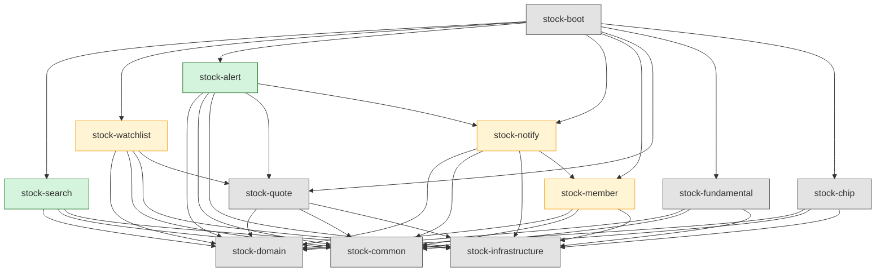
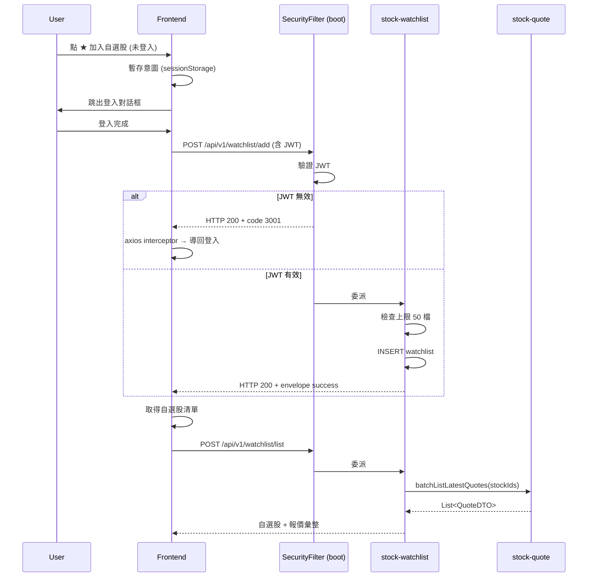
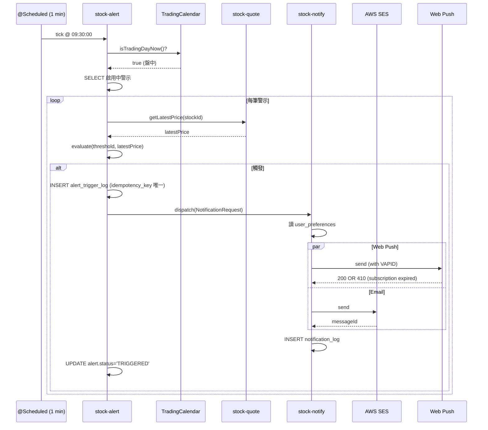
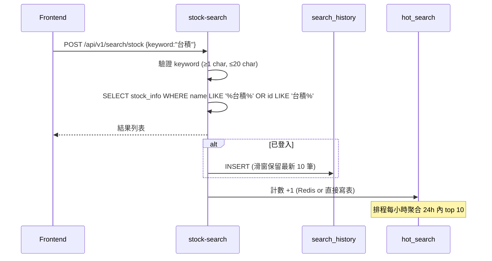
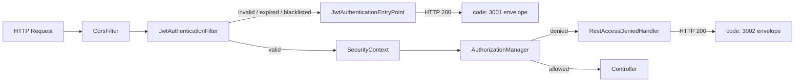

# Wave 3 專案架構（v0.3.0）

> **文件版本**：v1.0
> **撰寫者**：Preston（資深專案架構師）
> **撰寫日期**：2026-04-23
> **狀態**：✅ 正式（待 4 票投票通過後鎖定）
> **上游文件**：
> - [PRD v1.0](../../02_product/20260423_wave3_PRD.md)
> - [9 項決策紀錄](../../01_leader/decisions/20260423_decision-wave2-wave3-9items.md)
> - [Wave 2 ProjectArch](20260421_ProjectArch_stock-backend.md)
> - [Wave 2 部署架構](../system/20260423_wave2_deployment_architecture.md)
> **同層文件**：
> - [Module Breakdown](20260423_wave3_module-breakdown.md)
> - [ER Diagram](20260423_wave3_er-diagram.md)
> - [Flyway Migration Plan](20260423_wave3_flyway-migration-plan.md)

---

## 0. 對齊紀錄

本架構依 PRD v1.0 與 9 項決策設計，特別對齊以下 4 個拍板項目：

| 決策 | 對應架構章節 |
|------|--------------|
| D-05 廣度 5 功能 | §3 模組劃分（新增 3 模組 + 落地 2 placeholder） |
| D-06 強制登入 | §5 跨模組授權契約（無匿名路徑） |
| D-07 Web Push + Email | §3.4 stock-notify、§4.3 推播時序 |
| D-08 HTTP 200 + code 3001 | §6 Spring Security 整合（客製 EntryPoint） |

**重大調整**（與任務描述不同的工程考量）：

1. **不新建 `stock-auth` 模組**：Wave 1 已有 `stock-member` 模組（含 JWT、PasswordEncoder、Login/Refresh API、`users` / `user_preferences` 表）。Wave 3 改為 **「Spring Security 整合到 stock-member」+ 新增 `refresh_token` 表**，避免重複設計與表名衝突。
2. **不新建 `stock-notification` 模組**：Wave 1 已有 `stock-notify` 空殼。Wave 3 改為 **落地實作 stock-notify**（Web Push VAPID + AWS SES + audit log）。
3. **新增 3 個落地模組**：`stock-search`（含搜尋歷史 / 熱門搜尋）、`stock-watchlist`（落地）、`stock-alert`（價格警示引擎 + 警示 CRUD）。
4. **PostgreSQL 16**：`relational-database.md` 雖檔名 rename 但內容仍是 Oracle 範例。本文件依 Wave 2 V2.0.0 migration 既有慣例（PostgreSQL 16 + VARCHAR/NUMERIC/TIMESTAMP WITHOUT TIME ZONE）設計，**不使用 VARCHAR2 / NUMBER**。

---

## 1. 模組總覽（Wave 3 後）

```
stock-platform/                       (parent pom)
├── stock-common                     # 共用 envelope、exception、utils（Wave 1）
├── stock-domain                     # 共用 enum、constant（Wave 1）
├── stock-infrastructure             # DataSource、Redis、AWS SDK config（Wave 1）
├── stock-member                     # ✏ Wave 3 擴充：Spring Security + refresh_token
├── stock-watchlist                  # ✏ Wave 3 落地：自選股 CRUD + 彙整 API
├── stock-search                     # ✨ Wave 3 新增：個股搜尋 + 歷史 + 熱門
├── stock-alert                      # ✨ Wave 3 新增：價格警示 + 觸發引擎
├── stock-notify                     # ✏ Wave 3 落地：Web Push + Email + audit
├── stock-quote                      # Wave 2，Wave 3 不動
├── stock-fundamental                # Wave 2，Wave 3 不動
├── stock-chip                       # Wave 2，Wave 3 不動
├── stock-technical                  # Wave 2 占位
├── stock-news / stock-risk / stock-score   # 後續 Wave
└── stock-boot                       # 啟動模組（聚合 + Spring Security 主配置）
```

| 標記 | 意義 |
|------|------|
| ✨ 新增 | 全新模組（pom + 套件骨架皆新建） |
| ✏ 落地 | 既有空殼或基礎 placeholder，Wave 3 補完商業邏輯 |
| 不動 | Wave 2 已交付，Wave 3 完全不修改 |

---

## 2. 模組依賴圖



**依賴規則**（ArchUnit 守護）：

1. 任何 Wave 3 模組 → `stock-domain` / `stock-common` / `stock-infrastructure` 為基礎依賴
2. `stock-watchlist` → `stock-quote`（彙整自選股報價需查 quote）
3. `stock-alert` → `stock-quote`（讀即時報價判斷觸發）+ `stock-notify`（觸發後送推播）
4. `stock-notify` → `stock-member`（讀使用者偏好決定 Web Push / Email 開關）
5. **禁止** `stock-quote` / `stock-fundamental` / `stock-chip` 反向依賴 Wave 3 任何模組（Wave 2 不動）
6. **禁止** Wave 3 任何模組互相形成循環依賴（ArchUnit `slices().should().beFreeOfCycles()`）

---

## 3. 各新增 / 變更模組職責

### 3.1 stock-member（✏ 擴充）

**Wave 1 既有**：使用者註冊 / 登入 / Profile / JWT 發行 / Refresh API（記憶體版）

**Wave 3 新增**：
- 新增 `refresh_token` 資料表（持久化 + 黑名單機制）
- 新增 `JwtBlacklistService`（記憶體 → 資料表）
- Spring Security 6 整合（Filter Chain、SecurityConfig、AuthenticationEntryPoint、AccessDeniedHandler）
- 客製 EntryPoint：未授權回 **HTTP 200 + envelope `code: 3001`**（D-08）
- 客製 AccessDeniedHandler：權限不足回 **HTTP 200 + envelope `code: 3002`**

**對外 API**（Wave 3 新增 / 變更）：
- `POST /api/v1/auth/logout`（黑名單該 access token + refresh token）
- 既有 `POST /api/v1/auth/login` / `POST /api/v1/auth/refresh` 不變

### 3.2 stock-watchlist（✏ 落地）

**Wave 1 placeholder** → **Wave 3 落地**

**職責**：
- 自選股新增 / 移除 / 列表
- 自選股彙整 API（10 檔報價一次回，避免 N+1，依靠 stock-quote 批次介面）
- 上限：每使用者 50 檔（PRD §10.3）

**對外 API**：
- `POST /api/v1/watchlist/add`
- `POST /api/v1/watchlist/remove`
- `POST /api/v1/watchlist/list`（含彙整報價）

### 3.3 stock-search（✨ 新增）

**職責**：
- 個股搜尋（中文 LIKE / pg_trgm + 英文代號前綴）
- 自動完成（debounce 由前端處理，後端僅提供 API）
- 熱門搜尋（每小時排程聚合 → `hot_search` 表）
- 搜尋歷史（每使用者最多 10 筆，逾 10 筆滑窗淘汰）
- 股票主檔 `stock_info`（**整合 TWSE + OTC**，Wave 3 一併建立並補資料）

**對外 API**：
- `POST /api/v1/search/stock`（主搜尋，登入 / 未登入皆可）
- `POST /api/v1/search/hot`（熱門搜尋，公開）
- `POST /api/v1/search/history/list`（需登入）
- `POST /api/v1/search/history/remove`（需登入）
- `POST /api/v1/search/history/clear`（需登入）

### 3.4 stock-alert（✨ 新增）

**職責**：
- 價格警示 CRUD（每股最多 5 條）
- 警示觸發引擎（`@Scheduled` 每分鐘掃描，盤中 09:00-13:30 GMT+8）
- TD-7 交易日曆服務整合（假日 / 週末不檢查）
- 觸發 idempotency（`alert_trigger_log` + 唯一鍵）
- 觸發後呼叫 `stock-notify` 送推播

**對外 API**：
- `POST /api/v1/alert/create`
- `POST /api/v1/alert/update`
- `POST /api/v1/alert/delete`
- `POST /api/v1/alert/list`

**內部介面**（給 stock-notify 使用，Java interface）：
- `AlertNotificationDispatcher#dispatch(AlertTrigger)`：解耦觸發與推播

### 3.5 stock-notify（✏ 落地）

**Wave 1 placeholder** → **Wave 3 落地**

**職責**：
- Web Push（VAPID 協定，public/private key 由 AWS Secrets Manager 管）
- Email（AWS SES，模板 i18n）
- 推播管道偏好讀取（依 `user_preferences` `notify_web_enabled` / `notify_email_enabled`）
- 推播失敗降級（Web Push 失敗 → 自動 Email；Email 失敗 → audit log only）
- `notification_log` 寫入（送達追蹤）
- VAPID push subscription 管理（`push_subscription` 表）

**對外 API**：
- `POST /api/v1/notify/subscribe`（前端註冊 push subscription）
- `POST /api/v1/notify/unsubscribe`
- `POST /api/v1/notify/test`（Settings 頁測試推播）

**內部介面**：
- `NotificationDispatcher#dispatch(NotificationRequest)`：給 `stock-alert` 使用

---

## 4. 跨模組互動時序

### 4.1 加入自選股（含未登入登入後補做）



### 4.2 價格警示觸發



### 4.3 個股搜尋（含搜尋歷史寫入）



---

## 5. 跨模組授權契約

### 5.1 公開 API（無需 JWT）

- `POST /api/v1/auth/login`
- `POST /api/v1/auth/register`
- `POST /api/v1/auth/refresh`
- `POST /api/v1/search/stock`（搜尋本身公開）
- `POST /api/v1/search/hot`（熱門搜尋公開）
- `GET /api/v1/quote/**`、`GET /api/v1/fundamental/**`、`GET /api/v1/chip/**`（StockDetail 公開頁，沿用 Wave 2）
- `/actuator/health/**`、`/v3/api-docs/**`（local/dev/uat 才開）

### 5.2 需 JWT 的 API（D-06 強制登入）

- `/api/v1/watchlist/**`
- `/api/v1/alert/**`
- `/api/v1/search/history/**`
- `/api/v1/notify/**`
- `/api/v1/auth/logout`
- `/api/v1/member/**`（Profile）

### 5.3 未授權回應（D-08）

```json
{
  "code": 3001,
  "message": "未登入",
  "timestamp": "2026-04-23T10:30:45.123+08:00",
  "traceId": "abc-123"
}
```
- HTTP status：**200**（非 401）
- 由 `stock-member.security.JwtAuthenticationEntryPoint` 統一輸出

### 5.4 權限不足

```json
{
  "code": 3002,
  "message": "無權限",
  "timestamp": "...",
  "traceId": "..."
}
```
- HTTP status：**200**（非 403）
- 由 `stock-member.security.RestAccessDeniedHandler` 統一輸出
- Wave 3 暫無 Role 區分（單一一般使用者），預留未來 Admin 角色

---

## 6. Spring Security 整合架構



**設定主檔位置**：`stock-boot/src/main/java/.../config/SecurityConfig.java`

**關鍵 Bean**：
- `SecurityFilterChain securityFilterChain(HttpSecurity http)`
- `JwtAuthenticationFilter jwtAuthenticationFilter`
- `JwtAuthenticationEntryPoint jwtAuthenticationEntryPoint`
- `RestAccessDeniedHandler restAccessDeniedHandler`
- `AuthenticationManager authenticationManager(AuthenticationConfiguration config)`

**Stateless**：`SessionCreationPolicy.STATELESS`（不使用 HttpSession）

**CSRF**：關閉（純 JWT API；前端為 SPA + Bearer Token）

**CORS**：
- local：`http://localhost:5173`
- dev：`https://dev.stock.example.com`
- prod：`https://stock.example.com`
- **禁止** `*`

---

## 7. 設計模式應用

| 模式 | 應用位置 | 理由 |
|------|----------|------|
| **Strategy** | `AlertEvaluator`（PriceBreakUpEvaluator / PriceBreakDownEvaluator / DailyChangeEvaluator） | 警示類型多樣，依 `alert_type` 切換評估策略 |
| **Strategy** | `NotificationChannel`（WebPushChannel / EmailChannel） | 推播管道可獨立啟停與失敗降級 |
| **Factory** | `AlertEvaluatorFactory` | 依 `alert_type` 取得對應 Strategy（Spring 容器注入） |
| **Template Method** | `AbstractNotificationChannel#send` | 統一 `pre-check → 送出 → 寫 log` 流程 |
| **Builder** | `NotificationRequest`、`AlertTrigger`（Java record + static of()） | 多欄位物件建構清楚 |
| **Decorator** | `JwtAuthenticationFilter` 包裹 Spring Security 預設流程 | 攔截 + envelope 統一輸出 |
| **Observer / Event** | `ApplicationEventPublisher.publishEvent(AlertTriggeredEvent)` | 解耦警示觸發與推播；測試易 mock |
| **Repository** | MyBatis `*Mapper` interface | 沿用 Wave 1/2 慣例 |
| **DTO + Convertor (MapStruct)** | 各模組 `convertor/` package | 沿用 Wave 1/2 慣例，新模組同樣使用 |

---

## 8. Configuration 策略

### 8.1 Profile 對照

| Profile | 用途 | Web Push / Email | DB | Secrets |
|---------|------|------------------|----|---------|
| local | 本機開發 | Web Push 用測試 VAPID key（明碼於 yml）；Email 用 MailHog（Docker） | PostgreSQL Testcontainers 或本機 docker | 明碼 |
| dev | 整合 | Web Push 用 dev VAPID key（從 AWS Secrets Manager 讀）；Email AWS SES Sandbox | RDS dev | AWS Secrets Manager |
| uat | 內部驗證 | 同 prod 配置但獨立 SES 識別 | RDS uat | AWS Secrets Manager |
| prod | 正式 | 正式 VAPID key、SES 正式網域 | RDS prod Multi-AZ | AWS Secrets Manager + KMS |

### 8.2 application-{profile}.yml 新增段

```yaml
# Wave 3 新增配置鍵（各 profile 必設）
stock:
  alert:
    scheduler:
      enabled: true              # local 可關閉避免干擾測試
      cron: "0 * 9-13 * * MON-FRI"
      market-close-time: "13:30"
  notify:
    web-push:
      vapid-public-key: ${VAPID_PUBLIC_KEY}
      vapid-private-key: ${VAPID_PRIVATE_KEY}
      vapid-subject: "mailto:ops@stock.example.com"
    email:
      from: "no-reply@stock.example.com"
      ses-region: ap-northeast-1
      enabled: true
  search:
    history:
      max-per-user: 10
    hot:
      refresh-cron: "0 0 * * * *"   # 每小時整點
      min-count-threshold: 3        # 隱私：< 3 次不入榜
  watchlist:
    max-per-user: 50
  member:
    refresh-token-ttl-days: 7
    access-token-ttl-minutes: 15
```

### 8.3 禁止事項

- 禁止在 prod yml 寫 VAPID private key 明碼（必須走 AWS Secrets Manager）
- 禁止在任何 profile 啟用本地快取 fallback（依 `system-design` 原則）
- 禁止使用嵌套變數 `${A:${B:default}}`

---

## 9. 例外處理架構

### 9.1 模組例外類別

每個 Wave 3 模組各自定義 `BusinessException` 子類，集中於 `exception/` package：

| 模組 | 例外 | 對應 Envelope code |
|------|------|--------------------|
| stock-watchlist | `WatchlistLimitExceededException` | 4101（自選股已達 50 檔上限）|
| stock-watchlist | `WatchlistDuplicateException` | 4102（已加入過）|
| stock-search | `SearchKeywordInvalidException` | 1101（關鍵字格式錯誤）|
| stock-alert | `AlertLimitExceededException` | 4201（每股警示已達 5 條上限）|
| stock-alert | `AlertNotFoundException` | 4202 |
| stock-alert | `AlertInvalidThresholdException` | 1201（threshold 不合理，例如負值）|
| stock-notify | `PushSubscriptionExpiredException` | 5101（推播訂閱失效，需重新訂閱）|
| stock-notify | `NotificationDispatchFailedException` | 5102 |
| stock-member | `JwtBlacklistedException` | 3003（token 已被登出）|

### 9.2 GlobalExceptionHandler（位於 stock-boot）

沿用 Wave 1/2 既有 `@RestControllerAdvice`，新增上述例外的 mapping。**不**為每個模組各自寫 ExceptionHandler，避免分散。

### 9.3 errorCodes 中央表

新增條目寫入 `docs/03_spec/20260422_errorCodes_central.md`（由 Peter 補完 SRS 時同步）。

---

## 10. AOP 設計

| Aspect | 切入點 | 用途 |
|--------|--------|------|
| `LoggingAspect`（既有） | 所有 `@RestController` 方法 | 請求 / 回應日誌（含 traceId） |
| `AuditAspect`（新增） | `@Auditable` 註解的方法（自選新增 / 警示新增 / 搜尋查詢） | 寫 `audit_logs` 表（沿用 Wave 1） |
| `RateLimitAspect`（建議 Wave 3 評估） | `@RateLimit` 註解的方法 | 簡易記憶體限流（搜尋 API 防爬蟲） |

**注意**：限流如需跨節點生效須走 API Gateway，本 Wave 暫不導入分散式限流（Redis-based）。

---

## 11. 資料庫設計概要

詳見 [ER Diagram](20260423_wave3_er-diagram.md)。

**Wave 3 新增 8 張表**：
1. `stock_info`（股票主檔，搜尋用，TWSE + OTC）
2. `search_history`（搜尋歷史）
3. `hot_search`（熱門搜尋彙總）
4. `watchlist`（自選股）
5. `price_alert`（價格警示）
6. `alert_trigger_log`（警示觸發紀錄，含 idempotency key）
7. `refresh_token`（refresh token 黑名單 / 登出機制）
8. `push_subscription`（Web Push VAPID 訂閱）
9. `notification_log`（推播送達紀錄）

實際 9 張，超出任務描述提示的 8 張：因為 `notification_log` 需獨立記錄送達狀態，無法併入其他表。

**沿用 Wave 1/2 既有表**：`users`、`user_preferences`、`audit_logs`、`stock_quote`、`stock_fundamental`、`stock_chip`

**Wave 3 不修改 Wave 1/2 既有表結構**（任何欄位變更要走獨立 ADR）。

**索引策略**：詳見 ER 文件，重點：
- 高頻查詢：`watchlist (user_id, stock_id)` 唯一複合
- prefix 查詢：`stock_info` 名稱用 pg_trgm GIN，代號用 BTREE
- 排序：`search_history (user_id, searched_at DESC)`

---

## 12. 反模式（Anti-Pattern）警示

Preston 主動標示以下 Wave 3 設計時必須避免的陷阱：

| Anti-Pattern | 風險 | 對策 |
|--------------|------|------|
| ❌ 警示觸發直接呼叫 SES API（無 idempotency） | 同一 alert 重複推播 | 必須先寫 `alert_trigger_log` 唯一鍵約束（`alert_id + trade_date`） |
| ❌ 自選股彙整 N+1（for each stock 查 quote） | API P95 爆炸 | 必須 `stock-quote` 提供 `batchListLatestQuotes(List<String>)` 介面 |
| ❌ 搜尋歷史 unbounded growth | 表持續膨脹 | 滑窗淘汰：插入時 `DELETE WHERE rownum > 10`（PG 用 `DELETE … WHERE id IN (SELECT id … OFFSET 10)`） |
| ❌ 在 Service 內 `new BCryptPasswordEncoder()` | 多實例 cost 不一致、IO 抖動 | 由 Spring Bean 統一注入（已有） |
| ❌ Web Push VAPID private key 寫死於 yml | 安全漏洞 | 一律走 AWS Secrets Manager；local 用獨立測試金鑰 |
| ❌ 警示 `@Scheduled` 在多 Pod 重複執行 | 重複觸發 | 採 ShedLock（PostgreSQL `shedlock` 表）或 Wave 3 暫保證單 Pod；scaling 前必須補強 |
| ❌ `users` 表新增欄位（如 last_login） | 影響 Wave 1/2 既有 PO | 改用獨立 `user_login_log` 表 |
| ❌ 跨模組直接 `@Autowired Mapper` | 破壞模組邊界 | 跨模組互動一律走 Service interface（domain 提供）|
| ❌ Frontend 直接呼叫 `localStorage` 暫存自選股 | 違反 D-06 強制登入決策 | 一律 API + 後端持久化 |
| ❌ HTTP 401 漏網 | 違反 D-08 envelope 規範 | 必須跑契約測試確認所有路徑都回 200 |

---

## 13. 開發優先序建議

依 PRD §10.1 6 週時程倒推：

| 週次 | 模組優先序 | 關鍵交付 |
|------|------------|----------|
| W1（本週） | 架構定稿 | 本文件 + ER + Migration Plan |
| W2 | stock-member（Spring Security 整合） | F-W3-04 完成 → 解鎖其他 endpoint 保護 |
| W2 | stock-search（含 stock_info 主檔匯入） | F-W3-01 主檔資料準備 |
| W3 | stock-watchlist + stock-search 落地 | F-W3-01 / F-W3-02 / F-W3-05 完成 |
| W3-4 | stock-alert + stock-notify | F-W3-03 完成（推播管道） |
| W5 | Code Review + QA | Brian/Fiona Review、整合測試 |
| W6 | 滲透測試 + Hotfix | OWASP ZAP + 第三方滲透 |

**關鍵相依**：
- stock-watchlist 需等 `stock-quote.batchListLatestQuotes` 介面（跨Wave-7 N+1 優化）
- stock-alert 需等 TD-7 交易日曆服務
- stock-notify 需等 stock-member 完成 `user_preferences` `notify_*_enabled` 讀取 API

---

## 14. 給 Sophia 的協作請求

以下決定需 Sophia（系統架構）配合敲定，Preston 列出建議方向但**不單方面拍板**：

| # | 議題 | Preston 建議 | Sophia 須回覆 |
|---|------|--------------|---------------|
| S1 | VAPID key 儲存位置 | AWS Secrets Manager（與 JWT secret 同一管道） | ✅ / ❌ + 替代方案 |
| S2 | Web Push 實作 lib | `nl.martijndwars:web-push` 或 `com.googlecode.web-push` | 確認版本與 CVE 狀態（轉 Linus） |
| S3 | Email 寄信服務 | AWS SES（Wave 2 部署架構已預留） | 確認 SES 已開通 production access |
| S4 | `@Scheduled` 多 Pod 防重 | Wave 3 先單 Pod，待 v0.4.0 評估 ShedLock | 確認 prod 是否單 Pod；Blue-Green 切換時是否短暫雙 Pod |
| S5 | 搜尋熱門排序的儲存 | 寫 `hot_search` 表 + 每小時排程聚合 | 是否需引入 Redis ZSET 加速？（Wave 3 評估足夠 / 否則延 Wave 4） |
| S6 | Spring Security 主配置位置 | 放 `stock-boot.config.SecurityConfig`（避免 stock-member 反向依賴 Filter Chain） | 確認與 Wave 2 Boot 配置不衝突 |
| S7 | 滲透測試廠商選定（D-02/D-09） | — | 仍待使用者親簽 |
| S8 | `stock_info` 主檔資料來源 | TWSE OpenAPI + OTC（櫃買中心）每日下載 | 是否需排程入庫？頻率？ |
| S9 | pg_trgm extension 啟用 | Migration `CREATE EXTENSION IF NOT EXISTS pg_trgm` | RDS 是否已啟用？權限問題確認 |

---

## 15. 投票項目（4 票機制）

本文件交付後請 Jamie 啟動 4 票投票：

| 投票議題 | 預期立場 |
|----------|----------|
| Q1：是否同意「不新建 stock-auth，整合到 stock-member」？ | Brian 高度相關（後端） |
| Q2：是否同意「Wave 3 新增 3 模組（search / alert）+ 落地 2 模組（watchlist / notify）」？ | Sophia 高度相關（系統） |
| Q3：是否同意「Wave 3 暫不導入 ShedLock，保持單 Pod 部署」？ | Sophia / Brian |
| Q4：是否同意「pg_trgm 用於中文搜尋」？（替代方案：簡化為 LIKE，效能差但無 extension 依賴） | Brian / Sophia |

---

## 16. 變更歷史

| 日期 | 版本 | 變更 | 作者 |
|------|------|------|------|
| 2026-04-23 | v1.0 | 初版 | Preston |
