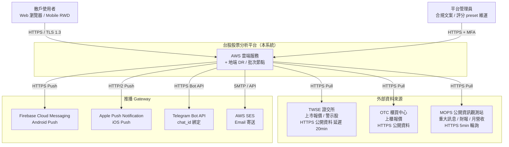
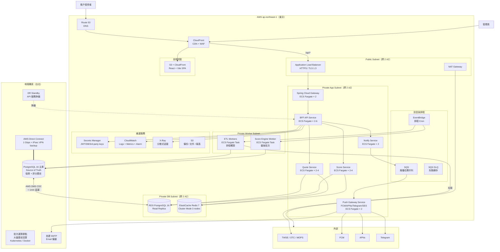
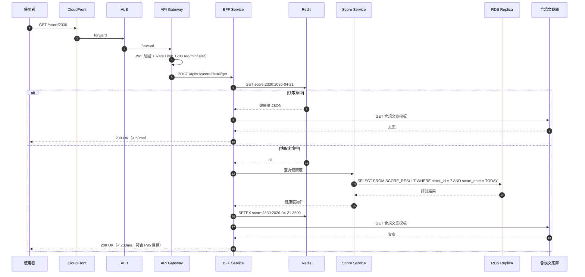
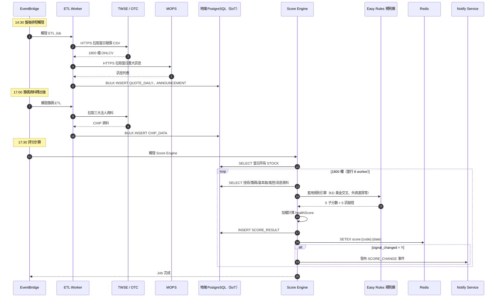
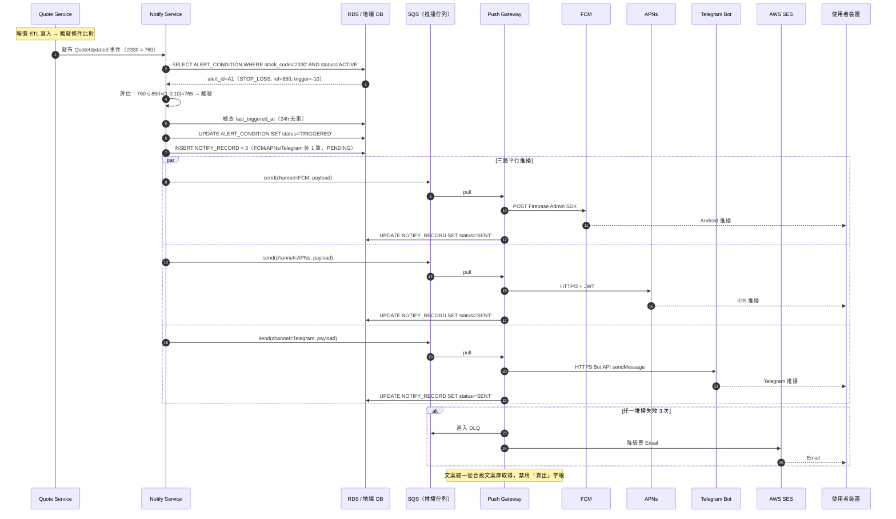

# 系統架構：台股股票分析與追蹤平台 MVP

- **文件版本**：v1.0
- **架構師**：Sophia（資深系統架構師）
- **日期**：2026-04-21
- **對應 PRD**：[20260421_PRD_stock-analysis-mvp.md](../../02_product/20260421_PRD_stock-analysis-mvp.md)
- **對應 SRS**：[20260421_SRS_stock-analysis-mvp.md](../../03_spec/20260421_SRS_stock-analysis-mvp.md)
- **拍板決策**：
  - [PRD Top3 拍板](../../01_leader/decisions/20260421_decision-prd-top3.md)（D1 合規 / D2 AWS+地端 / D3 Q4 上線）
  - [SRS 延伸 3 議題拍板](../../01_leader/decisions/20260421_decision-srs-extension.md)（P1 評分權重 / P2 歷史評分 / P3 推播管道 / D-Redis 分散式快取）

---

## 0. 執行摘要

本架構為**台股散戶分析平台**設計的 **AWS（ap-northeast-1 東京）+ 地端（台北機房）混合架構**。

**核心架構決策**：

1. **AWS 為主、地端為輔**：對外服務、彈性擴展、推播 gateway 全置於 AWS；地端定位為「**敏感個資主庫 + 批次運算節點 + 災難復原節點**」，符合台灣個資法資料在地化建議與 D2 拍板要求
2. **計算選 ECS Fargate**：無需管理節點、啟動快、適合 1 萬 MAU 規模，後續若超過 5 萬 MAU 可平滑遷移至 EKS
3. **資料庫選 PostgreSQL**：取代原 PROJECT.md 預設 Oracle（已在 PRD Q2 拍板採納），免授權費、JSONB 與時序資料支援優於 MySQL
4. **三路推播 Gateway**：FCM + APNs + Telegram Bot（呼應 P3 拍板，排除已停服的 LINE Notify）
5. **合規文案動態化**：所有 UI / 推播文案統一從「合規文案庫」（PostgreSQL + Redis 快取）取得，符合 D1 拍板「不出現買賣建議字眼」要求，且支援不發版即可更新

**總體月費粗估**：USD **$3,200 ~ $4,500**（AWS）+ NTD **$25,000 ~ $40,000**（地端電費 / 機櫃 / 維運）

---

## 1. 架構概覽

### 1.1 系統定位

本系統屬「**面向 C 端散戶的金融資訊呈現平台**」，並非投顧、不涉下單，依 D1 拍板**完全不提供投資建議**。系統與外部世界的關係：

- **上游**：TWSE / OTC / MOPS（行情與公告資料來源，僅公開延遲 20 分鐘資料）
- **下游**：FCM / APNs / Telegram Bot（訊息推播 gateway）、AWS SES（Email）
- **本系統職責**：資料蒐集 → 標準化儲存 → 規則引擎評分 → API 對外服務 → 條件達成提醒推播

### 1.2 C4 Context Diagram（Level 1）



### 1.3 元素說明

| 元素 | 角色 | 連線方式 | SLA 期望 |
|------|------|----------|----------|
| 散戶使用者 | 主要終端使用者 | HTTPS（CloudFront） | 99.9% |
| 平台管理員 | 內部維運（合規文案、preset 權重、警示） | HTTPS + MFA + IP 白名單 | 99.9% |
| TWSE / OTC | 報價、警示股資料源 | 公開 HTTPS、20 分鐘延遲 | 對方非保證 SLA |
| MOPS | 重大訊息、財報資料源 | 公開 HTTPS、5 分鐘輪詢 | 對方非保證 SLA |
| FCM | Android 推播 | HTTPS / Firebase Admin SDK | 99.95% |
| APNs | iOS 推播 | HTTP/2 + JWT | 99.95% |
| Telegram Bot | Telegram 推播 | HTTPS Bot API | 99.9% |
| AWS SES | Email 推播 | API / SMTP | 99.9% |

---

## 2. 系統邊界

### 2.1 範圍內

- 會員、自選股、行情、技術指標、籌碼、基本面、消息、風控、AI 評分、推播等 10 個 SRS 模組
- 47 個 REST API
- AWS 雲端基礎設施、地端機房整合
- 三路推播 gateway 整合
- 評分權重個人化（P1 拍板：4 種 preset + 滑桿微調）
- 歷史評分查詢（P2 拍板：6 個月 / 1 年 / 3 年）

### 2.2 範圍外

- TWSE / OTC / MOPS 內部運作與 SLA
- FCM / APNs / Telegram / SES 內部運作
- 第三方付費行情 API（v2 評估）
- 機器學習評分模型（v2 評估，v1 採規則引擎）
- 下單交易、模擬交易、社群討論
- 原生 Mobile App（v1 採 Web RWD）

### 2.3 系統間契約

| 對外系統 | 介面 | 同步性 | 對方 SLA | 備援 |
|----------|------|--------|----------|------|
| TWSE | HTTPS + 公開 CSV/JSON | 非同步（排程拉取） | 無保證 | 5 分鐘重試 + 地端快取舊資料 |
| OTC | HTTPS + 公開 CSV/JSON | 非同步 | 無保證 | 同上 |
| MOPS | HTTPS + HTML / API | 非同步（5 分鐘輪詢） | 無保證 | 同上 |
| FCM | Firebase Admin SDK | 非同步（透過 SQS） | 99.95% | 失敗重送 + 降級 Email |
| APNs | HTTP/2 + JWT | 非同步（透過 SQS） | 99.95% | 同上 |
| Telegram | HTTPS Bot API | 非同步（透過 SQS） | 99.9% | 失敗重送 + 降級 Email |
| AWS SES | API | 非同步 | 99.9% | 自建 SMTP（地端）作為備援通道 |

---

## 3. C4 Container Diagram（Level 2）

### 3.1 整體容器圖



### 3.2 容器（Container）職責表

| 容器 | 部署位置 | 技術 | 職責 |
|------|---------|------|------|
| CloudFront + WAF | AWS Edge | AWS Managed | CDN、DDoS 防護、OWASP 規則 |
| Application Load Balancer | AWS Public Subnet | AWS Managed | TLS 終結、路由 |
| API Gateway | AWS Private Subnet | Spring Cloud Gateway 4.x | 路由、限流、JWT 預驗證 |
| BFF API Service | AWS Private Subnet | Spring Boot 3 | 47 個 REST API、組合下游服務 |
| Quote Service | AWS Private Subnet | Spring Boot 3 | 行情查詢、技術指標讀取 |
| Score Service | AWS Private Subnet | Spring Boot 3 | 健康度查詢、preset 管理、評分明細 |
| Notify Service | AWS Private Subnet | Spring Boot 3 | 條件達成提醒 CRUD、推播紀錄 |
| Push Gateway Service | AWS Private Subnet | Spring Boot 3 | 三路推播 + Email 統一介面 |
| ETL Workers | AWS Private Subnet | Spring Boot 3 + Spring Batch | TWSE/OTC/MOPS 資料拉取與正規化 |
| Score Engine Worker | AWS Private Subnet | Spring Boot 3 + Easy Rules | 盤後批次計算 1800 檔健康度 |
| PostgreSQL 主庫 | 地端 | PostgreSQL 16 | Source of Truth：個資、評分歷史、合規文案 |
| RDS PostgreSQL Replica | AWS DB Subnet | RDS for PostgreSQL 16 | 唯讀副本，承擔 95% 讀流量 |
| ElastiCache Redis | AWS DB Subnet | Redis 7 Cluster Mode | 健康度快取、報價快取、Session、限流計數 |
| SQS | AWS | AWS Managed | 推播任務佇列、跨服務解耦 |
| EventBridge | AWS | AWS Managed | 排程觸發（盤後 14:30、籌碼 17:00、早盤 08:00） |
| Secrets Manager | AWS | AWS Managed | DB password、JWT secret、第三方 API key |
| CloudWatch / X-Ray | AWS | AWS Managed | Logs、Metrics、分散式追蹤 |
| S3 | AWS | AWS Managed | 備份歸檔、靜態檔、文件 |
| 地端批次節點 | 地端 | Kubernetes / Docker | 歷史資料大量回算（3 年回測） |
| 地端 DR Standby | 地端 | Spring Boot 3 + Nginx | AWS 全區故障時熱備 API |
| 地端 SMTP | 地端 | Postfix | Email 備援通道 |

---

## 4. AWS 雲端架構

### 4.1 區域與可用區

- **主要 Region**：`ap-northeast-1`（東京）— 對台灣延遲 < 50ms
- **DR Region**：搭配地端機房（不額外採購 ap-southeast-1，控制成本）
- **多 AZ**：跨 `ap-northeast-1a` 與 `ap-northeast-1c`

### 4.2 VPC 與 Subnet 設計

| Subnet | CIDR | AZ | 用途 |
|--------|------|-----|------|
| public-a | 10.10.1.0/24 | ap-northeast-1a | ALB / NAT Gateway |
| public-c | 10.10.2.0/24 | ap-northeast-1c | ALB / NAT Gateway |
| private-app-a | 10.10.10.0/24 | ap-northeast-1a | ECS Fargate（API/BFF/各服務） |
| private-app-c | 10.10.11.0/24 | ap-northeast-1c | ECS Fargate |
| private-worker-a | 10.10.20.0/24 | ap-northeast-1a | ETL / Score Engine Workers |
| private-worker-c | 10.10.21.0/24 | ap-northeast-1c | ETL / Score Engine Workers |
| db-a | 10.10.30.0/24 | ap-northeast-1a | RDS Replica Primary |
| db-c | 10.10.31.0/24 | ap-northeast-1c | RDS Replica Standby |
| cache-a | 10.10.40.0/24 | ap-northeast-1a | ElastiCache Redis |
| cache-c | 10.10.41.0/24 | ap-northeast-1c | ElastiCache Redis |
| dx-gateway | 10.10.50.0/28 | - | Direct Connect Gateway 對接地端 |

VPC CIDR：`10.10.0.0/16`（與地端 `10.20.0.0/16` 完全不重疊）

### 4.3 AWS 服務清單

| 用途 | 選定服務 | 規格（v1） | 月費粗估（USD） |
|------|----------|-----------|-----------------|
| CDN + WAF | CloudFront + AWS WAF | 含 OWASP 規則集 | 80 |
| 負載平衡 | ALB | 跨 2 AZ | 35 |
| 容器計算 | ECS Fargate | 平均 12 tasks × 1 vCPU × 2GB | 480 |
| 資料庫副本 | RDS PostgreSQL 16 | db.r6g.large Multi-AZ Read Replica | 420 |
| 快取 | ElastiCache Redis 7 | cache.m6g.large × 3（cluster mode） | 360 |
| 訊息佇列 | SQS | 3 個 queue + 3 個 DLQ | 15 |
| 排程 | EventBridge | 約 50 條規則 | 5 |
| 物件儲存 | S3 | 500 GB + 跨區複製 | 30 |
| Email | SES | 30 萬封/月 | 30 |
| API Gateway | 自建 Spring Cloud Gateway（含於 ECS 費用） | - | 0 |
| 機密管理 | Secrets Manager | 30 個 secret | 15 |
| 監控 | CloudWatch | Logs 100 GB + Metrics + Alarm | 200 |
| 追蹤 | X-Ray | 約 1500 萬 trace/月 | 75 |
| Direct Connect | 1 Gbps Hosted Connection | 透過合作 ISP | 300 |
| Data Transfer | 出 AWS 流量 | 約 2 TB/月 | 180 |
| DNS | Route 53 | 1 hosted zone | 5 |
| KMS | 加密金鑰 | 5 個 CMK | 5 |
| **AWS 小計** | - | - | **~2,235** |
| **+ 預留爆量緩衝（30%）** | - | - | **~670** |
| **AWS 月費總計** | - | - | **~2,900 USD（高峰可至 4,500）** |

### 4.4 安全群組（SG）設計

| SG | Inbound | Outbound |
|----|---------|----------|
| sg-alb | 443 from 0.0.0.0/0 | 8080 to sg-app |
| sg-app | 8080 from sg-alb | 5432 to sg-db、6379 to sg-cache、443 to internet |
| sg-worker | - | 5432 to sg-db、443 to TWSE/OTC/MOPS |
| sg-db | 5432 from sg-app、sg-worker | - |
| sg-cache | 6379 from sg-app | - |

**禁止**：DB / Cache Subnet 不開 Public IP、無 NAT 路由

---

## 5. 地端架構

### 5.1 地端定位（Sophia 建議）

依 D2 拍板「AWS + 地端混合」並評估成本與合規效益後，**地端建議承擔以下三個職責**：

| 職責 | 理由 |
|------|------|
| **個資與會員主庫（Source of Truth）** | 台灣個資法雖未強制資料在地化，但金融類使用者較信任本地儲存；且地端 DB 可避免跨境傳輸合規疑慮 |
| **批次運算節點** | 1800 檔 × 3 年 = 200 萬筆歷史評分一次性回算（P2 拍板需求），於地端執行可省去 AWS 巨量計算費 |
| **災難復原熱備（DR Standby）** | AWS ap-northeast-1 整區故障（歷史上發生過 2 次/年）時，可切換到地端維持基本服務 |

**不建議**：將「**對外即時 API**」放地端 — 地端機房對外頻寬與 BGP 多線通常劣於 AWS

### 5.2 機房硬體規格建議

| 角色 | CPU | RAM | Disk | Network | 數量 | 用途 |
|------|-----|-----|------|---------|------|------|
| DB Server（PostgreSQL 主庫） | 16 vCPU | 64 GB | 2 TB NVMe SSD（RAID 10） | 10 GbE | 1 主 + 1 同步 standby | 個資與評分歷史主庫 |
| Batch Server（K8s Worker） | 16 vCPU | 32 GB | 500 GB SSD | 10 GbE | 2 | 歷史回算、ML 模型 v2 預留 |
| DR Standby Server | 8 vCPU | 16 GB | 200 GB SSD | 10 GbE | 2 | API 熱備 |
| SMTP Relay | 4 vCPU | 8 GB | 100 GB SSD | 1 GbE | 1 | Email 備援 |
| Bastion / Monitor | 4 vCPU | 8 GB | 100 GB SSD | 1 GbE | 1 | Prometheus + Grafana 收集地端指標、SSH 跳板 |

**機房環境**：
- UPS 不斷電 + 雙路電源
- 機櫃級恆溫恆濕
- 24/7 上架／斷電監控

**地端月費粗估**：機櫃租用 NTD 15,000 + 電費 NTD 8,000 + 維運外包 NTD 12,000 = **約 NTD 35,000/月**

### 5.3 AWS ↔ 地端連線方式比較

| 比較項 | Site-to-Site VPN | Direct Connect | Sophia 建議 |
|--------|------------------|----------------|-------------|
| 頻寬 | 1.25 Gbps（單通道） | 1 Gbps / 10 Gbps | DX 1 Gbps |
| 延遲 | 30 ~ 80 ms（網際網路） | 5 ~ 15 ms（專線） | DX |
| 穩定性 | 受網際網路影響 | 高 | DX |
| 月費 | 約 USD 40 | USD 300（透過 AWS Partner）+ ISP 專線 NTD 30,000 | DX |
| 建置時間 | 1 天 | 4 ~ 8 週 | DX 為主、VPN 為 backup |

**結論**：採 **Direct Connect 1 Gbps 為主 + Site-to-Site VPN 為 failover backup**，符合金融類資料同步可靠性與延遲需求。

---

## 6. AWS ↔ 地端資料同步策略

### 6.1 主從關係定義（Source of Truth）

| 資料類別 | SoT 位置 | 同步方向 | 機制 |
|---------|---------|----------|------|
| 會員資料（USER_INFO） | **地端** | 地端 → AWS RDS Replica | AWS DMS CDC（< 1 min 延遲） |
| 評分歷史（SCORE_RESULT 3 年） | **地端** | 地端 → AWS RDS Replica（最近 6 個月） | DMS CDC + S3 歸檔 |
| 條件達成提醒（ALERT_CONDITION） | **地端** | 雙向（雙寫，地端為仲裁） | 應用層雙寫 + 排程比對 |
| 自選股（WATCHLIST） | **地端** | 地端 → AWS Replica | DMS CDC |
| 股票主檔（STOCK） | **AWS** | AWS → 地端 | DMS CDC（反向） |
| 行情（QUOTE_DAILY） | **AWS** | AWS → 地端歸檔 | DMS CDC（反向） |
| 籌碼（CHIP_DATA） | **AWS** | AWS → 地端歸檔 | DMS CDC（反向） |
| 基本面（FUNDAMENTAL） | **AWS** | AWS → 地端歸檔 | DMS CDC（反向） |
| 重大訊息（ANNOUNCEMENT） | **AWS** | AWS → 地端歸檔 | DMS CDC（反向） |
| 推播紀錄（NOTIFY_RECORD） | **AWS** | 僅 AWS（30 日後 S3 歸檔） | - |
| 合規文案庫（NEW） | **地端** | 地端 → AWS Replica → Redis | DMS + 應用層 cache invalidation |
| Session / JWT 黑名單 | **AWS Redis** | 不同步 | - |

**設計原則**：
- 個資與使用者操作（會員、自選股、提醒、評分歷史）= **地端為 SoT**
- 行情類市場資料（任何人皆可由 TWSE 重抓）= **AWS 為 SoT**
- 此設計確保「即使 AWS 全掛，使用者個資不遺失」

### 6.2 同步機制選擇

| 選項 | 優缺點 | 採用場景 |
|------|-------|----------|
| **AWS DMS CDC** | AWS 託管、PostgreSQL logical replication 原生支援、< 1 min 延遲 | ✅ 主要機制（會員、自選股、評分歷史） |
| **應用層雙寫** | 應用控制細緻、可加業務驗證 | 條件達成提醒（涉及一致性需即時） |
| **S3 + Glue 批次同步** | 低成本、高延遲（1 小時+） | 歷史評分 6 個月以上歸檔 |
| **Kafka Connect** | 通用性強 | ❌ v1 不採（運維複雜） |

### 6.3 Failover 策略

```
正常狀態：
  使用者 → AWS（讀寫）
  AWS RDS Replica → 地端 PostgreSQL（CDC，地端為 SoT）

AWS 故障（單一服務，例 ECS）：
  CloudWatch Alarm → 自動 Auto Scaling 增加 task → 5 分鐘恢復

AWS 整區故障（ap-northeast-1 全掛）：
  1. Route 53 健康檢查偵測（30 秒）
  2. DNS 切換到地端 DR Standby Public IP
  3. 地端 DR Standby 啟用（已熱備）
  4. 地端 PostgreSQL 升為主庫（原本就是 SoT，無需切換）
  5. 預估 RTO：15 ~ 30 分鐘
  6. 服務降級：行情 / 籌碼資料若無法即時拉取，顯示「資料延遲」橫幅
```

### 6.4 一致性保證

- **個資寫入路徑**：應用層 → 地端 PostgreSQL → DMS CDC → AWS Replica（< 1 min 對齊）
- **強一致需求（密碼變更、註銷）**：應用層強制讀地端主庫
- **最終一致需求（自選股、提醒）**：可讀 AWS Replica，容忍 < 1 min 延遲

---

## 7. 資料流圖（Sequence Diagram）

### 7.1 流程一：使用者查看個股健康度（含快取命中／未命中）



**快取策略**：
- Key：`score:{stockCode}:{date}`
- TTL：3600 秒（盤後 14:30 後該日不再變動）
- 失效機制：盤後評分排程完成時主動 SET 新值

### 7.2 流程二：盤後批次計算評分



**規則引擎選型**：採 **Easy Rules**（輕量、Java 原生、規則可外部 YAML 定義），詳見第 8.7 節。

### 7.3 流程三：警示條件達成 → 三路推播



---

## 8. 技術選型決策

### 8.1 後端框架

- **選定**：Spring Boot 3.3.x + Java 21（LTS）
- **替代方案**：

| 方案 | 優點 | 缺點 | 評分 |
|------|------|------|------|
| Spring Boot 3 + Java 21 | 生態最成熟、團隊熟悉、Virtual Threads 解決 IO 並發 | 啟動較慢、記憶體較大 | 9/10 |
| Quarkus 3 | Native Image、低記憶體 | 生態較小、團隊需重新學 | 7/10 |
| Micronaut 4 | AOT、低記憶體 | 學習曲線、社群較小 | 6/10 |

- **理由**：團隊既有經驗 + 全域 CLAUDE.md 規範指定 Spring Boot；Java 21 LTS 的 Virtual Threads 可在 ETL Worker 大量併發 HTTP 拉取時顯著提升吞吐
- **遷移成本**：未來若改 Quarkus 需重寫約 30% 設定與部分 starter

### 8.2 資料庫（取代 Oracle）

- **選定**：PostgreSQL 16
- **替代方案**：

| 方案 | 優點 | 缺點 | 評分 |
|------|------|------|------|
| PostgreSQL 16 | 免授權費、JSONB / 時序 / partition 支援強、台灣社群成熟 | 大型 OLAP 不及 Oracle | 9/10 |
| MySQL 8 | 普及度高 | partition 與時序資料弱於 PG、JSON 支援較弱 | 7/10 |
| Oracle XE | 與 PROJECT.md 預設一致 | 11g/21c XE 容量限制（12GB user data）、商用版本貴、運維成本高 | 5/10 |

- **理由**：
  1. PRD Q2 已拍板採 PostgreSQL（取代 Oracle）
  2. 評分歷史（P2 拍板）需要 200 萬筆/股票 × 1800 檔 = 36 億筆，PG 14+ 的 declarative partitioning 處理優於 MySQL
  3. 合規文案庫使用 JSONB 儲存版本與多語系，PG 原生支援
  4. 後續若資料量大增可平滑升級至 TimescaleDB（PG extension），無需換引擎
- **遷移成本**：MyBatis SQL 中 PG 與 Oracle 語法差異約 5%（DATE 函式、序列），需轉換

### 8.3 快取

- **選定**：Redis 7（ElastiCache Cluster Mode）
- **替代方案**：

| 方案 | 優點 | 缺點 | 評分 |
|------|------|------|------|
| Redis 7 Cluster | 資料結構豐富、TTL 原生、Pub/Sub | 記憶體成本 | 9/10 |
| Memcached | 簡單、純 KV | 無持久化、無資料結構 | 6/10 |
| Hazelcast | Java 原生整合好 | 商業授權、社群較小 | 5/10 |

- **理由**：
  1. D-Redis 拍板允許分散式快取
  2. 報價快取需要 Sorted Set（時序）
  3. 限流需要 INCR + TTL
  4. Spring Session 整合成熟
- **避免本地快取**：嚴格遵守 system-design.md「禁止本地快取」原則，所有 Caffeine / Guava Cache 不採用

### 8.4 訊息佇列

- **選定**：AWS SQS（Standard + FIFO 各一）
- **替代方案**：

| 方案 | 優點 | 缺點 | 評分 |
|------|------|------|------|
| AWS SQS | 全託管、按用量計費、與 ECS / Lambda 整合佳 | 訊息順序需 FIFO（額外成本）、最大保留 14 天 | 9/10 |
| Kafka（MSK） | 高吞吐、可持久化長期、stream processing | 運維重、月費 USD 500+ 起、v1 不需要 | 6/10 |
| RabbitMQ（地端自建） | 路由靈活 | 需自建運維、HA 設計複雜 | 5/10 |

- **理由**：v1 推播量約 30 萬封/天，SQS 完全足夠且月費僅 USD 15。未來若需要 event sourcing / CQRS 可再評估 Kafka

### 8.5 容器編排

- **選定**：ECS Fargate
- **替代方案**：

| 方案 | 優點 | 缺點 | 評分 |
|------|------|------|------|
| ECS Fargate | 無需管 EC2、按 vCPU/RAM 計費、啟動 < 60s | 比 EC2 自管貴 30%、無法用 spot | 9/10 |
| EKS | K8s 標準、生態最大、可跨雲 | Control Plane USD 73/月、運維重、人才需求高 | 7/10 |
| ECS on EC2 | 便宜、可用 Reserved Instance | 需自管 EC2、ASG 設計複雜 | 7/10 |

- **理由**：團隊規模小、v1 服務數約 6 個、無 K8s 專職維運，Fargate 是甜蜜點。地端的批次節點可用 K8s（因有專職維運），雲地端工具不一致可接受
- **未來路徑**：MAU 達 5 萬時評估遷至 EKS（利用 spot + Karpenter 進一步降本）

### 8.6 API Gateway

- **選定**：Spring Cloud Gateway 4.x（自建於 ECS）
- **替代方案**：

| 方案 | 優點 | 缺點 | 評分 |
|------|------|------|------|
| Spring Cloud Gateway | 與 Spring 生態一致、熟悉度高、可寫 Java filter、無額外費用 | 需自管 HA | 9/10 |
| AWS API Gateway | 全託管、與 IAM 整合 | 每 100 萬 req USD 3.5、複雜路由 / JWT 自訂困難 | 7/10 |
| Kong / APISIX | 功能豐富 | 需獨立運維、團隊不熟 | 6/10 |

- **理由**：47 endpoints 流量約 30 萬 req/day = 9 百萬/月，AWS API Gateway 月費 USD 32 看似便宜，但**JWT 自訂驗證、合規文案動態 header 注入** 用 Spring Cloud Gateway 寫 filter 更直接

### 8.7 AI 評分引擎（規則引擎）

- **選定**：Easy Rules 4.x
- **替代方案**：

| 方案 | 優點 | 缺點 | 評分 |
|------|------|------|------|
| Easy Rules | 輕量（< 200KB）、規則可 YAML 定義、易讀 | 不支援複雜推理 | 9/10 |
| Drools | 功能強、社群大、支援 DRL 規則 | 學習曲線陡、過度工程化、效能重 | 6/10 |
| 自寫 Strategy + Spec Pattern | 完全可控、零依賴 | 維護成本高、規則變動需發版 | 7/10 |

- **理由**：
  1. v1 共約 30 條規則（KD 黃金交叉、外資連買、EPS YoY 等），Easy Rules 規模剛好
  2. 規則可外部 YAML 配置，**業務修改不需發版**
  3. 符合「Smart Service, Dumb Database」原則
  4. v2 若引入 ML 評分，可保留 Easy Rules 作為規則層、ML 作為輔助層

### 8.8 行情資料來源

- **選定**：TWSE / OTC / MOPS 公開資料（v1）
- **替代評估**：

| 方案 | 優點 | 缺點 | 月費 |
|------|------|------|------|
| TWSE / OTC / MOPS 公開（v1） | 免費、合規無爭議 | 延遲 20 分鐘、解析需自寫 ETL | $0 |
| 群益 API（v2 評估） | 即時 tick、資料完整 | 需開戶 + 月費 NTD 3,000+、僅限券商客戶 | NTD 3,000+ |
| 玉山證券 API | 即時、完整 | 同上 | NTD 3,000+ |
| FugleAPI | RESTful 友善 | 需付費方案才能商用 | NTD 5,000+ |

- **理由**：
  1. PRD 已明確 v1 採延遲 20 分鐘公開資料
  2. 商用授權須與 TWSE 簽 MOU（**Sophia 風險提示**：公開資料商用是否需付費取決於 TWSE 政策，建議 Jamie 帶回確認）
  3. v2 若達 10 萬 MAU 再評估付費 API ROI

### 8.9 前端與 Mobile

- **選定**：React 18 + TypeScript 5 + Vite 5（遵照 PROJECT.md）
- **行動端**：Web RWD（PRD 已限定 v1 不做原生 App）
- **Push 訂閱**：Web Push（VAPID）+ FCM 接 PWA + APNs 接 Safari Web Push（macOS 13+ / iOS 16.4+ 支援）

### 8.10 IaC

- **AWS 部分**：Terraform 1.7+（state 存 S3 + DynamoDB lock）
- **地端部分**：Ansible 2.16+
- **CI/CD**：Jenkins（既有）+ GitHub Actions（雲端側）

---

## 9. 非功能需求設計

### 9.1 可用性（Availability）

| 服務 | SLA 目標 | 設計手段 |
|------|---------|---------|
| 對外 API（盤中 09:00-13:30） | 99.9%（每月停機 ≤ 43 分鐘） | ECS 跨 2 AZ × 2+ tasks、ALB 自動跨 AZ、RDS Multi-AZ、Redis Cluster |
| 對外 API（其餘時段） | 99.5% | 同上 |
| 推播服務 | 99.5% | SQS 解耦 + 三路 fallback（FCM 失敗降級 Email） |
| 資料 ETL | 不影響使用者，允許 < 30 分鐘延遲 | 失敗自動重試 3 次 + Slack 告警 |

### 9.2 擴展性（Scalability）

- **水平擴展**：
  - BFF / Quote / Score Service：ECS Auto Scaling，CPU > 70% 或 SQS depth > 1000 時 scale out
  - Min: 2 tasks / Max: 10 tasks per service
- **垂直擴展**：RDS Replica 從 db.r6g.large 可升級到 db.r6g.4xlarge（線上升級 < 5 分鐘）
- **快取擴展**：Redis Cluster 可動態加 shard
- **預期承載**：1 萬 MAU、30 萬 req/day（峰值早盤 5,000 req/min），架構預留至 10 萬 MAU 不需重構

### 9.3 安全性（呼應 security-owasp.md）

| 類別 | 措施 |
|------|------|
| 傳輸加密 | TLS 1.3（最低 1.2），HSTS 強制 |
| WAF | AWS WAF + OWASP Top 10 規則集 + Rate-based rule（IP 5 分鐘超 1000 req 自動封） |
| DDoS | CloudFront + AWS Shield Standard（免費）|
| 認證 | JWT（Access 15 min + Refresh 7 day），密碼 BCrypt cost=12 |
| 授權 | Spring Security + 資源擁有者檢查（防 IDOR）|
| 機密管理 | Secrets Manager + 自動輪替 RDS / 第三方 API key |
| 個資加密 | DB 層 PostgreSQL pgcrypto（Email、display_name AES-256）|
| 注入防護 | MyBatis #{} 參數化、輸入驗證白名單 |
| Header 安全 | X-Frame-Options DENY、CSP、Referrer-Policy |
| Audit Log | 所有登入 / 註銷 / 推播 / 評分查詢寫 CloudWatch Logs，含 traceId / userId / ip |
| 敏感資料遮罩 | Email 顯示為 `a***@example.com`，密碼絕不入 log |
| 個資法合規 | 註冊時明確同意條款、可申請刪除（CLOSED → 30 日永久刪）、最小蒐集（不蒐集身分證／信用卡） |
| 合規文案 | 所有對外文案經合規文案庫，禁用詞清單（D1 拍板）由管理員後台維護 |
| 滲透測試 | 上線前一次 + 半年一次，外包專業廠商 |
| 程式碼掃描 | OWASP Dependency-Check + Snyk（CI pipeline）|

### 9.4 監控（Observability）

| 類別 | 工具 | 指標 / 樣本 |
|------|------|-------------|
| Metrics | CloudWatch + Prometheus（地端） | CPU / Memory / Request rate / Error rate / Latency P50/P95/P99 |
| Logging | CloudWatch Logs + S3 歸檔 1 年（地端 ELK 備份） | 結構化 JSON，含 traceId、userId |
| Tracing | AWS X-Ray + Spring Cloud Sleuth | 跨服務 trace、識別瓶頸 |
| APM | Sentry（前後端錯誤聚合）+ CloudWatch | Java exception、JS error |
| Alerting | CloudWatch Alarm → SNS → PagerDuty / Slack | P0 phone、P1 Slack、P2 Email |

**必設 Alarm**：
- API P95 latency > 500ms 持續 5 分鐘
- 5xx 錯誤率 > 1% 持續 5 分鐘
- ETL Job 失敗
- DMS replication lag > 5 分鐘
- RDS CPU > 80% 持續 10 分鐘
- 推播失敗率 > 5%

---

## 10. 災難復原（DR）

| 指標 | 目標 |
|------|------|
| RTO（Recovery Time Objective）| **30 分鐘** |
| RPO（Recovery Point Objective）| **5 分鐘** |
| 備份頻率 | 地端 PG 每日全備（保留 30 天）+ 每小時 WAL（保留 7 天）；AWS RDS daily snapshot + PITR 7 天 |
| 備份保留 | 短期 30 天 + 月度長期備份 12 個月（S3 Glacier） |
| DR 演練 | 每季 1 次，模擬 AWS 全區故障切換到地端 |

**情境演練**：

| 情境 | 處理流程 | 預估 RTO |
|------|---------|----------|
| 單一 ECS task 掛 | ECS 自動重啟 | 1 分鐘 |
| 單一 AZ 掛 | ALB 自動跨 AZ、RDS Multi-AZ failover | 5 分鐘 |
| AWS 整區故障 | Route 53 健康檢查 + DNS 切到地端 DR | 30 分鐘 |
| 地端機房斷電 | 個資 SoT 切到 AWS RDS Replica（升為主），需手動驗證 | 1 小時 |
| 資料誤刪 | RDS PITR + 地端 PG WAL recovery | 2 小時 |

---

## 11. 成本估算（月費）

### 11.1 假設條件

- MAU 1 萬、DAU 約 4,000
- 每日 30 萬 API 請求（峰值早盤 5,000/min）
- 每日推播約 30,000 封（早盤摘要 4,000 + 條件觸發 26,000）
- 1800 檔股票每日全量更新

### 11.2 AWS 月費明細

| 服務 | 規格 | 月費（USD） |
|------|------|-------------|
| ECS Fargate | 平均 12 tasks × 1 vCPU × 2GB（含 Worker 高峰） | 480 |
| RDS PostgreSQL Replica | db.r6g.large Multi-AZ Read Replica | 420 |
| ElastiCache Redis | cache.m6g.large × 3（cluster） | 360 |
| ALB | 1 個 + LCU | 35 |
| CloudFront + WAF | 含 OWASP rule + 1 TB CDN 流量 | 150 |
| S3 | 500 GB（含跨區複製） | 30 |
| SES | 30 萬封/月 | 30 |
| SQS | 約 1 億訊息/月 | 15 |
| EventBridge | 50 條 schedule | 5 |
| Secrets Manager | 30 個 | 15 |
| CloudWatch | Logs 100 GB + Metrics + Alarm | 200 |
| X-Ray | 1500 萬 trace | 75 |
| Direct Connect | Hosted Connection 1 Gbps | 300 |
| Data Transfer Out | 約 2 TB/月 | 180 |
| Route 53 + KMS | - | 10 |
| AWS DMS | t3.medium replication instance | 65 |
| **AWS 小計** | - | **2,370** |
| **+ 流量爆量緩衝（30%）** | - | **710** |
| **AWS 月費總計** | - | **約 3,080 USD** |

### 11.3 地端月費明細（NTD）

| 項目 | 月費（NTD） |
|------|-------------|
| 機櫃租用（半櫃，台北 IDC）| 15,000 |
| 電費（含冷氣） | 8,000 |
| ISP 專線（搭配 DX）| 30,000 |
| 維運外包（每月巡檢 + on-call） | 12,000 |
| 硬體攤提（5 年攤）| 8,000 |
| **地端月費總計** | **73,000 NTD（約 USD 2,250）** |

### 11.4 總月費

| 項目 | 金額（USD） |
|------|-------------|
| AWS | 3,080 |
| 地端 | 2,250 |
| 第三方服務（Sentry、PagerDuty、GitHub Actions） | 200 |
| **總計** | **約 5,530 USD / 月** |

### 11.5 範圍：3,200 ~ 4,500 USD（不含地端攤提時的純 AWS + 部分地端）

**節流建議**：
- v1 上線初期 Direct Connect 可先用 VPN（節省 USD 300/月）
- ECS Fargate 可改用 Fargate Spot（worker 類）節省 70%
- RDS 可用 Reserved Instance 1 年期省 30%
- 預估完整優化後可降至 **USD 2,500/月（純 AWS 部分）**

---

## 12. 風險與緩解

| 風險 | 可能性 | 影響 | 緩解措施 | 負責 |
|------|--------|------|---------|------|
| TWSE / OTC 公開資料商用授權爭議 | 🟡 中 | 🔴 高 | 上線前 Jamie 帶回確認；備案：與資料商簽商用 API | Jamie |
| 地端機房維運成本超出預估 | 🟡 中 | 🟡 中 | 採用 IDC 託管而非自建；預留 30% buffer | Sophia |
| AWS DMS CDC 延遲超 1 分鐘 | 🟢 低 | 🟡 中 | 設 CloudWatch Alarm > 5 分鐘告警；強一致請求改讀地端 | Sophia |
| Direct Connect 建置時程 4-8 週影響上線 | 🟡 中 | 🟡 中 | v1 先用 Site-to-Site VPN 上線，DX 後續切換 | Sophia |
| Easy Rules 規則調整頻繁導致評分不穩 | 🟡 中 | 🟡 中 | 規則變更走 GitOps + Code Review；版本化 audit | Brian |
| 推播 gateway 全掛 | 🟢 低 | 🔴 高 | SQS DLQ + 自建 SMTP 降級 + Web 通知 fallback | Sophia |
| 評分計算 1800 檔超 30 分鐘 | 🟡 中 | 🟡 中 | Workers 並行 + 地端批次節點分流 | Sophia |
| 合規文案漏更導致出現禁用詞 | 🟡 中 | 🔴 高（法規） | API 層強制套用文案庫 + QA 自動掃描禁用詞 | Brian / QA |
| AWS 跨 AZ 流量費用爆量 | 🟢 低 | 🟡 中 | Cache 集中讀、避免跨 AZ chatty call | Sophia |
| 個資外洩 | 🟢 低 | 🔴 高 | 滲透測試、KMS 加密、最小蒐集、Audit Log | Brian / Sophia |

---

## 13. 與 Preston 待協調議題（Top 3）

依 Sophia / Preston 分工原則，以下議題需共同確認以避免衝突：

| # | 議題 | Sophia 立場 | 需 Preston 確認 |
|---|------|------------|-----------------|
| 1 | **服務拆分粒度** | 採「6 個 microservice + 1 BFF」設計（BFF / Quote / Score / Notify / PushGw / Worker） | Preston 需決定是否合併為「1 個 monolith + 1 個 worker」更利於小團隊開發 |
| 2 | **ER Diagram 主導權** | 11 張資料表中 STOCK / QUOTE_DAILY / CHIP_DATA / FUNDAMENTAL / ANNOUNCEMENT / SCORE_RESULT / TECHNICAL_SNAPSHOT 為跨系統資料（含 ETL），Sophia 主導；USER_INFO / WATCHLIST / ALERT_CONDITION / NOTIFY_RECORD 為單系統內部，Preston 主導 | Preston 確認分工是否同意，不同意則進入投票 |
| 3 | **規則引擎位置** | Easy Rules 規則文件放於獨立 repo（rules-config），CD 觸發 Score Service 熱載 | Preston 需決定 Spring 套件結構是否將 rules 放於 score-service 內或抽出 |

---

## 14. 投票紀錄

無（本架構設計階段尚無與其他 Agent 衝突項目，待 Preston 完成專案架構後由 Jamie 召集確認）

---

## 15. 待確認事項

| 項目 | 對象 | 緊急度 |
|------|------|--------|
| TWSE / OTC 公開資料商用是否需付授權費 | Jamie 帶回給 Dale 確認 | 🔴 高 |
| 地端機房具體位置與既有資源（是否已有合作 IDC） | Jamie 帶回給 Dale 確認 | 🔴 高 |
| Direct Connect 建置時程是否來得及 Q4 上線 | Jamie + DevOps | 🟡 中 |
| 是否同意上線初期先 VPN、後切 Direct Connect 的兩階段策略 | Jamie | 🟡 中 |
| 平台管理員（合規文案維運）是否需獨立 Admin Web | Patricia / Peter | 🟡 中 |
| Sentry / PagerDuty 是否核准付費（影響監控完整性） | Jamie | 🟢 低 |

---

## 附錄 A：架構決策快速索引

| 決策編號 | 決策 | 依據 |
|---------|------|------|
| D-AWS-Region | ap-northeast-1（東京） | 對台延遲 < 50ms、aws-onprem-deployment.md 規範 |
| D-Compute | ECS Fargate（不選 EKS） | 團隊規模小、運維成本考量 |
| D-DB | PostgreSQL 16（取代 Oracle） | PRD Q2 拍板 |
| D-Cache | Redis 7 Cluster | D-Redis 拍板 |
| D-Queue | SQS（不選 Kafka） | 流量規模 v1 不需要 |
| D-Gateway | Spring Cloud Gateway 自建 | 流量成本與 JWT 自訂彈性 |
| D-Rules | Easy Rules（不選 Drools） | 30 條規則規模剛好 |
| D-Push | FCM + APNs + Telegram + SES | P3 拍板 |
| D-OnPrem | DB SoT + 批次 + DR | D2 拍板要求保留地端 |
| D-Sync | AWS DMS CDC | 託管 + 低延遲 |
| D-Network | Direct Connect 1 Gbps + VPN backup | 金融級可靠性 |

---

**文件結束**
