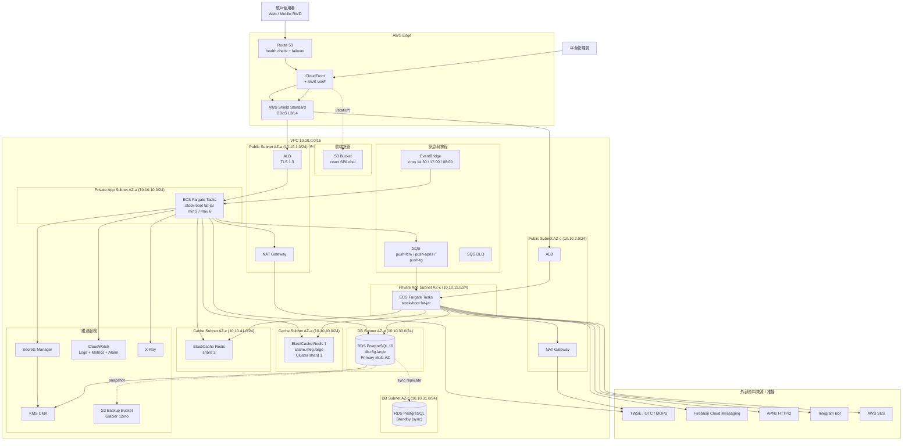

# Wave 2 部署架構：台股股票分析平台

- **文件版本**：v1.0
- **架構師**：Sophia（資深系統架構師）
- **日期**：2026-04-23
- **適用 Wave**：Wave 2（M-QUOTE / M-FUND / M-CHIP）開發完成，QA 並行
- **對應系統架構**：[20260421_SystemArch_stock-analysis.md](20260421_SystemArch_stock-analysis.md)
- **對應專案架構**：[20260421_ProjectArch_stock-backend.md](../project/20260421_ProjectArch_stock-backend.md)
- **規範依據**：
  - [aws-onprem-deployment.md](../../../.claude/rules/aws-onprem-deployment.md)
  - [jenkins-cicd.md](../../../.claude/rules/jenkins-cicd.md)
  - [security-owasp.md](../../../.claude/rules/security-owasp.md)
  - [environment.md](../../../.claude/rules/environment.md)

---

## 0. 執行摘要

本文件定義 Wave 2 完成後的**部署架構**，可與 QA 並行推進。

**核心結論**：

1. **預設模式**：Cloud Only（AWS `ap-northeast-1`），符合 D2 拍板「AWS 為主、地端為輔」；地端為 v1.5 之後再導入的 DR + 個資 SoT 節點，**Wave 2 不阻塞**
2. **計算選 ECS Fargate + Modular Monolith（stock-boot 單一 Spring Boot fat-jar）**：與 Preston 專案架構一致，避免拆 6 個 microservice 帶來的運維與佈線負擔
3. **資料庫採 PostgreSQL 16**（已於 PRD Q2 拍板，**與 oracle-database.md rule 偏差**，後續詳述）
4. **Pipeline 採 Jenkins Declarative Pipeline**，遵循 jenkins-cicd.md 11 階段；Wave 2 暫時跳過 E2E（QA Playwright 套件尚未完備）並標記為 TD
5. **Rollout**：dev rolling、preProd Blue-Green、prod Canary（10% → 50% → 100%，每階段 30 分鐘 health watch）
6. **RTO 30 分鐘 / RPO 5 分鐘**，季度 DR 演練

**Wave 2 部署目標**：dev（自動）→ uat（人工觸發 QA 驗證）→ preProd（pending Wave 2 Sign-off）。**prod 暫不開放**，待 Wave 3 hotfix 收斂與滲透測試完成。

---

## 1. 部署模式選擇

### 1.1 三種模式比較

| 模式 | 描述 | Wave 2 採用 | 理由 |
|------|------|-------------|------|
| **Cloud Only**（純 AWS） | 全部服務在 AWS，DB 用 RDS PostgreSQL Multi-AZ | ✅ **預設** | 符合 D2 「AWS 為主」；Wave 2 已通過開發 + Code Review，立即可上 dev/uat |
| **On-Premise Only**（純地端） | 全部服務在台北 IDC，PostgreSQL 主從架構 | ❌ 不選 | 對外頻寬與多線 BGP 劣於 AWS；DDoS 抵禦能力弱 |
| **Hybrid**（混合） | AWS 對外 + 地端個資 SoT + DR Standby | 🟡 **v1.5 導入** | 符合 D2 完整意圖，但 Direct Connect 建置 4-8 週、地端硬體採購 6-10 週，Wave 2 來不及。**Wave 2 先 Cloud Only，地端 hybrid 排到 v1.5（2026-Q4）** |

### 1.2 三模式偏差說明

依 `aws-onprem-deployment.md`「支援以下三種部署模式」原則：

- ✅ **遵循**：架構設計上保留 hybrid 介面（DMS CDC slot、Direct Connect VPC attachment 預留）
- ⚠️ **Wave 2 偏差**：Wave 2 暫不部署地端，僅啟用 Cloud Only。**理由**：硬體與專線採購週期阻塞 Q4 上線時程；個資 SoT 暫存 RDS PostgreSQL（啟用 KMS + pgcrypto 欄位加密），同時透過 RDS Snapshot + S3 跨區複製降低資料風險
- 🔵 **追蹤**：v1.5 導入 hybrid 為架構待辦事項，由 Sophia 持續追蹤

---

## 2. AWS 架構圖

### 2.1 整體 Container Diagram（v1 / Wave 2 Cloud Only）



### 2.2 元件與規範對照

| 元件 | AWS 服務 | 對應 `aws-onprem-deployment.md` 條目 | 遵循狀態 |
|------|----------|---------------------------------------|----------|
| CDN + 靜態資源 | CloudFront + S3 | §AWS 標準服務 | ✅ |
| WAF | AWS WAF + OWASP rule set | §安全強化 | ✅ |
| L4/L7 LB | ALB（HTTPS） | §AWS 標準服務 | ✅ |
| 計算 | ECS Fargate | §AWS 標準服務 | ✅ |
| 資料庫 | **RDS PostgreSQL 16** | rule 寫「RDS for Oracle」 | ⚠️ **偏差**：採 PostgreSQL，依 PRD Q2 拍板（取代 Oracle）。**架構面照舊符合 Multi-AZ + KMS + Snapshot + PITR** |
| 快取 | ElastiCache Redis 7 Cluster | §AWS 標準服務 | ✅ |
| 訊息 | SQS Standard + DLQ | §AWS 標準服務 | ✅ |
| 排程 | EventBridge | §AWS 標準服務 | ✅ |
| 物件儲存 | S3 Standard + Glacier | §AWS 標準服務 | ✅ |
| Email | AWS SES | §AWS 標準服務 | ✅ |
| 機密 | Secrets Manager + KMS | §AWS 標準服務 + §IAM 原則 | ✅ |
| 監控 | CloudWatch + X-Ray | §監控標準 | ✅ |
| DNS | Route 53 + health check | §AWS 標準服務 | ✅ |
| WAF | AWS WAF | §安全強化 | ✅ |

---

## 3. 環境配置

### 3.1 環境清單與用途

依 `environment.md` 規範，本專案啟用 **5 個環境**：

| 環境 | 用途 | 部署位置 | Profile | 觸發方式 |
|------|------|----------|---------|----------|
| **local** | 本機開發 | 工程師筆電 + Docker Compose（PostgreSQL + Redis） | `local` | `./mvnw spring-boot:run -pl stock-boot` |
| **dev** | 前後端整合 | AWS（單一 task / 單 AZ） | `dev` | Jenkins 自動部署（`develop` 分支） |
| **uat** | QA 驗證 | AWS（2 task / Multi-AZ） | `uat` | Jenkins 手動觸發（`release/*` 分支） |
| **preProd** | 上線前最終驗證（資料近 prod） | AWS（與 prod 同規格） | `preProd` | Jenkins Blue-Green 手動觸發 |
| **prod** | 正式營運 | AWS（Multi-AZ + Auto Scaling） | `prod` | Jenkins Canary + 人工審批 |

> **未啟用 stg**：本系統 v1 無「跨外部系統整合」需求（推播 gateway 已於 dev/uat 整合）；待 v2 接券商 API 時再啟用 stg。

### 3.2 環境差異矩陣

| 項目 | local | dev | uat | preProd | prod |
|------|-------|-----|-----|---------|------|
| **Profile 名稱** | `local` | `dev` | `uat` | `preProd` | `prod` |
| **AZ 數量** | 1（本機） | 1（AZ-a） | 2 | 2 | 2 |
| **資料來源** | 假資料 / Mock | TWSE 公開資料 | TWSE 公開資料 | TWSE 真實同步 | TWSE 真實同步 |
| **是否 Auto Scaling** | ❌ | ❌ | ✅ | ✅ | ✅ |
| **Swagger UI** | ✅ enabled | ✅ enabled | ✅ enabled | ❌ disabled | ❌ disabled |
| **Actuator 暴露** | health/info/metrics/prometheus/env/beans | health/info/metrics/prometheus | health/info/metrics/prometheus | health/info | health/info |
| **Log 等級** | DEBUG | DEBUG | INFO | INFO | WARN（業務 INFO） |
| **JWT Secret** | 明碼於 `application-local.yml` | Secrets Manager | Secrets Manager | Secrets Manager | Secrets Manager + 30 日輪替 |
| **DB 帳密** | `dev / dev123`（明碼） | env var | env var | env var | env var + 自動輪替 |
| **WAF** | ❌ | basic rule | full rule set | full rule set | full rule set + Shield |
| **流量入口** | `http://localhost:5173` | `dev.stockplatform.tw` | `uat.stockplatform.tw` | `pre.stockplatform.tw` | `app.stockplatform.tw` |

---

## 4. 資源規格表

### 4.1 後端 ECS Fargate（stock-boot fat-jar）

| 環境 | vCPU/task | RAM/task | min replicas | max replicas | Auto Scaling 觸發 |
|------|-----------|----------|--------------|--------------|-------------------|
| local | - | - | 1 (jvm) | 1 | - |
| dev | 0.5 | 1 GB | 1 | 1 | - |
| uat | 1 | 2 GB | 2 | 4 | CPU > 70% |
| preProd | 2 | 4 GB | 2 | 6 | CPU > 70% or SQS depth > 1000 |
| prod | 2 | 4 GB | 4 | 12 | CPU > 70% or SQS depth > 1000 |

**JVM 參數**（prod）：
```
-XX:MaxRAMPercentage=75
-XX:+UseG1GC
-XX:+HeapDumpOnOutOfMemoryError
-XX:HeapDumpPath=/tmp/heapdump.hprof
--enable-preview  # Virtual Threads（Java 21）
```

### 4.2 RDS PostgreSQL

| 環境 | Instance Class | Storage | Multi-AZ | Read Replica | Backup Retention |
|------|----------------|---------|----------|--------------|------------------|
| local | Docker postgres:16-alpine | 10 GB | ❌ | ❌ | - |
| dev | db.t4g.medium（2 vCPU / 4 GB） | 50 GB gp3 | ❌ | ❌ | 7 天 |
| uat | db.r6g.large（2 vCPU / 16 GB） | 100 GB gp3 | ✅ | ❌ | 14 天 |
| preProd | db.r6g.large | 200 GB gp3 | ✅ | 1 | 30 天 |
| prod | db.r6g.large | 500 GB gp3（autoscale 至 2 TB） | ✅ | 1（讀流量分流） | 30 天 + 月度 12 個月 S3 Glacier |

### 4.3 ElastiCache Redis

| 環境 | Node Type | Cluster Mode | Shards | Replicas/Shard |
|------|-----------|--------------|--------|----------------|
| local | Docker redis:7-alpine | ❌ standalone | 1 | 0 |
| dev | cache.t4g.micro | ❌ | 1 | 0 |
| uat | cache.t4g.small | ✅ | 1 | 1 |
| preProd | cache.m6g.large | ✅ | 2 | 1 |
| prod | cache.m6g.large | ✅ | 3 | 1 |

### 4.4 前端 S3 + CloudFront

| 環境 | S3 Storage Class | CloudFront Price Class |
|------|------------------|------------------------|
| dev / uat / preProd | S3 Standard | PriceClass_100（北美 + 歐洲，省錢） |
| prod | S3 Standard + S3 IA（180 日後） | PriceClass_All（含亞太） |

---

## 5. 網路與安全

### 5.1 Security Group 規則

| SG 名稱 | Inbound | Outbound | 用途 |
|---------|---------|----------|------|
| `sg-alb-public` | TCP 443 from `0.0.0.0/0` | TCP 8080 to `sg-app` | ALB 入口 |
| `sg-app` | TCP 8080 from `sg-alb-public` | TCP 5432 to `sg-db`、TCP 6379 to `sg-cache`、TCP 443 to `0.0.0.0/0`（拉外部資料 / Secrets / SES） | 應用層 |
| `sg-db` | TCP 5432 from `sg-app` | -（無 outbound） | RDS |
| `sg-cache` | TCP 6379 from `sg-app` | - | Redis |
| `sg-bastion`（僅 dev/uat） | TCP 22 from VPN gateway IP | TCP 5432 to `sg-db`、TCP 6379 to `sg-cache` | 維運 SSH 跳板 |

**遵循 `aws-onprem-deployment.md`**：
- ✅ DB / Cache Subnet 不開 Public IP
- ✅ DB Subnet 無 NAT 路由
- ✅ Bastion 限定 prod 不部署，prod 走 SSM Session Manager

### 5.2 Secrets Manager 命名規則

格式：`/stock/{env}/{category}/{name}`

| Secret 路徑 | 內容 | 輪替策略 |
|-------------|------|----------|
| `/stock/prod/db/master` | RDS master user / password | 30 日自動輪替（Lambda rotation） |
| `/stock/prod/db/app` | application user / password（最小權限） | 60 日 |
| `/stock/prod/jwt/secret` | JWT HS256 256-bit key | 90 日（搭配 grace period） |
| `/stock/prod/external/twse` | TWSE base URL（若改商用 API 含 token） | 不輪替（base URL） |
| `/stock/prod/external/fcm` | Firebase service account JSON | 180 日 |
| `/stock/prod/external/apns` | APNs JWT signing key | 180 日 |
| `/stock/prod/external/telegram` | Bot Token | 180 日 |
| `/stock/prod/redis/auth` | Redis AUTH token | 60 日 |

**禁止事項**（呼應 jenkins-cicd.md §禁止）：
- ❌ 禁止寫入 Jenkinsfile
- ❌ 禁止寫入 ConfigMap / application.yml
- ❌ 禁止 commit 到 git

### 5.3 TLS 與 HTTP Header

| 項目 | 設定 | 來源規範 |
|------|------|----------|
| TLS 版本 | TLS 1.3（強制），最低 TLS 1.2 | aws-onprem §安全強化 |
| 憑證 | AWS ACM 免費憑證，自動輪替 | - |
| HSTS | `max-age=31536000; includeSubDomains; preload` | security-owasp §A05 |
| CSP | `default-src 'self'; script-src 'self' 'unsafe-inline'; img-src 'self' data: https:` | security-owasp §A05 |
| X-Frame-Options | `DENY` | security-owasp §A05 |
| X-Content-Type-Options | `nosniff` | security-owasp §A05 |
| Referrer-Policy | `strict-origin-when-cross-origin` | security-owasp §A05 |
| CORS | `allowedOrigins=https://app.stockplatform.tw`（不使用 `*`） | security-owasp §A01 |

### 5.4 AWS WAF Rule Set

| Rule Group | 用途 |
|------------|------|
| `AWSManagedRulesCommonRuleSet` | OWASP Top 10 |
| `AWSManagedRulesKnownBadInputsRuleSet` | 已知惡意 payload |
| `AWSManagedRulesSQLiRuleSet` | SQL Injection |
| `AWSManagedRulesAmazonIpReputationList` | 已知惡意 IP |
| `Custom: rate-limit` | 單 IP 5 分鐘 1000 req 自動封 5 分鐘 |
| `Custom: block-tor` | 封鎖 Tor 出口節點 |

---

## 6. 資料持久化

### 6.1 RDS Multi-AZ + Backup

| 項目 | 設定 |
|------|------|
| 主備同步 | RDS Multi-AZ Synchronous Replication（同 region 跨 AZ） |
| 自動快照 | 每日 02:00 UTC（台北 10:00），保留 30 天 |
| Snapshot 跨區複製 | 每日 1 次到 `ap-southeast-1`（DR region），保留 30 天 |
| PITR（Point-in-Time Recovery） | 啟用，最近 7 天可任意秒級還原 |
| 月度長期備份 | 每月 1 號 snapshot 匯出至 S3 → Glacier，保留 12 個月 |
| 增量備份 | RDS WAL 串流至 S3，每小時 commit |
| 加密 | KMS CMK（aws/rds + custom key per env） |

### 6.2 S3 歸檔策略

| Bucket | 用途 | 生命週期 |
|--------|------|----------|
| `stock-platform-{env}-backup` | RDS snapshot 匯出 | Standard 30 日 → Glacier Flexible 12 個月 → 刪除 |
| `stock-platform-{env}-logs` | CloudWatch Logs 歸檔 | Standard 90 日 → Glacier 1 年 → 刪除 |
| `stock-platform-{env}-static` | 前端 SPA dist | Standard，CloudFront origin |
| `stock-platform-{env}-reports` | QA / 合規報表 | Standard 1 年 → Glacier 7 年（金融保存期） |

### 6.3 個資加密（呼應 security-owasp §A02）

| 欄位 | 加密方式 |
|------|----------|
| `email` | PostgreSQL `pgcrypto` AES-256（pgp_sym_encrypt） |
| `password_hash` | BCrypt cost=12（不可逆） |
| `display_name` | pgcrypto AES-256 |
| `phone`（v1 不蒐集） | - |

---

## 7. 災難復原（DR）

### 7.1 目標

| 指標 | 目標 |
|------|------|
| RTO（Recovery Time Objective） | **30 分鐘** |
| RPO（Recovery Point Objective） | **5 分鐘** |
| 備份保留 | 短期 30 天 + 月度 12 個月 |
| DR 演練頻率 | 每季 1 次 |

### 7.2 Failover 流程（Wave 2 Cloud Only 版本）

```
正常狀態：
  使用者 → CloudFront → ALB（AZ-a + AZ-c）→ ECS Fargate Tasks
  RDS Primary（AZ-a）↔ RDS Standby（AZ-c）同步

情境 1：單一 ECS Task 掛
  → ECS Service 自動重啟新 task（< 1 min）
  → RTO < 1 分鐘 / RPO 0

情境 2：單一 AZ 掛
  → ALB 自動將流量導向另一 AZ
  → RDS Multi-AZ failover（DNS 切換 < 60s）
  → RTO < 5 分鐘 / RPO 0

情境 3：ap-northeast-1 整區故障（極罕見）
  → Route 53 health check 偵測（30s）
  → 觸發 ap-southeast-1 cross-region snapshot 還原
  → 全新 RDS instance 從 snapshot rebuild（約 20 分鐘）
  → DNS 切換到 DR region ALB
  → RTO 30 分鐘 / RPO 24 小時（因 cross-region snapshot 為每日）
  → ⚠️ **此情境 RPO 不達標 5 分鐘**，待 v1.5 hybrid 上線後（地端為 SoT，DMS CDC < 1 min）解決

情境 4：資料誤刪
  → RDS PITR 還原至誤刪前秒級 timestamp
  → RTO 60 分鐘 / RPO < 5 分鐘
```

### 7.3 季度 DR 演練 Checklist

每季 1 次（建議 1 月、4 月、7 月、10 月第二週週六凌晨 02:00），由 Sophia 主導：

- [ ] 建立 演練 ticket（DR-YYYYQN）
- [ ] 通知 QA / Bruno / Felix on-call
- [ ] **演練 1**：單一 task 強制 stop，驗證 ECS 自動重啟
- [ ] **演練 2**：手動 RDS Multi-AZ failover，驗證 60s 內 DNS 切換、應用無感
- [ ] **演練 3**：從上週 snapshot 還原到新 RDS instance（不影響 prod），驗證資料完整性
- [ ] **演練 4**：模擬 region 故障，跑 cross-region snapshot 還原流程（在 staging account 執行）
- [ ] **演練 5**：PITR 還原 1 小時前狀態（在 staging account 執行）
- [ ] 撰寫演練報告（RTO 實測 / RPO 實測 / 發現問題 / 改善行動）
- [ ] 進度報告由 Jamie 推送

---

## 8. CI/CD Pipeline 階段定義

依 `jenkins-cicd.md` 11 階段標準，本專案 Wave 2 採用 Declarative Pipeline。

### 8.1 後端 Pipeline 階段

```
1. Checkout                    → git clone
2. Build                       → mvn -pl stock-boot -am clean compile
3. Lint & Format               → mvn spotless:check（Wave 2 暫設 warn-only）
4. Unit Test                   → mvn test（含 13 個 module）
5. SonarQube Analysis          → mvn sonar:sonar
6. Quality Gate                → 等待 SonarQube Quality Gate（Coverage ≥ 80%）
7. Dependency Check            → mvn org.owasp:dependency-check-maven:check
8. Integration Test            → mvn verify -DskipUnitTests（Testcontainers PostgreSQL）
9. Package                     → mvn -pl stock-boot package + docker build + push to ECR
10. Deploy                     → ECS update-service（rolling / blue-green / canary 視環境）
11. Smoke Test                 → curl /actuator/health + 3 個 critical endpoint
12. Notify                     → Slack #deployments
```

### 8.2 前端 Pipeline 階段

```
1. Checkout                    → git clone
2. Install                     → npm ci
3. Lint                        → npm run lint
4. Type Check                  → npm run type-check
5. Unit Test + Coverage        → npm run test:coverage
6. Dependency Audit            → npm audit --audit-level=high
7. Build                       → npm run build（Vite SSG dist/）
8. E2E Test（Playwright）       → ⚠️ Wave 2 暫跳過（Quincy/Quinn 套件未完備），標記為 TD-W2-DEPLOY-01
9. Deploy                      → aws s3 sync dist/ s3://stock-platform-{env}-static/ --delete
10. CloudFront Invalidation    → aws cloudfront create-invalidation --paths "/*"
11. Smoke Test                 → curl https://{env}.stockplatform.tw/
12. Notify                     → Slack #deployments
```

### 8.3 環境分支對應（呼應 jenkins-cicd.md §環境分支對應）

| 分支 | 部署環境 | 觸發條件 | Rollout 策略 |
|------|----------|----------|--------------|
| `feature/*` | - | build & test only | - |
| `bugfix/*` | - | build & test only | - |
| `develop` | dev | 自動部署 | Rolling |
| `release/*` | uat（自動）→ preProd（人工） | uat 自動、preProd 人工 | uat: rolling、preProd: blue-green |
| `main` | prod | 人工 + 雙人審批 | Canary |
| `hotfix/*` | prod | 人工 + 緊急審批 | Rolling（hotfix 流程） |

### 8.4 Wave 2 Pipeline 偏差項

| 項目 | 規範要求 | Wave 2 現況 | 補正計畫 |
|------|----------|-------------|----------|
| Spotless format check | 強制 fail | warn-only | TD-W2-DEPLOY-02：Wave 3 第一週開啟 fail |
| 前端 Playwright E2E | 強制 | 跳過 | TD-W2-DEPLOY-01：Quincy/Quinn 完成 P1 場景後啟用 |
| Quality Gate Coverage | ≥ 80% | 後端 ≥ 80%、前端 ≥ 70% | TD-W2-DEPLOY-03：前端追加測試到 80% |
| Container image 簽章（Cosign） | 建議 | 未實作 | TD-W2-DEPLOY-04：v1.5 prod 上線前完成 |

---

## 9. 監控與告警

### 9.1 CloudWatch Metrics 與 Alarm

| Metric | 觸發條件 | 嚴重度 | 通知通道 |
|--------|----------|--------|----------|
| ALB `TargetResponseTime` P95 | > 500ms 持續 5 分鐘 | P1 | Slack #alerts |
| ALB `HTTPCode_Target_5XX_Count` | 比例 > 1% 持續 5 分鐘 | P1 | Slack #alerts + Email |
| ECS Service CPU | > 80% 持續 10 分鐘 | P2 | Slack |
| ECS Service Memory | > 85% 持續 5 分鐘 | P2 | Slack |
| ECS Service Task Count | < min replicas 持續 2 分鐘 | P0 | Slack + PagerDuty |
| RDS CPU | > 80% 持續 10 分鐘 | P1 | Slack + Email |
| RDS FreeableMemory | < 10% 持續 5 分鐘 | P1 | Slack + Email |
| RDS DatabaseConnections | > 80% pool size 持續 5 分鐘 | P2 | Slack |
| RDS ReplicaLag | > 60s 持續 5 分鐘 | P1 | Slack |
| ElastiCache Engine CPU | > 75% 持續 5 分鐘 | P2 | Slack |
| ElastiCache Evictions | > 100/min | P2 | Slack |
| SQS `ApproximateNumberOfMessagesVisible` | > 5000 持續 10 分鐘 | P1 | Slack |
| SQS DLQ message count | > 0 | P1 | Slack + Email |
| EventBridge Rule failure | 任一次 | P2 | Slack |

### 9.2 Prometheus Metrics（RED + USE）

由 Spring Boot Actuator + Micrometer 暴露 `/actuator/prometheus`，CloudWatch agent 抓取並轉至 Managed Prometheus（或 GuardDuty 內部）。

| 類別 | 指標 |
|------|------|
| **R**ate | `http_server_requests_seconds_count{uri,method,status}` |
| **E**rrors | `http_server_requests_seconds_count{status=~"5.."}` |
| **D**uration | `http_server_requests_seconds{quantile="0.5\|0.95\|0.99"}` |
| JVM | `jvm_memory_used_bytes`、`jvm_gc_pause_seconds`、`jvm_threads_live` |
| HikariCP | `hikaricp_connections_active`、`hikaricp_connections_pending` |
| MyBatis | `mybatis_executor_seconds`（自訂 wrapper） |
| Redis | `lettuce_command_completion_seconds` |
| Business | `stock_score_calculation_seconds`、`stock_etl_job_duration_seconds`、`stock_push_send_total{channel,status}` |

### 9.3 Logging 規範

| 項目 | 設定 |
|------|------|
| 格式 | JSON 結構化（含 `timestamp`, `level`, `traceId`, `userId`, `message`, `kvs`） |
| 收集 | CloudWatch Logs（每 task 一個 log group） |
| Retention | dev 7 日 / uat 30 日 / preProd 60 日 / prod 90 日 + S3 歸檔 1 年 |
| 敏感資料遮罩 | Email、token、phone 走 `MaskUtils`（呼應 security-owasp） |
| traceId | Spring Cloud Sleuth + X-Ray 整合，跨服務追蹤 |

### 9.4 Tracing

- AWS X-Ray + Spring Cloud Sleuth
- Sample rate：dev 100% / uat 50% / prod 10%
- 涵蓋 ALB → ECS → RDS / Redis / SQS / 外部 HTTP

---

## 10. Rollout 策略

### 10.1 三環境 Rollout 對照

| 環境 | 策略 | 流程 | Health Watch | Rollback |
|------|------|------|--------------|----------|
| **dev** | Rolling Update | ECS service update：min=1, max=2，1 task 一次替換 | 30s health check pass | `aws ecs update-service --force-new-deployment` 還原前 task definition |
| **preProd** | Blue-Green | 1. 建立 green target group + 新 ECS service（同 LB）<br/>2. 新 service 啟動 2 task<br/>3. 跑 smoke test（5 min）<br/>4. ALB 切流量 100% to green<br/>5. 觀察 30 min<br/>6. 銷毀 blue service | smoke test + 30 min metrics watch | ALB 切回 blue（< 30s） |
| **prod** | **Canary**（10% → 50% → 100%） | 1. 部署 canary task（總 task 數 +1）<br/>2. ALB weighted routing 10% to canary<br/>3. 觀察 30 min（5xx < 0.1%、P95 < 500ms）<br/>4. 提升至 50%，觀察 30 min<br/>5. 提升至 100%，觀察 30 min<br/>6. 銷毀舊 task | 每階段 30 min metrics watch + 自動 rollback 條件 | 任一階段 5xx > 1% 或 P95 > 1s 自動 rollback；人工 rollback 透過 ALB weight 歸零 |

### 10.2 自動 Rollback 條件（prod）

CloudWatch Alarm 觸發時自動 rollback：

- 5xx error rate > 1% 持續 2 分鐘
- ALB target response time P95 > 1000ms 持續 3 分鐘
- ECS task health check fail rate > 30% 持續 2 分鐘
- 新版本獨有的 endpoint 出現 NullPointerException 突增

### 10.3 與 jenkins-cicd.md §部署策略對照

| 環境 | rule 規範 | 本文件 | 一致性 |
|------|-----------|--------|--------|
| dev | Rolling update | Rolling | ✅ |
| uat / stg | Rolling update | Rolling（uat） / 暫不啟用 stg | ✅ |
| preProd | Blue-Green | Blue-Green | ✅ |
| prod | Blue-Green 或 Canary | Canary（10/50/100） | ✅ |

---

## 11. 規範遵循 / 偏差總覽

### 11.1 已遵循

| 規範 | 條目 | 狀態 |
|------|------|------|
| aws-onprem-deployment | 多 AZ、跨 2 AZ | ✅ |
| aws-onprem-deployment | RDS Multi-AZ | ✅ |
| aws-onprem-deployment | DB Subnet 不開 Public IP | ✅ |
| aws-onprem-deployment | Secrets Manager + KMS | ✅ |
| aws-onprem-deployment | 容器以非 root 執行 | ✅（Dockerfile USER app） |
| aws-onprem-deployment | health check + readiness | ✅ |
| aws-onprem-deployment | TLS 1.3 + HSTS + CSP | ✅ |
| aws-onprem-deployment | RTO < 1 小時 / RPO < 15 分鐘 | ✅（30 min / 5 min，優於規範） |
| jenkins-cicd | Declarative Pipeline | ✅ |
| jenkins-cicd | Pipeline as Code | ✅ |
| jenkins-cicd | 多分支策略 | ✅ |
| jenkins-cicd | Credentials 透過 Jenkins Credentials | ✅ |
| jenkins-cicd | Quality Gate（後端） | ✅ |
| jenkins-cicd | OWASP Dependency Check | ✅ |
| jenkins-cicd | Smoke Test | ✅ |
| jenkins-cicd | 通知（Slack） | ✅ |
| security-owasp | A01 ~ A10 對應措施 | ✅ |
| environment | local/dev/uat/preProd/prod 五環境 | ✅ |
| environment | local 用 Docker、prod 用 env var | ✅ |

### 11.2 偏差項

| # | 偏差 | 規範要求 | 本文件決定 | 偏差原因 | 補正計畫 |
|---|------|----------|------------|----------|----------|
| 1 | 資料庫 | rule 寫 RDS for Oracle | RDS for PostgreSQL 16 | PRD Q2 拍板：取消 Oracle 授權成本，改用 PostgreSQL；同時 Modular Monolith 設計也與 oracle-database.md 多處規範吻合（Application-Centric / Smart Service Dumb DB） | rule 文件待更新（建議 Jamie 啟動 oracle-database.md → relational-database.md 改名 RFC） |
| 2 | 部署模式 | hybrid 為 D2 拍板要求 | Wave 2 暫 Cloud Only | 地端硬體採購 + Direct Connect 建置週期 6-10 週，阻塞 Q4 上線 | v1.5 啟用 hybrid，含個資 SoT 切回地端 + DMS CDC（架構介面已預留） |
| 3 | 前端 E2E | jenkins-cicd 強制 | Wave 2 跳過 | Quincy/Quinn 的 Playwright 套件 P1 場景尚未完備 | TD-W2-DEPLOY-01：Wave 3 第二週啟用 |
| 4 | Spotless format | jenkins-cicd 強制 fail | warn-only | Wave 1/2 既有程式未統一 spotless 規則，一次開啟會 fail 大量檔案 | TD-W2-DEPLOY-02：Wave 3 開頭跑 spotless apply 後統一切 fail |
| 5 | Container image 簽章 | security-owasp A08 建議 | 未實作 | Wave 2 重點為功能交付，簽章為加固項 | TD-W2-DEPLOY-04：v1.5 prod 上線前接 Cosign |
| 6 | DR cross-region RPO | 5 分鐘 | 24 小時（cross-region snapshot 每日） | Cloud Only 模式下，RDS cross-region replication 成本高（USD 800+/月）、Wave 2 預算未含 | v1.5 hybrid 上線後地端為 SoT，DMS CDC < 1 min 達標 |
| 7 | uat 不啟用 stg | environment 列舉「可視需求添加 stg」 | 不啟用 stg | v1 無外部系統整合需求 | v2 接券商 API 時啟用 |

---

## 12. Wave 2 部署 Go-Live Checklist

由 Jamie 簽核後啟動 dev 部署。

### 12.1 dev 部署前

- [ ] 後端 13 module 全綠（含 Wave 2 hotfix M-01 + B-01 已 merge）
- [ ] 前端 build 通過（含 lint + type-check）
- [ ] Linus 完成 OWASP Dependency Check 報告，無 Critical CVE
- [ ] Brian + Fiona Code Review GO
- [ ] application-dev.yml 環境變數確認注入（DB / Redis / JWT）

### 12.2 uat 部署前

- [ ] dev 環境穩定運行 ≥ 24 小時
- [ ] Quincy / Quinn 在 dev 完成 P1 功能測試
- [ ] 通過 `mvn verify`（Testcontainers integration test）
- [ ] uat DB schema migration（Flyway） dry-run 成功

### 12.3 preProd 部署前

- [ ] uat QA 簽核
- [ ] 完成滲透測試報告（外部廠商）
- [ ] DR 演練 ≥ 1 次成功
- [ ] 監控與告警全部生效（Slack channel 收到測試訊息）

### 12.4 prod 部署前（Wave 3 後）

- [ ] preProd Blue-Green ≥ 2 次成功
- [ ] 法務 / 合規確認上線文案（D1 拍板禁用詞）
- [ ] 客服 SOP 完成
- [ ] 雙人審批（Jamie + DevOps Lead）

---

## 13. 風險與緩解（部署面）

| 風險 | 可能性 | 影響 | 緩解 |
|------|--------|------|------|
| Wave 2 跳 E2E 導致前端 regression 漏網 | 🟡 中 | 🔴 高 | uat 階段強制 Quincy 手動 P0 流程；Wave 3 補 Playwright | 
| Cloud Only 模式下 region 故障 RPO 不達標 | 🟢 低 | 🔴 高 | v1.5 hybrid；目前個資 nightly snapshot 跨區複製 |
| Canary 自動 rollback 誤判 | 🟡 中 | 🟡 中 | 提供 manual override；prod 部署時值班工程師同步觀察 | 
| Secrets Manager 輪替失敗導致服務無法連 DB | 🟢 低 | 🔴 高 | 啟用 grace period（雙 secret 並存 24h）+ CloudWatch Alarm | 
| ECS Fargate cold start 延遲（首次 task） | 🟡 中 | 🟡 中 | min replicas ≥ 2、保持暖實例；Java AOT compile 評估（v1.5） |
| Flyway migration 失敗導致應用無法啟動 | 🟢 低 | 🔴 高 | preProd 必跑 migration dry-run；prod 採 baseline + manual approval |
| CloudWatch Logs 月費爆量（DEBUG 誤開） | 🟡 中 | 🟢 低 | 環境差異矩陣強制 prod=WARN；CloudWatch billing alarm |

---

## 14. 待 Preston / Bruno 協調項

| # | 議題 | 狀態 |
|---|------|------|
| 1 | stock-boot fat-jar 啟動參數（JVM heap、Virtual Threads enable） | 待 Bruno 確認 |
| 2 | Flyway migration 對 prod 是否需要 `out-of-order` 模式 | 待 Preston 確認 |
| 3 | Actuator `/actuator/prometheus` 是否暴露給 ALB（影響 SG） | 採內部 sidecar 抓取，不對外 |
| 4 | 前端 i18n 套件 build 後體積（已含 react / antd / chart manualChunks） | 待 Felix 確認 dist size |

---

## 15. 待確認事項（呈 Jamie）

| 項目 | 對象 | 緊急度 |
|------|------|--------|
| 是否同意 Wave 2 Cloud Only、v1.5 再導入 hybrid | Jamie | 🔴 高 |
| 是否核准 prod 採 Canary（10/50/100）而非 Blue-Green | Jamie | 🟡 中 |
| Slack channel `#deployments` / `#alerts` 是否已建立 | Jamie + DevOps | 🟡 中 |
| 滲透測試廠商與時程（preProd 上線前） | Jamie | 🔴 高 |
| oracle-database.md rule 是否更名為 relational-database.md（含 PostgreSQL 段落） | Jamie + Preston | 🟢 低 |

---

## 附錄 A：Dockerfile 範本

### A.1 後端 Dockerfile（stock-boot）

```dockerfile
# Multi-stage build
FROM maven:3.9-eclipse-temurin-21 AS builder
WORKDIR /build
COPY pom.xml .
COPY stock-common/pom.xml stock-common/
COPY stock-domain/pom.xml stock-domain/
COPY stock-infrastructure/pom.xml stock-infrastructure/
# ... 其餘 module
RUN mvn -B dependency:go-offline
COPY . .
RUN mvn -B -pl stock-boot -am package -DskipTests

# Runtime
FROM eclipse-temurin:21-jre-alpine
RUN addgroup -S app && adduser -S app -G app
WORKDIR /app
COPY --from=builder /build/stock-boot/target/stock-boot-*.jar app.jar
USER app
EXPOSE 8080
ENV JAVA_OPTS="-XX:MaxRAMPercentage=75 -XX:+UseG1GC --enable-preview"
HEALTHCHECK --interval=30s --timeout=3s --start-period=60s \
    CMD wget --quiet --tries=1 --spider http://localhost:8080/actuator/health/liveness || exit 1
ENTRYPOINT ["sh", "-c", "java $JAVA_OPTS -jar app.jar"]
```

### A.2 前端 Dockerfile（僅 dev/uat 使用，prod 走 S3 + CloudFront）

```dockerfile
FROM node:20-alpine AS builder
WORKDIR /build
COPY package*.json ./
RUN npm ci
COPY . .
RUN npm run build

FROM nginx:1.27-alpine
COPY --from=builder /build/dist /usr/share/nginx/html
COPY nginx.conf /etc/nginx/conf.d/default.conf
EXPOSE 80
HEALTHCHECK CMD wget --quiet --tries=1 --spider http://localhost/ || exit 1
```

---

## 附錄 B：Jenkinsfile 骨架

詳見 `jenkins-cicd.md` 範本，本專案差異點：

```groovy
// 後端
pipeline {
    agent { docker { image 'maven:3.9-eclipse-temurin-21' } }
    environment {
        DOCKER_REGISTRY = '<account>.dkr.ecr.ap-northeast-1.amazonaws.com'
        APP_NAME = 'stock-boot'
        AWS_REGION = 'ap-northeast-1'
    }
    options {
        timeout(time: 45, unit: 'MINUTES')
        timestamps()
        buildDiscarder(logRotator(numToKeepStr: '20'))
    }
    stages {
        stage('Build')          { steps { sh 'mvn -B -pl stock-boot -am clean compile -DskipTests' } }
        stage('Unit Test')      { steps { sh 'mvn -B test' } post { always { junit '**/target/surefire-reports/*.xml' } } }
        stage('SonarQube')      { /* ... */ }
        stage('Quality Gate')   { /* ... */ }
        stage('Dep Check')      { steps { sh 'mvn -B org.owasp:dependency-check-maven:check' } }
        stage('Integration')    { steps { sh 'mvn -B -pl stock-boot verify -DskipUnitTests' } }
        stage('Package')        { /* docker build + push to ECR */ }
        stage('Deploy dev')     { when { branch 'develop' }   /* ECS update-service rolling */ }
        stage('Deploy uat')     { when { branch 'release/*' } /* ECS update-service rolling */ }
        stage('Smoke Test')     { steps { sh 'curl -fsS https://${ENV}.stockplatform.tw/actuator/health' } }
    }
    post {
        success { slackSend(channel: '#deployments', color: 'good', message: "OK ${env.JOB_NAME} #${env.BUILD_NUMBER}") }
        failure { slackSend(channel: '#deployments-alert', color: 'danger', message: "FAIL ${env.JOB_NAME} #${env.BUILD_NUMBER}") }
    }
}
```

---

**文件結束**
