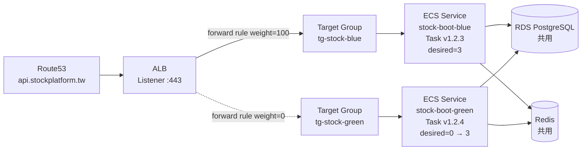
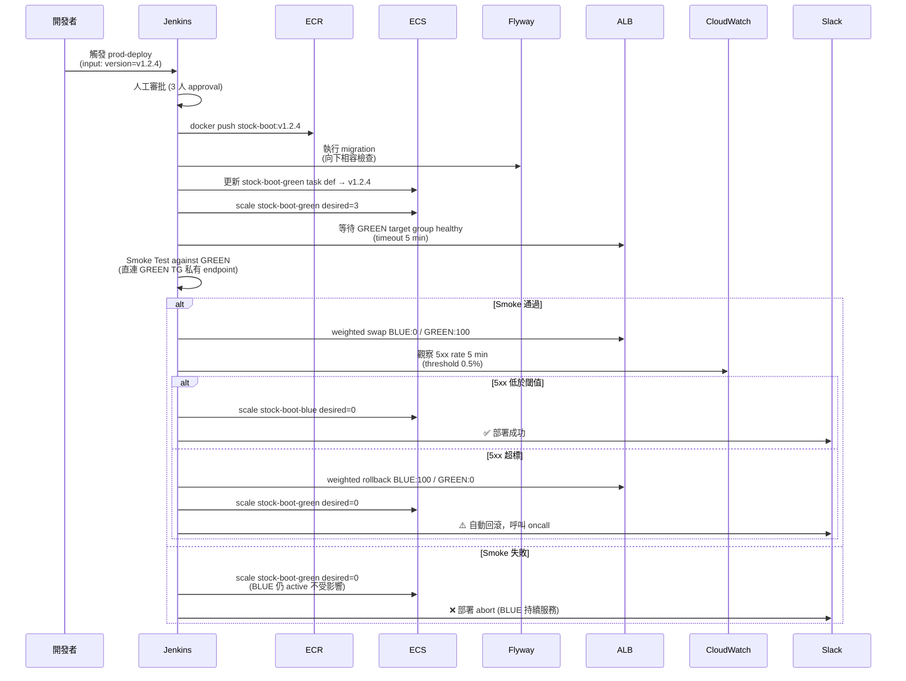

# Wave 3 Blue-Green 部署 SOP

- **文件版本**：v1.0
- **架構師**：Sophia（資深系統架構師）
- **日期**：2026-04-23
- **適用 Wave**：Wave 3（v0.3.0 起 prod 採用）
- **上游決策**：D-2026-04-23-03（prod 部署策略 = Blue-Green）
- **規範依據**：
  - [aws-onprem-deployment.md](../../../.claude/rules/aws-onprem-deployment.md)
  - [jenkins-cicd.md](../../../.claude/rules/jenkins-cicd.md)
- **相依文件**：
  - [20260423_wave3_system-architecture.md](20260423_wave3_system-architecture.md) §4.2
  - [20260423_wave2_deployment_architecture.md](20260423_wave2_deployment_architecture.md)（Wave 2 採 Canary，Wave 3 起改 BG）

---

## 0. 設計目標

| 目標 | 指標 |
|------|------|
| 切換中斷時間 | < 30 秒（ALB target group draining）|
| 回滾時間 | < 60 秒（ALB listener rule weight swap）|
| Smoke Test 通過率門檻 | 100%（任何失敗自動 abort）|
| 資料庫 schema 相容性 | 新版必須與舊版相容（向下相容 1 版本）|
| 月部署次數能力 | 8 次（每週 2 次）|
| 同 Region 內切換 | 不跨 Region，不換 VPC，不換 RDS |

---

## 1. 架構元件

### 1.1 雙 ECS Service



| 屬性 | BLUE | GREEN |
|------|------|------|
| ECS Service 名稱 | `stock-boot-blue` | `stock-boot-green` |
| Target Group | `tg-stock-blue` | `tg-stock-green` |
| 平時 desired count | 3（active）| 0（standby）|
| 平時 ALB weight | 100 | 0 |

### 1.2 ALB Listener Rule

採 ALB 原生 [weighted target group](https://aws.amazon.com/blogs/aws/new-application-load-balancer-simplifies-deployment-with-weighted-target-groups/) 功能：

```json
{
  "Type": "forward",
  "ForwardConfig": {
    "TargetGroups": [
      { "TargetGroupArn": "arn:...:targetgroup/tg-stock-blue/...",  "Weight": 100 },
      { "TargetGroupArn": "arn:...:targetgroup/tg-stock-green/...", "Weight": 0   }
    ],
    "TargetGroupStickinessConfig": { "Enabled": false }
  }
}
```

**為什麼用 weighted TG 而非 Route53 weighted record？**

| 維度 | ALB Weighted TG | Route53 Weighted |
|------|------------------|-------------------|
| 切換生效時間 | 即時（< 5 秒）| 受 DNS TTL 影響（60 秒）|
| Sticky session 控制 | 細粒度 | 無 |
| Cost | 含於 ALB 費用 | $0.50 / hosted zone + 查詢費 |
| 採用 | ✅ | 備用（DNS layer fallback）|

---

## 2. Schema 向下相容規範

### 2.1 Migration 三階段策略（避免 BG 切換時 schema 不相容）

| 變更類型 | 階段 1（v1.2.3 部署前）| 階段 2（v1.2.3 → v1.2.4 BG 切換）| 階段 3（v1.2.5 部署後）|
|----------|---------------------|--------------------------------|---------------------|
| **新增欄位（NULL allowed）** | Flyway 加欄位（v1.2.3 仍可寫入，舊資料為 NULL）| 切到 v1.2.4，開始寫入新欄位 | - |
| **新增欄位（NOT NULL）** | 加欄位 + DEFAULT | 切換 | 後續版本移除 DEFAULT |
| **刪除欄位** | v1.2.4 程式碼不再讀寫該欄位（雙寫期）| 切換 | v1.2.5 Flyway 真正 drop column |
| **rename 欄位** | 不允許 ❌ | - | - |
| **新增索引** | `CREATE INDEX CONCURRENTLY`（PostgreSQL 不鎖表）| 切換 | - |
| **新增 NOT NULL constraint** | 先 backfill + add as NOT VALID | 切換 | v1.2.5 `VALIDATE CONSTRAINT` |

### 2.2 雙寫期（dual-write）規則

當需要 schema 重大變更時：

```
N    版本：只寫舊欄位
N+1  版本：雙寫新舊欄位（讀舊欄位）← 部署 + BG 切換
N+2  版本：雙寫新舊欄位（讀新欄位）← 觀察 1 週
N+3  版本：只寫新欄位
N+4  版本：drop 舊欄位
```

**Wave 3 不允許在單一 wave 完成「N → N+4」**，必須跨 wave 分階段。

### 2.3 Flyway migration 命名規範

```
backend/stock-boot/src/main/resources/db/migration/
├── V1.2.3__add_watchlist_table.sql              # 新增 table（向下相容）
├── V1.2.3__add_alert_table.sql
├── V1.2.3__add_web_push_subscription_table.sql
├── V1.2.4__add_search_history_table.sql
└── V1.2.5__add_notify_log_table.sql
```

**重要規則**：
- W3 全部為 `CREATE TABLE`，向下相容無風險
- W3 不修改 W2 既有表結構（除非絕對必要，需走 Preston / Brian Review）
- Migration 在 BG 切換**之前**執行（部署 GREEN 前先跑 migration）

---

## 3. 部署流程（Jenkins Pipeline）

### 3.1 完整流程圖



### 3.2 Jenkinsfile 範例（prod-deploy stage 重點）

```groovy
stage('Deploy to Production (Blue-Green)') {
    when {
        branch 'main'
    }
    input {
        message '確認部署到 prod？'
        ok '部署'
        submitter 'jamie,sophia,bruno'
        parameters {
            string(name: 'VERSION', defaultValue: '', description: 'Image tag to deploy')
        }
    }
    environment {
        AWS_REGION    = 'ap-northeast-1'
        ECS_CLUSTER   = 'stock-prod'
        SERVICE_BLUE  = 'stock-boot-blue'
        SERVICE_GREEN = 'stock-boot-green'
        TG_BLUE_ARN   = credentials('alb-tg-blue-arn')
        TG_GREEN_ARN  = credentials('alb-tg-green-arn')
        ALB_LISTENER_ARN  = credentials('alb-listener-arn')
        ALB_RULE_ARN  = credentials('alb-rule-arn')
    }
    steps {
        script {
            // 1. 偵測目前 active 與 standby
            def activeColor = sh(
                returnStdout: true,
                script: 'aws elbv2 describe-rules --rule-arns $ALB_RULE_ARN ' +
                        '| jq -r ".Rules[0].Actions[0].ForwardConfig.TargetGroups | ' +
                        'map(select(.Weight==100))[0].TargetGroupArn" ' +
                        '| grep -q blue && echo BLUE || echo GREEN'
            ).trim()
            def standbyColor = activeColor == 'BLUE' ? 'GREEN' : 'BLUE'
            def standbyService = standbyColor == 'BLUE' ? env.SERVICE_BLUE : env.SERVICE_GREEN
            def standbyTgArn   = standbyColor == 'BLUE' ? env.TG_BLUE_ARN  : env.TG_GREEN_ARN
            def activeTgArn    = activeColor  == 'BLUE' ? env.TG_BLUE_ARN  : env.TG_GREEN_ARN

            echo "Active: ${activeColor}  /  Standby: ${standbyColor}  /  Deploying ${params.VERSION} to ${standbyColor}"

            // 2. Flyway migration (向下相容)
            sh "./scripts/flyway-migrate-prod.sh ${params.VERSION}"

            // 3. 更新 standby task definition + scale up
            sh "./scripts/ecs-update-task-def.sh ${standbyService} ${params.VERSION}"
            sh "aws ecs update-service --cluster $ECS_CLUSTER --service ${standbyService} --desired-count 3"

            // 4. 等待 standby healthy
            sh "./scripts/wait-target-group-healthy.sh ${standbyTgArn} 300"

            // 5. Smoke Test 直打 standby
            sh "./scripts/smoke-test-standby.sh ${standbyTgArn}"

            // 6. ALB weighted swap (核心切換)
            sh """
                aws elbv2 modify-rule --rule-arn $ALB_RULE_ARN --actions \\
                  '[{"Type":"forward","ForwardConfig":{"TargetGroups":[
                    {"TargetGroupArn":"${standbyTgArn}","Weight":100},
                    {"TargetGroupArn":"${activeTgArn}","Weight":0}
                  ]}}]'
            """

            // 7. 觀察 5 分鐘
            sh "./scripts/post-cutover-watch.sh 300 0.5"

            // 8. scale down 舊 active
            def oldService = activeColor == 'BLUE' ? env.SERVICE_BLUE : env.SERVICE_GREEN
            sh "aws ecs update-service --cluster $ECS_CLUSTER --service ${oldService} --desired-count 0"

            // 9. 通知
            slackSend(
                channel: '#deployments',
                color: 'good',
                message: ":white_check_mark: prod 部署成功 ${params.VERSION} (${activeColor} → ${standbyColor})"
            )
        }
    }
    post {
        failure {
            script {
                // 觸發回滾
                sh './scripts/blue-green-rollback.sh'
                slackSend(
                    channel: '#deployments-alert',
                    color: 'danger',
                    message: ":rotating_light: prod 部署失敗，已自動回滾。請檢查 oncall。"
                )
            }
        }
    }
}
```

---

## 4. 切換腳本（核心 5 個 shell）

### 4.1 `scripts/wait-target-group-healthy.sh`

```bash
#!/bin/bash
# 等待 Target Group 內的 task 全部 healthy
set -euo pipefail
TG_ARN="$1"
TIMEOUT="${2:-300}"
ELAPSED=0
INTERVAL=10

echo "Waiting for ${TG_ARN} healthy (timeout ${TIMEOUT}s)"
while [ $ELAPSED -lt $TIMEOUT ]; do
    UNHEALTHY=$(aws elbv2 describe-target-health \
        --target-group-arn "$TG_ARN" \
        --query 'TargetHealthDescriptions[?TargetHealth.State!=`healthy`] | length(@)')
    HEALTHY=$(aws elbv2 describe-target-health \
        --target-group-arn "$TG_ARN" \
        --query 'TargetHealthDescriptions[?TargetHealth.State==`healthy`] | length(@)')
    echo "[$(date +%T)] healthy=${HEALTHY} unhealthy=${UNHEALTHY}"
    if [ "$UNHEALTHY" = "0" ] && [ "$HEALTHY" -ge "3" ]; then
        echo "All targets healthy"
        exit 0
    fi
    sleep $INTERVAL
    ELAPSED=$((ELAPSED + INTERVAL))
done
echo "Timeout waiting for healthy"
exit 1
```

### 4.2 `scripts/smoke-test-standby.sh`

```bash
#!/bin/bash
# 透過 internal ALB endpoint 直打 standby TG，避開公開流量
set -euo pipefail
TG_ARN="$1"
STANDBY_HOST=$(aws elbv2 describe-target-health \
    --target-group-arn "$TG_ARN" \
    --query 'TargetHealthDescriptions[0].Target.Id' --output text)

# 從跳板機 / Bastion 直打
SMOKE_BASE="https://internal-prod.stockplatform.tw"

run_smoke() {
    local path="$1"
    local expected_code="$2"
    local body="$3"
    local resp=$(curl -sS -X POST "${SMOKE_BASE}${path}" \
        -H "X-Smoke-Target: ${STANDBY_HOST}" \
        -H "Content-Type: application/json" \
        -d "$body")
    local code=$(echo "$resp" | jq -r '.code')
    if [ "$code" != "$expected_code" ]; then
        echo "FAIL ${path}: expected ${expected_code}, got ${code}"
        echo "Response: $resp"
        exit 1
    fi
    echo "PASS ${path}"
}

# === Wave 2 既有 endpoint smoke ===
run_smoke "/api/v1/quote/get"       0    '{"stockId":"2330"}'
run_smoke "/api/v1/fundamental/get" 0    '{"stockId":"2330"}'
run_smoke "/api/v1/chip/get"        0    '{"stockId":"2330"}'

# === Wave 3 新增 endpoint smoke ===
run_smoke "/api/v1/search/stock"    0    '{"keyword":"台積"}'
run_smoke "/api/v1/watchlist/list"  3001 '{}'  # 未登入應回 3001 (D-08)

# === Health ===
HEALTH=$(curl -sS "${SMOKE_BASE}/actuator/health" | jq -r '.status')
[ "$HEALTH" = "UP" ] || { echo "Health DOWN"; exit 1; }

echo "All smoke tests passed"
```

### 4.3 `scripts/post-cutover-watch.sh`

```bash
#!/bin/bash
# 切換後觀察 5xx rate，超標立即回滾
set -euo pipefail
DURATION="${1:-300}"
THRESHOLD="${2:-0.5}"  # 5xx % threshold
ELAPSED=0
INTERVAL=30

while [ $ELAPSED -lt $DURATION ]; do
    METRIC=$(aws cloudwatch get-metric-statistics \
        --namespace AWS/ApplicationELB \
        --metric-name HTTPCode_Target_5XX_Count \
        --dimensions Name=LoadBalancer,Value=app/stock-prod-alb/xxx \
        --start-time $(date -u -d '1 minute ago' +%FT%T) \
        --end-time $(date -u +%FT%T) \
        --period 60 \
        --statistics Sum \
        --query 'Datapoints[0].Sum' --output text)

    TOTAL=$(aws cloudwatch get-metric-statistics \
        --namespace AWS/ApplicationELB \
        --metric-name RequestCount \
        --dimensions Name=LoadBalancer,Value=app/stock-prod-alb/xxx \
        --start-time $(date -u -d '1 minute ago' +%FT%T) \
        --end-time $(date -u +%FT%T) \
        --period 60 \
        --statistics Sum \
        --query 'Datapoints[0].Sum' --output text)

    if [ "$TOTAL" != "None" ] && [ "$(echo "$TOTAL > 0" | bc)" = "1" ]; then
        RATE=$(echo "scale=4; $METRIC / $TOTAL * 100" | bc)
        echo "[$(date +%T)] 5xx rate: ${RATE}% (threshold ${THRESHOLD}%)"
        if [ "$(echo "$RATE > $THRESHOLD" | bc)" = "1" ]; then
            echo "5xx rate exceeded threshold, triggering rollback"
            exit 2  # caller (Jenkins) catches exit 2 → invoke rollback
        fi
    fi
    sleep $INTERVAL
    ELAPSED=$((ELAPSED + INTERVAL))
done
echo "Post-cutover watch completed without anomaly"
```

### 4.4 `scripts/blue-green-rollback.sh`

```bash
#!/bin/bash
# 一鍵回滾：weight swap 回原色，scale up 原 active，scale down 失敗版
set -euo pipefail
RULE_ARN="${ALB_RULE_ARN}"

# 找出當前 weight 100 的 TG（即「失敗版」），對另一個做切換
CURRENT=$(aws elbv2 describe-rules --rule-arns $RULE_ARN \
    | jq -r '.Rules[0].Actions[0].ForwardConfig.TargetGroups[] |
             select(.Weight==100) | .TargetGroupArn')
ROLLBACK_TO=$(aws elbv2 describe-rules --rule-arns $RULE_ARN \
    | jq -r '.Rules[0].Actions[0].ForwardConfig.TargetGroups[] |
             select(.Weight==0) | .TargetGroupArn')

echo "Rolling back: ${CURRENT} (weight=0)  ←→  ${ROLLBACK_TO} (weight=100)"

aws elbv2 modify-rule --rule-arn $RULE_ARN --actions \
  "[{\"Type\":\"forward\",\"ForwardConfig\":{\"TargetGroups\":[
    {\"TargetGroupArn\":\"${ROLLBACK_TO}\",\"Weight\":100},
    {\"TargetGroupArn\":\"${CURRENT}\",\"Weight\":0}
  ]}}]"

# 確保回滾目標的 service desired >= 3
ROLLBACK_SERVICE=$(echo $ROLLBACK_TO | grep -q blue && echo stock-boot-blue || echo stock-boot-green)
aws ecs update-service --cluster stock-prod --service $ROLLBACK_SERVICE --desired-count 3

# 縮減失敗版 service
FAILED_SERVICE=$(echo $CURRENT | grep -q blue && echo stock-boot-blue || echo stock-boot-green)
aws ecs update-service --cluster stock-prod --service $FAILED_SERVICE --desired-count 0

echo "Rollback complete"
```

### 4.5 `scripts/flyway-migrate-prod.sh`

```bash
#!/bin/bash
set -euo pipefail
VERSION="$1"

# 從 Secrets Manager 取得 DB credentials
DB_URL=$(aws secretsmanager get-secret-value --secret-id prod/stock/db --query 'SecretString' --output text | jq -r '.url')
DB_USER=$(aws secretsmanager get-secret-value --secret-id prod/stock/db --query 'SecretString' --output text | jq -r '.username')
DB_PASS=$(aws secretsmanager get-secret-value --secret-id prod/stock/db --query 'SecretString' --output text | jq -r '.password')

docker run --rm \
    -v "$(pwd)/backend/stock-boot/src/main/resources/db/migration:/flyway/sql" \
    flyway/flyway:10 \
    -url="$DB_URL" \
    -user="$DB_USER" \
    -password="$DB_PASS" \
    -outOfOrder=false \
    -validateOnMigrate=true \
    migrate

echo "Flyway migration complete for ${VERSION}"
```

---

## 5. 切換場景演練

### 5.1 場景 A：正常部署（v1.2.3 → v1.2.4）

```
[T+0s]    當前 active=BLUE (v1.2.3)
[T+10s]   執行 Flyway migration（新增 watchlist / alert / push_subscription tables，向下相容）
[T+30s]   更新 stock-boot-green task def → v1.2.4，desired=3
[T+150s]  等待 GREEN target group 全部 healthy（3 task）
[T+180s]  Smoke Test 直打 GREEN（W2 + W3 endpoint）→ 全部通過
[T+185s]  ALB weight swap：BLUE 100→0, GREEN 0→100
[T+190s]  使用者流量瞬間切到 GREEN（< 5 秒）
[T+220s]  觀察 5 分鐘 5xx rate < 0.5%
[T+520s]  scale down stock-boot-blue → desired=0
[T+540s]  Slack 通知部署成功
總部署時間：約 9 分鐘
```

### 5.2 場景 B：Smoke Test 失敗

```
[T+180s]  Smoke Test 失敗（例如新版啟動但 health check 通過、實際 endpoint 500）
[T+185s]  Pipeline abort（不執行 ALB swap）
[T+190s]  scale down stock-boot-green → desired=0
[T+200s]  Slack 通知 abort，BLUE 持續服務
影響使用者：0（流量未切換）
```

### 5.3 場景 C：切換後 5xx 超標（自動回滾）

```
[T+185s]  ALB swap 完成，GREEN active
[T+250s]  CloudWatch 偵測 5xx rate 1.5% (threshold 0.5%)
[T+260s]  post-cutover-watch.sh exit 2
[T+265s]  Jenkins post failure → blue-green-rollback.sh
[T+270s]  ALB weight 回切 GREEN→BLUE
[T+275s]  scale up stock-boot-blue desired=3（已存在 task 跳過 cold start）
[T+285s]  scale down stock-boot-green desired=0
[T+295s]  Slack alert 通知 oncall
影響使用者：~110 秒內 ~1.5% 5xx
```

### 5.4 場景 D：手動回滾（使用者回報嚴重問題）

oncall 觸發 Jenkins job `prod-emergency-rollback`：

```bash
# 直接呼叫 rollback script
./scripts/blue-green-rollback.sh
```

回滾完成時間：< 60 秒

---

## 6. 與 Wave 2 部署文件的差異

| 項目 | Wave 2 文件 | Wave 3 變更 |
|------|-------------|--------------|
| prod 部署策略 | Canary（10% → 50% → 100%） | **Blue-Green**（D-03 拍板）|
| ECS Service 數 | 1 個 | 2 個（BLUE + GREEN）|
| Target Group 數 | 1 個 | 2 個 |
| 切換機制 | Canary weight 階梯 | Weighted TG 一次切換 |
| 回滾時間 | 5-10 分鐘（需 scale + drain） | < 60 秒 |
| 適用流量規模 | > 100 RPS（值得 5% 試水溫） | < 100 RPS（一次切更乾淨）|

> **Wave 2 部署文件 §1.x prod Canary 段落需 Sophia 後續更新註記「v0.3.0 起改用 Blue-Green」**，本文件為新基準。

---

## 7. 待確認事項

| # | 議題 | 對象 |
|---|------|------|
| Q1 | ALB rule arn 與 listener arn 由 Terraform 管理還是 console 手建？建議 Terraform | Sophia + Jamie |
| Q2 | Smoke Test 用的「internal-prod」是否需新建獨立 ALB？或共用 prod ALB 但加 internal listener rule？ | Sophia |
| Q3 | 手動回滾 Jenkins job 是否需多人審批？建議 oncall 1 人即可（時效優先）| Jamie |
| Q4 | Wave 2 Canary 文件何時更新為 BG？建議與本文件同 PR 處理 | Sophia |

---

**本文件為 Wave 3 起 prod 部署的標準作業程序，每次 prod 部署皆須遵循**
