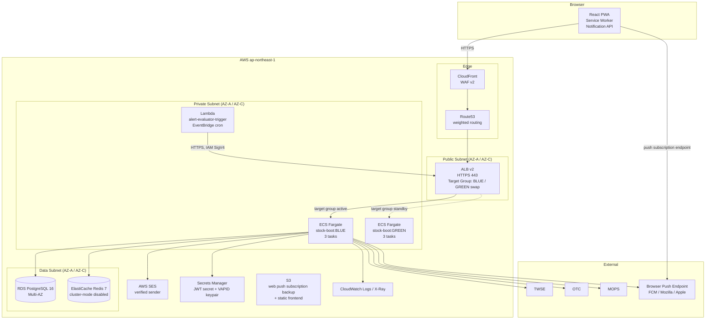
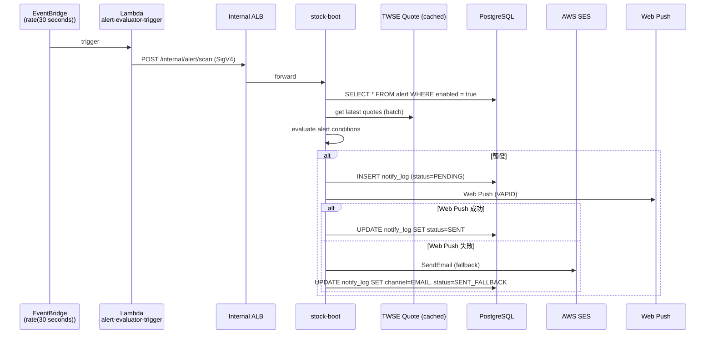
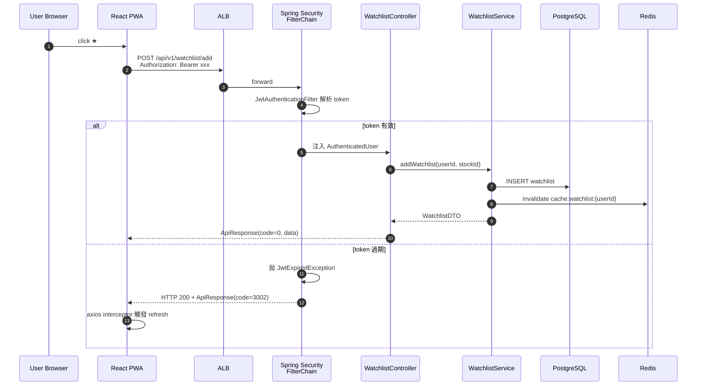
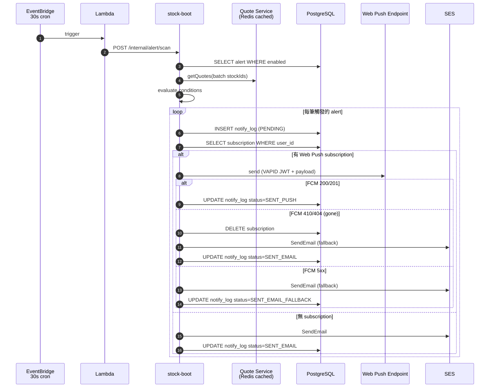
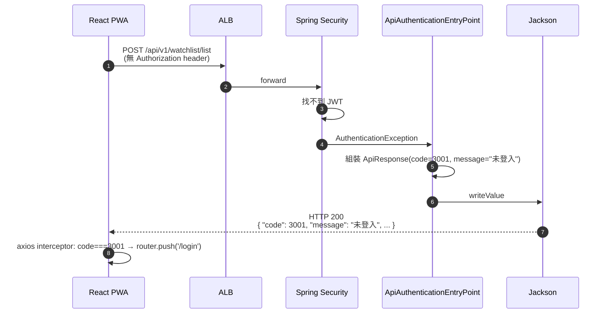

# Wave 3 系統架構：台股股票分析平台 v0.3.0

- **文件版本**：v1.0
- **架構師**：Sophia（資深系統架構師）
- **日期**：2026-04-23
- **適用 Wave**：Wave 3（v0.3.0）
- **上游決策**：[20260423_decision-wave2-wave3-9items.md](../../01_leader/decisions/20260423_decision-wave2-wave3-9items.md)
- **上游 PRD**：[20260423_wave3_PRD.md](../../02_product/20260423_wave3_PRD.md)
- **延伸文件**：
  - [20260423_wave3_spring-security-integration.md](20260423_wave3_spring-security-integration.md)
  - [20260423_wave3_blue-green-deployment.md](20260423_wave3_blue-green-deployment.md)
  - [20260423_pentest_rfp_draft.md](20260423_pentest_rfp_draft.md)
- **基準架構**：[20260421_SystemArch_stock-analysis.md](20260421_SystemArch_stock-analysis.md)、[20260423_wave2_deployment_architecture.md](20260423_wave2_deployment_architecture.md)

---

## 0. 執行摘要

Wave 3 在既有 Cloud Only（AWS `ap-northeast-1`）+ Modular Monolith（stock-boot fat-jar on ECS Fargate）+ PostgreSQL 16 + Redis ElastiCache 基礎上，**新增 4 條垂直能力**：

| 能力 | 對應 PRD | 對應拍板 | 新增 AWS 服務 |
|------|----------|----------|---------------|
| Spring Security 全面接入 | F-W3-04 | D-08（HTTP 200 + code 3001） | Secrets Manager（JWT secret 託管）|
| Web Push 推播 | F-W3-03 | D-07（VAPID） | EventBridge + Lambda（排程觸發 evaluator）|
| Email 推播 | F-W3-03 | D-07（後援） | **AWS SES**（驗證 sender 域名）|
| Blue-Green 部署 | — | D-03 | ALB Target Group × 2、Route53 weighted routing |

**核心相容性原則**：
1. **Wave 2 既有 4 個 endpoint（quote / fundamental / chip / quote/history）保持公開**，不需 JWT，前端原有呼叫零改動（詳見 §3 與 spring-security-integration 文件）
2. **未授權回應沿用 ApiResponse Envelope**（`code: 3001` + HTTP 200），不引入 401/403，前端 axios interceptor 既有「依 envelope code 分派」邏輯不變
3. **推播失敗不影響核心查詢**：採非同步事件流（Spring `@Async` + DB outbox table），Web Push / SES 失敗只記錄 `notify_log`，不阻塞警示評估批次
4. **Blue-Green 不換 Region 不換 VPC**：僅在同 VPC 內以雙 ECS Service + 雙 Target Group 切換，避免跨 Region 失敗模式

---

## 1. C4 Level 1：Context Diagram

```mermaid
C4Context
    title 台股分析平台 v0.3.0 - Context Diagram
    Person(retail, "散戶投資人", "Wave 3 強化：登入後享自選股、價格警示、搜尋")
    Person_Ext(opsAdmin, "維運", "監控 + Blue-Green 切換")
    Person_Ext(pentestVendor, "滲透測試廠商", "OWASP ASVS L2 報告（W6）")

    System_Boundary(platform, "台股分析平台 v0.3.0") {
        System(web, "Web App (PWA)", "React 18 + Vite + Service Worker（W3 新增 SW）")
        System(api, "API Service", "Spring Boot 3 Modular Monolith（W3 加上 Spring Security Filter Chain）")
        System(notifyEvaluator, "Alert Evaluator", "EventBridge 每 30 秒觸發 Lambda → 呼叫 API /internal/alert/scan（W3 新增）")
    }

    System_Ext(twse, "TWSE OpenAPI", "上市行情")
    System_Ext(otc, "OTC API", "上櫃行情")
    System_Ext(mops, "MOPS", "公開資訊觀測站")
    System_Ext(ses, "AWS SES", "Email 後援推播（W3 新增）")
    System_Ext(webPushBrowser, "Web Push Service", "FCM / Mozilla autopush / Apple APNs（W3 新增）")

    Rel(retail, web, "HTTPS / Web Push 訂閱")
    Rel(web, api, "POST /api/v1/* (HTTPS, JWT in Authorization)")
    Rel(api, twse, "HTTPS / 5 min cache")
    Rel(api, otc, "HTTPS / 5 min cache")
    Rel(api, mops, "HTTPS / 1 hr cache")
    Rel(api, ses, "AWS SDK / SendEmail")
    Rel(api, webPushBrowser, "VAPID JWT + AES-128-GCM payload")
    Rel(notifyEvaluator, api, "POST /internal/alert/scan (VPC 內，IAM SigV4)")
    Rel(opsAdmin, platform, "AWS Console / kubectl / Jenkins")
    Rel(pentestVendor, web, "OWASP ZAP + 手動測試（W6）")
```

---

## 2. C4 Level 2：Container Diagram（Wave 3 完整視圖）



**新增元件清單（vs Wave 2）**：

| 元件 | 用途 | 規格 | 月成本估算（USD）|
|------|------|------|------------------|
| Lambda `alert-evaluator-trigger` | EventBridge 每 30 秒觸發，呼叫 `/internal/alert/scan` | 256 MB / 30 秒上限 | 約 5 |
| AWS SES | Email 推播後援 | 第一個月 62K 封免費（EC2 sender），之後 $0.10 / 1K 封 | 約 10 |
| Secrets Manager（新增 1 條目）| VAPID public/private key pair（W3 新增）| $0.40/月 | 0.4 |
| Route53 weighted routing | Blue-Green DNS 切換 | $0.50 / hosted zone + $0.40 / 1M queries | 約 1 |
| ElastiCache 用量增加 | 新增 watchlist / search history / alert evaluator dedupe | 加 1 GB | 約 15 |
| RDS 用量增加 | 5 張新表（watchlist、alert、subscription、search_history、notify_log）| - | 約 5 |
| **小計** | | | **~$36 / 月** |

---

## 3. 系統邊界與相容性策略

### 3.1 Wave 2 既有 endpoint 衝擊評估（核心相容性）

| Endpoint | Wave 2 狀態 | Wave 3 是否受 Spring Security 保護 | 相容方案 |
|----------|-------------|-----------------------------------|----------|
| `POST /api/v1/quote/get` | 公開、無認證 | ❌ 維持公開 | 加入 `permitAll()` 白名單 |
| `POST /api/v1/quote/list` | 公開、無認證 | ❌ 維持公開 | 加入 `permitAll()` 白名單 |
| `POST /api/v1/quote/history` | 公開、無認證 | ❌ 維持公開 | 加入 `permitAll()` 白名單 |
| `POST /api/v1/fundamental/get` | 公開、無認證 | ❌ 維持公開 | 加入 `permitAll()` 白名單 |
| `POST /api/v1/chip/get` | 公開、無認證 | ❌ 維持公開 | 加入 `permitAll()` 白名單 |
| `POST /api/v1/member/register` | 公開 | ❌ 維持公開 | 加入 `permitAll()` 白名單 |
| `POST /api/v1/member/login` | 公開 | ❌ 維持公開 | 加入 `permitAll()` 白名單 |
| `POST /api/v1/member/refresh` | 公開（W2 placeholder）| ❌ 維持公開（W3 啟用實作）| 加入 `permitAll()` 白名單 |
| `POST /api/v1/member/logout` | W2 自寫 JWT parse | ✅ 改由 Spring Security Filter | 移除 Controller 內 `currentUserId()`，改注入 `@AuthenticationPrincipal` |
| `POST /api/v1/member/profile/get` | W2 自寫 JWT parse | ✅ 改由 Spring Security Filter | 同上 |
| `POST /api/v1/member/profile/update` | W2 自寫 JWT parse | ✅ 改由 Spring Security Filter | 同上 |

**對 Wave 2 既有測試的影響**：
- `QuoteController`、`ChipController`、`FundamentalController` 的 MockMvc 測試 → **零改動**（白名單 endpoint）
- `MemberController` 既有測試 → 需更新測試 setup：用 `@WithMockUser` 或自建 JWT 後加入 `Authorization` header；既有「3001 / 3002 / 3003 throw 流程」改為由 `JwtAuthenticationFilter` 拋出，斷言不變（envelope code 仍為 3001/3002/3003）

**Bruno 改動清單**（限縮在最小範圍）：
1. `MemberController#currentUserId()` 方法 → 標記 `@Deprecated`，過渡期保留（給未上 Spring Security 的單元測試使用）；新邏輯改注入 `Principal` 或 `@AuthenticationPrincipal AuthenticatedUser`
2. 新增 `stock-common` 模組：`SecurityConfig`、`JwtAuthenticationFilter`、`ApiAuthenticationEntryPoint`、`ApiAccessDeniedHandler`、`AuthenticatedUser` record
3. 新增 W3 endpoint（受保護）：`/api/v1/watchlist/*`、`/api/v1/alert/*`、`/api/v1/search/history/*`、`/api/v1/push/subscription/*`
4. 新增 W3 endpoint（公開）：`/api/v1/search/stock`（搜尋功能 D-06 雖強制登入，但此處指的是「進階搜尋歷史 / 自動補全 personalize」需登入；基礎模糊搜尋仍開放公開使用，與 PRD §4.2 F-W3-01 一致）

### 3.2 內部 endpoint vs 公開 endpoint

新增 `/internal/*` 路徑，**僅 VPC 內存取**（ALB listener rule + Security Group 限制）：

| Endpoint | 呼叫者 | 認證方式 |
|----------|--------|----------|
| `POST /internal/alert/scan` | Lambda alert-evaluator-trigger | IAM SigV4（API Gateway 簽章）|
| `POST /internal/health/deep` | ALB health check | 來源 IP 白名單（ALB private IP 段）|

`/internal/*` 不暴露在公開 ALB listener，由獨立 internal ALB 或 ALB rule path-based blocking 處理。

---

## 4. 雲端架構（Wave 3 增量）

### 4.1 VPC 與網路（沿用 Wave 2，不變）

- VPC CIDR `10.0.0.0/16`，Multi-AZ（AZ-A `ap-northeast-1a` + AZ-C `ap-northeast-1c`）
- Public / Private / Data 三層 subnet 結構不變
- **Wave 3 新增**：
  - Lambda subnet：與 Private subnet 共用，需 NAT GW 出去（呼叫 ALB）
  - SES VPC Endpoint：**不必要**（SES 走 public endpoint 即可，省成本）

### 4.2 ECS Service（Blue-Green 雙服務）

| 屬性 | BLUE Service | GREEN Service |
|------|--------------|---------------|
| Service 名稱 | `stock-boot-blue` | `stock-boot-green` |
| 對應 Task Definition | `stock-boot:vN`（current） | `stock-boot:vN+1`（pending） |
| Target Group | `tg-stock-blue` | `tg-stock-green` |
| Desired Count | 3（active）| 0（standby）→ 部署時拉到 3 |
| ALB Listener Rule | weight=100 | weight=0 |

**切換瞬間**：ALB listener rule weight 從 `BLUE:100 / GREEN:0` 翻轉為 `BLUE:0 / GREEN:100`。詳見 [blue-green-deployment 文件](20260423_wave3_blue-green-deployment.md)。

### 4.3 EventBridge + Lambda（推播觸發架構）



**為什麼不用 Spring Scheduler？**

| 方案 | 優點 | 缺點 | 採用 |
|------|------|------|------|
| Spring `@Scheduled` 在 ECS 內部 | 不需新元件、簡單 | Blue-Green 切換時雙寫風險（BLUE 跟 GREEN 同時跑 cron）、Multi-task 需 ShedLock 加鎖 | ❌ |
| **EventBridge + Lambda → 呼叫 API**| 1. 全域只有一個觸發源（不需 ShedLock）<br>2. Blue-Green 切換時 Lambda 只打 ALB，自動跟著切到 active TG<br>3. 失敗有 EventBridge retry + DLQ | 多一個元件、Lambda cold start（首次 ~500ms 可接受）| ✅ |
| EventBridge → 直接呼叫 ECS Task | 不經 Lambda | 需要寫 RunTask + 等 task 啟動，慢、複雜 | ❌ |

### 4.4 AWS SES 設定要點

| 項目 | 設定 |
|------|------|
| Sandbox 退出 | 必須在 W4 前申請（一次性，需 24h 審核）|
| Sender 域名 | `noreply@stockplatform.tw`（DKIM + SPF + DMARC 全簽）|
| Sending Quota | dev/uat 沿用 sandbox（200/day）；prod 申請 50K/day |
| Bounce / Complaint 處理 | SNS topic → Lambda → 寫入 `email_suppression` 表，禁止重發 |
| Region | `ap-northeast-1`（與主環境同 Region）|

### 4.5 Web Push（VAPID）設計

| 項目 | 設定 |
|------|------|
| 協定 | VAPID（RFC 8292）|
| Key 演算法 | ECDSA P-256 |
| Key 儲存 | Secrets Manager `prod/stock/vapid` JSON `{ publicKey, privateKey }` |
| Subject | `mailto:ops@stockplatform.tw`（VAPID 規範）|
| Subscription Storage | PostgreSQL `web_push_subscription` 表（user_id, endpoint, p256dh, auth, ua, created_at, last_seen_at）|
| Payload 加密 | aes128gcm（webpush-java library）|
| 失效 endpoint 處理 | Web Push response 410 Gone / 404 → 刪除 subscription，下次警示自動降級 Email |

---

## 5. 技術選型決策

### 5.1 Spring Security 版本

- **選定方案**：Spring Security 6.2.x（隨 Spring Boot 3.3.x 帶入）
- **替代方案**：

  | 方案 | 優點 | 缺點 | 評分 |
  |------|------|------|------|
  | **Spring Security 6.2.x** | 與 Spring Boot 3.3 對齊、JWT 原生支援、社群成熟 | 學習曲線、舊版範例不適用 | 9/10 |
  | Apache Shiro 1.13 | API 簡潔、輕量 | Spring Boot 3 整合差、Jakarta EE 相容性弱 | 5/10 |
  | 自寫 Filter | 最簡單 | 不可審計、漏洞風險高、滲透測試會被質疑 | 3/10 |

- **選擇理由**：
  1. 滲透測試廠商必查 Spring Security 配置；用標準框架可快速通過
  2. 與 W2 既有 `JwtTokenProvider` 整合容易（Filter 內呼叫即可）
  3. 後續 v1.0 引入 OAuth2 / OIDC（Google / Apple SSO）成本低
- **遷移成本**：低（W3 一次到位，後續無遷移問題）
- **生態系成熟度**：⭐⭐⭐⭐⭐（事實標準）

### 5.2 Web Push library

- **選定方案**：`nl.martijndwars:web-push:5.1.1`
- **替代方案**：

  | 方案 | 優點 | 缺點 | 評分 |
  |------|------|------|------|
  | **web-push (martijndwars)** | 1.6k stars、純 Java、無 native binding、支援 aes128gcm | 維護頻率中等 | 8/10 |
  | webpush4j | 文件少、社群小 | 已停止維護 | 3/10 |
  | 自寫 VAPID | 可控 | RFC 8291 加密實作易錯（OWASP A02 風險）| 2/10 |

- **選擇理由**：純 Java，可放入 fat-jar 直接帶到 ECS，不需 native dependency；web-push library 已實作 VAPID JWT + aes128gcm 加密
- **替代風險**：library 若停止維護，可考慮 fork 或自行維護（風險可控）

### 5.3 Email 服務

- **選定方案**：AWS SES（Region `ap-northeast-1`）
- **替代方案**：

  | 方案 | 月成本（10K 封） | 優點 | 缺點 | 評分 |
  |------|------------------|------|------|------|
  | **AWS SES** | $1（EC2 sender 前 62K 免費） | 與 AWS 整合、IAM 控制、Bounce SNS hook | 需脫離 sandbox | 9/10 |
  | SendGrid Free | $0（100 封/天）/ Essentials $19.95 | UI 友善、模板系統 | 跨 Region、需獨立帳號 | 7/10 |
  | Mailgun | $35（Foundation） | API 完善 | 跨 Region | 6/10 |
  | 自架 Postfix | $0（除 EC2 成本） | 完全控制 | IP reputation 難維護、進垃圾郵件率高 | 2/10 |

- **選擇理由**：與 AWS IAM、CloudWatch 整合、Bounce/Complaint 透過 SNS 自動處理、成本最低
- **遷移成本**：中（Provider 切換需更新 ~~Spring Mail starter~~ AWS SDK SES Client，預估 0.5 day）

### 5.4 警示排程觸發

- **選定方案**：EventBridge + Lambda → API endpoint
- **替代方案**：見 §4.3 表格
- **選擇理由**：避免 Spring Scheduler 在 Multi-task / Blue-Green 環境的雙觸發問題

### 5.5 部署策略

- **選定方案**：Blue-Green（D-03 拍板）
- **替代方案考量**：Canary 留 v1.x（流量規模未到）

---

## 6. 資料流向（核心場景 Sequence）

### 6.1 場景 A：使用者加入自選股（W3 新功能）



### 6.2 場景 B：價格警示觸發 → 推播



### 6.3 場景 C：未授權請求（D-08 拍板核心場景）



**關鍵：HTTP 狀態碼仍為 200**，符合 D-08 與 [api-design.md](../../../.claude/rules/api-design.md) Envelope Pattern。

---

## 7. 非功能需求

### 7.1 可用性

| 指標 | 目標 | 達成方式 |
|------|------|----------|
| API SLA | 99.5%（W3 同 W2 基準）| ECS Multi-AZ + ALB + RDS Multi-AZ |
| Web Push delivery success rate | ≥ 95%（5% 為 FCM unreachable）| 失敗自動降級 Email |
| Email delivery rate | ≥ 99%（SES SLA）| SES Bounce/Complaint 監控 |
| Blue-Green 切換中斷時間 | < 30 秒 | ALB target group draining 時間 |

### 7.2 擴展性

| 維度 | Wave 3 容量 | 擴充策略 |
|------|-------------|----------|
| 並發使用者 | 1,000 DAU / 50 RPS | ECS Auto Scaling（CPU 70% trigger）|
| Watchlist 條目 | 50 條/人 × 10K 人 = 500K rows | Index on `user_id`、`stock_id` |
| Alert 條目 | 10 條/人 × 5K 人 = 50K rows | Lambda scan 30 秒可完成 |
| Web Push subscriptions | 預估 5K / Wave 3 結束 | 批次 send 用 virtual thread pool |
| Notify log | 1 筆/觸發 × 預估 1K/day | 90 天後自動歸檔到 S3（CloudWatch Events 排程）|

### 7.3 安全性（OWASP Top 10 對應）

| OWASP | Wave 3 應對 |
|-------|-------------|
| A01 失效存取控制 | Spring Security `@PreAuthorize`、IDOR 檢查（watchlist / alert 限本人）|
| A02 加密失效 | TLS 1.3、JWT secret 256-bit、VAPID 私鑰存 Secrets Manager |
| A03 注入 | MyBatis `#{}`、Web Push payload 已加密、Email 模板 escape |
| A04 不安全設計 | EventBridge rate limit、警示評估去重（Redis SETNX 30s lock）|
| A05 安全設定錯誤 | prod 關 Swagger / Actuator env、`server.error.include-*=never`|
| A06 過時元件 | Linus 每週 dependency-check |
| A07 認證失效 | Account Lockout（5 次 / 15 min）、Refresh Token rotation、MFA 留 v1.x |
| A08 完整性失效 | CI 簽章（cosign 留 v1.x）、Dependency-check + SBOM |
| A09 監控失效 | CloudWatch + X-Ray、登入 / 警示 / 推播全記錄、敏感資料遮罩 |
| A10 SSRF | 對外 HTTP 走白名單（TWSE / OTC / MOPS），禁止從 user input 組 URL |

### 7.4 監控

| 指標 | 工具 | 告警閾值 |
|------|------|----------|
| API 5xx rate | CloudWatch Logs Insights | > 1% / 5min P1 |
| API P95 latency | X-Ray | > 500ms / 5min P2 |
| Web Push success rate | 自定 metric → CloudWatch | < 80% / 1hr P2 |
| Email send fail | SES SNS | bounce > 5% P1 |
| Lambda alert-evaluator failure | CloudWatch Lambda metric | failure > 3 / 5min P1 |
| Auth 3001/3002/3003 異常激增 | 自定 metric | > 100/min P2（疑似攻擊）|
| Blue-Green 切換後 5xx | CloudWatch | > 0.5% / 1min → 自動回滾（Lambda hook）|

### 7.5 災難復原

| 指標 | 目標 |
|------|------|
| RTO | 30 分鐘（Wave 2 基準）|
| RPO | 5 分鐘（RDS 自動 snapshot + WAL）|
| Web Push subscription 備份 | 每日 dump 至 S3（保留 30 天）|
| 滲透測試發現 High → 回滾 | < 4 小時（透過 Blue-Green DNS 回切）|

---

## 8. 成本估算（Wave 3 增量）

| 項目 | Wave 2 月成本 | Wave 3 增量 | Wave 3 月成本 |
|------|---------------|-------------|----------------|
| ECS Fargate（含 BLUE+GREEN 平均 4.5 task）| $130 | $65 | $195 |
| ALB | $25 | $0 | $25 |
| RDS PostgreSQL（db.t3.medium Multi-AZ）| $130 | $5（5 張新表）| $135 |
| ElastiCache Redis（cache.t4g.small）| $30 | $15 | $45 |
| CloudWatch Logs / X-Ray | $40 | $10 | $50 |
| Secrets Manager | $1.6 | $0.4 | $2 |
| Route53 | $1 | $1（weighted routing）| $2 |
| **AWS SES（新增）** | - | $10 | $10 |
| **Lambda alert-evaluator（新增）** | - | $5 | $5 |
| S3（subscription backup）| $5 | $2 | $7 |
| Data Transfer | $30 | $5 | $35 |
| **小計** | **$393** | **$118** | **$511 / 月** |

**滲透測試一次性費用**：50 萬新台幣（D-02 / D-09 預算，**不含於 AWS 月費**）

---

## 9. 風險與緩解

| # | 風險 | 機率 | 影響 | 緩解 |
|---|------|------|------|------|
| R1 | Spring Security 整合打壞 W2 既有 endpoint | 中 | 高 | §3.1 白名單機制 + W2 既有測試全部跑過才能合併（Brian Code Review 把關）|
| R2 | iOS Safari Web Push 相容問題 | 高 | 中 | iOS 16.4+ 才支援；UI 偵測後自動引導 Email 為主 |
| R3 | AWS SES sandbox 退出延誤 | 中 | 中 | W2 即提交申請（24h 審核），不卡 W3 開發 |
| R4 | Lambda cold start 延誤警示 | 低 | 低 | 30 秒 cron 內 cold start 一次後 warm，可接受；P95 < 1s |
| R5 | Blue-Green 切換失敗導致 outage | 低 | 高 | 自動回滾腳本 + Smoke Test gate（詳見 BG 文件 §4.3）|
| R6 | 滲透測試廠商簽約延誤 | 高 | 高 | RFP 草稿先備（本文件附 RFP）；W0 結束前必須簽約 |
| R7 | VAPID 私鑰外洩 | 低 | 中 | Secrets Manager + IAM least privilege；定期 rotate（每 6 個月）|
| R8 | Alert evaluator 漏觸發 | 中 | 中 | EventBridge DLQ + CloudWatch alarm；evaluator 補償機制（最近 5 分鐘 missing trigger 補跑）|

---

## 10. 待確認事項（給 Jamie / Preston / Brian / Linus）

| # | 議題 | 對象 | 急迫性 |
|---|------|------|--------|
| Q1 | `web-push:5.1.1` library 是否符合 Linus CVE 政策？ | Linus | W0 |
| Q2 | Watchlist / Alert / Search History 的 ER 圖由誰主導？建議 Preston（單系統）| Preston | W0 |
| Q3 | 是否需要在 Spring Security 加入 `@PreAuthorize` 還是用 method security 即可？ | Brian | W0 |
| Q4 | EventBridge + Lambda 是否需 Preston 在專案架構文件補上 Lambda 部署 IaC？ | Preston | W1 |
| Q5 | 滲透測試 RFP 是否需法務 review？建議走法務 | Jamie | W0 |

---

**本文件為 Wave 3 系統架構基準，後續 SRS / 專案架構 / 開發實作均以本文件為準**
